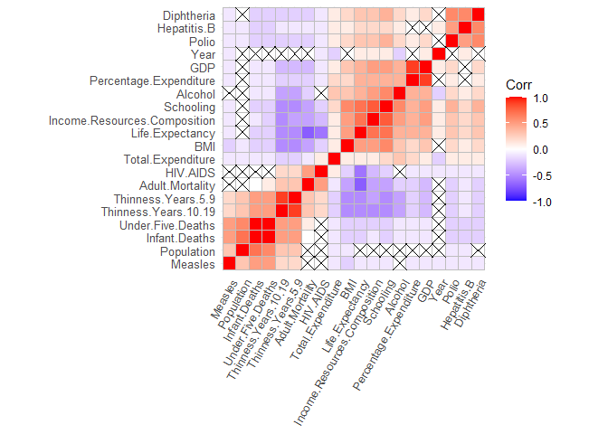
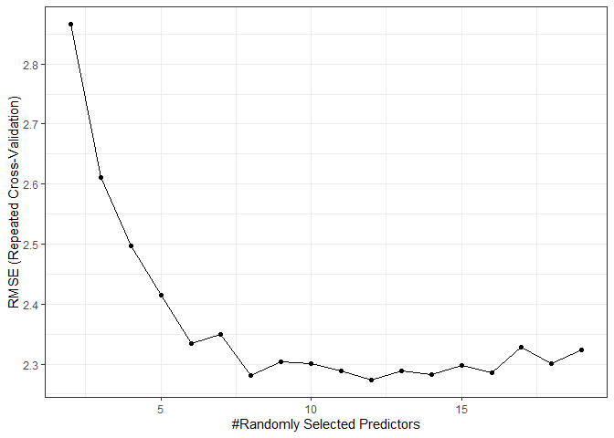

## Podsumowanie


## 1. Wyliczanie bibliotek


```r
usePackage <- function(p) {
    if (!is.element(p, installed.packages()[,1]))
        install.packages(p, dep = TRUE, verbose = FALSE)
    require(p, character.only = TRUE, quietly = TRUE)
}

packageList <- c("dplyr", "matrixStats", "tidyr", "caret", "ggcorrplot", "plotly")

print("Użyte biblioteki to:")
```

```
## [1] "Uzyte biblioteki to:"
```

```r
packageList
```

```
## [1] "dplyr"       "matrixStats" "tidyr"       "caret"       "ggcorrplot" 
## [6] "plotly"
```

```r
sapply(packageList, usePackage)
```

```
##       dplyr matrixStats       tidyr       caret  ggcorrplot      plotly 
##        TRUE        TRUE        TRUE        TRUE        TRUE        TRUE
```

## 2. Zapewnianie powtarzalności obliczeń


```r
setConsistency <- function() {
  set.seed(42)
}
```

## 3. Ładowanie danych


```r
loadData <- function(urlPath, localFile = 'life_expectancy.tsv') {
  remote_data_file <- download.file(urlPath, destfile = localFile, quiet= TRUE)
  return(read.csv(TMP_LOCAL_FILE, quote='"'))
}
FILE_URL <- 'http://www.cs.put.poznan.pl/alabijak/emd/projekt/Life_Expectancy_Data.csv'
TMP_LOCAL_FILE <- 'life_expectancy.csv'

data <- loadData(FILE_URL, TMP_LOCAL_FILE)
```

## 4. Przetwarzanie brakujących danych


```r
fixData <- function(df) {
  # Rename data
  fixedData <- rename(df,
     Life.Expectancy = Life.expectancy,
     Infant.Deaths = infant.deaths, 
     Percentage.Expenditure = percentage.expenditure,
     Under.Five.Deaths = under.five.deaths,
     Total.Expenditure = Total.expenditure,
     Thinness.Years.10.19 = thinness..1.19.years,
     Thinness.Years.5.9 = thinness.5.9.years,
     Income.Resources.Composition = Income.composition.of.resources)
  
  fixedData <- within(fixedData, Alcohol[is.na(Alcohol) & Year == 2015] <- 0)
  fixedData <- within(fixedData, Total.Expenditure[is.na(Total.Expenditure) & Year == 2015] <- 0)

  # fixedData$Country <- as.factor(fixedData$Country)
  # fixedData$Status <- as.factor(fixedData$Status)
  
  return(fixedData)
}

cleanData <- function (df) {
  return(na.omit(df))
}
  
removeChrColumns <- function(df) {
  library(dplyr)
  return(df %>% 
    select_if(~!is.character(.)))
}

fixedData <- fixData(data)
cleanedData <- cleanData(fixedData)
numericData <- removeChrColumns(cleanedData)
```

## 5. Rozmiar zbioru i podstawowe statystyki


```r
print(paste('Zbiór danych zawiera', nrow(cleanedData), 'przykladów.'))
```

```
## [1] "Zbiór danych zawiera 1777 przykladów."
```

```r
print(paste('Każdy z przykladow posiada', ncol(cleanedData), 'atrybutów.'))
```

```
## [1] "Kazdy z przykladow posiada 22 atrybutów."
```


```r
library(dplyr)
library(tidyr)

cleanedData %>%
  tibble::as_tibble() %>% 
  select(Life.Expectancy, Adult.Mortality, Infant.Deaths, Population) %>%
  summarise(across(everything(), list(mean = mean, median = median, min = min, max = max), .names = "{.col}_{.fn}")) %>%
  gather(variable, value) %>%
  separate(variable, c("var", "funkcja"), sep = "\\_") %>%
  spread(var, value) %>%
  relocate(Life.Expectancy, .after = funkcja)
```

```
## # A tibble: 4 x 5
##   funkcja Life.Expectancy Adult.Mortality Infant.Deaths  Population
##   <chr>             <dbl>           <dbl>         <dbl>       <dbl>
## 1 max                89              723         1600   1293859294 
## 2 mean               69.4            168.          32.2   14430006.
## 3 median             71.7            148            3      1435568 
## 4 min                44                1            0           34
```


## 6. Szczegółowa analiza wartości atrybutów


```
## Warning: `arrange_()` is deprecated as of dplyr 0.7.0.
## Please use `arrange()` instead.
## See vignette('programming') for more help
## This warning is displayed once every 8 hours.
## Call `lifecycle::last_warnings()` to see where this warning was generated.
```

<!--html_preserve--><div id="htmlwidget-e5d410b9e1ebca8619ff" style="width:672px;height:480px;" class="plotly html-widget"></div>
<script type="application/json" data-for="htmlwidget-e5d410b9e1ebca8619ff">{"x":{"visdat":{"4b045d512d63":["function () ","plotlyVisDat"]},"cur_data":"4b045d512d63","attrs":{"4b045d512d63":{"alpha_stroke":1,"sizes":[10,100],"spans":[1,20],"x":[2015,2014,2013,2012,2011,2010,2009,2008,2007,2006,2005,2004,2003,2002,2001,2000,2015,2014,2013,2012,2011,2010,2009,2008,2007,2006,2005,2004,2003,2002,2001,2000,2015,2014,2013,2012,2011,2010,2009,2008,2007,2006,2005,2004,2015,2014,2013,2012,2011,2010,2009,2008,2007,2015,2014,2013,2012,2011,2010,2009,2008,2007,2006,2005,2004,2003,2002,2015,2014,2013,2012,2011,2010,2009,2008,2007,2006,2005,2004,2003,2002,2001,2000,2015,2014,2013,2012,2011,2010,2009,2008,2007,2006,2005,2004,2003,2002,2001,2015,2014,2013,2012,2011,2010,2009,2008,2007,2006,2005,2004,2003,2002,2001,2000,2015,2014,2013,2012,2011,2010,2009,2008,2007,2006,2005,2004,2003,2002,2015,2014,2013,2012,2011,2010,2009,2008,2007,2006,2005,2004,2003,2015,2014,2013,2012,2011,2010,2009,2008,2007,2006,2005,2004,2003,2002,2001,2000,2015,2014,2013,2012,2011,2010,2009,2008,2007,2006,2005,2004,2003,2002,2001,2000,2015,2014,2013,2012,2011,2010,2009,2008,2007,2006,2005,2004,2003,2002,2001,2000,2015,2014,2013,2012,2011,2010,2009,2008,2007,2006,2005,2004,2003,2002,2015,2014,2013,2012,2011,2010,2009,2008,2007,2006,2005,2004,2003,2002,2001,2000,2015,2014,2013,2012,2011,2010,2009,2008,2007,2006,2005,2004,2015,2014,2013,2012,2011,2010,2009,2008,2007,2006,2005,2004,2003,2002,2001,2000,2015,2014,2013,2012,2011,2010,2009,2008,2007,2006,2005,2004,2003,2002,2001,2000,2015,2014,2013,2012,2011,2010,2009,2008,2007,2006,2005,2004,2003,2002,2001,2000,2015,2014,2013,2012,2011,2010,2009,2008,2007,2006,2015,2014,2013,2012,2011,2010,2009,2008,2007,2006,2005,2004,2015,2014,2013,2012,2011,2010,2009,2008,2007,2006,2005,2004,2003,2002,2015,2014,2013,2012,2011,2010,2009,2008,2007,2006,2015,2014,2013,2012,2011,2010,2009,2008,2007,2006,2005,2015,2014,2013,2012,2011,2010,2009,2008,2007,2006,2005,2004,2003,2015,2014,2013,2012,2011,2010,2009,2015,2014,2013,2012,2011,2010,2009,2008,2015,2014,2013,2012,2011,2010,2009,2008,2007,2006,2015,2014,2013,2012,2011,2010,2009,2008,2007,2006,2005,2004,2003,2002,2001,2000,2015,2014,2013,2012,2011,2010,2009,2008,2007,2006,2005,2004,2003,2002,2001,2000,2015,2014,2013,2012,2011,2010,2009,2008,2007,2006,2005,2004,2003,2015,2014,2013,2012,2011,2010,2009,2008,2007,2006,2005,2004,2003,2002,2001,2000,2015,2014,2013,2012,2011,2010,2009,2008,2007,2015,2014,2013,2012,2011,2010,2009,2008,2007,2006,2005,2004,2003,2002,2001,2000,2015,2014,2013,2012,2011,2010,2009,2008,2007,2015,2014,2013,2012,2011,2010,2009,2008,2007,2006,2005,2004,2003,2002,2001,2000,2015,2014,2013,2012,2011,2010,2009,2008,2007,2006,2005,2004,2003,2002,2001,2000,2015,2014,2013,2012,2011,2010,2009,2008,2007,2006,2005,2004,2003,2002,2001,2000,2015,2014,2011,2010,2009,2008,2007,2006,2005,2004,2003,2002,2015,2014,2013,2012,2011,2010,2009,2008,2007,2006,2005,2004,2015,2014,2013,2012,2011,2010,2009,2008,2007,2015,2014,2013,2012,2011,2010,2009,2008,2007,2006,2005,2004,2003,2002,2001,2000,2015,2014,2013,2012,2011,2010,2009,2008,2007,2006,2005,2004,2003,2002,2001,2000,2015,2014,2013,2012,2011,2010,2009,2008,2007,2006,2005,2015,2014,2013,2012,2011,2010,2009,2008,2007,2006,2005,2004,2003,2002,2001,2000,2015,2014,2013,2012,2011,2010,2009,2008,2007,2006,2005,2004,2003,2002,2001,2000,2015,2014,2013,2012,2011,2010,2009,2008,2007,2006,2005,2004,2003,2002,2015,2014,2013,2012,2011,2010,2009,2008,2007,2006,2005,2004,2003,2002,2001,2000,2015,2014,2013,2012,2011,2010,2009,2008,2007,2006,2005,2015,2014,2013,2012,2011,2010,2009,2008,2007,2015,2014,2013,2012,2011,2010,2009,2015,2014,2013,2012,2011,2010,2009,2008,2007,2006,2005,2004,2003,2002,2001,2015,2014,2013,2015,2014,2013,2012,2011,2010,2009,2008,2007,2006,2005,2004,2003,2002,2001,2000,2015,2014,2013,2012,2011,2010,2009,2008,2007,2006,2005,2004,2015,2014,2013,2012,2011,2010,2009,2008,2007,2006,2005,2004,2003,2002,2001,2000,2015,2014,2013,2012,2011,2010,2009,2008,2007,2006,2005,2004,2015,2014,2013,2012,2011,2010,2015,2014,2013,2012,2011,2010,2009,2008,2007,2006,2005,2004,2003,2002,2001,2000,2015,2014,2013,2012,2011,2010,2009,2008,2007,2006,2005,2004,2003,2002,2001,2000,2015,2014,2013,2012,2011,2010,2009,2008,2007,2006,2005,2004,2003,2015,2014,2013,2012,2011,2010,2009,2008,2007,2006,2005,2004,2003,2002,2001,2000,2015,2014,2013,2012,2011,2010,2009,2008,2007,2006,2005,2004,2003,2002,2001,2000,2015,2014,2013,2012,2011,2010,2009,2008,2007,2006,2005,2004,2003,2002,2015,2014,2013,2012,2011,2010,2009,2008,2007,2006,2005,2004,2003,2002,2001,2000,2015,2014,2013,2012,2011,2010,2009,2008,2007,2006,2005,2004,2003,2002,2001,2000,2015,2014,2013,2012,2011,2010,2009,2008,2007,2006,2005,2004,2003,2002,2001,2000,2015,2014,2013,2012,2011,2010,2009,2008,2007,2006,2005,2004,2003,2015,2014,2013,2012,2011,2010,2009,2008,2015,2014,2013,2012,2011,2010,2009,2008,2007,2006,2005,2004,2003,2002,2001,2000,2015,2014,2013,2012,2011,2010,2009,2008,2007,2006,2005,2004,2003,2002,2001,2000,2015,2014,2013,2012,2011,2010,2009,2008,2007,2006,2005,2004,2003,2002,2015,2014,2013,2012,2011,2010,2009,2008,2007,2006,2005,2004,2003,2002,2015,2014,2013,2012,2011,2010,2009,2008,2007,2006,2005,2004,2003,2002,2001,2000,2015,2014,2013,2012,2011,2010,2009,2008,2007,2006,2005,2004,2003,2002,2001,2000,2015,2014,2013,2012,2011,2010,2009,2008,2007,2006,2005,2004,2003,2015,2014,2013,2012,2011,2010,2009,2008,2007,2006,2005,2004,2003,2015,2014,2013,2012,2011,2010,2009,2008,2007,2006,2005,2015,2014,2013,2012,2011,2010,2009,2008,2007,2006,2005,2004,2003,2002,2001,2000,2015,2014,2013,2012,2011,2010,2009,2008,2007,2006,2005,2004,2003,2002,2001,2000,2015,2014,2013,2012,2011,2010,2009,2008,2007,2006,2005,2004,2003,2002,2001,2000,2015,2014,2013,2012,2011,2010,2009,2008,2007,2006,2015,2014,2013,2012,2011,2010,2009,2008,2007,2006,2005,2004,2003,2002,2001,2000,2015,2014,2013,2012,2011,2010,2009,2008,2007,2006,2005,2004,2003,2002,2001,2015,2014,2013,2012,2011,2010,2009,2008,2007,2006,2005,2004,2003,2015,2014,2013,2012,2011,2010,2015,2014,2013,2012,2011,2010,2009,2008,2007,2006,2005,2004,2003,2015,2014,2013,2012,2011,2015,2014,2013,2012,2011,2010,2009,2008,2007,2006,2005,2004,2003,2002,2001,2000,2015,2014,2013,2012,2011,2010,2009,2015,2014,2013,2012,2011,2010,2009,2008,2007,2006,2005,2015,2014,2013,2012,2011,2010,2009,2008,2007,2006,2005,2004,2003,2015,2014,2013,2012,2011,2010,2009,2008,2007,2006,2005,2004,2003,2002,2001,2014,2013,2012,2011,2010,2009,2008,2007,2006,2005,2004,2003,2002,2001,2000,2015,2014,2013,2012,2011,2010,2009,2008,2007,2006,2005,2004,2003,2015,2014,2013,2012,2011,2010,2009,2008,2007,2006,2005,2004,2003,2015,2014,2013,2012,2011,2010,2009,2008,2007,2006,2005,2004,2003,2002,2001,2000,2015,2014,2013,2012,2011,2010,2009,2008,2007,2006,2005,2004,2003,2002,2001,2000,2015,2014,2013,2012,2011,2010,2009,2008,2007,2006,2005,2004,2003,2002,2001,2000,2015,2014,2013,2012,2011,2010,2009,2008,2007,2006,2005,2004,2003,2002,2001,2000,2015,2014,2013,2012,2011,2010,2009,2008,2007,2006,2005,2004,2003,2002,2001,2015,2014,2013,2012,2011,2010,2009,2008,2007,2006,2005,2004,2003,2002,2015,2014,2013,2012,2011,2010,2009,2008,2007,2006,2005,2004,2003,2002,2001,2000,2015,2014,2013,2012,2011,2010,2009,2008,2007,2006,2005,2004,2003,2015,2014,2013,2012,2011,2010,2009,2008,2007,2006,2005,2004,2015,2014,2013,2012,2011,2010,2009,2008,2007,2006,2005,2004,2015,2014,2013,2012,2011,2010,2009,2008,2007,2006,2005,2004,2003,2002,2001,2000,2015,2014,2013,2012,2011,2010,2009,2008,2007,2015,2014,2013,2012,2011,2010,2009,2008,2007,2006,2005,2004,2003,2002,2001,2000,2015,2014,2013,2012,2011,2010,2009,2008,2007,2006,2005,2004,2003,2002,2001,2000,2015,2014,2013,2012,2011,2010,2009,2008,2007,2006,2005,2004,2003,2002,2001,2000,2015,2014,2013,2012,2011,2010,2009,2008,2007,2006,2005,2004,2003,2015,2014,2013,2012,2011,2010,2009,2008,2007,2006,2005,2015,2014,2013,2012,2011,2010,2009,2008,2007,2006,2005,2004,2003,2002,2001,2000,2015,2014,2013,2012,2011,2007,2006,2005,2004,2003,2002,2001,2000,2015,2014,2013,2012,2011,2010,2009,2008,2007,2006,2005,2004,2003,2002,2015,2014,2013,2012,2011,2010,2009,2008,2007,2006,2005,2004,2003,2002,2001,2000,2015,2014,2013,2012,2011,2010,2009,2008,2015,2014,2013,2012,2011,2010,2009,2008,2015,2014,2013,2012,2011,2010,2009,2008,2007,2006,2005,2004,2003,2002,2001,2000,2015,2014,2013,2012,2011,2010,2009,2008,2007,2006,2005,2004,2003,2002,2015,2014,2013,2012,2011,2010,2009,2008,2007,2006,2005,2004,2003,2002,2001,2000,2015,2014,2013,2012,2011,2010,2009,2008,2007,2006,2005,2004,2003,2002,2001,2000,2015,2014,2013,2012,2011,2010,2009,2008,2007,2006,2005,2004,2003,2002,2015,2014,2013,2012,2011,2010,2009,2008,2007,2006,2005,2004,2003,2002,2015,2014,2013,2012,2011,2010,2009,2008,2007,2006,2005,2004,2003,2002,2001,2000,2015,2014,2013,2012,2011,2010,2009,2008,2007,2006,2005,2004,2003,2002,2001,2000,2015,2014,2013,2012,2011,2010,2009,2008,2007,2006,2005,2004,2003,2002,2015,2014,2013,2012,2011,2010,2009,2008,2007,2006,2005,2004,2003,2002,2001,2000,2015,2014,2013,2012,2011,2010,2009,2008,2007,2006,2005,2015,2014,2013,2012,2011,2010,2009,2008,2007,2006,2005,2004,2003,2002,2001,2000],"type":"histogram","visible":true,"name":"Year","inherit":true},"4b045d512d63.1":{"alpha_stroke":1,"sizes":[10,100],"spans":[1,20],"x":[65,59.9,59.9,59.5,59.2,58.8,58.6,58.1,57.5,57.3,57.3,57,56.7,56.2,55.3,54.8,77.8,77.5,77.2,76.9,76.6,76.2,76.1,75.3,75.9,74.2,73.5,73,72.8,73.3,73.6,72.6,75.6,75.4,75.3,75.1,74.9,74.7,74.4,74.1,73.8,73.4,72.9,72.3,52.4,51.7,51.1,56,51,49.6,49.1,48.7,48.2,76.3,76.2,76,75.9,75.7,75.5,75.6,75.4,74.8,75.2,74.9,74.7,74.1,74.1,74.8,74.6,74.4,74.4,73.9,73.5,73.3,73.2,73.5,72.9,73,73,72.7,72.6,72.6,72,82.8,82.7,82.5,82.3,82,81.9,81.7,81.3,81.3,81.2,81,86,83,79.9,79.9,81.5,81.4,81.1,88,88,84,82,84,81,79.8,79.4,79.3,78.8,78.7,78.6,78.1,72.7,72.5,72.2,71.9,71.6,71.1,78,73,73,69.2,68.4,68.4,67.8,67.8,71.8,71.4,71,77,73,69.9,69.5,69.1,68.6,68.2,67.8,67.3,66.8,72.3,72,71.7,71.9,72,73,70,70,69.8,68.9,68.1,68.2,67.7,67.2,67.7,68,81.1,89,87,83,83,80,79.8,79.5,79.5,79.4,78.9,78.8,78.3,78,78,77.6,71,70,69.8,69.4,69.4,69.5,69.5,69.6,69.6,69.4,69,68.7,68.4,68.5,68.2,68.3,60,59.7,59.5,59.3,59.1,58.7,58.4,57.6,57.1,56.8,56.5,56.1,55.8,55.6,69.8,69.4,69.1,68.7,68.3,67.9,67.4,67,66.5,65.8,65,64.2,63.3,62.5,61.7,62,77.4,77.2,77,76.8,76.9,76.4,76.1,76,75.4,75.7,75,75.5,65.7,65.1,64.2,63.4,62.2,61.1,59.2,57.5,56.9,54.8,51.7,48.1,46.4,46,46.7,47.8,75,74.8,74.7,74.5,74.1,73.8,73.6,73.4,73.3,73,72.7,72,71.8,71.4,71,75,74.5,74.3,74.1,73.9,73.7,73.4,73.2,72.9,72.6,72.2,72.1,72.2,72,71.8,71.6,71.1,59.9,59.3,59,58.6,58.1,57.5,56.9,56.1,55.3,54.3,59.6,59.1,58.6,58,57.4,56.8,56.2,55.3,54.8,54.1,53.4,52.6,73.3,73,72.8,72.7,72.6,72.5,72.4,72.4,72.3,72.1,71.8,71.4,71.1,77,68.7,68.3,67.8,67.4,67,66.6,66.1,65.6,65,64.1,57.3,56.7,56.4,55.9,55.6,55.3,54.8,54.2,53.6,53.3,52.8,82.2,82,81.8,81.6,81.5,81.2,81,87,85,85,81,80,79.7,52.5,58,49.9,53,49.8,49.2,48.6,53.1,52.6,52.2,51.8,51.6,51.2,57,49.6,85,83,81,79.9,79.8,79.1,79.3,79.6,78.9,78.9,76.1,75.8,75.6,75.4,75.2,75,74.9,74.5,74.4,74.2,73.9,73.5,73.1,72.7,72.2,71.7,74.8,74.6,74.4,74.3,74.2,73.6,73.6,73.5,73.5,73.1,73.1,72.8,72.4,71.8,71.5,71.4,63.5,63.2,62.9,62.5,62.2,61.8,61.3,61,66,63,60,59.8,59.6,79.6,79.5,79.4,79.2,79,78.1,79.2,78.9,78.9,78,78.6,77.7,78,78.3,77.5,77.6,78,77.8,77.7,77.1,77,76.6,76.3,76,75.8,85,83,81,80,79.7,79.5,79.3,79.1,78.9,78.8,78.7,78.6,78.5,78.4,78.2,78.1,63.5,63,62.7,62.2,61.8,61.3,69,62,59.8,73.9,73.6,73.4,72.1,73.1,72.7,73.6,73.3,72.9,72.3,69.7,69.3,73,71.4,71.2,72,76.2,76,76,75.5,75.3,75,75.1,74.6,74.7,74.4,74.2,74.4,74.4,73.6,73.4,72.8,73.5,73.3,73,73,72,72,71.4,71.7,71.2,75,71,70,69.9,73,68.9,69,58.2,57.9,62.9,62.1,61.4,67,62,59.7,59.4,59.1,58.8,58.5,77.6,77.3,76.9,76.3,76.1,75.6,74.9,74.2,73,73,72.8,72.3,64.8,64.2,63.7,63.3,62.6,61.8,68,59.8,58.5,69.9,69.7,69.6,69.4,69.2,69.1,68.9,68.7,68.6,68.5,68.3,68.1,68,67.9,67.8,67.7,82.4,82.2,82,81.5,81.7,81.3,81.1,89,89,86,81,82,79.3,79.2,79,78.8,66,65.5,64.6,63.5,62.8,62.3,61.7,61.6,61.6,61.4,65,74.4,74.5,74.5,74.2,73.9,73.8,73.2,73.9,74.4,73.9,73.9,72.3,72.7,71.7,73,71.8,81,89,86,86,85,81,80,79.9,79.8,79.6,79.2,79.1,78.5,78.4,78.3,78,62.4,62.1,61.9,61.6,61.2,69,66,63,59.9,59.4,58.9,58.3,57.9,57.6,81,88,86,84,85,83,80,79.9,79.4,79.7,79.3,79.2,79.1,79,78.7,78.2,71.9,71.7,71.4,71.3,71.1,77,76,79,75,69.7,69.2,59,58.1,58.8,58.4,58.1,57.8,57.3,56.8,56.4,58.9,58.4,58.1,57.6,57.1,56.7,56.3,66.2,66,65.9,65.8,65.6,65.9,66.1,66.3,65.7,65.2,65,65.1,65.3,65.3,65.4,63.5,63.1,62.7,74.6,74.5,74.3,74.1,73.9,73.6,73.4,73.2,73,72.8,72.5,72.2,71.9,71.6,71.3,71,68.3,68,67.6,67.3,66.8,66.4,66,65.5,65.2,64.8,64.4,64,69.1,68.9,68.7,68.5,68.3,68.1,67.9,67.7,67.5,67.3,67.2,65.3,66.9,66.7,66.5,66.3,68.9,67.9,69.5,76,77,76,74,69.3,65.9,64.7,66.8,67.2,81.4,81.2,81,85,84,86,82.5,82.2,82.1,81.8,81.8,81.7,81.5,81,84,84,80,81,79.7,79.3,79.3,78.9,82.7,82.5,82.3,82,82,81.8,81.6,81.5,81.3,81.2,88,89,79.9,80,79.8,79.4,76.2,75.8,75.6,75.3,75.2,75,74.7,74.5,74.2,74,73.5,73.3,73.1,74.1,74,73.9,73.7,73.6,73.4,73.3,73.1,73,72.8,72.4,72.5,72.3,72.1,71.9,71.7,72,69.9,69.5,69.1,68.5,67.8,67.8,66.6,65.3,65,64.6,64.7,64.4,64.7,64.4,63.9,63.4,62.9,62.6,62.1,61.2,63,59.1,57.9,56.8,55.3,54.1,53,52.4,52.1,66.3,66.1,65.8,65.7,65.5,65.3,65.2,65.1,65,65,64.9,64.8,64.7,64.6,64.3,64.1,74.6,74.4,74.1,73.8,73.6,72.8,72.6,71.9,78,75,76,71,78,73,69.9,71,74.9,74.8,74.9,75,75,74.9,74.7,74.5,74.4,74.1,73.9,73.7,73.5,73.2,73,72.7,53.7,52.1,52.1,52.2,52.3,51.1,49.4,47.8,46.2,45.3,44.5,44.8,45.5,61.4,58.1,61.1,67,62,59.7,59.2,58.6,73.6,73.4,73,73,72.8,72.4,72.2,71.1,72,76,78,71.6,71.6,71.4,71.2,71.6,82,81.7,81.4,81.1,88,86,83,80,79.7,79.4,78.8,78.7,78.6,78.3,78,77.8,65.5,65.1,64.7,64.3,63.8,63.3,62.8,62.3,61.9,61.4,69,64,59.9,59.3,58.3,57.6,56.7,55.3,54.1,52.9,51.5,50,48.5,47.1,46,45.1,44.6,44,75,74.8,74.6,74.5,74.3,74.1,74,73.8,73.7,73.6,73.4,73.2,73.1,72.9,72.7,72.4,78.5,78.2,77.9,77.6,77.3,76.7,76.3,75.9,75.4,75,74.3,73.4,72.7,71.8,78,69.6,58.2,57.8,57.3,57.2,56.8,56.5,56,55.5,55,54.3,53.6,52.8,52,81.7,81.4,81.1,81,87,83,82,80,79.6,79.3,79,78.7,78.5,63.1,63,62.7,62.5,62.2,62,61.7,61.4,61.2,69,66,74.6,74.2,74.1,73.9,73.6,73.3,72.8,72.7,72.9,71.8,72.1,71.9,71.5,71.5,71.5,71,76.7,76.6,76.6,76.3,76.1,75.6,75.7,75.6,76,75.8,75.3,75.4,75,75,75,74.8,68.8,68.4,68.1,67.8,67.3,66.3,66.9,67.4,65.9,65,64.5,64,64,63.8,63.2,62.8,76.1,75.9,75.8,75.6,75.4,75.3,75,74.6,74.2,73.8,74.3,74.1,73.9,73.6,73.3,72.8,72.3,71.8,71.4,71,77,72,69.9,69.5,69,68.6,57.6,56.7,55.3,54.8,54.3,54,53.8,53.2,52.1,51.2,58,54,51,49.8,49.5,66.6,66.4,66.2,65.9,65.6,65.4,65.2,59.2,64.5,64.2,63.9,63.5,63.2,65.8,65.9,66.1,65.8,64.3,63,69.2,69.6,69.3,68.9,68.4,68,67.5,67,66.6,66,65.4,64.7,64.3,81.9,81.7,81.4,81.1,81.1,74.8,74.5,73.9,73.9,74.5,73.2,73.2,72.5,72.5,73,71.2,71,76,75,73,73,61.8,61.4,69,63,59.4,58.2,57.1,54.5,53.6,53.2,52.7,52.3,52,51.6,59,55,49.8,49.2,66.4,66.2,66,65.7,65.5,65.1,64.8,64.6,64.4,64.2,62.9,63.7,63.5,77.8,77.6,77.5,77.2,77.3,76.5,76.8,76.5,76.4,76.2,75.8,75.8,75.5,75.7,75.5,62.7,62.4,62.2,62,61.8,61.6,61.4,61.1,68,64,59.9,59.6,59.3,59.1,58.9,74,73.9,73.8,73.6,73.4,73.2,73,72.7,72.5,72.3,72.1,71.9,71.7,75.5,75.3,75.3,74.9,74.5,73.7,73.8,73.9,74,74.2,72.8,72.2,72.1,68.5,68.4,68.1,68.1,68,67.9,68,67.5,67.5,67.3,67,67.3,67.2,66.8,66.8,66.8,77.5,77.3,77.1,76.8,76.7,76.3,75.7,75.5,75.3,75.2,75,74.9,74.7,74.5,74.2,73.7,81.1,89,86,83,82,79.6,79.3,79,78.7,78.5,77.7,78,77.3,77.2,76.9,76.6,75,74.8,74.6,74.4,74.3,73.4,73.1,73.1,72.9,72.5,71.9,71.7,71.1,77,78,77,75,73,70,69.6,69.4,68.4,68.2,67.5,67.3,66.4,65,64.9,64.6,64.8,65.1,66.1,65.7,65.2,64.6,63.8,62.8,61,68,59.6,57.6,55.3,53.4,52,57,74,73.8,73.6,73.2,73,72.6,76,72.5,72.2,72,71.6,71.4,79,76,75,72,67.5,67.3,67.1,66.9,66.6,66.2,65.8,65.4,65.1,64.7,64.3,63.8,63.4,66.7,66.4,66,65.6,64.9,64.3,63.5,62.8,62.1,61.3,65,59.7,75.6,75.4,75.3,74.9,74.6,74.4,74.1,74,73.8,73.6,73,73,73.2,73,72.9,72.7,72.6,72.4,72.3,72.2,72.2,72.2,72.2,72.1,72.1,72.1,72,71.8,51,48.1,54,49.7,48.9,48.1,47.1,46.2,45.3,69.2,68.8,68.8,68.7,68.5,68.3,68.1,68,67.6,67.6,67.4,67.1,66.8,66.5,66.2,65.8,62.9,62,69,59.2,58.9,58,56.5,55.3,54.5,54,53.8,53.7,54,54.9,56,57.3,82.8,82.6,82.4,82,82.1,81.9,81.6,81.3,89,88,81,81,79.4,79.5,79.4,79.1,74.9,74.7,74.6,74.5,74.5,74.5,71.8,72.3,73.7,73.8,74.2,69.1,73.9,71.6,71.4,71.2,71.3,76,73,70,69.8,69.5,69.3,68.9,58.9,58.4,57.6,56.5,55,53.6,52.6,51.4,50,47.8,46,45.6,45.9,46.4,47.1,48.4,82.4,82.3,81.9,81.7,81.7,73.8,73.7,73.5,73.2,73,72.8,72.7,72.6,69.7,69.6,69.3,68.8,68.1,67.3,66.7,66.4,66.1,65.9,65.5,65.9,65.2,64.3,74.9,74.6,74.5,74.3,74.1,73.9,73.7,73.5,73.3,73,72.5,71.6,71.7,71.4,71.2,71.1,68.3,68,67.7,67.4,67.2,66.9,66.6,66.2,59.9,59.7,59.4,58.9,58.3,57.4,56.7,56.2,73.5,73.3,73.2,73,72.9,72.8,72.5,72.6,72.5,72.4,72.3,72.2,72,71.9,71.8,71.6,71.2,71.1,71,78,76,74,71,69.9,69.7,69.6,69.5,69.4,69.3,69.2,75.3,75.1,74.9,74.9,74.8,74.8,74.7,74.7,74.6,74.4,74.2,74,73.7,73.5,73.2,72.9,75.8,75.5,75.2,74.8,74.5,74.2,73.9,73.5,73.2,72.8,72.4,72,71.6,71.2,78,74,66.3,66,65.4,65.6,65.6,65.8,65.6,64.5,64.1,63.7,63.3,63.5,63.4,63.3,62.3,61.5,67,60,59.3,58.4,57.5,56.3,55.5,54.9,53.2,51.3,51,48.8,71.3,78,71,77,75,69.8,69.2,67.7,67.5,67.7,67,67.4,67.6,67.6,67.7,67.5,77,76.8,76.8,76.5,77,76.3,76.6,76.4,75.4,76.2,75.7,75.4,75.4,75.4,75.2,75.1,69.4,69.2,69.1,68.8,68.5,68.3,68,67.9,67.8,67.6,67.3,67.8,67.2,67.1,72,71.7,71.6,71.4,71.2,71,78,75,73,71,69.9,69.6,69.4,69.3,69.1,69,61.8,61.1,63,59.2,58.2,58,57.4,55.7,52.6,58,49.3,67,59.2,58,56.6,54.9,52.4,50,48.2,46.6,45.4,44.6,44.3,44.5,44.8,45.3,46],"type":"histogram","visible":false,"name":"Life.Expectancy","inherit":true},"4b045d512d63.2":{"alpha_stroke":1,"sizes":[10,100],"spans":[1,20],"x":[263,271,268,272,275,279,281,287,295,295,291,293,295,3,316,321,74,8,84,86,88,91,91,1,9,99,15,17,18,15,14,11,19,11,112,113,116,119,123,126,129,132,136,14,335,348,355,358,361,365,369,371,375,116,118,119,12,12,121,126,126,129,127,127,13,137,138,118,12,123,121,128,132,137,14,132,141,137,132,134,134,141,142,59,6,61,61,63,64,66,66,66,66,67,69,71,73,75,65,66,68,7,73,75,77,76,8,81,85,86,88,9,92,96,118,119,121,123,125,13,132,141,14,154,162,154,154,146,129,132,135,137,14,142,144,147,151,152,155,158,161,196,199,23,194,232,222,226,224,226,243,252,247,253,262,254,247,74,76,77,78,8,81,85,87,86,85,89,91,95,99,1,11,175,177,18,189,188,186,184,181,181,184,191,197,21,199,21,196,249,252,251,251,251,254,259,278,283,284,285,285,285,283,211,216,219,223,225,228,232,234,238,245,254,263,273,282,29,312,88,89,9,92,92,94,97,98,16,1,12,99,256,268,286,3,325,349,393,427,436,491,566,652,693,699,679,647,142,144,146,148,152,154,157,158,159,161,163,17,172,176,179,183,137,138,14,139,144,147,152,155,157,161,16,157,155,157,16,163,26,268,27,271,275,279,283,288,293,32,288,297,33,312,321,33,338,35,355,361,369,378,114,117,12,121,122,123,124,124,126,129,134,14,144,148,174,179,183,186,19,192,195,199,24,216,357,366,364,369,371,37,373,382,395,394,4,64,65,67,68,68,7,72,74,74,75,76,77,78,397,437,451,439,443,446,453,356,362,366,367,365,364,37,394,82,83,84,84,86,89,91,88,9,91,85,86,88,89,91,92,93,97,96,98,99,11,13,16,11,115,143,144,145,143,144,15,15,146,144,147,144,148,15,163,165,167,227,23,233,237,241,246,251,255,259,262,266,269,271,95,96,96,97,98,16,96,99,93,16,97,12,1,99,1,98,95,97,97,14,14,16,19,116,114,52,53,54,56,57,59,6,62,63,64,65,65,66,68,69,7,241,252,256,263,268,273,279,289,296,152,154,157,174,16,166,157,161,164,178,28,214,22,189,188,176,118,121,121,127,131,134,137,139,14,144,151,148,151,157,158,163,178,181,184,181,197,191,23,194,23,211,213,215,29,24,219,218,32,32,286,298,311,322,329,336,34,342,343,343,119,122,127,135,138,137,156,167,189,188,189,195,225,234,237,241,249,261,274,289,39,188,19,192,195,197,2,23,26,29,211,214,218,22,22,221,221,78,79,81,83,83,86,88,88,89,92,93,94,99,11,13,13,229,237,255,276,289,294,31,298,291,288,37,129,125,128,13,127,132,133,128,12,126,128,134,132,142,121,129,68,69,71,71,74,76,79,8,82,84,85,86,9,91,92,95,249,253,254,257,263,267,271,275,28,288,296,34,38,31,72,73,74,76,76,76,78,77,8,77,81,81,81,81,83,84,186,187,189,189,193,196,198,19,192,24,28,284,299,284,288,29,291,297,33,36,275,282,279,285,289,287,288,215,217,218,22,229,221,218,218,232,24,238,237,237,244,247,24,245,253,147,149,15,151,153,156,157,159,16,161,163,165,166,169,171,174,181,184,187,19,193,196,2,23,26,28,211,214,176,179,181,183,185,187,189,189,19,191,19,213,189,189,188,188,182,199,17,147,144,145,148,167,227,249,29,21,64,66,67,69,7,68,58,6,61,6,61,61,63,65,68,68,71,69,71,74,74,76,56,57,58,6,6,6,61,61,63,65,66,66,72,72,75,77,125,133,136,138,139,138,142,145,148,15,161,165,166,112,113,114,115,116,117,118,119,12,121,127,125,127,129,131,133,198,22,28,214,224,236,235,258,288,295,294,287,282,276,284,292,249,255,258,263,278,294,317,339,356,388,412,432,437,437,198,2,22,24,26,27,28,21,211,212,213,214,215,217,219,222,153,156,161,163,169,18,184,199,221,229,216,26,29,219,228,218,98,99,97,93,93,94,95,98,98,1,11,13,15,17,11,112,484,522,518,513,52,527,566,592,633,654,675,666,648,259,329,258,261,266,272,277,281,165,169,178,176,18,188,192,224,24,229,222,24,22,22,21,2,63,65,68,7,72,73,76,8,82,85,9,92,92,95,96,98,22,225,23,235,241,248,254,259,261,263,265,267,268,271,365,377,394,42,441,462,491,525,559,587,66,615,613,67,123,126,128,129,13,131,131,132,133,134,135,137,138,14,144,149,61,62,64,65,67,73,75,81,82,88,93,16,112,124,129,139,266,272,275,27,271,273,276,278,282,288,29,296,299,54,55,57,58,59,62,63,64,65,66,67,69,71,25,26,28,29,212,214,215,217,219,221,223,146,148,147,154,158,163,166,166,161,165,168,168,174,179,177,177,122,122,12,123,124,127,13,127,123,125,126,124,127,127,126,129,222,225,227,231,235,25,235,225,26,271,274,284,271,263,266,274,16,17,19,11,113,115,117,121,125,13,95,96,97,99,14,11,116,123,128,133,137,142,146,15,155,16,355,375,46,48,47,47,4,45,425,434,434,429,424,416,48,199,21,22,25,27,29,211,296,217,22,224,228,231,248,242,232,232,268,299,165,158,162,167,172,178,183,189,194,21,28,218,22,57,58,6,62,63,145,148,157,157,147,154,163,169,173,17,194,194,198,197,193,192,22,223,227,232,241,252,263,344,362,367,374,375,374,376,386,388,396,4,161,162,163,165,167,172,175,177,178,179,2,183,185,118,119,118,12,121,122,127,127,124,125,122,123,126,125,124,278,281,284,285,286,288,29,295,299,37,314,321,327,331,335,146,147,148,148,15,152,155,157,159,161,163,165,166,123,125,125,129,133,14,14,138,133,134,148,151,152,211,214,219,217,218,218,219,217,216,219,223,218,217,221,221,219,117,12,12,125,128,13,136,14,144,144,144,143,142,145,149,153,76,78,79,81,85,88,9,92,94,96,11,99,15,17,11,11,133,135,138,138,139,153,158,159,154,157,162,165,174,178,179,175,222,225,229,237,242,256,261,278,282,3,327,321,322,313,38,227,23,233,239,247,26,288,282,295,328,37,397,48,415,125,128,131,136,139,144,172,146,149,153,16,162,169,174,175,18,19,191,192,194,198,24,21,215,217,22,222,224,225,188,192,196,2,26,212,219,225,23,236,242,247,121,123,122,126,127,128,131,132,132,133,135,134,168,17,172,174,177,18,182,184,185,185,185,186,185,186,187,188,413,463,47,411,418,424,433,441,45,177,183,182,184,186,188,192,193,2,2,24,29,215,22,227,235,328,347,371,48,413,428,449,473,486,496,498,497,485,459,429,397,56,58,6,61,63,64,66,7,72,73,77,79,83,83,84,86,138,141,142,143,141,138,183,172,146,145,138,197,146,176,178,179,178,187,19,196,196,22,199,25,373,382,393,412,438,459,46,477,51,564,63,69,6,587,568,536,53,54,57,57,58,121,123,127,131,134,135,135,136,161,162,163,164,166,171,174,178,181,183,194,177,182,193,148,152,153,154,155,158,16,162,165,168,177,189,189,192,194,194,152,155,158,159,161,163,165,168,287,285,287,294,34,323,336,344,133,135,137,138,14,142,147,145,146,148,15,151,153,155,157,158,17,171,172,174,176,179,183,185,187,188,189,19,191,192,1,12,13,13,13,12,12,12,12,12,14,15,17,19,11,112,16,17,19,112,114,116,118,121,124,126,129,132,135,138,14,143,215,217,228,22,217,211,215,235,241,245,248,238,231,229,291,38,325,339,347,362,378,41,41,41,446,485,53,523,195,23,198,25,24,212,231,273,277,267,278,267,256,256,253,257,116,117,117,118,111,118,118,119,124,117,123,122,121,124,123,131,184,184,185,184,183,183,183,184,184,185,192,183,183,186,13,134,135,138,141,145,149,153,157,161,165,169,173,176,179,18,33,314,328,349,366,363,368,45,487,526,554,336,371,399,429,464,527,587,632,67,7,717,723,715,73,686,665],"type":"histogram","visible":false,"name":"Adult.Mortality","inherit":true},"4b045d512d63.3":{"alpha_stroke":1,"sizes":[10,100],"spans":[1,20],"x":[62,64,66,69,71,74,77,80,82,84,85,87,87,88,88,88,0,0,0,0,0,1,1,1,1,1,1,1,1,1,1,1,21,21,21,21,21,21,20,20,20,20,19,19,66,67,69,72,75,78,81,84,87,8,8,8,9,9,10,10,10,10,11,11,11,11,12,1,1,1,1,1,1,1,1,1,1,1,1,1,1,1,1,1,1,1,1,1,1,1,1,1,1,1,1,1,1,1,0,0,0,0,0,0,0,0,0,0,0,0,0,0,0,0,5,5,5,5,5,5,6,6,6,6,6,6,7,7,92,98,104,111,118,126,135,144,154,164,174,185,196,0,0,0,0,0,0,0,1,1,1,1,1,1,1,1,1,0,0,0,0,0,0,0,0,0,0,0,1,0,1,1,1,0,0,0,0,0,0,0,0,0,0,0,0,0,0,0,0,25,25,25,25,25,25,25,25,25,25,25,25,25,25,0,0,0,0,0,1,1,1,1,1,1,1,1,1,1,1,0,0,0,0,0,0,0,0,0,0,0,0,2,2,2,2,2,2,2,2,2,2,2,2,2,2,2,2,42,44,46,49,51,54,57,61,65,70,75,81,88,95,103,111,0,1,1,1,1,1,1,1,1,1,1,1,1,1,1,1,38,39,40,41,42,43,44,45,46,47,21,22,22,22,22,23,23,23,24,24,24,24,0,0,0,0,0,0,0,0,0,0,0,0,0,0,10,11,11,12,13,14,15,16,16,17,45,47,48,50,51,53,54,56,57,58,58,2,2,2,2,2,2,2,2,2,2,2,2,2,15,15,16,16,16,17,17,46,46,46,46,46,46,46,46,2,2,2,2,2,2,2,2,2,2,157,171,185,201,215,231,248,266,285,307,332,360,391,422,457,490,10,11,11,11,12,12,13,14,14,15,15,16,16,17,17,18,1,1,1,2,2,2,2,2,2,2,2,2,2,1,1,1,1,1,1,1,1,1,1,1,1,1,1,1,1,0,0,0,0,0,0,0,0,0,0,0,0,0,0,0,0,0,0,0,0,0,0,0,0,0,1,1,1,1,1,1,1,1,1,6,6,6,6,6,6,6,6,6,7,7,7,7,7,7,7,6,6,6,7,7,7,7,7,7,8,8,8,8,8,9,9,2,2,2,2,2,2,2,2,2,3,3,3,3,3,4,4,3,3,6,6,6,6,6,7,7,7,7,7,0,0,0,0,0,0,0,0,0,0,0,0,136,140,145,150,156,162,169,177,186,0,0,0,0,0,0,0,0,0,0,0,0,0,0,0,0,2,3,3,3,3,3,3,3,3,3,3,3,3,3,3,3,2,2,2,2,2,2,2,2,2,2,2,1,1,1,1,1,1,1,1,1,1,1,1,1,2,2,2,2,2,2,2,2,2,2,2,3,3,3,3,3,3,3,3,37,37,38,39,40,40,41,41,41,41,41,41,41,42,0,0,0,0,0,0,0,0,0,0,0,0,0,1,1,1,10,10,11,11,11,12,12,13,13,14,14,26,27,27,28,28,29,29,30,31,4,4,4,4,4,4,4,0,0,0,0,0,0,0,1,1,1,1,1,1,1,1,14,14,14,3,3,4,4,4,4,4,4,5,5,5,5,6,6,6,6,910,957,1000,1100,1100,1200,1300,1300,1400,1500,1500,1600,114,119,124,129,134,138,143,149,154,159,163,174,173,177,182,187,32,32,32,32,32,32,32,32,31,31,31,30,0,0,0,0,0,0,0,1,1,1,1,1,1,1,1,1,1,1,1,1,1,1,1,2,2,2,2,2,2,2,2,2,2,2,2,2,2,3,1,1,1,1,1,1,1,1,1,1,1,1,1,4,4,4,4,4,4,4,4,4,4,4,4,4,4,4,4,4,5,5,6,7,7,7,8,8,8,8,8,8,8,8,9,54,56,58,59,60,61,62,64,66,68,70,72,74,76,0,0,0,0,0,0,0,0,0,0,0,0,0,0,0,0,0,0,0,0,0,0,0,0,0,0,0,0,0,0,0,0,1,1,1,1,1,1,1,1,1,1,1,1,1,1,1,1,4,4,4,4,4,4,4,5,4,5,5,5,5,8,8,9,9,9,9,10,10,0,0,0,0,0,0,0,0,0,0,0,0,0,0,0,0,0,0,0,0,0,0,0,0,0,0,0,0,0,0,0,0,28,29,29,30,31,32,33,34,35,36,37,38,40,41,26,27,29,31,32,35,36,36,37,38,39,40,43,46,4,4,3,3,3,3,3,3,3,3,3,3,3,4,4,4,0,0,0,0,0,0,0,0,0,0,0,0,0,0,0,0,52,52,53,53,54,54,55,55,56,57,57,58,59,0,0,0,0,0,0,0,0,0,0,0,0,0,8,8,8,8,8,8,8,8,8,8,8,0,0,0,0,0,0,0,0,0,0,0,0,0,0,0,0,30,31,32,33,34,35,36,37,38,40,42,44,46,49,52,55,1,1,1,1,1,1,1,2,2,2,2,2,2,2,2,2,0,0,0,0,0,0,0,0,0,0,17,18,18,19,19,20,20,21,21,22,22,23,24,25,26,27,60,61,62,64,66,69,70,72,74,78,80,82,85,87,90,39,40,42,44,47,49,52,59,58,61,64,66,69,2,2,3,3,3,3,17,18,19,20,22,23,25,27,29,31,33,35,38,1,1,1,1,1,2,2,2,2,3,3,3,3,3,3,3,4,4,4,4,4,49,49,49,49,50,50,51,483,490,498,505,513,521,527,536,542,549,556,352,359,365,369,371,372,371,369,367,365,364,364,366,1,1,1,1,1,1,1,1,1,1,1,1,1,1,2,10,10,10,10,10,11,11,11,11,11,11,11,11,11,11,2,3,3,3,3,3,3,3,3,3,3,3,4,8,8,8,9,9,10,10,11,11,12,13,14,15,52,54,55,56,57,58,59,60,62,63,65,66,67,68,68,69,2,2,2,2,2,2,2,2,2,2,2,2,3,3,3,3,0,0,0,0,0,0,0,0,0,0,0,0,0,1,1,1,2,2,2,2,2,2,2,2,3,3,3,4,4,4,4,4,13,13,14,14,14,15,15,16,16,17,18,19,20,20,21,11,12,12,13,14,16,17,18,20,22,24,26,29,31,0,0,0,0,0,0,0,0,0,0,0,0,0,0,0,0,0,0,0,0,0,0,0,0,0,0,0,0,0,19,19,20,20,20,21,21,22,22,23,23,24,1,1,1,1,1,1,1,1,1,1,1,1,0,0,0,0,0,0,0,0,0,0,0,0,0,0,0,0,22,23,23,25,26,27,28,29,29,0,0,0,0,0,0,0,0,0,0,0,0,0,0,0,0,42,42,43,43,43,43,46,50,51,54,55,55,55,54,52,51,1,1,1,1,1,1,2,2,2,2,2,2,2,2,2,2,3,3,3,3,3,3,4,4,4,4,4,6,5,0,0,0,0,0,0,0,0,0,0,0,2,2,2,2,2,2,3,3,3,3,3,3,3,3,3,3,0,0,0,0,0,8,8,9,9,9,9,10,10,10,10,10,10,10,10,10,10,10,10,10,11,11,12,8,8,9,9,10,10,11,11,12,13,13,14,15,16,17,18,2,2,2,2,2,2,2,2,13,13,14,14,14,14,14,14,0,0,0,0,0,0,0,0,0,0,0,0,0,0,0,0,0,0,0,0,0,0,0,0,0,0,0,0,0,0,3,3,3,3,3,3,3,3,3,3,3,3,4,4,4,4,15,16,17,19,20,21,23,25,26,28,30,33,35,38,41,44,6,7,7,7,7,7,6,6,6,6,6,6,7,7,66,68,71,73,76,79,82,84,88,93,99,104,109,112,4,4,4,5,5,5,5,5,5,5,5,5,6,6,6,6,0,0,0,0,0,0,0,1,1,1,1,1,1,1,1,1,15,16,17,18,19,20,21,22,22,23,24,24,25,27,0,0,0,0,0,0,0,0,0,0,0,0,0,0,0,0,27,28,29,29,29,30,30,31,32,33,34,22,23,25,26,28,29,30,30,29,28,28,27,26,25,25,24],"type":"histogram","visible":false,"name":"Infant.Deaths","inherit":true},"4b045d512d63.4":{"alpha_stroke":1,"sizes":[10,100],"spans":[1,20],"x":[0.01,0.01,0.01,0.01,0.01,0.01,0.01,0.03,0.02,0.03,0.02,0.02,0.01,0.01,0.01,0.01,4.6,4.51,4.76,5.14,5.37,5.28,5.79,5.61,5.58,5.31,5.16,4.54,4.29,3.73,4.25,3.66,0,0.01,0.53,0.66,0.56,0.45,0.5,0.46,0.44,0.36,0.5,0.45,0,8.33,8.1,8.24,8.06,7.8,7.01,7.07,6.35,0,7.93,8.28,8.35,8.11,8.15,8.33,8.41,8.16,7.75,7.53,7.63,7.62,7.81,0,3.91,3.79,3.89,4.09,4.23,3.96,3.96,3.99,4.01,4.25,3.81,3.03,2.86,2.86,2.9,0,9.71,9.87,10.03,10.3,10.52,10.62,10.76,10.56,10.31,10.3,9.84,9.97,9.84,9.53,0,12.32,11.82,12.26,12.04,12.1,11.3,12,12.5,12.4,12.4,12.1,12.2,12.5,12.4,13.2,0,0.01,2.14,0.01,1.98,1.98,2.1,1.18,1.02,0.85,0.73,0.62,0.55,0.55,0,0.01,0.01,0.01,0.01,0.01,0.01,0.01,0.01,0.01,0.01,0.01,0.01,0,13.94,14.66,16.35,17.31,14.44,14.09,14.67,14.22,12.6,11.01,12.05,11.17,12.23,10.74,12.98,0,12.6,11.77,10.08,10.11,10.22,10.05,10.47,10.25,10.98,12.27,12.05,11.28,11.29,11.01,11.21,0,6.58,6.56,6.66,6.64,6.76,6.85,7.22,7.24,6.48,6.25,6.2,5.67,4.99,4.9,4.79,0,0.01,0.01,0.01,1.4,1.33,1.16,1.28,1.12,1.19,1.13,1.15,1.35,1.23,0,0.01,0.01,0.01,0.23,0.28,0.17,0.21,0.16,0.29,0.73,0.96,0.52,0.29,0.14,0.17,0,4.03,4.12,4.61,4.64,4.54,4.75,5.13,5.16,4.82,4.56,4.25,0,0.01,0.01,0.01,5.76,5.99,5.01,6.56,6.21,6.45,6.37,4.9,5.51,6.41,5.48,5.37,0,7.32,7.24,7.55,7.58,7.52,7.33,7.21,7.19,7.1,6.97,6.85,6.95,7,7.13,7.26,0,12.03,12.06,10.99,10.67,10.8,10.93,10.98,10.89,10.39,10.48,10.96,11.19,10.2,10.72,9.69,0,0.01,4.64,4.75,4.51,4.55,4.55,4.5,4.58,4.73,0,0.01,0.01,0.01,4.16,4.16,4.05,4.33,4.54,4.5,5.54,5.72,0,0.01,0.01,0.01,5.07,4.75,4.45,4.16,5.28,4.25,4.26,4.19,4.16,3.82,0,0.01,0.01,0.01,2.12,2.2,2.13,2.24,2.08,2.03,0,0.01,0.01,0.01,6.19,6.15,5.89,5.9,5.44,5.22,5.03,0,8.1,8.2,8.3,8.2,8.4,8.4,8.3,8.3,8.2,8,7.8,7.7,0,0.01,0.01,0.01,1.66,1.67,1.56,0,0.01,0.64,0.62,0.56,0.5,0.47,0.45,0,7.16,7.2,6.76,7.26,7.93,7.67,7.31,7.39,7.33,0,5.78,5.79,5.74,5.63,5.75,4.88,4.27,3.88,3.28,2.92,3.04,2.96,2.91,2.84,3.06,0,4.38,4.41,4.44,4.37,4.28,4.34,4.45,4.66,4.53,4.38,4.26,4.25,4.45,4.43,4.66,0,0.01,0.01,0.01,0.12,0.15,0.17,0.12,0.16,0.25,0.24,0.27,0.26,0,3.45,3.42,3.34,3.41,3.58,4.07,4.22,4.2,4.15,4.1,4.09,4.04,4.17,4.29,4.34,0,12.14,12.39,11.49,12.19,12.1,12.21,12.06,12.56,0,0.01,9.04,10.55,10.69,11.32,10.8,12.01,11.56,11.47,11.41,13.03,10.62,11.68,10.16,9.56,0,0.38,0.53,0.52,0.39,0.44,0.49,0.49,0.45,0,5.92,5.93,5.93,5.91,6.02,6.05,6.12,6.05,6.2,5.71,5.16,6.32,6.43,6.13,6.58,0,3.82,3.77,3.92,3.99,3.95,3.87,3.76,3.63,3.52,3.54,3.65,3.69,3.88,4.13,3.99,0,2.52,2.42,2.48,2.37,2.36,2.55,2.68,2.83,2.77,2.77,2.9,3.1,2.97,2.88,2.79,0,0.01,0.62,0.61,0.63,0.49,1.23,0.97,1.07,0.64,0.56,0.83,0,0.01,0.01,0.01,0.01,14.97,15.04,16.99,17.87,16.58,15.52,15.07,0,0.01,1.86,1.84,1.32,1.34,1.17,1.13,1.06,0,0.01,0.01,0.01,0.01,2.25,2.31,1.95,2.09,2.06,2.02,1.63,1.76,1.85,1.93,2.05,0,11.5,11.1,11.5,11.8,11.7,11.8,11.9,12.2,12.4,12.2,13.18,13.49,13.78,13.89,13.63,0,0.01,8.86,8.3,8.9,8.85,8.64,8.75,9.02,8.01,7.72,0,6.13,5.91,7.71,8.14,7.24,6.66,7.17,8.65,6.18,4.7,3.74,3.36,2.72,2.76,3.28,0,11.03,10.94,11.18,11.2,11.2,11.22,11.36,11.5,11.76,11.67,11.83,11.92,12.25,12.46,12.91,0,0.01,0.01,0.01,1.64,1.69,1.76,1.78,1.25,1.7,1.5,1.46,1.53,1.6,0,7.53,7.46,8.2,8.02,9,9.08,9.51,9.67,9.42,9.95,9.56,9.46,8.09,8.62,8.48,0,1.88,1.93,2.02,2.16,2.14,2.14,2.21,2.4,2.38,2.35,0,0.01,0.01,0.01,0.22,0.2,0.18,0.21,0.19,0,0.01,0.01,0.01,3.57,3.21,2.55,0,7.64,7.56,7.57,7.56,7.52,7.49,7.32,7.2,7.04,7.35,7.84,7.93,7.73,6.71,0,0.01,5.68,0,2.87,3.11,3.11,3.1,3.1,3.08,3.14,3.16,3.23,3.23,3.02,3.04,3.09,2.74,2.61,0,3.07,3.11,3.1,3,2.77,2.5,1.93,1.59,1.37,1.27,1.2,0,0.09,0.09,0.08,0.08,0.08,0.08,0.07,0.06,0.06,0.06,0.06,0.05,0.05,0.06,0.06,0,0.01,0.01,0.01,0.17,0.19,0.2,0.17,0.14,0.03,0.18,0.32,0,10.75,10.49,11.49,11.72,11.88,0,2.62,2.69,2.78,2.67,2.63,2.55,2.47,2.33,2.23,2.41,2.23,2.32,2.47,2.53,2.53,0,7.56,7.35,7.49,6.98,6.95,7.25,7.96,8.37,8.44,8.65,8.98,9.3,9.25,9.69,9.78,0,3.83,3.79,3.65,3.58,3.55,3.33,3.51,3.64,3.63,3.59,3.67,3.48,0,0.41,0.4,0.41,0.43,0.51,0.59,0.61,0.6,0.59,0.55,0.54,0.54,0.54,0.55,0.49,0,6.29,6.48,6.82,6.63,6.83,6.64,7.6,7.44,7.08,6.94,6.55,6.58,5.99,5.75,6,0,0.01,1.84,1.81,1.8,1.73,1.86,1.71,1.97,1.76,1.82,1.43,1.49,1.66,0,0.01,0.01,0.01,0.53,0.48,0.54,0.46,0.68,0.76,0.6,0.48,0.5,0.49,0.6,0.46,0,0.01,10.37,10.21,10.14,9.8,9.85,11.84,12.12,10.4,9.92,8.81,8.24,7.44,6.68,7.13,0,1.32,1.29,1.53,1.57,1.58,1.62,1.67,1.72,1.82,1.94,2.1,2.19,1.98,2.19,2.26,0,0.01,0.01,0.01,2.39,2.71,2.75,2.75,2.69,2.61,2.67,1.8,1.99,0,0.01,0.01,0.01,3.72,3.64,3.75,3.88,0,15.19,15.04,15.14,12.66,12.9,12.4,13.3,13.4,12.7,12.3,12.1,11.29,11,10.2,9.87,0,11.12,11.02,11.34,11.5,11.36,11.42,11.53,11.75,11.98,11.84,12.42,12.61,12.91,12.89,13.14,0,0.01,0.87,0.87,0.97,1.03,0.91,0.68,0.71,0.68,0.72,0.81,0.93,0.9,0,0.01,0.01,0.01,1.23,1.08,1.16,1.27,1.18,1.18,1.04,1.11,1.08,1.1,0,0.52,0.53,0.53,0.51,0.49,0.47,0.47,0.43,0.42,0.46,0.49,0.48,0.49,0.53,0.54,0,0.01,0.01,0.01,1.92,1.83,1.59,1.76,1.78,1.62,1.47,1.6,1.75,1.95,1.98,1.83,0,0.01,0.01,0.01,0.61,0.6,0.59,0.57,0.55,0.53,0.55,0.49,0.54,0,8.49,8.58,7.67,6.91,7.91,7.38,7.14,7.45,8.84,6.41,6.53,6.7,0,0.01,0.01,0.01,0.01,0.01,0.01,0.02,0.02,0.01,0.01,0,0.01,0.01,0.01,3.03,2.95,2.83,2.49,3.24,3.73,3.94,4.16,4.08,4.14,4.38,4.6,0,5.26,5.23,5.29,5.3,5.21,5.27,5.36,5.35,5.11,4.93,4.9,4.88,4.77,4.86,4.99,0,0.01,0.01,0.01,0.01,5.8,4.61,4.26,3.79,2.91,2.75,1.75,1.31,2.43,2.87,2.79,0,0.01,0.01,0.01,6.56,6.56,6.45,6.17,4.98,5.38,0,0.43,0.45,0.55,0.54,0.56,0.62,0.51,0.56,0.58,0.47,0.56,0.58,0.46,0.46,0.45,0,0.01,1.16,1.19,0.94,0.96,1.18,1.48,1.03,1.2,1.23,1.54,1.68,2.16,2.09,0,0.01,0.7,0.55,0.33,0.3,0.28,0.3,0.26,0.28,0.28,0.44,0.4,0,0.01,0.01,0.01,7.84,7.58,0,0.01,0.27,0.26,0.27,0.24,0.22,0.21,0.2,0.2,0.2,0.21,0.2,0,0.01,8.68,9.05,8.96,0,3.55,3.58,3.63,3.39,3.38,3.36,3.64,3.83,3.69,3.7,3.81,3.77,3.5,3.51,3.61,0,0.01,0.01,0.01,0.15,0.12,0.11,0,0.01,8.3,8.54,8.75,8.9,9.05,9.3,9.55,9.66,9.71,0,0.01,0.04,0.04,0.04,0.04,0.03,0.03,0.03,0.03,0.04,0.01,0.01,0,6.74,6.89,6.95,6.9,6.94,6.87,6.74,6.16,5.72,5.53,5.69,5.52,5.52,5.43,0.01,0.01,0.01,0.88,0.79,0.82,0.81,0.71,0.64,0.84,0.58,0.59,0.61,0.68,0.73,0,0.01,5.03,5.36,5.79,5.65,5.39,6.14,5.61,5.61,6.38,6.2,6.64,0,0.01,5.38,5.14,4.83,4.72,4.69,4.85,4.29,4.22,4.44,4.27,4.5,0,4.52,4.61,5.02,4.96,4.85,4.42,4.21,4.19,4.08,4.22,4.45,4.44,4.42,4.54,4.73,0,10.71,11.63,10.81,10.93,10.59,10.7,11.4,10.9,10.4,9.5,9.19,9.06,8.02,7.74,8.4,0,9.88,10,11.96,11.92,12.25,12.03,12.35,12.57,13.11,13.33,13.45,14.21,12,12.22,11.89,0,0.01,9.59,9.58,9.1,9,10.4,11.9,10.6,8.51,7.68,9.82,8.78,9.62,9.78,10.16,0,10.12,10.58,10.99,11.04,11.05,11.21,12.04,12.19,11.79,11.57,11.5,11.32,10.87,10.47,0,0.01,0.01,0.01,8.34,7.92,7.11,6.39,6.78,6.88,7.01,6.75,6.66,7.82,0,0.01,0.01,0.01,2.15,3.01,2.88,3.97,3.85,3.52,3.63,3.62,4.17,3.3,3.43,3,0,0.01,0.01,0.01,5.69,5.58,4.13,4.36,4.14,5.46,5.27,5.78,6.54,0,0.26,0.26,0.28,0.32,0.28,0.3,0.28,0.32,0.34,0.33,0.35,0,9.09,9.16,9.38,9.56,9.65,9.85,9.54,9.3,8.58,9.6,7.42,0,0.01,0.01,0.01,9.72,6.51,4.94,6.33,8.12,8.12,7.82,7.91,7.41,11.15,6.72,8.24,0,0.01,0.01,0.01,3.78,3.84,3.97,3.91,3.86,0,0.01,0.01,0.01,0.99,1.1,1.21,1.09,0.85,0.99,0.9,1.18,1.18,1.08,0.7,0.71,0,7.38,7.34,7.38,7.38,7.28,7.6,8.19,8.48,8.5,8.69,6.96,6.93,7.04,7.38,7.3,0,0.01,9.25,9.35,9.62,9.78,9.99,10.24,11.05,11.86,11.92,11.96,12.09,12.26,9.86,11.12,0,2.37,2.56,2.8,3.03,2.31,2.05,2.1,2.29,1.96,1.97,1.56,1.69,0,6.32,6.02,5.73,5.64,5.26,5.13,4.94,4.72,4.52,4.47,0,0.01,0.01,0.01,5.2,4.93,4.9,4.87,5.55,5.53,5.08,5.78,5.65,5.52,6.72,7.19,0,7.3,7.3,7.4,7.4,0.83,0.97,0.92,0.93,1.29,1.25,1.29,1.41,0,0.01,0.01,0.01,0.32,0.32,0.3,0.32,0.35,0.38,0.37,0.38,0.36,0.6,0,6.41,6.5,6.56,6.07,5.95,5.88,5.92,6.2,6.18,6.26,6.17,6.14,5.93,5.92,5.88,0,0.01,0.01,0.01,0.5,0.1,0.09,0.06,0,0.01,0.01,0.01,1.44,1.21,1.24,1.33,0,0.01,0.01,0.01,0.96,1.24,1.08,1.1,2.05,1.79,1.57,1.8,1.79,1.51,1.35,1.24,0,6.94,6.71,6.7,6.5,6.5,6.37,6.41,6.37,6.35,6.12,5.82,5.53,5.12,0,1.39,1.29,1.3,1.29,1.28,1.4,1.37,1.24,1.46,1.37,1.36,1.34,1.17,1.19,1.21,0,1.45,1.41,1.54,1.53,1.49,1.4,1.39,1.26,1.29,1.29,1.35,1.42,1.47,1.49,1.54,0,2.9,2.93,2.75,2.55,2.48,2.35,2.4,2.58,2.71,2.85,2.86,2.88,2.33,0,0.01,0.01,0.01,10.22,10.03,9.63,9.79,9.65,9.81,10.09,9.89,10.16,10.42,0,8.06,8.44,8.44,8.48,8.39,8.71,9.46,8.86,7.99,7.31,6.79,5.92,4.89,4.31,4.49,0,6.03,5.82,5.77,5.97,6.21,6.67,6.76,6.67,6.58,6.35,5.66,5.11,5.86,6.48,6.65,0,0.01,0.01,0.01,2.83,2.73,2.56,2.36,2.15,1.96,1.78,1.59,1.54,1.47,0,0.01,0.01,0.01,0.85,0.91,0.83,1.18,1.01,1,0.88,0.85,1.2,1.24,0.91,1.21,0,0.01,2.41,2.59,2.57,2.47,2.3,2.12,2.08,2.25,2.33,0,6.5,6.39,6.09,6,5.21,4.64,3.56,3.88,4.57,4.14,4.36,4.06,4.43,1.72,1.68],"type":"histogram","visible":false,"name":"Alcohol","inherit":true},"4b045d512d63.5":{"alpha_stroke":1,"sizes":[10,100],"spans":[1,20],"x":[71.27962362,73.52358168,73.21924272,78.1842153,7.097108703,79.67936736,56.76221682,25.87392536,10.91015598,17.17151751,1.388647732,15.29606643,11.08905273,16.88735091,10.5747282,10.42496,364.9752287,428.7490668,430.8769785,412.4433563,437.0621,41.82275719,348.0559517,36.62206845,32.24655228,3.3021542,26.99312143,221.8428,14.71928882,104.5169157,96.20557078,91.71154052,0,54.2373183,544.4507432,555.9260834,509.0020405,430.7175861,352.0636419,43.08717334,320.3239241,270.2401962,2.548922758,220.393699,0,23.965612,35.95857279,256.1225243,239.8913921,191.6537407,212.9229325,249.9101958,184.8213446,0,847.3717463,1001.796332,1133.558003,1504.329462,187.610955,1398.042623,1413.73543,1105.659031,961.1774676,96.16653429,719.3663797,57.58467352,470.1869145,0,295.6087143,279.4290812,274.1526986,260.9963826,224.3212014,201.1855461,2.8888979,44.57219966,244.5352767,20.21822828,97.74087744,7.341493148,57.17810403,53.19373012,32.75626853,0,10769.36305,11734.85381,11714.99858,10986.26527,8875.786493,7172.275229,8547.292357,872.5986092,6187.062017,579.1331637,588.568371,3829.550928,46.3871819,3064.301144,0,8350.193523,90.58501176,7878.372355,8272.306757,7423.228774,8053.557638,8329.731655,7453.8644,69.92899358,5992.588029,5316.877456,504.4308735,3979.057728,3582.848308,3557.455507,0,306.1824313,275.6514934,285.6103912,263.142699,246.5686008,22.48638351,206.2616134,176.0107106,105.6337264,81.28883085,8.59680496,42.41491183,39.33253687,0,10.44640334,52.82986467,59.2589257,62.34988484,62.65945432,53.26400378,42.48865034,46.36536703,42.3304549,38.05462002,4.11469667,35.48458957,0,1147.1114,1109.854619,91.70962117,846.9113071,8.49409518,434.7985025,501.8056141,464.077513,364.426052,45.65007798,42.33443901,23.83578594,145.4233629,14.06141699,24.24947846,0,7163.348923,702.359357,664.4738975,713.5297354,665.7356115,671.9376566,7191.051507,640.3560918,5579.199083,5068.214488,5160.508378,507.306164,320.3177664,2943.375396,287.2084529,0,670.0920883,629.2018591,582.8027185,605.6286892,569.9527122,549.8096097,51.25232422,69.63051047,387.3324928,365.799896,325.6807462,312.7995946,262.8299189,251.6586929,219.0239836,0,90.12206791,87.4080423,9.80407467,110.2633619,94.25737917,71.01399249,7.615430126,7.49281752,75.91429496,7.106997355,10.73628066,8.931827297,40.48815233,0,209.3921344,19.79057439,188.7373664,289.8524057,244.0391949,27.48907048,302.667579,283.806236,169.2023968,145.5965445,2.586698228,19.15664091,151.9755193,8.574029812,93.35872844,0,732.8662491,75.61062911,693.8226461,7.959131146,630.3883564,645.021302,66.04635027,8.240355867,38.25414065,45.71354264,3.479918859,0,662.802194,1.117811275,12.83447357,668.9562854,547.0386679,426.7855662,476.8625872,512.5887995,76.31867911,629.8425643,469.5823898,299.3671252,6.3300072,306.9527349,250.8916484,0,83.16465362,916.270845,843.1946259,1084.999766,1111.191325,564.5233902,526.3780636,394.9321299,30.30374691,23.76370075,186.6090485,15.85781237,140.9824766,149.4802091,179.4777293,0,153.1400362,149.659879,851.450672,875.1495189,766.4454884,661.5144334,107.9826127,591.5100978,508.6304588,456.3404657,384.1473028,32.38616103,33.26778134,25.06262895,15.2357274,0,8.386339501,88.97040214,78.76987363,85.55592906,90.46018236,81.14304705,107.7988339,73.92730583,64.24025208,0,41.25159038,40.15128458,38.73170505,3.595980333,31.14187566,2.030494673,15.99415192,1.72659515,21.24915339,1.747440948,11.22655347,0,414.0242418,325.6298627,33.55888998,4.409153436,286.8907303,339.9777364,360.6208825,345.463714,26.45133197,3.349816965,240.139715,209.0865,155.2072669,0,12.17952064,8.758214538,6.914723983,60.18591771,56.88416481,48.35423978,53.10009046,57.73516711,51.50447119,0,61.39263642,63.07890158,68.55839112,83.18071241,100.8987451,9.042540892,68.7073044,7.562892922,0.962497052,73.03276195,0,102.1902168,9733.228019,9748.636237,971.9280384,8649.674911,864.94993,8433.936814,7946.743581,771.1817686,6333.177967,5513.329924,4687.845565,0,53.43964323,52.37766601,7.344808214,58.52947463,43.48359197,40.45156933,0,11.3020668,76.52382535,57.8242709,67.76269089,43.57328908,4.982900401,49.09198224,0,2352.999591,2442.222054,2260.777642,211.614293,177.4925143,181.525923,241.5533381,209.4875875,1275.689625,0,109.8743903,9.955532032,94.4344566,91.26749779,5.660754839,50.28348923,39.22509728,312.6624819,29.74342979,171.6596026,1.58668462,122.9365349,106.3590358,14.23064496,17.46057369,0,1435.487755,15.16255482,1487.896562,184.3073618,113.2436346,941.6464045,978.07041,780.5946749,62.43710774,531.9808176,42.17956418,417.8038898,393.8773633,404.4205858,477.1341814,0,73.86584922,61.57443584,78.39008571,59.6596497,47.30421873,56.98952474,93.36788979,9.087638194,77.0283958,69.9675435,7.212110766,45.09010835,0,384.5129138,386.1379123,2568.237059,2429.854745,2377.010299,24.88720369,1859.095621,150.8891479,1185.412346,1002.833273,1043.10795,1070.268999,112.9493745,868.3713593,94.17819458,0,1884.098811,1899.107385,1851.713262,1913.356642,206.8868182,2160.380199,2425.403891,2019.812779,0,207.3041936,212.0859259,2159.756205,2443.325028,283.3300258,230.2524184,239.6409938,1958.525877,1700.841534,1562.520827,1586.724172,158.7087399,1128.050886,100.8086193,950.8027925,0,24.73299655,229.4410095,217.2125786,20.35974738,187.4960097,177.2671607,171.7686449,20.86878709,0,1088.244952,97.52211538,857.1307037,843.7876995,664.5585242,587.8828228,49.09241952,74.8217488,352.9551269,289.7418649,182.6162515,293.0196601,4.67359227,340.0239945,44.79247812,0,79.11626341,59.12850204,41.88087712,344.7412164,367.9285652,282.1440066,197.9303077,19.60467787,19.13983284,18.09317114,16.37920405,18.26183281,187.3843511,14.5887403,84.17527008,0,665.7260253,653.6925016,591.7757569,549.2783081,469.3904193,416.4338399,53.95949877,52.30172215,57.74562629,440.6027042,398.6058322,400.1342971,29.68529375,332.1056586,353.6690328,0,13.40477417,20.97991915,17.35739784,1.575160196,11.76572311,11.42385961,10.60269773,5.064688968,10.26097341,6.913998013,0.703132179,0,2700.07305,261.2914808,2263.103797,2146.945741,1802.017593,1717.088711,225.0723618,1904.12469,244.3510801,153.5045263,101.1201161,0,89.95805845,8.313282039,86.82551124,67.77565369,67.73374413,53.77354001,38.55783268,30.46451811,0,50.539484,460.6487805,431.4854874,401.7931045,62.08343533,60.65068446,81.04656111,5.889526221,52.1241634,64.39203443,43.99452464,253.8196705,206.071686,20.7119129,31.25834616,0,6739.677606,6646.953935,751.3793553,683.9190568,72.8001211,6415.35735,7002.785925,64.73714894,5689.991931,5451.701225,5291.234786,4572.441963,3779.655273,3451.185079,3410.284431,0,715.2816939,154.8758879,805.3925284,133.5223672,145.318282,52.31086276,11.05422474,545.4389573,40.53719812,353.2438029,0,221.482875,180.3787034,158.2576025,198.94876,194.1732658,18.5314303,151.762567,106.164686,110.1138286,9.444875415,7.132564768,70.54185252,60.55818291,57.10318825,47.81704183,0,941.7562909,895.8779503,839.91332,869.790735,7584.078579,7641.270645,8285.264655,7777.556353,6407.535954,6012.92584,5842.374765,582.6157028,437.1059663,4057.637383,4238.540035,0,97.67794571,28.66897829,151.899429,225.2219474,195.9824626,30.72290501,161.0106435,3.181373629,129.0263364,78.71123825,53.23775977,31.09435342,3.336437969,0,2163.043414,2183.106986,2528.992935,3192.887363,3189.754439,372.6854142,3682.88717,3632.243121,318.5806628,2785.139364,287.6124519,2124.921517,160.8897265,1403.022211,122.1823517,0,657.5282797,582.1469583,484.7187892,457.7745845,443.3248254,445.4423371,472.2234994,380.9632429,352.0244894,41.50845637,0,50.57976483,5.140668848,4.344930862,42.2547904,29.74734049,24.84763562,19.68510257,1.399626733,0,50.06053544,8.20063742,0.948526366,40.45367358,53.30782696,47.12969266,0,4.141293345,345.9044258,497.4719464,536.2332523,48.02859441,466.6693698,493.3279293,362.8702271,170.6325842,17.46405901,1.776181042,16.47949015,10.9363388,15.54978677,0,5.103249438,4.989712322,0,345.3776344,311.7553193,363.5721644,32.16407994,302.1057507,286.1211446,231.9112915,222.4823338,192.9297829,203.7134882,188.2499208,194.4335736,154.8636161,15.36175284,28.80831098,0,86.52153895,67.67230438,64.96964491,64.6059005,57.73359864,0.844186331,43.03043312,5.234770324,34.85942671,3.5096369,27.33800857,0,200.0684443,22.8478308,254.4688257,211.8783404,190.5453646,125.7980678,10.26341108,102.633435,72.0159316,5.381782562,55.36107207,8.460155758,43.17867291,33.95837125,3.43334364,0,43.5240801,447.3695001,429.6625083,285.119726,21.82252494,185.6366983,192.1562998,146.7606488,75.25799773,59.18845152,44.12059646,0,746.3670453,703.5527332,6616.695125,6386.95437,4509.234803,0,4348.33531,4279.895512,3830.184587,3793.161624,409.4109292,508.6645438,471.5533294,4.3451016,33.58620657,250.9343317,1895.342792,1731.755747,1701.195787,22.27332618,199.9341033,0,4831.644796,483.1916844,4793.904924,5439.691769,5219.668802,5243.316638,66.37840495,5228.821581,473.1915451,4506.255963,4270.914882,3519.258515,2883.334911,3.1222302,31.50582204,0,427.3054534,5.457289334,37.17108782,33.17529686,396.6270975,235.7067417,31.76575838,25.62349238,194.092569,16.97511622,192.3226305,155.5884677,0,63.8784522,546.6235156,67.70171064,68.86623298,715.9709092,668.7447334,535.2786404,373.2628643,313.3626015,27.44252286,32.52523612,228.7838108,259.1572375,248.697463,227.296617,0,24.44473709,26.4072659,235.3566066,179.170133,11.1516268,808.243302,708.3285785,499.730412,76.19868936,351.8603267,33.91660183,23.43400762,145.1022528,12.60883976,112.541157,0,170.9626624,165.9304977,154.2269697,109.7051836,56.58984221,7.146851404,60.5153506,59.83361364,52.60385429,39.55677502,36.29775249,35.85204668,32.73674134,0,97.87193319,137.2591943,147.4549755,30.46703899,18.21661422,162.2903711,167.6201552,188.7108773,18.19457876,111.7392134,10.6242741,1.76541345,70.75572222,59.97185848,11.07543331,0,1542.635979,150.3116884,1356.022164,24.70841046,1109.969508,1137.6237,253.4022338,170.9884138,1099.248837,86.9255399,80.0328375,478.0644911,376.4570185,332.2751709,291.0170765,0,140.3771361,14.55610463,151.1526829,835.0626827,805.3956346,8.140373615,69.13924862,8.906931168,534.5795695,630.0540723,618.3614858,527.9176618,70.13207838,510.6035166,404.3879434,0,162.1278115,153.3443147,168.1348992,195.825251,154.8705998,104.3144732,91.85432774,9.18432717,71.15577609,57.90369752,67.91361818,5.300902041,0,54.37396957,45.04892458,48.09891474,60.44658161,41.91052416,5.592170255,40.03344077,0,2211.744178,1968.816817,1807.071336,1758.822757,1423.802386,1446.529217,1888.149904,1581.511914,116.504961,913.699529,76.36187737,80.99710054,561.9168642,42.87208671,373.2605532,0,16255.16198,15515.75234,2284.58215,17028.52798,2267.252192,2052.393076,18961.3486,267.051312,15345.4907,1346.246697,12372.05188,10111.38928,910.5062778,7877.33656,8246.130437,0,5.339065673,79.50882493,59.97914461,78.79967196,76.60442169,71.16601203,6.448762615,55.43034455,38.41870375,33.74786198,23.72796328,37.12894787,47.5262138,0,59.48744893,55.83107625,82.76865922,13.77617463,9.728005297,7.915071248,74.34482999,4.269511381,6.847033785,5.670640102,58.13583343,4.375316094,3.885394742,0,721.3655432,110.6779711,101.609245,9.23002632,65.56659662,431.5452472,438.4519214,409.9812523,365.9113978,297.5913833,315.6639322,264.2496129,216.7029481,210.2417002,23.37167228,0,2051.748615,1626.591186,1259.940376,1079.893546,91.13971812,100.503021,1077.712092,6.491488598,659.8499118,620.9518909,611.9093566,491.4978908,4.299053392,41.30688803,300.1621026,0,46.56231672,36.86104319,96.5465827,101.8113996,9.585584394,84.63438925,102.1413744,81.8405007,67.70920683,60.21211141,57.11644801,6.660451777,0,409.6000248,374.2947283,343.123395,3601.287457,278.0687051,335.5180568,2655.573684,2578.888314,2380.699796,2247.035692,203.3157499,1678.392773,0,80.92679802,8.88028118,62.48419552,79.27658464,8.353074798,11.14504291,61.76263795,7.35400072,55.79836969,55.12187071,0,115.2784282,917.467628,915.1859205,918.807245,0.108055973,624.2361828,6.6489825,582.5143743,502.3844946,479.9234077,509.3899943,407.779262,369.6317105,70.15536981,336.3213326,0,168.173753,150.408875,112.696486,1117.196097,1033.039737,881.7364327,159.8772264,105.7476131,980.2537444,998.3498049,920.8284115,781.2062828,12.1859723,13.31109532,10.22840118,0,281.0023992,241.1958645,253.8285861,257.8403154,22.31624272,134.1678932,181.0123284,126.698109,122.1206485,98.68367951,73.24150483,56.05686428,55.60878216,61.84921903,56.431387,0,726.0291764,707.144691,648.1331781,666.7374371,635.4849381,489.6818699,709.1311228,678.5188944,595.7306923,0,198.7343495,179.8598949,19.15853732,22.0945504,183.6592186,188.2902861,171.3658969,157.6431445,127.7632005,9.469371264,100.3638322,88.16506179,66.72933871,71.11645,63.42140024,0,54.91159475,5.813338496,49.90987221,40.80617976,5.743393664,39.75216936,0.796915785,53.9502789,58.59644487,67.33378735,46.58195631,42.52689559,40.82597077,37.82511936,0,45.33788677,38.33793462,38.4279083,21.23698847,17.48293752,11.05247903,9.53048032,0.5305728,4.632776304,2.793843188,4.15451614,3.824212472,0,751.3982719,760.6550553,796.8734263,7.896234931,719.5535161,0,8.523486403,80.15505125,80.58788376,112.1229028,84.62302524,6.19357029,70.27113179,52.22906505,45.87989927,4.259752532,31.93187316,2.79096532,0,1491.703605,1475.030397,1162.656768,1047.370244,0,473.1238124,366.4841804,334.8174246,321.6132593,302.7045411,292.753101,275.064434,253.0007812,21.41123529,218.5716179,36.81621175,2.542436908,2.092343893,22.35595448,15.25518816,0,3.304039899,31.50243237,29.75517982,32.22493445,5.883760536,5.665405066,0,263.2111031,194.2032879,204.7186256,187.5733187,133.1230872,14.5676468,105.5910629,104.4746444,10.35779424,6.416252787,0,62.29361092,60.18648815,59.65900139,57.87736282,0.66751505,0.697215581,5.447133608,3.912744517,40.36829999,30.59320769,28.98323119,24.23455671,0,1842.463782,1694.467075,201.7490628,119.2124275,1199.319976,1092.155356,956.8229765,76.2508038,631.1251711,623.9100503,527.60848,58.45976019,78.80940216,7.320514461,208.2311603,25.70881695,31.6357652,23.40731286,18.99961966,20.53327531,103.7277727,85.7175381,126.6142137,12.05551997,158.001946,124.3789361,110.9803062,93.37278497,62.56273841,0,561.7684701,573.4346982,441.8446244,472.1932825,359.9760397,30.93519548,34.73924576,318.6201852,26.18072382,20.68037294,20.60083027,155.4233076,0,973.728675,946.6521165,885.9858185,759.5380695,69.43934508,570.4532468,58.4989742,516.4037021,448.7670462,411.5645653,356.9393805,34.70333523,0,31.27232188,24.58973399,212.7418488,191.4949779,198.2563794,159.5348489,155.4767618,137.327474,121.3625467,105.7306982,13.39905105,0.901149288,0.09987219,69.0204245,11.69704463,0,243.808475,23.43533487,230.040097,250.0773782,220.4916851,1299.159757,15.71474837,14.3042452,9.1455559,79.41502672,648.0743453,542.0235,516.0554391,466.7383106,412.4323974,0,271.2545531,2698.01817,331.457035,3108.288623,3119.349824,337.1023516,3652.869332,333.3569124,2884.020194,2813.985285,276.0999798,2283.891796,1904.00231,1657.328352,167.3280168,0,1.576409172,1230.748231,1078.358105,10.32588862,983.2518091,14.96373588,128.0805702,919.1673438,665.6427546,615.4030781,431.3250367,375.1740323,37.82275031,180.1095132,152.6368899,0,1340.553699,1529.497771,178.8225911,184.764931,162.8088054,137.0063357,161.7301654,11.02617159,12.25184084,625.5081805,46.51559476,333.2148711,266.5416917,2.642527148,0,7.549797238,11.71090655,9.774676411,9.074569426,63.78723633,9.165614959,0.661540371,7.409771603,78.47020226,39.44666715,31.93566186,33.30286123,1.9659778,0,660.2777923,698.3522786,492.0552263,558.7206486,434.7940679,42.12368374,47.35260547,47.73638191,40.22855669,287.4671305,310.6117683,24.99717134,208.1688437,199.4118322,21.2543002,0,225.7307751,200.6600988,8.198047581,7.495401346,63.04032682,11.13608747,62.8565863,49.93698173,47.08931143,10.8139134,9.013493879,86.42744056,0,12.80528533,11.8385319,10.20659464,1.431051664,1.020071763,1.177477677,1.08833088,8.309152927,10.43022617,96.03725103,66.02236299,0,8.617208431,880.6403367,742.5109709,915.3190791,774.4396617,820.8109098,96.33237912,772.8700353,541.8243468,503.1115947,462.7076756,0,151.1045552,1521.672751,177.2633961,1121.475547,16.49232317,75.2256582,701.8526364,916.4741775,102.373909,21.4653132,12.94324581,843.1186662,562.3601848,643.7035752,601.7608115,0,1.443286353,1.321464076,54.56033696,54.6659175,5.347717533,49.8371267,5.379606465,45.57108889,0,3.718438799,24.73328608,247.9492284,229.6687488,29.5207994,244.3976438,19.74929219,28.90135229,240.4851202,25.31155956,195.5259417,16.83170578,156.2847968,325.1114746,4.24926073,0,922.0507313,978.5905287,1089.954838,123.753335,1038.885632,782.5987144,780.0336423,805.490079,732.1255305,709.3170967,622.043809,519.1563781,346.5316007,365.2585722,45.96380839,0,42.98847625,423.680459,4255.781693,4873.8188,578.7417172,5047.254058,5596.535203,510.9327012,4460.390006,405.4475981,3715.370095,3205.019918,228.3543024,2044.169761,1934.398154,0,42.7308283,41.62053588,20.76877311,20.83302367,191.7267589,13.39092189,17.81424344,127.6377505,120.2471713,97.76637062,15.35342268,72.4280894,0,1132.432517,1122.972967,1168.324095,989.1263558,99.08095375,885.0739766,815.4355995,685.0299083,72.800168,418.9206608,0,574.3895102,708.9556648,720.2333929,735.7090978,56.93670561,47.6164523,413.0063027,43.3664999,437.0802438,372.1651473,37.43857664,2.819124474,131.0421269,143.6197316,25.21683318,0,1142.212403,1212.666327,10947.02327,11477.6671,17.98136184,122.6523334,116.2585943,10.21129783,94.75639211,91.70356833,93.50075111,81.7274712,0,7.829008596,1.0419164,71.50892145,51.9919227,43.34099958,35.71613793,4.153362912,2.272404904,2.626234903,19.83672308,2.093721752,13.25723997,10.68147485,0,789.0772949,788.6873403,801.0504655,748.4451054,71.6850913,547.2101411,609.9511632,520.7639087,433.9210918,321.1953005,301.3597791,282.8364612,27.63810304,176.0625201,0.27564826,0,28.14578503,3.379874844,30.17998548,2.726570602,38.58376645,36.199487,36.69198927,0,4.877350139,48.73047089,41.60027954,39.08258546,41.96145465,77.09551224,69.35924758,0,565.9672173,584.9449886,63.80294988,7.033980828,471.8307668,4.783805563,569.6255035,568.8692813,503.5881956,689.9440223,423.2953509,45.85105771,310.8203382,330.1007394,40.49128897,0,1578.872339,167.2657906,1486.236406,144.9850711,1389.772683,128.0896289,1902.693048,136.8836683,103.3710689,1187.949491,11.85100131,78.72216127,72.03911741,0,604.8701316,594.6453102,585.8776761,623.2120325,64.85616718,585.6307861,53.08451654,469.6282925,420.1153538,379.5139945,379.7659054,321.7694175,262.8184944,257.2878697,264.7842196,0,181.9083783,188.1440348,20.75120211,1275.877569,32.78235828,106.9482898,22.67271848,115.5801103,103.523776,832.9552058,1.132766775,459.1113061,35.55729,256.4341746,421.2956602,0,691.1333535,63.7481117,579.4128244,490.4181326,385.325164,37.88466056,34.23979419,0.358651421,29.27235366,2.19888585,186.1013972,179.6156482,130.3784829,0,14.16770158,90.76144414,92.88697859,94.49686776,116.202964,87.04534954,72.85023656,6.002527685,50.83901418,44.52614001,36.60609252,4.426792406,2.690897842,0,5.663849328,52.42529588,453.7830847,415.1627705,375.6835376,324.5491348,456.4586664,46.19685449,29.38172706,217.4345257,180.3537859,21.22386354,115.738974,8.897421459,7.883791474,0,463.6397821,482.8039445,339.7190493,417.9117441,2331.532804,1871.736563,24.73142261,14.47305874,1712.225506,152.5448405,882.356362,160.8400141,27.46880965,421.4804282,645.9583816,0,0.442802404,19.1624696,16.71406295,140.6905284,119.4571154,92.81479759,13.89021225,9.290983645,77.27092119,40.13342094,34.41887163,28.52135777,24.99438738,0,564.8167043,447.545645,427.9885222,457.9731742,471.8626525,361.0940984,345.339056,342.4908556,43.19780767,337.2942846,334.1673373,27.29839073,171.1373611,163.105292,21.90075232,0,196.6675768,20.62306285,196.9152496,183.0461695,184.3649102,143.8698873,153.6783754,10.85148218,1.860003739,121.879331,0,10.82259524,10.66670728,92.60233636,63.75053034,53.30858081,1.040021112,20.84342867,29.81456607,34.26216876,8.7174087,0,0,0,0,0],"type":"histogram","visible":false,"name":"Percentage.Expenditure","inherit":true},"4b045d512d63.6":{"alpha_stroke":1,"sizes":[10,100],"spans":[1,20],"x":[65,62,64,67,68,66,63,64,63,64,66,67,65,64,63,62,99,98,99,99,99,99,98,99,98,98,98,99,97,96,96,96,95,95,95,95,95,95,94,91,9,8,83,81,64,64,77,75,72,77,61,69,73,94,94,94,91,91,94,94,9,85,84,88,81,73,66,94,93,95,95,95,94,93,89,85,78,91,91,93,91,69,55,93,91,91,91,92,92,94,94,94,95,95,95,95,95,94,93,98,95,92,89,86,83,83,85,83,86,83,83,81,44,33,96,94,93,88,84,8,74,68,62,52,49,5,51,5,97,97,96,94,96,94,97,96,95,86,45,11,5,99,97,98,97,98,96,98,98,91,98,99,99,56,99,93,7,98,98,98,98,97,97,97,98,94,94,77,64,64,6,6,6,94,95,95,98,95,96,97,94,96,98,96,97,96,97,96,76,82,78,77,8,75,76,79,75,82,74,7,75,73,15,99,99,97,97,95,91,93,96,95,95,95,89,95,83,89,98,82,89,91,92,88,89,9,88,94,9,93,36,95,95,95,95,95,95,94,94,93,93,92,91,9,88,87,86,96,96,96,96,98,96,99,96,99,99,98,96,97,92,91,94,92,95,95,95,96,95,96,96,95,96,96,94,96,88,93,94,91,91,88,9,91,91,92,93,89,76,94,95,96,96,96,96,94,92,99,92,87,83,96,97,94,94,9,98,98,98,96,95,93,91,66,4,89,88,83,86,88,89,92,91,82,8,84,87,89,85,82,84,8,84,82,81,79,55,55,55,7,7,56,42,28,14,14,14,14,14,47,47,23,47,47,45,42,46,37,39,4,33,39,24,17,97,95,9,9,94,92,94,95,92,95,99,99,99,99,99,99,99,95,92,91,84,79,75,7,65,6,91,9,91,92,85,88,92,92,93,93,93,89,92,78,8,78,91,88,88,89,83,74,83,81,75,69,68,77,28,92,91,94,91,84,89,87,89,89,88,9,89,86,94,8,89,94,95,96,98,97,97,97,97,95,97,96,96,96,96,96,96,93,93,93,88,88,88,88,89,89,84,78,82,81,87,88,89,88,25,81,89,8,74,8,83,8,81,81,84,87,82,79,63,66,68,78,83,87,88,88,9,91,93,94,96,92,88,82,75,69,36,91,93,92,92,89,89,91,98,99,96,89,9,94,81,75,99,16,2,96,9,92,94,91,94,96,84,91,86,91,93,93,94,94,94,95,94,95,95,95,9,77,77,72,69,65,62,56,52,47,99,99,99,99,99,99,99,99,99,99,99,99,99,99,98,98,86,83,74,78,74,65,51,47,42,39,35,35,28,29,28,26,8,7,79,82,75,67,79,82,75,52,28,94,91,96,92,89,95,54,89,94,84,79,64,48,51,61,55,88,88,88,88,88,88,88,87,86,87,9,88,9,87,86,84,88,98,9,92,91,94,94,93,94,84,84,8,8,8,96,96,98,98,95,95,95,95,95,94,93,92,92,91,9,89,74,73,85,96,88,94,92,95,85,89,87,54,51,63,62,63,64,57,57,57,87,87,87,87,86,83,8,95,98,98,97,93,95,98,93,94,93,93,91,9,91,85,6,48,68,97,97,97,97,97,97,97,92,93,94,97,93,91,94,95,93,87,79,7,73,44,38,37,29,6,6,8,6,78,78,85,83,81,83,82,82,76,66,65,64,64,63,62,65,56,62,66,61,77,72,75,66,56,59,65,62,95,95,95,95,95,46,96,97,97,97,98,97,98,99,99,96,96,99,98,98,96,98,93,95,96,96,96,96,96,96,97,96,96,96,95,95,95,94,91,92,93,96,92,94,9,92,92,97,99,98,36,99,98,98,98,98,98,98,97,98,98,95,95,97,95,97,93,98,95,99,95,99,99,99,99,94,99,94,99,99,95,95,99,89,92,93,94,96,9,88,88,81,8,76,73,73,84,82,75,95,94,95,91,86,83,96,88,5,67,73,79,85,9,94,92,94,9,89,91,92,93,91,94,99,98,98,98,96,95,81,81,81,81,81,81,81,81,8,78,77,75,74,77,8,83,93,93,93,95,96,93,91,88,9,91,87,6,17,52,5,76,8,77,47,64,64,94,94,93,93,95,94,95,96,96,95,95,94,95,94,95,98,94,94,94,94,95,94,95,94,87,95,95,94,95,95,86,77,69,73,74,7,73,7,77,77,84,82,81,71,61,51,88,91,89,96,97,93,93,91,87,99,93,89,84,64,99,96,96,97,96,96,96,97,96,95,96,94,95,95,95,97,99,99,99,99,96,97,98,98,98,98,98,97,98,98,98,96,64,73,69,66,66,72,71,74,74,9,83,73,79,95,9,94,93,82,75,86,86,82,86,85,85,89,73,84,8,8,75,64,64,74,74,68,42,97,97,98,98,98,99,99,99,97,97,97,98,97,88,92,88,82,84,82,99,98,93,95,97,98,98,98,98,98,97,97,97,99,99,98,99,99,96,97,96,98,98,98,98,98,98,95,93,82,87,9,9,91,9,87,93,9,9,99,99,99,99,98,98,98,97,95,95,96,95,9,92,84,43,8,79,78,76,76,74,74,75,75,75,75,76,76,76,25,89,88,75,58,4,92,91,85,85,75,62,39,8,92,88,89,84,82,83,91,92,92,9,92,82,89,82,82,69,41,27,2,94,92,51,2,2,98,98,98,98,98,98,98,97,93,88,86,79,86,85,87,83,65,68,67,71,75,7,71,49,49,46,42,46,49,63,41,42,27,18,72,72,72,72,74,82,78,65,75,78,7,65,63,73,8,8,85,87,94,85,86,85,88,92,95,98,98,98,67,73,68,66,56,66,59,61,71,63,6,67,6,59,57,93,87,86,87,89,89,85,87,86,92,92,9,86,9,88,88,95,91,93,93,93,93,94,94,92,65,6,67,89,88,87,77,85,88,87,77,49,48,52,42,45,7,96,96,96,97,98,98,98,98,98,98,98,98,97,98,95,99,98,98,98,98,97,97,96,97,97,97,94,94,94,82,7,58,9,94,96,96,96,98,95,97,99,99,98,99,98,99,98,98,97,97,97,97,97,97,98,98,98,98,97,96,94,81,43,98,98,98,98,97,97,97,97,97,99,95,89,96,88,59,56,6,64,58,57,44,12,46,35,41,54,83,86,89,89,96,95,97,96,96,98,98,99,87,75,96,7,43,89,89,92,91,92,89,86,88,94,89,84,54,94,92,91,97,94,89,93,93,99,93,65,89,98,99,99,99,99,99,99,99,99,99,99,99,99,99,96,98,86,83,92,91,89,86,84,77,63,98,88,94,99,99,9,92,89,9,99,83,81,79,75,83,81,75,8,7,68,76,71,74,76,83,83,79,76,71,72,72,73,97,96,95,96,97,97,96,97,96,97,96,97,81,82,83,77,99,99,99,99,99,99,97,98,98,98,99,62,32,89,85,86,84,86,86,87,84,84,84,83,9,98,98,95,91,89,88,9,92,93,95,93,9,88,86,83,67,67,67,53,42,83,83,83,82,81,8,8,79,96,97,96,94,96,93,93,86,84,88,81,81,58,39,99,99,99,98,98,98,98,98,96,96,96,96,96,95,95,95,76,77,82,83,67,72,72,79,88,87,84,84,85,83,78,24,78,8,82,77,82,82,84,84,87,89,89,9,85,88,91,93,9,92,92,92,9,9,9,9,89,89,95,94,76,5,98,98,98,97,98,98,99,99,98,99,97,96,92,93,94,94,97,96,97,97,96,96,94,92,96,82,85,77,68,72,77,71,99,97,98,98,97,96,97,96,98,98,99,96,97,96,78,78,78,78,82,8,79,71,73,64,64,62,44,29,22,22,46,46,21,48,66,84,92,96,97,98,77,48,7,4,95,95,94,95,95,95,95,94,94,95,96,94,91,95,94,92,99,99,99,99,99,99,98,91,99,98,99,99,99,62,64,64,64,64,63,62,62,61,6,59,61,63,64,66,68,7,9,86,79,78,81,83,94,87,8,81,82,87,91,95,97,94,9,73,75,72,68,65,68,7,73,76,79],"type":"histogram","visible":false,"name":"Hepatitis.B","inherit":true},"4b045d512d63.7":{"alpha_stroke":1,"sizes":[10,100],"spans":[1,20],"x":[1154,492,430,2787,3013,1989,2861,1599,1141,1990,1296,466,798,2486,8762,6532,0,0,0,9,28,10,0,0,22,68,6,7,8,16,18,662,63,0,25,18,112,103,107,217,0,944,2302,3289,118,11699,8523,4458,1449,1190,2807,265,1014,0,1,0,2,3,17,3,0,0,0,0,0,0,0,33,13,10,0,0,2,0,0,1,137,2281,1783,4,40,69,15,74,340,158,199,190,70,104,65,11,0,10,70,91,32,141,309,117,0,36,68,52,49,448,20,23,9,15,90,0,0,0,0,0,164,0,0,0,0,5,0,222,1238,827,1978,4353,240,289,237,1986,5625,788,718,2660,2924,6192,25934,9743,4067,2,64,16,10,50,1,0,0,1,149,1,2,21,14,45,21,47,70,39,109,576,40,33,98,64,15,26,61,44,0,83,0,0,0,0,0,0,0,0,0,0,0,0,0,0,0,0,0,55,786,637,288,426,392,1461,928,341,176,210,262,217,1588,11,0,0,1,10,21,6,7,11,2,11,3,0,27,756,418,1677,3000,0,22,10,45,22,8,166,17,23,28,0,1,1,7,8,853,184,0,1,6,5,1,59,7,1,2672,214,876,220,2,43,68,0,0,0,57,6,0,2,1,1,36,0,0,14,1,157,22004,2249,1,1,1,3,0,0,0,8,46,99,343,375,7362,860,2511,54118,395,12,125,9,0,0,49,129,495,305,173,43,784,0,2,0,0,0,0,0,0,0,0,0,0,0,0,0,0,0,0,0,15,722,1156,4779,4211,394,188,1809,831,760,609,504,240,251,495,100,196,605,195,418,83,10,803,99,14,62,101,13,6,7,15,150,210,596,141,679,2,11,418,1275,226,120,8650,194,165,63,9,0,0,0,6,0,1,0,0,0,42361,52628,26883,6183,9943,38159,52461,131441,109023,99602,124219,70549,71879,58341,88962,71093,1,0,1,1,6,0,0,0,0,0,0,0,0,139,3,1,0,0,0,1,3,0,1,0,0,85,912,0,0,0,1,0,0,0,0,0,0,0,0,1,0,1,0,0,0,206,0,0,2,12,7,2,51,0,0,10,0,1,0,18,0,1,0,0,1,0,0,0,0,0,47,0,28,709,49,7,48,143,24,0,0,0,0,2,0,0,0,0,0,0,0,0,0,113,253,0,0,0,72,257,0,0,1,0,0,0,0,0,0,2,0,0,0,0,0,0,0,0,0,0,0,0,0,0,0,2,0,1250,13,48,51,82,0,55,128,19,24,376,460,4,0,2,4,7,0,0,0,1,27,2,0,17745,12739,5253,4347,3255,4235,1176,3511,1446,0,0,0,0,0,0,1,0,0,136,0,37,305,304,17,0,157,267,272,0,14949,5048,1541,604,39,40,36,4448,0,5185,0,10000,27,33,122,2,2,1,0,3,0,90,0,431,3188,7872,31,64,22,23,56,44,334,1356,6847,216,199,35,50,2464,443,1771,166,1607,780,574,917,567,2307,778,121,779,4657,6024,0,23,124,319,1613,120,641,101,82,6,420,435,60,1939,12289,1,1,3,3,40,149,2,1,2,0,122,1,0,5,12,56,0,0,0,0,0,0,0,0,0,0,0,243,175,53,6,11,45,264,89,3,153,1,0,0,0,26,0,0,0,0,0,0,0,0,0,0,0,0,0,0,0,0,0,0,0,0,0,0,0,0,0,0,0,0,0,0,0,0,0,0,0,90387,79563,13822,18668,33634,31458,56188,44258,41144,64185,36711,55443,15099,12943,8419,15489,21893,18869,20818,15369,19456,20422,15853,29171,24457,14492,3825,3344,1433,1317,669,15,15,492,30328,5494,230,474,908,9081,4,33,51,107,285,443,80,6,50,211,70,23,5,931,539,9,2,116,124,2,19,36,159,0,0,376,5189,372,351,1617,321,439,135,599,10982,9385,0,1457,0,0,0,0,1,0,0,2,0,0,0,0,0,0,20,120,3,0,0,0,2,41,1,28,21,76,19,61,32,526,321,73,55,127,4,0,20,13,109,16118,2204,24,18,94,245,95,354,190,0,2395,95,1218,1282,1516,1847,153,20,65,766,0,0,0,0,0,0,0,0,0,0,0,0,0,0,0,0,0,36,0,3,1,0,0,3,0,7,2,0,0,0,1,0,39,112,1761,9,9,12,22,24,373,956,618,213,526,36,8,5,0,0,516,179,172,2488,0,0,2,1,0,31,1,1060,34,0,43,279,2200,6,1,50,11,35,0,7,2,0,1,0,1,1,1,1,103,7,19,0,0,0,2,6,0,0,1,0,8,0,0,1,0,0,0,3,3,6,2,0,1,0,3,0,2,0,35558,62233,10795,0,3,1,11,26,118712,21,20,143,1,184,1116,167,92,1318,221,195,1868,1569,73,153,334,394,564,1407,5729,632,408,2198,6187,0,0,0,0,0,0,6,0,20,47,1395,37,75,926,0,20,215,290,221,341,24,1719,2939,98,2,128,33,172,232,2,0,0,0,3,0,1,1,2,1,6,4,4,1,14,62,35,234,1292,322,4,11,22,127,0,0,0,0,2,12,15,12,13,3,7,28,777,0,0,0,0,3,0,0,3,0,0,0,0,23,6,64,44,0,3,30,20359,0,0,0,0,7,8,31,12,26,0,0,18,1205,10677,925,0,0,0,0,5,5,0,0,0,0,17,10,92,668,982,633,834,1455,2248,1217,0,6399,10841,6000,2724,7368,79,9,8,145,177,2321,60,4,267,183,12598,9396,28898,7155,7085,6,122,1010,2175,2046,190,329,333,1088,760,314,1329,830,212,477,1028,86,79,3138,1599,1279,1861,3362,2359,190,189,2089,1415,2838,5023,12074,13344,7,140,2632,10,51,0,0,0,0,0,0,0,0,0,0,0,0,0,0,0,0,7693,1142,1224,272,771,372,801,12423,6855,52852,6447,18843,8491,1272,9960,2613,704,110927,386,1370,8749,8046,4386,4321,863,1129,2801,7641,2981,4248,4740,0,0,0,0,4,0,0,0,0,0,0,0,0,0,0,2299,12,0,0,0,0,0,0,1,1222,1385,3863,17620,4023,7135,0,0,0,0,0,0,0,0,0,0,0,0,0,4,0,0,0,0,0,0,1,0,0,0,0,0,619,58848,2920,1536,6538,6368,1469,341,530,9,118,3025,10511,7003,7360,7120,0,0,84,71,0,13,115,0,40,120,13,11,48,34,133,77,8,0,1,23,2,5,3,1,0,0,7,5,8,8,0,45,4,59,1159,7450,4189,193,8,12,353,3196,5043,117,9,14,10,35,843,4711,2339,2123,629,129,101,27,173,1147,454,2444,3291,580,2072,1,10,17,75,31,121,5,6,26,494,129,386,1064,2738,0,0,0,1,0,8,0,0,0,0,0,0,0,0,0,0,0,0,0,0,0,0,0,0,0,0,0,0,0,58,32,17,46,18,428,999,6,11,3,0,31,383,37,1,0,370,20,1,2,201,2,2,11,0,0,0,0,0,0,0,0,1,10,0,0,0,0,0,0,607,1006,15,678,1865,1089,31,44,0,0,0,0,0,0,0,0,0,0,0,0,0,0,0,0,0,17,66,25,32,92,12499,5857,39,31,81,615,830,244,1043,1166,1459,115,154,131,1204,3802,302,41,297,267,362,22,26,256,67,0,152,1568,1686,2107,51,60,79,21,33,44,0,3,35,65,0,0,0,0,0,0,0,0,0,0,0,0,0,0,0,0,313,26,1,0,0,0,0,350,37,49,10,22,26,51,30,26,403,517,375,189,801,538,290,146,3,0,1,16,1,0,0,0,2,3,0,4,2144,927,154,0,2641,5197,3156,2583,6071,7790,3893,3588,3526,4165,4519,10315,7319,4074,43,47,4,16,763,50,10,0,20,577,564,238,187,120,425,187,0,0,0,0,0,0,0,0,0,0,0,0,0,0,4,0,0,0,0,0,0,0,0,0,0,0,0,0,0,0,16,15,16,48,11,1,1,2,4,3,15,1,22,98,231,47,342,565,7405,349,111,7,4,0,3,34,6200,8927,5844,7823,30509,16244,0,0,0,0,0,0,0,0,59,48,0,1,1,11,478,314,7878,2027,3312,1313,1601,1319,3776,5736,22,141,29429,49871,105,0,0,12746,1333,39,0,48,1005,42724,2392,146,411,7587,16970,817,0,0,0,0,0,0,0,0,0,0,0,0,0,0,0,0,22,8,0,0,476,117,0,2,863,823,737,75,85,25,39,10,0,0,0,0,0,0,0,0,3,0,165,101,7,9,9,9,35,896,13234,15754,26,140,535,459,45,0,0,0,0,0,9696,853,0,242,212,420,31,998,304,529,1483],"type":"histogram","visible":false,"name":"Measles","inherit":true},"4b045d512d63.8":{"alpha_stroke":1,"sizes":[10,100],"spans":[1,20],"x":[19.1,18.6,18.1,17.6,17.2,16.7,16.2,15.7,15.2,14.7,14.2,13.8,13.4,13,12.6,12.2,58,57.2,56.5,55.8,55.1,54.3,53.5,52.6,51.7,5.8,49.9,48.9,47.9,46.9,46,45,59.5,58.4,57.2,56.1,55,53.9,52.8,51.8,5.8,49.8,48.9,47.9,23.3,22.7,22.1,21.5,21,2.4,19.8,19.3,18.8,62.8,62.2,61.6,61,6.4,59.8,59.2,58.6,58,57.5,56.9,56.3,55.7,55.1,54.9,54.1,53.3,52.6,51.9,51.2,5.7,5.1,49.7,49.2,48.8,48.4,48.1,47.8,47.4,47.1,66.6,66.1,65.5,65,64.4,63.9,63.4,62.9,62.5,62,61.5,6.9,6.3,59.6,59,57.6,57.1,56.6,56.1,55.7,55.2,54.7,54.2,53.7,53.2,52.7,52.2,51.7,51.2,5.6,5.1,52.5,51.5,5.6,49.7,48.8,48,47.3,46.6,45.9,45.3,44.7,44.2,43.6,43.1,18.3,17.7,17,16.4,15.8,15.2,14.6,14,13.5,13,12.5,12,11.6,62.3,61.7,61.1,6.5,59.9,59.3,58.7,58.2,57.7,57.2,56.7,56.2,55.8,55.3,54.9,54.4,63.7,63.4,63,62.6,62.3,61.9,61.6,61.3,6.9,6.6,6.2,59.8,59.4,59,58.5,58.1,5.9,5.1,49.3,48.5,47.8,47,46.3,45.7,45,44.4,43.8,43.2,42.6,42,41.4,4.8,25.7,25.2,24.6,24.1,23.5,23,22.5,22,21.5,21,2.5,2.1,19.7,19.2,24.5,23.6,22.7,21.9,21.1,2.3,19.5,18.8,18,17.4,16.7,16.1,15.5,14.9,14.4,13.9,55.8,55.3,54.7,54.2,53.7,53.1,52.6,52.1,51.5,51,5.5,49.9,37.9,37.3,36.8,36.2,35.7,35.2,34.7,34.2,33.7,33.2,32.7,32.2,31.6,31.1,3.5,29.9,56.1,55.3,54.5,53.6,52.8,52,51.1,5.3,49.4,48.6,47.8,46.9,46.1,45.3,44.5,43.7,65.7,65.1,64.5,63.9,63.3,62.7,62.1,61.5,6.9,6.3,59.7,59.1,58.6,58.1,57.5,57,19.4,18.8,18.2,17.7,17.1,16.6,16.1,15.6,15.1,14.6,18.7,18.2,17.6,17.1,16.6,16.1,15.7,15.2,14.8,14.5,14.1,13.8,31.3,3.5,29.7,29,28.2,27.5,26.8,26.2,25.5,24.9,24.3,23.7,23.2,22.6,19.6,18.9,18.2,17.6,17,16.4,15.9,15.3,14.8,14.3,29,28.4,27.8,27.2,26.6,26,25.4,24.9,24.4,23.8,23.3,67,66.4,65.8,65.3,64.7,64.1,63.6,63,62.5,61.9,61.3,6.6,6,22.7,22.1,21.6,21.2,2.7,2.2,19.8,19.1,18.7,18.2,17.9,17.5,17.1,16.7,16.4,63.8,63.1,62.5,61.8,61.2,6.6,59.9,59.3,58.7,58.1,32.9,31.9,3.9,3,29,28.1,27.3,26.5,25.7,24.9,24.1,23.4,22.6,21.9,21.2,2.5,57.9,57.2,56.4,55.7,55,54.2,53.5,52.8,52,51.3,5.5,49.8,49,48.2,47.5,46.7,24.2,23.7,23.2,22.6,22.1,21.6,21.1,2.6,2.1,19.6,19.2,18.8,18.4,6.5,59.5,58.5,57.5,56.5,55.5,54.4,53.4,52.4,51.4,5.3,49.3,48.3,47.3,46.4,45.4,63.7,63.1,62.5,61.9,61.3,6.6,6,59.4,58.7,6.3,59.8,59.2,58.7,58.3,57.8,57.3,56.8,56.3,55.8,55.3,54.8,54.3,53.8,53.3,52.8,35,34.4,33.8,33.2,32.7,32.2,31.7,31.3,3.9,58.9,57.9,56.8,55.8,54.7,53.6,52.6,51.5,5.4,49.3,48.2,47.2,46.1,45.1,44.1,43.1,54.2,53.5,52.8,52.1,51.4,5.7,5,49.3,48.6,47.9,47.2,46.5,45.8,45.1,44.3,43.6,56.1,55.4,54.7,54.1,53.4,52.8,52.1,51.4,5.8,5.1,49.4,48.6,47.8,47,46.2,45.3,24.5,24,16.5,16,15.5,15.1,14.7,14.3,13.9,13.6,13.3,13.1,59.9,59.4,59,58.5,58,57.6,57.1,56.7,56.3,55.9,55.5,55.2,17.6,17.2,16.8,16.4,16,15.6,15.3,14.9,14.5,62.7,61.9,61.1,6.2,59.5,58.7,58,57.3,56.6,55.9,55.1,54.2,53.2,52.2,51.2,5.2,62.5,62,61.6,61.1,6.6,6.1,59.6,59.1,58.6,58,57.5,57,56.4,55.8,55.2,54.6,36.3,35.8,35.2,34.6,34.1,33.5,33,32.4,31.9,31.4,3.8,56.2,55.3,54.4,53.6,52.8,52,51.3,5.5,49.9,49.2,48.6,48.1,47.5,47,46.5,46,62.3,61.9,61.4,6.9,6.4,59.9,59.5,59,58.5,58,57.6,57.1,56.6,56.1,55.6,55.1,28.6,28,27.3,26.7,26.1,25.5,24.9,24.2,23.6,23,22.4,21.8,21.2,2.7,66.5,66,65.4,64.9,64.3,63.7,63.1,62.4,61.8,61.2,6.5,59.9,59.2,58.6,58,57.4,5.6,49.9,49.3,48.6,47.9,47.2,46.5,45.9,45.2,44.5,43.8,23.3,22.7,22.2,21.7,21.2,2.8,2.3,19.8,19.4,26.3,25.6,25,24.3,23.7,23.1,22.5,46.7,45.9,45,44.1,43.2,42.4,41.6,4.9,4.3,39.6,39,38.4,37.8,37.1,36.4,49.9,48.8,47.7,51,5.2,49.3,48.4,47.6,46.8,45.9,45.1,44.3,43.5,42.8,42,41.2,4.4,39.6,38.8,18.7,18.1,17.5,17,16.4,15.9,15.4,14.9,14.4,13.9,13.5,13,27.4,26.5,25.6,24.7,23.8,22.9,22.1,21.3,2.5,19.7,19,18.2,17.5,16.7,16,15.4,59.1,58.5,57.8,57.2,56.5,55.8,55.2,54.5,53.8,53.2,52.5,51.9,62.8,62.1,61.3,6.5,59.7,58.9,64.9,64.6,64.2,63.8,63.4,63,62.6,62.1,61.6,61.1,6.6,6.1,59.6,59.2,58.7,58.3,63.6,63.1,62.6,62.1,61.5,61,6.5,59.9,59.4,58.8,58.2,57.6,57,56.4,55.7,55,54.2,53.5,52.7,52,51.2,5.5,49.7,48.9,48.1,47.2,46.3,45.4,44.5,65.6,64.8,64,63.2,62.4,61.7,6.9,6.1,59.3,58.6,57.8,57,56.3,55.5,54.8,54,53.1,52.3,51.4,5.6,49.9,49.2,48.5,47.9,47.3,46.8,46.3,45.8,45.3,44.8,44.4,43.9,22,21.3,2.7,2.1,19.5,18.9,18.4,17.9,17.3,16.9,16.4,15.9,15.5,15.1,77.6,77.1,76.7,76.2,75.7,75.2,74.6,74.1,73.4,72.8,72.1,71.4,7.6,69.7,68.8,67.9,61.2,6.7,6.2,59.8,59.4,58.9,58.5,58.1,57.7,57.4,57,56.6,56.3,56,55.7,55.4,66.1,65.4,64.9,64.4,64,63.5,63,62.5,61.9,61.4,6.8,6.2,59.7,59.1,58.6,57.9,32.6,32,31.4,3.8,3.2,29.7,29.2,28.8,28.3,27.9,27.4,26.9,26.4,27.3,26.7,26.1,25.6,25,24.5,24,23.4,62.4,61.9,61.4,6.9,6.5,6,59.7,59.3,59,58.7,58.4,58.1,57.8,57.5,57.2,56.9,61.3,6.9,6.5,6.1,59.6,59.2,58.8,58.4,57.9,57.5,57,56.4,55.8,55.2,54.6,54,2.5,2,19.5,19,18.5,18,17.6,17.1,16.7,16.3,15.8,15.4,15,14.7,19.6,19.2,18.8,18.4,18,17.6,17.3,16.9,16.6,16.2,15.9,15.5,15.2,14.8,4.6,39.5,38.5,37.4,36.3,35.3,34.4,33.4,32.5,31.6,3.7,29.8,28.8,27.9,27,26,27.4,26.2,25.1,24.1,23.1,22.1,21.2,2.3,19.5,18.7,18,17.3,16.7,16.2,15.6,15.2,23.8,23.2,22.5,21.9,21.3,2.7,2.2,19.6,19,18.5,18,17.5,17,69.6,69.2,68.8,68.4,68,67.6,67.1,66.6,66.1,65.6,65,64.5,63.9,3.8,3.1,29.4,28.8,28.1,27.4,26.8,26.1,25.5,24.8,24.2,33.3,32.8,32.3,31.8,31.3,3.7,3.2,29.7,29.1,28.6,28,27.5,26.9,26.4,25.8,25.3,63.5,62.8,62.1,61.5,6.8,6.1,59.4,58.7,57.9,57.2,56.4,55.7,54.9,54.1,53.2,52.4,52.7,51.5,5.4,49.2,48,46.9,45.9,44.9,43.9,43,42.1,41.3,4.5,39.8,39.1,38.5,61.8,61.3,6.7,6.2,59.7,59.1,58.5,57.8,57.2,56.5,58.5,57.5,56.5,55.5,54.6,53.6,52.7,51.7,5.8,49.9,49.1,48.2,47.3,46.5,45.7,44.8,22.6,22.2,21.8,21.3,2.9,2.5,2.1,19.7,19.3,18.9,18.5,18.1,17.7,17.3,16.9,23.8,22.9,22.1,21.3,2.5,19.8,19.1,18.3,17.6,17,16.4,15.7,15.2,35.7,34.9,34.1,33.3,32.5,31.8,19.1,18.5,18,17.4,16.9,16.4,15.9,15.4,14.9,14.4,13.9,13.4,12.9,62.1,61.6,61,6.5,59.9,54,53.2,52.4,51.7,5.9,5.2,49.4,48.6,47.9,47.1,46.4,45.7,44.9,44.2,43.5,42.8,19.3,18.9,18.5,18.1,17.7,17.3,16.9,25.4,24.7,24.1,23.5,22.8,22.2,21.6,21,2.4,19.9,19.3,25.4,24.7,23.9,23.2,22.5,21.9,21.3,2.6,2.1,19.5,18.9,18.4,17.9,57.8,57.1,56.3,55.6,54.9,54.2,53.4,52.7,51.9,51.1,5.3,49.5,48.6,47.8,46.9,47.9,47.2,46.4,45.7,44.9,44.2,43.4,42.7,41.9,41.1,4.4,39.6,38.9,38.2,37.5,5.2,49.4,48.6,47.9,47.1,46.4,45.6,44.9,44.2,43.5,42.8,42,41.3,55.6,54.9,54.2,53.6,52.9,52.2,51.5,5.8,5.2,49.5,48.8,48.1,47.4,25.4,24.8,24.3,23.7,23.1,22.6,22.1,21.6,21.1,2.6,2.1,19.6,19.2,18.7,18.3,17.8,61.7,61.1,6.4,59.7,59.1,58.4,57.8,57.2,56.6,56,55.5,55,54.5,54,53.6,53.1,61.6,6.9,6.2,59.5,58.8,58.1,57.3,56.5,55.7,54.9,54.1,53.3,52.5,51.7,5.9,5.1,6.7,59.9,59.2,58.4,57.7,56.9,56.3,55.6,55,54.4,53.9,53.4,52.9,52.4,51.9,51.4,6.5,59.9,59.3,58.7,58.1,57.5,57,56.6,56.1,55.7,55.3,55,54.7,54.5,54.2,21.4,2.8,2.1,19.5,18.9,18.3,17.7,17.1,16.5,15.9,15.4,14.9,14.5,14.1,74.7,74.3,73.8,73.4,72.9,72.5,72,71.4,7.9,7.3,69.7,68.9,68.2,67.4,66.5,65.6,3.9,3.1,29.3,28.5,27.7,26.9,26.2,25.4,24.7,24,23.4,22.8,22.2,24.3,23.8,23.2,22.7,22.2,21.7,21.2,2.8,2.3,19.9,19.5,19.1,6,59.4,58.9,58.3,57.7,57,56.4,55.8,55.1,54.5,53.9,53.3,37.4,36.2,35.5,34.8,34.2,33.5,32.4,31.8,31.2,3.7,3.1,29.2,28.7,28.1,27.6,27.1,24.4,23.8,23.3,22.7,22.2,21.7,21.2,2.7,2.2,5.5,49.7,48.9,48.1,47.2,46.4,45.5,44.7,43.8,43,42.1,41.3,4.4,39.6,38.7,37.9,51.1,5.3,49.5,48.7,47.9,47.2,46.4,45.7,45,44.3,43.6,42.9,42.2,41.6,4.9,4.1,66.6,66,65.4,64.8,64.1,63.5,62.9,62.3,61.7,61.1,6.5,59.9,59.3,58.8,58.2,57.6,23.4,22.7,21.9,21.2,2.5,19.8,19.2,18.5,17.9,17.2,16.6,16.1,15.6,58.3,57.7,57,56.3,55.5,54.8,54.1,53.3,52.6,51.8,51.1,32.3,31.8,31.2,3.7,3.2,29.7,29.3,28.9,28.5,28.2,27.8,27.4,27.1,26.7,26.3,25.9,59.5,59,58.5,58.1,57.7,49.4,48.5,47.6,46.8,46,45.3,44.6,43.9,4.7,39.9,39,38.2,37.4,36.6,35.9,35.3,34.7,34.1,33.5,33,32.5,32.1,33.6,32.4,31.3,3.1,29,27.9,26.8,25.7,24.6,23.6,22.6,21.7,2.9,2.2,19.4,18.7,17.4,17,16.6,16.2,15.8,15.5,15.1,14.7,24.3,23.7,23.1,22.6,22,21.4,2.9,2.4,75.2,74.8,74.3,73.8,73.3,72.7,72.1,71.5,7.8,7.1,69.4,68.6,67.8,67,66.2,65.5,47.1,46,45,44,43,42,41.1,4.2,39.3,38.4,37.6,36.8,36,35.2,61.2,6.2,59.3,58.3,57.4,56.5,55.6,54.7,53.9,53.1,52.2,51.4,5.6,49.7,48.9,48.1,66.1,65.3,64.5,63.7,62.8,61.9,61.1,6.2,59.3,58.5,57.6,56.8,55.9,55.1,54.3,53.5,48.6,47.7,46.7,45.9,45,44.2,43.4,42.7,42,41.3,4.7,4,39.4,38.7,18.5,18.1,17.6,17.2,16.7,16.3,15.9,15.6,15.2,14.8,14.5,14.2,13.9,13.6,61.3,6.7,6.1,59.6,59,58.5,58,57.6,57.2,56.8,56.4,56.1,55.7,55.4,55.1,54.8,64,63.4,62.9,62.3,61.8,61.2,6.7,6.1,59.5,58.9,58.3,57.7,57,56.3,55.7,55,44.7,43.9,43,42.2,41.4,4.7,4,39.3,38.7,38.1,37.5,37,36.4,35.9,53.3,52.5,51.7,5.8,49.9,49.1,48.2,47.4,46.6,45.7,44.9,44.1,43.3,42.6,41.9,41.1,23.4,22.8,22.3,21.7,21.2,2.7,2.2,19.7,19.2,18.8,18.4,31.8,31.3,3.8,3.3,29.9,29.4,29,28.6,28.2,27.9,27.5,27.1,26.7,26.3,25.9,25.5],"type":"histogram","visible":false,"name":"BMI","inherit":true},"4b045d512d63.9":{"alpha_stroke":1,"sizes":[10,100],"spans":[1,20],"x":[83,86,89,93,97,102,106,110,113,116,118,120,122,122,122,122,0,1,1,1,1,1,1,1,1,1,1,1,1,1,1,1,24,24,24,24,24,24,23,23,23,23,22,23,98,101,105,110,115,121,127,133,138,9,9,10,10,10,11,11,11,12,12,12,12,13,13,1,1,1,1,1,1,1,1,1,1,1,1,1,1,1,1,1,1,1,1,1,1,1,1,2,2,2,1,1,2,2,0,0,0,0,0,0,0,0,0,0,0,0,0,0,0,0,6,6,6,6,6,6,6,6,7,7,7,8,8,9,113,121,130,139,150,161,173,186,201,215,231,247,264,0,0,1,1,1,1,1,1,1,1,1,1,1,1,1,1,1,1,1,1,1,1,1,1,1,1,1,1,1,1,1,1,0,0,0,0,0,0,0,0,0,0,0,0,0,0,0,0,39,39,39,39,39,39,39,39,39,39,39,39,40,40,0,1,1,1,1,1,1,1,1,1,1,1,1,1,1,1,0,0,0,0,0,0,0,0,0,0,0,0,2,2,2,3,3,3,3,3,3,3,3,4,4,4,4,4,47,49,52,54,57,61,64,68,73,79,85,93,100,109,118,127,1,1,1,1,1,1,1,1,1,1,1,1,1,1,1,1,61,63,66,68,71,74,77,80,83,86,31,32,32,33,33,34,34,35,36,36,37,38,0,0,0,0,0,0,0,0,0,0,0,0,0,0,12,12,13,14,15,16,17,18,20,21,68,71,73,76,79,82,85,87,89,91,93,2,2,2,2,2,2,2,2,2,2,2,2,2,21,22,23,23,24,24,25,77,78,78,79,79,80,80,80,2,2,2,2,2,2,2,2,2,2,183,198,216,233,251,268,288,308,332,360,392,427,467,511,558,608,12,12,13,13,14,15,15,16,17,17,18,19,19,20,21,21,2,2,2,2,2,2,2,2,2,2,2,2,2,1,1,1,1,1,1,1,1,1,1,1,1,1,1,1,1,0,0,0,0,0,0,0,0,0,0,0,0,0,0,0,0,0,0,0,0,0,0,0,0,0,1,1,2,2,2,2,2,2,2,7,7,7,7,7,8,8,8,8,8,8,8,8,8,9,9,7,7,8,8,8,8,8,9,9,9,9,9,10,10,10,11,2,2,2,2,2,2,2,3,3,3,3,3,4,4,4,5,4,4,8,9,9,9,9,9,9,10,10,10,0,0,0,0,0,0,0,0,0,0,0,0,194,202,211,221,231,243,256,270,286,0,0,0,0,0,0,0,0,0,0,0,0,0,0,0,0,3,3,3,3,3,3,3,3,3,4,4,4,4,4,4,4,3,3,3,3,3,3,3,3,3,3,3,1,1,1,1,1,1,1,1,1,1,1,1,2,2,2,2,3,3,3,3,3,3,3,3,3,3,3,3,4,4,4,4,52,54,55,56,58,59,60,61,61,62,62,62,63,63,0,0,0,0,0,0,0,0,0,1,1,1,1,1,1,1,12,13,13,13,14,14,15,15,16,17,18,40,41,41,42,43,44,46,47,48,6,6,6,6,7,7,7,1,1,1,1,1,1,1,1,1,1,1,1,1,1,1,18,19,19,4,4,4,4,5,5,5,5,6,6,6,7,7,7,8,8,1100,1200,1300,1400,1500,1600,1700,1800,1900,2000,2000,2100,136,142,148,154,161,167,174,181,188,194,201,237,215,222,229,237,38,39,39,39,39,39,39,38,38,38,37,37,0,0,0,0,0,0,1,1,1,1,1,1,1,1,1,1,1,1,1,1,1,1,2,2,2,2,2,2,2,2,2,2,2,3,3,3,3,3,1,1,1,1,1,1,1,1,1,1,1,1,1,4,4,4,4,4,4,4,4,4,4,4,4,4,4,4,4,5,5,6,7,7,8,8,9,9,9,9,9,9,9,10,10,75,79,81,84,86,89,91,95,100,104,108,112,115,118,0,0,0,0,0,0,0,0,0,0,0,0,0,0,0,0,0,0,0,0,0,0,0,0,0,0,0,0,0,0,0,0,1,1,1,1,1,1,1,1,1,1,1,1,1,1,1,1,6,6,6,6,6,6,6,6,6,6,6,7,7,11,11,11,12,12,13,13,14,0,0,0,0,0,0,0,0,0,0,0,0,0,0,0,0,0,0,0,0,0,0,0,0,0,0,0,0,0,0,0,0,38,39,40,42,43,45,47,49,51,54,56,58,60,63,38,40,42,46,50,54,56,58,59,61,62,65,70,75,4,4,4,4,4,4,4,4,4,4,4,4,4,4,5,5,0,0,0,0,0,0,0,0,0,0,0,0,0,0,0,0,84,85,86,88,90,91,93,94,96,98,101,103,106,0,0,0,0,0,0,0,0,0,0,0,0,0,12,12,12,12,12,12,12,12,12,12,12,0,0,0,0,0,0,0,0,0,0,0,0,0,0,0,0,35,36,37,38,39,40,42,43,45,47,49,52,55,58,62,66,1,1,1,2,2,2,2,2,2,2,2,2,2,2,3,3,0,0,0,0,0,0,0,0,0,0,20,21,21,22,22,23,23,24,25,25,26,27,28,29,30,32,81,84,87,90,94,98,101,104,108,113,117,120,124,127,132,50,52,55,58,61,65,69,96,78,83,87,90,93,3,3,3,4,4,4,21,22,24,25,27,30,32,35,38,41,44,47,50,1,1,1,1,1,2,3,3,3,3,3,3,3,4,4,4,4,5,5,5,5,87,88,89,90,93,95,99,747,759,773,788,802,817,832,848,863,879,893,433,442,450,456,459,461,460,460,459,458,459,461,466,1,1,1,1,1,2,2,2,2,2,2,2,2,2,2,13,13,13,13,14,14,14,14,14,15,15,14,14,14,14,3,3,3,3,3,3,3,4,4,4,4,4,4,10,10,11,11,12,12,13,14,15,15,16,18,19,66,68,69,71,72,74,76,78,80,82,84,86,87,89,89,90,2,2,2,2,2,2,3,3,3,3,3,3,3,3,3,4,0,0,0,0,0,0,0,0,0,0,1,1,1,1,1,1,2,2,2,2,2,2,3,3,3,4,4,4,4,5,5,5,15,15,16,16,17,17,18,18,19,20,20,21,22,24,25,15,16,17,18,20,23,25,28,30,34,38,42,46,50,0,0,0,0,0,0,0,0,0,0,0,0,0,0,0,0,0,0,0,0,0,0,0,0,0,0,0,0,0,26,27,28,29,31,32,33,34,36,38,40,42,1,1,1,1,1,1,1,1,1,1,1,1,0,0,0,0,0,0,0,0,0,0,0,0,0,0,0,0,30,32,33,35,38,40,42,44,45,0,0,0,0,0,0,0,0,0,0,0,0,0,0,0,0,52,52,54,56,58,62,70,75,79,82,84,83,82,79,76,73,1,1,2,2,2,2,2,2,2,2,2,2,2,2,2,2,3,3,3,4,4,4,4,4,5,5,5,10,5,0,0,0,0,0,0,0,0,0,0,0,3,3,3,3,3,4,4,4,4,4,4,4,4,4,4,4,0,0,0,0,0,9,10,10,10,11,11,11,12,11,11,11,12,12,12,12,12,12,12,12,13,14,15,9,10,10,11,11,12,12,13,14,15,15,16,18,19,20,21,2,2,2,2,3,3,3,3,20,20,20,21,21,21,22,22,0,0,0,0,0,0,0,0,0,0,0,0,0,0,0,0,0,0,0,0,0,0,0,0,0,0,0,0,1,1,3,3,3,3,3,3,3,3,4,4,4,4,4,5,5,5,18,19,20,22,23,25,27,29,31,34,36,39,43,46,50,54,7,8,8,8,8,8,8,8,8,8,8,8,8,8,93,97,103,109,114,119,124,130,137,145,155,164,173,181,5,5,5,5,5,6,6,6,6,6,6,6,6,7,7,8,0,0,0,0,1,1,1,1,1,1,1,1,1,1,1,1,17,18,19,21,22,23,24,25,26,27,28,29,30,32,0,0,0,0,0,0,0,0,0,0,0,0,0,0,0,0,40,41,42,43,44,45,47,49,51,52,55,32,34,36,39,42,44,45,46,46,45,43,42,41,40,39,39],"type":"histogram","visible":false,"name":"Under.Five.Deaths","inherit":true},"4b045d512d63.10":{"alpha_stroke":1,"sizes":[10,100],"spans":[1,20],"x":[6,58,62,67,68,66,63,64,63,58,58,5,41,36,35,24,99,98,99,99,99,99,98,99,99,97,97,98,97,98,97,97,95,95,95,95,95,95,94,92,95,95,88,86,7,68,67,75,73,81,63,65,75,93,92,99,99,93,95,97,94,92,92,95,91,95,94,96,95,96,96,96,96,94,91,9,87,92,93,96,96,97,96,93,92,91,92,92,92,92,92,92,92,92,92,92,92,91,93,98,95,92,89,86,83,83,85,83,86,83,84,82,83,71,98,97,96,92,91,85,84,85,81,8,79,78,79,8,97,97,96,94,96,94,97,96,96,95,94,88,9,99,97,98,98,98,99,98,98,9,97,98,99,53,99,99,99,99,99,99,99,98,98,98,99,99,99,97,96,96,96,96,96,94,95,95,98,95,96,98,94,97,98,96,97,95,93,96,91,78,74,73,8,77,77,8,77,82,76,73,74,75,76,98,98,97,97,95,92,93,96,93,96,95,9,96,89,88,98,74,86,87,87,89,9,9,92,95,91,95,87,96,96,96,96,96,96,96,96,96,96,96,96,96,97,97,97,98,96,96,96,98,99,99,99,99,99,99,99,99,99,99,99,91,88,95,95,95,94,94,96,95,96,97,94,96,94,94,94,91,91,89,9,9,9,91,92,93,94,94,95,96,96,95,94,96,89,93,88,82,76,93,95,93,94,9,99,99,99,98,97,95,94,93,92,87,87,66,84,87,88,95,91,82,8,83,86,88,85,8,83,79,82,81,78,79,91,91,91,99,87,88,89,89,9,95,93,91,88,47,47,23,47,47,46,45,52,44,46,51,4,43,32,3,96,95,9,9,93,92,94,95,95,94,99,99,99,99,99,99,99,99,94,94,87,87,87,86,86,86,91,9,91,91,85,88,92,92,93,94,93,89,92,83,83,82,92,87,85,85,85,82,84,81,75,69,67,73,8,92,91,95,9,82,93,8,89,89,89,91,9,88,94,92,8,94,95,96,96,96,97,96,96,96,97,99,99,99,99,99,99,97,97,97,98,98,98,98,97,97,84,78,82,81,87,88,89,89,88,87,9,82,85,84,85,85,86,86,88,86,66,65,74,71,71,84,84,87,85,85,88,91,94,95,92,89,9,97,88,9,83,92,93,92,93,9,89,91,98,99,96,89,9,93,81,94,98,17,24,96,9,92,94,91,94,96,98,95,92,93,93,94,94,93,94,95,95,95,95,96,95,75,75,7,7,7,69,65,63,61,99,99,99,99,99,99,99,99,99,98,97,96,95,94,92,91,98,98,99,99,99,99,98,98,99,99,98,99,96,97,98,98,79,68,77,8,75,68,74,81,78,44,44,91,91,94,93,88,88,93,9,88,89,82,66,74,89,83,81,94,94,94,94,94,94,95,95,95,94,95,96,96,97,96,94,88,93,91,91,91,94,94,92,94,84,85,81,8,8,99,99,99,99,99,99,99,99,99,98,96,95,93,92,9,89,9,65,84,94,88,94,92,96,85,9,87,42,42,63,63,63,62,6,59,46,87,87,87,87,85,82,78,92,97,98,97,93,95,97,93,94,92,93,91,91,93,9,56,55,67,97,97,97,97,97,97,97,93,94,94,98,94,92,95,99,88,86,84,82,79,79,76,73,69,67,66,65,58,8,8,86,84,81,82,85,83,77,78,79,79,8,8,77,72,63,67,7,7,8,74,78,71,74,63,69,69,95,96,96,95,95,94,95,95,96,94,94,95,96,94,95,94,95,95,93,91,93,93,93,95,96,96,96,96,96,96,97,97,97,97,97,96,96,97,91,93,86,96,93,94,9,91,94,99,99,97,99,99,98,98,98,98,98,98,98,98,98,95,95,97,95,97,94,98,95,98,98,99,98,99,99,94,99,99,99,99,95,95,96,83,93,94,94,97,9,89,88,76,77,7,73,75,83,8,79,91,92,95,95,84,74,93,86,74,61,79,96,88,9,95,92,94,91,92,92,94,94,94,96,99,99,98,98,97,96,75,75,75,75,75,75,75,75,75,75,74,74,74,77,8,83,9,9,9,93,95,92,89,86,87,88,88,89,9,52,49,75,8,77,71,84,79,93,93,93,93,92,95,98,96,95,94,93,9,91,97,97,92,99,99,99,99,96,96,96,96,96,99,99,99,99,99,99,99,71,73,73,71,73,7,76,77,83,83,8,74,65,61,88,87,89,95,97,86,93,92,88,99,94,94,85,79,99,97,97,97,96,96,97,97,97,95,96,95,96,94,95,98,99,99,99,99,96,97,98,98,98,98,98,96,98,98,97,98,66,74,7,72,72,77,77,74,76,79,78,7,67,97,99,99,99,96,76,73,72,76,83,94,89,94,67,84,8,8,73,52,63,73,75,68,71,98,98,98,98,98,99,99,99,96,98,97,98,99,88,93,88,87,87,83,99,97,95,95,96,98,98,98,98,98,98,97,97,99,99,98,99,99,96,96,95,99,98,99,99,98,98,95,94,89,91,94,94,95,93,91,95,92,9,99,99,99,99,98,99,99,99,95,97,98,97,91,94,93,95,8,79,78,73,73,73,74,74,75,73,71,69,67,76,72,89,88,76,87,9,9,9,85,84,82,86,92,86,92,88,89,84,85,83,9,92,92,9,92,83,93,82,82,91,78,8,76,95,96,97,97,97,99,99,99,99,99,99,99,97,93,88,87,8,86,85,89,85,65,67,56,71,4,75,71,49,49,46,42,48,54,66,6,54,46,45,72,72,72,72,75,82,7,7,75,77,78,65,69,72,8,81,87,91,95,85,86,84,98,88,92,95,99,95,64,8,81,69,72,79,76,72,67,61,59,62,54,52,51,89,83,8,83,84,85,81,85,95,98,96,92,86,88,78,71,94,91,92,92,93,93,94,66,81,95,79,77,84,88,87,78,86,91,87,88,9,85,85,77,76,74,92,94,95,95,96,96,96,96,99,99,99,99,98,98,98,98,98,98,98,98,97,97,96,97,96,97,93,95,96,96,96,96,89,94,88,92,89,94,95,95,96,97,97,97,97,98,99,99,97,97,98,98,97,98,98,98,98,98,98,98,97,97,97,99,98,98,98,93,93,93,97,98,99,95,89,96,85,61,58,62,62,6,57,45,54,49,37,55,26,82,85,83,94,96,95,97,96,96,98,99,99,98,97,97,99,94,85,85,89,83,89,76,83,87,93,89,84,87,95,93,97,93,94,91,97,95,93,97,98,96,97,99,98,98,99,99,99,99,99,99,99,99,99,99,96,98,86,83,92,91,88,84,81,75,63,99,94,99,99,99,94,98,94,93,99,9,89,84,78,88,88,75,77,73,65,69,72,75,77,79,79,75,73,7,7,71,71,97,97,96,97,97,97,96,97,96,98,96,97,99,98,95,95,99,99,99,99,99,99,97,98,98,98,99,97,98,89,85,86,84,86,96,85,85,84,84,84,84,98,98,92,85,89,89,89,88,88,88,88,87,87,87,87,98,98,98,98,98,83,83,83,84,85,86,83,86,96,94,97,96,97,95,93,87,85,76,79,82,82,84,99,99,99,99,99,99,99,99,98,98,98,98,98,97,97,97,75,76,82,83,66,72,78,79,88,85,84,84,85,83,78,8,8,82,84,79,84,84,86,88,88,89,9,91,91,85,91,91,88,94,94,91,91,91,9,91,9,89,95,94,91,96,98,98,98,97,98,98,99,99,98,99,98,97,95,96,98,97,97,96,98,97,97,97,96,96,96,9,9,85,69,78,88,85,99,98,98,98,97,96,97,96,98,98,99,98,66,99,82,82,82,82,82,79,78,69,7,62,59,58,57,57,51,45,72,72,54,57,74,91,98,99,95,99,99,99,99,99,95,95,94,95,95,95,95,94,94,95,96,95,91,93,94,92,99,99,99,99,99,99,99,98,98,94,99,99,99,99,65,65,65,65,65,66,66,66,67,67,67,67,67,67,67,67,9,78,74,7,83,8,93,9,77,83,84,88,92,95,95,93,89,69,75,73,71,69,67,7,73,76,78],"type":"histogram","visible":false,"name":"Polio","inherit":true},"4b045d512d63.11":{"alpha_stroke":1,"sizes":[10,100],"spans":[1,20],"x":[8.16,8.18,8.13,8.52,7.87,9.2,9.42,8.33,6.73,7.43,8.7,8.79,8.82,7.76,7.8,8.2,6,5.88,5.66,5.59,5.71,5.34,5.79,5.87,6.1,5.86,6.12,6.38,6.27,6.3,6,6.26,0,7.21,7.12,6.14,5.29,5.12,5.36,4.2,3.82,3.36,3.24,3.54,0,3.31,4.26,3.3,3.38,3.39,4.37,3.84,3.38,0,4.79,4.99,5.2,5.89,6.55,7.63,6.66,6.49,6.68,6.85,6.84,8.22,8.31,0,4.48,4.55,4.48,3.71,4.56,4.55,3.8,4.31,4.58,5.25,5.5,5.56,5.4,5.94,6.25,0,9.42,9.36,9.36,9.2,9.2,9.5,8.78,8.53,8.49,8.45,8.57,8.32,8.39,8.18,0,11.21,11.14,11.17,1.94,11.17,11.19,1.6,1.4,1.35,1.53,1.56,1.48,1.27,1.12,1.6,0,6.4,5.54,5.37,5.1,5.33,5.85,4.37,5.1,6.17,7.86,7.92,6.56,4.47,0,2.82,2.88,3.8,3.16,3.6,2.91,2.85,2.8,2.8,2.68,2.62,2.51,0,5.69,6.7,5.1,4.92,5.55,6.9,5.95,6.44,6.34,6.89,6.59,6.59,6.47,6.62,6.13,0,1.59,1.57,1.54,1.42,1.17,1.39,9.6,9.25,9.17,9.24,9.32,9.3,8.46,8.29,8.12,0,5.79,5.79,5.45,5.61,5.85,5.81,5.9,4.76,4.4,4.45,4.39,4.53,4.38,4.5,3.98,0,4.59,4.59,4.86,5.37,4.95,4.46,4.2,4.55,4.75,4.73,4.56,4.63,4.27,0,3.57,3.83,3.7,4.73,5.17,6.3,6.58,5.88,5.27,5.28,4.41,4.9,7.75,5.91,6.91,0,9.57,9.46,9.94,9.71,9.58,9.64,8.58,8.37,8.28,8.5,9.4,0,5.41,5.84,6.27,5.25,5.64,6.39,5.55,4.71,4.93,5.62,5.56,4.65,6.47,5.73,4.64,0,8.32,8.48,8.26,8.9,8.27,8.65,8.24,8.28,8.36,8.27,7.7,6.94,7.13,7.19,7.3,0,8.44,7.93,7.11,6.88,7.24,6.78,6.61,6.41,6.67,7.8,7.9,7.43,7.41,7.23,6.7,0,4.96,5.91,5.33,5.17,7.17,7.41,6.77,6.63,6.58,0,7.54,8.3,8.21,8.58,8.82,6.96,7.86,1.3,11.49,9.84,7.1,0,4.76,4.29,4.61,4.6,4.83,4.24,3.96,4.3,5.11,4.86,5.6,5,5.17,0,5.68,5.93,6.24,5.64,5.95,6.36,5.55,3.75,4.48,0,4.1,4.29,4.34,3.96,5.28,5.7,5.18,4.76,4.69,4.75,0,1.45,1.67,1.78,1.82,11.2,11.17,1.3,9.83,9.75,9.57,9.56,9.54,0,4.2,3.82,3.62,3.73,3.9,3.58,0,3.62,3.42,3,3.17,2.95,3.31,2.92,0,7.79,7.53,7.24,7,6.97,7.39,6.87,6.35,6.18,0,5.55,5.39,5.26,5.3,4.89,5.8,4.59,4.32,4.52,4.66,4.72,4.82,4.79,4.56,4.6,0,7.2,6.84,6.93,6.64,6.76,7.1,6.62,6.25,6.11,5.82,5.37,5.92,5.67,5.96,5.91,0,6.75,6.51,7.11,6.1,5.82,3.82,5.13,4.93,4.57,4.32,3.96,3.65,0,9.31,9.47,9.56,9.73,9.66,9.69,9.1,8.37,7.82,7.74,7.8,8.45,8.23,7.25,7.12,0,7.8,7.83,7.8,7.8,8.25,8.18,7.7,7.44,0,7.37,7.46,7.44,7.54,7.23,7.4,6.89,6.5,6.28,6.37,6.42,6.83,6.12,5.78,5.77,0,1.57,9.14,8.95,8.71,8.84,8.37,8.5,7.72,0,4.38,4.12,4.26,4.22,4.6,4.41,4.2,4.34,4.34,4.26,4.28,5.53,5.79,5.59,5.9,0,9.16,7.29,6.48,5.92,5.9,5.58,5.66,5.94,5.86,5.87,6.22,6.46,4.62,3.86,3.38,0,6.77,6.95,6.7,6.81,6.91,6.83,6.21,6.32,6.68,7.19,7.3,7.61,7.9,8.2,8.17,0,3.8,3.6,3.24,3.3,3.69,3.29,3.3,2.97,3.14,3.5,4.2,0,6.38,6.48,6.36,5.83,6.25,6.93,6.6,5.16,5.1,5.2,5.13,0,4.88,5.19,5.77,6.55,6.86,4.41,4.28,4.69,0,4.49,4.26,4.16,4.6,4.23,4.26,3.68,3.74,3.84,3.61,3.61,3.35,3.48,3.28,3.87,0,11.54,11.56,11.44,11.33,11.2,11.28,1.57,1.45,1.53,1.6,1.53,1.43,1.22,9.89,9.77,0,3.44,3.98,3.13,3.12,3.41,3.43,2.54,2.86,2.88,2.76,0,7.42,7.25,8.57,9.38,1.5,1.19,8.99,8.17,8.39,8.6,8.53,8.49,8.72,7.82,6.94,0,11.3,11.16,1.99,1.93,11.25,11.4,1.39,1.18,1.34,1.52,1.37,1.62,1.4,1.15,1.1,0,3.56,4.63,4.79,4.81,5.33,5.17,4.85,5.3,4.64,4.51,3.96,3.12,3.7,0,8.8,9.26,9.24,9.77,9.18,9.76,9.76,9.41,9.34,9.36,8.3,8.61,8.72,8.47,7.6,0,6.2,6.3,6.33,6.28,6.64,6.79,6.65,6.86,7.7,6.79,0,5.64,5.49,5.39,4.73,4.55,3.85,3.21,3.8,0,5.59,6.14,5.96,5.46,6.7,6.81,0,5.25,5.1,6.57,6.8,6.6,7.32,7.46,6.45,4.67,5.83,5.73,5.97,5.84,5.82,0,7.56,8.1,0,8.72,9.15,9.78,8.57,8.45,8.84,8.4,7.89,7.63,7.81,7.89,8.29,7.28,6.88,6.63,0,4.69,4.53,4.39,4.33,4.28,4.38,4.34,4.23,4.25,4.28,4.22,0,2.85,2.93,2.9,2.71,2.74,2.83,2.81,3.1,2.91,2.79,2.37,2.53,2.27,2.23,1.98,0,5.54,5.92,5.26,3.32,3.82,4.65,3.93,3.69,3,4.13,5.61,0,7.78,8.1,8.32,8.15,8.76,0,7.81,7.89,7.73,7.39,7.36,7.46,7.33,7.37,7.38,7.44,7.35,7.44,7.49,7.61,7.13,0,9.25,9.22,9.28,9.27,9.42,9.41,8.89,8.48,8.82,8.71,8.49,8.17,8.23,8.11,7.91,0,5.36,5.91,5.66,5.21,5.3,5.16,5.4,4.87,4.22,4.7,4.8,4.56,0,7.45,7.23,8,8.39,8.42,9.54,8.78,8.35,8.8,8.88,9.5,9.15,9.68,9.9,9.65,0,4.36,4.3,4.32,4.6,4.42,4.13,3.65,3.19,3.73,4.7,3.95,3.7,3.61,3.47,4.16,0,5.72,5.57,5.49,5.23,3.97,4.17,3.9,4.8,4.24,4.36,4.29,4.45,4.54,0,1.21,1.15,1.37,1.42,1.52,12.24,12.23,13.66,1.93,1.6,1.39,9.98,9.1,9,8.12,0,5.88,5.67,5.91,6.1,6.55,6.84,6.63,7.1,6.8,6.37,6.51,6.15,6.29,6.17,6,0,6.39,6.63,6.99,7.12,7.19,7.42,8.7,8.9,8.83,8.42,8.91,9.3,1.5,1.9,1.86,0,1.62,11.7,11.14,11.79,1.87,9.8,8.85,8.47,7.12,6.3,6.96,7.13,0,1.4,9.25,1.19,11.23,11.87,14.39,11.83,0,6.55,6.59,6.67,6.86,7.9,7.53,6.61,6.22,6.2,5.83,5.67,6.46,6.4,6.26,6.46,0,6.94,7.1,7.18,7.34,7.68,8.11,7.34,6.8,7.75,7.95,8.2,7.67,8.27,7.4,7.48,0,3.4,4.15,3.46,4.24,4.86,4.7,4.5,4.98,5.11,5.3,4.89,4.81,5.29,0,11.38,1.96,12.6,11.67,1.5,1.18,1.7,9.31,8.99,8.2,7.82,6.35,4.82,0,4.17,4.2,4.1,3.89,3.99,3.97,3.47,3.61,3.65,3.29,3.74,3.95,3.4,3.4,3.4,0,13.73,11.16,9.16,8.11,7.93,9.22,9.3,6.64,7.37,9.52,5.89,5.9,5.78,5.84,8,0,6.86,6.58,6.47,6.59,6.35,6.85,6.74,6.97,6.56,6.34,6.28,6.25,0,9.75,9.89,9.95,9.6,8.3,8.33,8.15,8.36,8.93,8.83,8.46,8.6,0,3.77,3.63,3.36,2.87,3.28,3.79,3.23,3.54,3.21,4.21,0,4.81,4.82,4.76,5.2,5.29,4.97,4.6,4.24,4.38,4.47,4.29,4.15,4.24,3.87,3.78,0,6.3,6.3,6.21,6.4,6.39,6.6,6.6,5.92,5.83,6.4,6.11,6.2,5.52,5.35,4.98,0,4.73,4.21,4.22,4.45,4.7,5.29,5.58,5.6,4.68,5.9,5.99,6.18,5.81,5.45,4.92,0,6.42,6.43,7.25,6.92,6.9,6.7,6.13,6.74,8.1,0,5.91,5.94,6.15,5.99,5.86,5.67,5.41,5.48,5.23,5.6,5.22,5.25,5.31,4.44,4.18,0,6.98,5.9,5.58,6.23,5.38,5.43,4.91,5.25,6.51,6.87,5.91,6.39,6.45,5.64,0,2.28,2.16,2.22,1.87,1.92,2.5,1.87,1.68,1.78,1.83,1.97,1.97,0,8.93,8.53,8.24,8.78,7.89,0,5.8,5.69,5.89,6.73,6.43,6.41,6.44,5.84,5.7,5.72,5.82,5.48,0,1.9,11.4,11.1,1.53,0,9.4,8.43,8.4,6.39,6.58,6.82,6.98,6.91,6.33,6.11,6.13,6.12,5.71,5.26,5.39,0,5.82,5.9,6.11,6.66,6.36,6.98,0,3.67,3.7,3.3,3.69,3.47,4.24,4,4.47,3.66,4.11,0,2.61,2.7,2.76,3.1,3.2,2.94,3.26,3.35,3.4,2.91,2.56,2.61,0,8.3,8.9,7.25,7.5,8.5,7.56,6.75,6.31,7,7.48,8.9,7.6,8.3,7.72,4.26,4.78,4.55,4.94,4.18,4.36,4.6,4.4,5.92,6.42,8.39,6.79,7.69,6.68,3.98,0,9.81,1.49,1.33,9.42,9.1,9.14,7.6,6.41,6.43,6.7,5.78,5.99,0,5.47,5.23,5.18,4.93,5.3,5.36,4.73,4.6,4.47,4.72,4.56,4.6,0,4.71,4.56,4.46,4.29,4.37,4.41,4.5,3.94,3.95,3.91,3.23,3.25,2.79,3,3.21,0,6.35,6.4,6.62,6.7,6.88,7.12,6.88,6.28,6.17,6.2,6.19,6.22,6.32,5.86,5.5,0,9.5,9.55,9.74,1.7,1.44,1.42,9.9,9.62,9.67,9.98,9.84,9.54,9.15,9.1,9.14,0,5.57,5.6,5.48,5.53,5.83,5.56,5.33,5.21,5.6,5.47,5.43,5.3,4.57,4.36,4.33,0,7.7,7.9,6.88,6.61,6.83,7.44,6.22,5.38,5.3,5.21,5.19,5.61,5.99,5.67,0,7.53,7.69,7.68,7.71,7.91,7.2,7.66,8.49,1.2,6.83,6.24,6.34,4.18,0,7.22,6.91,5.2,5.8,5.7,5.4,4.52,5.25,4.68,4.47,4.45,4.71,5.1,5.16,5.31,0,8.35,9.76,8.6,5.44,5.24,6.65,5.66,7.44,7.84,1.4,9.94,11.12,0,4.66,4.51,4.31,4.42,4.62,4.81,4.94,4.72,5.44,5.35,5.68,0,1.37,1.12,9.89,9.72,1.9,9.9,1.5,1.2,8.99,8.7,8.24,0,3.37,3.58,4.8,3.38,3.59,2.64,2.64,3.3,3.73,3.91,4.17,4.64,4.21,4.45,4.62,0,11.9,11.59,11.24,11.98,1.32,13.13,1.29,1.12,0,5.5,5.42,5.48,5.8,7.47,7.92,5.97,6.42,6.66,7.83,5.64,6,6.9,6.44,4.56,0,8.8,8.78,8.79,8.61,8.5,8.39,7.75,7.53,7.57,7.77,7.93,8.26,8.9,8.31,8.7,0,9.3,9.1,9.39,9.48,9.56,9.52,8.8,8.36,8.23,8.12,8.5,7.99,7.25,7.24,7.21,0,3.5,3.68,3.21,3.28,3.43,3.37,3.44,3.76,4.6,4.6,4.28,3.95,0,5.69,5.96,6.9,5.93,5.81,6.14,5.92,5.92,6.22,6.78,0,9.25,9.66,8.76,8.61,8.47,8.46,8.19,7.5,6.81,6.8,5.88,5.71,5.16,5.11,5.26,0,11.93,11.97,11.8,11.7,3.72,3.78,4.11,4.48,5.12,4.94,4.92,4.92,0,6.88,6.75,6.39,5.98,6.4,5.93,5.58,5.35,5.7,5.89,5.7,4.46,4.48,0,4.12,4,4.17,4.12,3.81,4.11,3.92,3.56,3.49,3.55,3.51,3.58,3.7,3.32,3.4,0,1.48,1.29,1.1,0.76,0.92,1.2,0.74,0,5.25,5.12,5.11,5.21,5.37,6.64,5.73,0,5.18,4.98,4.51,4.6,4.59,4.67,5.13,5.82,5.61,6.52,4.87,5.9,5.3,5.66,4.75,0,5.93,5.98,5.78,5.6,5.29,6.47,4.4,4.82,4.49,5.31,5.22,5.13,5,0,7,7.26,7.18,7.15,6.54,6.18,5.63,5.64,5.64,5.57,5.63,5.36,5.32,5.29,5.4,0,5.41,5.38,5.24,5.29,5.61,6.8,6.7,6.4,5.81,5.45,5.37,5.34,5.36,5.16,4.95,0,2.7,2.12,1.96,1.98,1.99,1.88,1.93,2.16,2.9,3.51,4.3,3.85,3.34,0,7.22,7.47,7.58,9.9,11.2,8.43,9.1,9.76,9.86,9.36,8.9,7.54,7.78,0,7.1,7.67,7.47,6.98,7.81,7.8,6.63,6.36,6.39,6.41,6.61,6.93,6.25,5.66,5.59,0,8.58,8.68,8.74,8.55,8.63,8.78,8.17,8.23,11.17,11.15,11.59,6.52,7.18,7.46,7.82,0,5.84,6.32,6.49,5.65,5.34,6.31,5.92,5.81,5.49,5.11,5.11,5.17,5.44,0,5.2,3.92,3.7,3.85,4.71,3.9,3.66,3.67,3.96,3.87,4.12,4.2,3.52,3.37,3.28,0,4.99,4.99,4.91,4.26,4.41,4.73,4.87,4.37,6.11,7.56,0,6.44,6.88,6.69,6.31,5.37,6.26,4.96,4.47,5.12,6.44,7.13,6.52,6.53,6.16,7.1],"type":"histogram","visible":false,"name":"Total.Expenditure","inherit":true},"4b045d512d63.12":{"alpha_stroke":1,"sizes":[10,100],"spans":[1,20],"x":[65,62,64,67,68,66,63,64,63,58,58,5,41,36,33,24,99,98,99,99,99,99,98,99,98,97,98,97,97,98,97,97,95,95,95,95,95,95,95,93,95,95,88,86,64,64,77,75,71,77,6,69,73,94,94,94,91,91,94,94,93,91,91,98,98,96,93,94,93,95,95,95,94,93,89,88,87,9,91,94,94,94,93,93,92,91,92,92,92,92,92,92,92,92,92,93,92,92,93,98,95,92,89,86,83,83,85,83,86,83,84,83,84,81,96,94,93,89,87,81,81,81,79,78,75,77,77,76,97,97,96,94,96,94,97,96,94,94,93,99,87,99,97,98,98,98,98,96,97,95,99,99,99,5,99,99,99,99,99,99,99,98,98,98,99,98,98,97,95,95,95,95,95,94,95,95,98,95,96,97,94,96,98,96,97,96,89,96,91,82,78,77,8,75,76,79,75,82,74,7,72,73,75,99,99,97,97,95,91,93,96,95,95,95,89,95,86,88,92,82,86,89,92,88,89,9,91,95,87,93,84,95,95,95,95,95,95,96,96,96,96,96,96,96,97,97,97,96,93,97,95,99,99,99,99,99,99,99,99,99,99,98,98,91,88,95,95,95,94,94,95,95,95,96,95,96,93,94,93,91,91,88,9,91,91,92,93,89,86,94,95,96,96,96,96,94,92,99,92,87,83,93,95,93,94,9,99,99,99,98,96,95,93,92,91,89,88,83,86,88,89,94,91,82,8,84,87,89,85,82,84,8,84,82,81,8,91,91,91,95,87,89,91,92,94,95,93,91,91,47,47,23,47,47,45,42,46,37,39,4,33,39,24,19,96,95,91,9,94,92,94,95,96,94,99,99,99,99,99,99,99,97,93,93,87,87,86,86,86,85,91,9,91,91,85,88,92,92,93,93,93,89,92,81,8,79,91,87,87,86,83,74,83,81,75,69,68,76,8,92,91,95,91,85,88,86,9,89,89,91,9,88,94,91,88,94,95,96,96,96,97,96,96,96,97,99,99,99,99,99,99,97,97,97,98,98,98,98,97,97,84,78,82,81,87,88,89,89,88,85,91,83,85,84,88,82,82,85,89,87,79,79,82,72,78,78,83,87,87,88,91,94,96,96,96,92,88,87,88,89,87,91,94,92,92,89,89,91,98,99,96,89,9,94,81,92,99,16,2,96,9,92,94,91,94,96,98,93,9,93,93,94,94,93,94,95,95,95,95,96,94,77,77,72,69,65,61,58,54,5,99,99,99,99,99,99,99,99,99,98,96,95,94,93,91,9,98,98,99,99,99,99,98,98,98,99,98,98,97,97,97,97,8,7,79,82,75,67,76,82,81,45,45,94,91,93,92,94,92,88,92,98,88,82,78,75,84,87,8,95,95,95,95,95,95,96,96,96,96,96,96,97,93,93,9,88,98,9,92,91,94,94,93,94,84,84,8,8,78,99,99,99,99,99,99,99,99,99,98,96,95,94,92,91,89,74,73,85,96,88,94,92,95,85,89,87,54,51,63,62,63,64,57,6,63,87,87,87,87,86,83,8,95,98,98,97,93,95,98,93,94,93,93,91,9,91,85,6,48,68,97,97,97,97,97,97,97,93,94,95,98,94,92,95,96,94,87,85,83,82,82,79,74,7,64,65,65,63,78,78,85,83,81,81,78,77,73,72,72,71,71,7,76,75,58,64,68,69,79,74,78,69,57,59,65,74,95,96,96,95,95,94,95,95,96,94,94,95,96,94,95,95,93,95,93,9,92,93,93,95,96,97,96,96,96,96,97,96,95,94,96,93,93,87,91,92,93,96,92,94,9,91,92,95,99,98,96,99,98,98,98,98,98,98,97,98,98,95,95,97,95,99,91,98,95,98,99,99,99,98,99,93,99,98,82,99,95,95,97,89,92,87,94,96,9,88,88,81,8,76,73,73,84,78,75,95,94,99,91,86,82,94,86,79,62,7,77,85,9,95,92,94,91,92,92,94,94,94,96,99,99,98,97,97,96,81,81,81,81,81,81,81,81,8,78,77,75,74,77,8,83,93,93,93,95,96,93,91,88,88,89,89,9,9,52,5,76,8,77,7,81,75,93,93,93,93,92,95,98,96,95,94,94,94,94,95,95,94,99,99,99,99,99,99,99,99,99,99,99,99,98,99,99,99,69,73,74,7,73,7,77,77,84,85,85,78,66,62,88,91,89,96,97,93,93,91,87,99,93,89,84,64,99,97,97,97,96,96,97,97,97,95,96,95,96,94,96,98,99,99,99,99,96,96,98,98,98,98,98,96,98,98,98,98,64,73,69,66,66,73,73,74,74,78,77,69,63,97,99,99,99,96,76,73,72,74,85,92,89,94,73,84,8,8,75,64,64,74,75,68,71,97,97,98,98,98,99,99,99,97,97,97,98,99,88,92,88,87,87,83,99,97,95,95,96,98,98,98,98,98,97,97,97,99,99,98,99,99,96,95,96,95,99,99,99,98,98,95,94,89,91,94,94,95,94,92,95,92,9,99,99,99,99,99,99,99,99,95,97,98,97,91,94,96,95,8,79,78,76,76,74,74,75,75,78,8,83,85,76,73,89,88,75,84,84,9,9,85,86,82,73,82,78,92,88,89,84,82,83,91,92,92,9,92,82,89,82,82,89,75,8,78,95,96,97,97,97,98,98,98,98,98,98,98,97,93,88,86,79,86,85,87,83,65,68,67,71,75,7,71,49,49,46,42,48,54,63,53,42,4,36,72,72,72,72,74,82,71,62,75,78,77,65,67,73,8,8,85,87,94,85,86,85,88,92,95,98,99,99,73,79,74,72,67,73,63,71,72,72,62,68,61,55,59,93,87,86,87,89,89,85,89,95,98,96,92,86,9,88,88,95,91,93,93,93,93,94,77,86,94,6,67,89,88,87,79,87,91,87,88,89,88,84,79,79,78,98,98,99,99,99,99,99,99,99,99,99,99,99,99,98,98,98,98,98,98,97,98,96,97,97,97,93,95,99,98,97,96,89,94,92,91,89,94,95,96,96,97,97,97,97,98,99,99,97,97,97,97,97,97,98,98,98,98,98,97,96,97,96,98,98,98,98,97,97,97,97,97,99,95,89,96,88,66,63,67,64,65,62,49,26,53,39,49,55,83,86,85,95,96,95,97,96,96,98,98,99,97,97,97,96,94,89,89,92,91,92,89,86,88,94,89,84,87,95,93,95,91,94,91,95,95,94,92,98,88,97,99,98,98,99,99,99,99,99,99,99,99,99,99,96,98,86,83,92,91,89,86,84,77,64,98,88,94,99,99,9,92,89,9,99,89,9,84,78,84,86,75,77,73,65,69,72,76,79,82,82,79,74,69,7,71,73,97,97,96,97,97,97,96,97,96,98,96,97,98,98,96,95,99,99,99,99,99,99,97,98,98,98,99,97,99,89,85,86,84,86,96,87,85,84,84,83,9,98,98,95,91,89,88,88,87,87,86,86,85,85,84,84,98,98,98,98,98,8,8,8,81,83,84,82,84,96,97,96,94,96,93,93,86,86,83,84,86,85,85,99,99,99,99,99,99,99,99,98,98,98,98,98,96,96,97,76,77,82,83,67,72,72,79,88,87,84,84,85,83,78,81,78,8,82,77,82,82,84,86,87,88,89,9,9,84,89,91,96,92,92,92,9,9,9,9,88,92,95,94,91,96,98,98,98,97,98,98,99,99,98,99,98,97,95,96,98,97,97,96,98,97,97,97,96,96,96,9,9,85,68,78,88,85,99,98,98,97,97,96,96,96,98,98,99,97,83,98,78,78,78,78,82,8,79,71,73,64,64,62,59,57,23,23,76,76,5,52,71,9,98,98,96,99,97,99,99,99,95,95,94,95,95,95,95,94,94,95,96,94,91,95,94,9,99,99,99,99,99,99,98,98,96,96,99,99,98,99,64,64,64,64,65,65,66,67,67,68,68,69,69,7,7,71,9,86,79,78,81,83,94,87,8,81,82,87,91,95,95,93,89,73,75,73,7,68,65,68,71,75,78],"type":"histogram","visible":false,"name":"Diphtheria","inherit":true},"4b045d512d63.13":{"alpha_stroke":1,"sizes":[10,100],"spans":[1,20],"x":[0.1,0.1,0.1,0.1,0.1,0.1,0.1,0.1,0.1,0.1,0.1,0.1,0.1,0.1,0.1,0.1,0.1,0.1,0.1,0.1,0.1,0.1,0.1,0.1,0.1,0.1,0.1,0.1,0.1,0.1,0.1,0.1,0.1,0.1,0.1,0.1,0.1,0.1,0.1,0.1,0.1,0.1,0.1,0.1,1.9,2,2.3,2.6,2.5,2.5,2.5,2.6,2.6,0.1,0.1,0.1,0.1,0.1,0.1,0.1,0.1,0.1,0.1,0.1,0.1,0.1,0.1,0.1,0.1,0.1,0.1,0.1,0.1,0.1,0.1,0.1,0.1,0.1,0.1,0.1,0.1,0.1,0.1,0.1,0.1,0.1,0.1,0.1,0.1,0.1,0.1,0.1,0.1,0.1,0.1,0.1,0.1,0.1,0.1,0.1,0.1,0.1,0.1,0.1,0.1,0.1,0.1,0.1,0.1,0.1,0.1,0.1,0.1,0.1,0.1,0.1,0.1,0.1,0.1,0.1,0.1,0.1,0.1,0.1,0.1,0.1,0.1,0.1,0.1,0.1,0.1,0.1,0.1,0.1,0.1,0.1,0.1,0.1,0.1,0.1,0.1,0.1,0.1,0.1,0.1,0.1,0.1,0.1,0.1,0.1,0.1,0.1,0.1,0.1,0.1,0.1,0.1,0.1,0.1,0.1,0.1,0.1,0.1,0.1,0.1,0.1,0.1,0.1,0.1,0.1,0.1,0.1,0.1,0.2,0.2,0.2,0.1,0.5,0.2,0.3,0.1,0.6,0.6,0.8,0.8,1.5,0.1,0.4,0.3,1,1.1,1.2,1.3,1.4,1.4,1.6,1.8,2,2,2.1,2.1,2.1,2.1,0.5,0.5,0.6,0.6,0.5,0.5,0.4,0.4,0.3,0.3,0.3,0.3,0.2,0.1,0.1,0.1,0.1,0.1,0.1,0.1,0.1,0.1,0.1,0.1,0.1,0.1,0.1,0.1,2.2,2.3,2.8,4.4,5.5,6.2,9,12.7,13.4,14.4,20.6,28.4,31.9,34.6,37.2,38.8,0.1,0.1,0.1,0.1,0.1,0.1,0.1,0.1,0.1,0.1,0.1,0.1,0.1,0.1,0.1,0.1,0.1,0.1,0.1,0.1,0.1,0.1,0.1,0.1,0.1,0.1,0.1,0.1,0.1,0.1,0.1,0.1,0.6,0.6,0.7,0.8,0.9,1,1.1,1.5,1.7,2,0.7,0.7,1,1.2,1.5,1.9,2.4,2.9,3.4,3.8,4.3,4.8,0.2,0.2,0.2,0.3,0.3,0.4,0.4,0.4,0.6,0.6,0.8,0.8,0.9,0.8,0.2,0.2,0.2,0.3,0.3,0.5,0.6,0.7,0.9,1.1,3.5,3.7,4,4.6,4.9,5.5,6.3,6.7,7,7.2,7.4,0.1,0.1,0.1,0.1,0.1,0.1,0.1,0.1,0.1,0.1,0.1,0.1,0.1,4.4,4.5,5.1,5.1,5.8,6.6,7.3,2.8,2.9,3.1,3.6,3.9,4.1,4.4,4.7,0.1,0.1,0.1,0.1,0.1,0.1,0.1,0.1,0.1,0.1,0.1,0.1,0.1,0.1,0.1,0.1,0.1,0.1,0.1,0.1,0.1,0.1,0.1,0.1,0.1,0.1,0.1,0.1,0.1,0.1,0.1,0.1,0.1,0.1,0.1,0.1,0.1,0.1,0.1,0.1,0.1,0.1,0.8,0.8,0.8,0.8,0.2,0.1,0.1,0.1,0.1,0.1,0.1,0.1,0.1,0.1,0.1,0.1,0.1,0.1,0.1,0.1,0.1,0.1,0.1,0.1,0.1,0.1,0.1,0.1,0.1,0.1,0.1,0.1,0.1,0.1,0.1,0.1,0.1,0.1,0.1,0.1,0.1,0.1,0.1,0.1,0.1,0.1,0.1,0.1,0.1,0.1,0.1,0.1,0.1,0.1,2.1,2.1,2.1,1.9,2.7,3.1,3.2,3.3,3.5,0.3,0.3,0.3,0.4,0.7,0.9,1.2,1.4,1.6,1.8,2,2.1,2.3,2.4,2.5,2.5,0.1,0.1,0.1,0.1,0.1,0.1,0.1,0.1,0.2,0.3,0.3,0.3,0.3,0.3,0.3,0.3,0.2,0.2,0.2,0.3,0.3,0.3,0.3,0.3,0.3,0.2,0.2,0.3,0.3,0.4,0.4,0.4,4.2,4.4,0.7,0.9,1,1.1,1.3,1.4,1.6,1.8,1.9,1.9,0.1,0.1,0.1,0.1,0.1,0.1,0.1,0.1,0.1,0.1,0.1,0.1,0.6,0.6,0.9,1.2,1.4,1.7,2,2.4,2.8,0.1,0.1,0.1,0.1,0.1,0.1,0.1,0.1,0.1,0.1,0.1,0.1,0.1,0.1,0.1,0.1,0.1,0.1,0.1,0.1,0.1,0.1,0.1,0.1,0.1,0.1,0.1,0.1,0.1,0.1,0.1,0.1,2.7,2.8,3.7,4.9,6,7,8,8.9,10,10.7,10.9,0.1,0.1,0.1,0.1,0.1,0.1,0.1,0.1,0.1,0.1,0.1,0.1,0.1,0.1,0.1,0.1,0.1,0.1,0.1,0.1,0.1,0.1,0.1,0.1,0.1,0.1,0.1,0.1,0.1,0.1,0.1,0.1,0.7,0.8,0.9,0.9,1.3,1.9,2.1,2.2,2.6,2.9,3.1,3.2,3.4,3.5,0.1,0.1,0.1,0.1,0.1,0.1,0.1,0.1,0.1,0.1,0.1,0.1,0.1,0.1,0.1,0.1,0.4,0.4,0.4,0.4,0.4,0.4,0.4,0.4,0.4,0.4,0.4,0.5,0.5,1,1.9,2,2.2,2.3,2.3,2.4,3.2,3.4,4.5,5.3,5.7,5.9,6,0.3,0.3,0.3,0.3,0.4,0.4,0.3,0.8,1.9,1.1,1.8,1.9,2.1,2.3,1.7,0.5,0.5,0.5,0.3,0.3,0.4,0.4,0.4,0.4,0.5,0.6,0.7,0.8,0.9,1.2,1.4,1.5,1.6,1.7,0.2,0.2,0.2,0.2,0.2,0.2,0.2,0.3,0.3,0.3,0.3,0.3,0.3,0.3,0.3,0.3,0.3,0.3,0.3,0.2,0.2,0.1,0.1,0.1,0.1,0.1,0.1,0.1,0.1,0.1,0.1,0.1,0.1,0.1,0.1,0.1,0.1,0.1,0.1,0.1,0.1,0.1,0.1,0.1,0.1,0.1,0.1,0.1,0.1,0.1,0.1,0.1,0.1,0.1,0.1,0.1,0.1,0.1,0.1,0.1,0.1,0.1,0.1,0.1,0.1,0.1,0.1,0.1,0.1,0.1,0.1,0.1,0.1,0.1,0.1,0.1,0.1,0.1,0.5,0.5,0.6,0.5,0.6,0.5,0.6,0.4,0.9,1.5,1.9,2.3,2.3,0.1,0.1,0.1,0.1,0.1,0.1,0.1,0.1,0.1,0.1,0.1,0.1,0.1,0.1,0.1,0.1,0.1,0.1,0.1,0.1,0.1,0.1,0.1,0.1,0.1,0.1,0.1,0.1,0.1,0.1,0.1,0.1,2.8,2.9,3,3,3.4,4.3,5,6.4,9.1,10.3,11.6,13.2,14.5,15.7,0.1,0.1,0.1,0.1,0.1,0.1,0.1,0.1,0.1,0.1,0.1,0.1,0.1,0.1,0.1,0.1,0.1,0.1,0.1,0.1,0.1,0.1,0.1,0.1,0.1,0.1,0.1,0.1,0.1,0.1,0.1,0.1,0.1,0.1,0.1,0.1,0.1,0.1,0.1,0.1,0.1,0.1,0.1,0.1,0.1,0.1,0.1,0.1,9.3,9.4,9.6,9,10.5,13.4,18.2,27.3,30,34.1,34.8,34.6,33.8,0.9,0.9,1.1,1.2,1.5,1.8,2.1,2.4,0.1,0.1,0.1,0.1,0.1,0.1,0.1,0.1,0.1,0.1,0.1,0.1,0.1,0.1,0.1,0.1,0.1,0.1,0.1,0.1,0.1,0.1,0.1,0.1,0.1,0.1,0.1,0.1,0.1,0.1,0.1,0.1,0.3,0.3,0.4,0.4,0.4,0.5,0.5,0.5,0.6,0.6,0.6,0.6,0.7,0.7,4.8,5.1,6.3,8.3,11.2,13.7,14.9,16.9,19.3,21.1,22.4,23.4,24.2,24.7,0.1,0.1,0.1,0.1,0.1,0.1,0.1,0.1,0.1,0.1,0.1,0.1,0.1,0.1,0.1,0.1,0.1,0.1,0.1,0.1,0.1,0.1,0.1,0.1,0.1,0.1,0.1,0.1,0.1,0.1,0.1,0.1,1.5,1.6,1.6,1.5,1.5,1.5,1.6,1.6,1.7,1.8,1.9,2,2.2,0.1,0.1,0.1,0.1,0.1,0.1,0.1,0.1,0.1,0.1,0.1,0.1,0.1,0.9,0.9,1.1,1.2,1.2,1.2,1.2,1.3,1.3,1.3,1.3,0.1,0.1,0.1,0.1,0.1,0.2,0.1,0.1,0.1,0.1,0.1,0.1,0.1,0.1,0.1,0.1,0.1,0.1,0.1,0.1,0.1,0.1,0.1,0.1,0.1,0.1,0.1,0.1,0.1,0.1,0.1,0.1,0.1,0.1,0.1,0.1,0.1,0.1,0.1,0.1,0.1,0.1,0.1,0.1,0.1,0.1,0.1,0.1,0.1,0.1,0.1,0.1,0.1,0.1,0.1,0.1,0.1,0.1,0.1,0.1,0.1,0.1,0.1,0.1,0.1,0.1,0.1,0.1,0.1,0.1,0.1,0.1,0.1,0.1,3.9,4.1,5.1,6.9,9.6,10.8,11.3,12.6,14.1,16.3,16.2,15.9,15.3,14.5,13.4,0.3,0.3,0.4,0.5,0.5,0.5,0.6,0.6,0.6,0.6,0.5,0.5,0.5,2.1,2.2,2.5,3.7,4.7,6.2,0.1,0.1,0.1,0.2,0.2,0.2,0.2,0.2,0.2,0.2,0.2,0.2,0.1,0.1,0.1,0.1,0.1,0.1,0.1,0.1,0.1,0.1,0.1,0.1,0.2,0.2,0.2,0.3,0.3,0.3,0.3,0.4,0.4,0.4,0.4,0.5,0.6,0.7,0.7,0.9,1.1,3.7,3.9,3.9,4.4,4.7,4.8,4.9,5,5.2,5.3,5.4,0.1,0.1,0.1,0.1,0.1,0.1,0.1,0.1,0.1,0.1,0.1,0.1,0.1,0.1,0.1,0.1,0.1,0.1,0.1,0.1,0.1,0.2,0.1,0.1,0.2,0.1,0.2,0.1,0.7,0.8,1,1,1.1,1.1,1.3,1.4,1.5,1.5,1.5,1.4,1.4,1.3,1.1,0.2,0.2,0.2,0.1,0.1,0.1,0.1,0.1,0.1,0.2,0.2,0.2,0.1,0.1,0.1,0.1,0.1,0.2,0.2,0.3,0.3,0.3,0.4,0.4,0.4,0.4,0.1,0.1,0.1,0.1,0.1,0.1,0.1,0.1,0.1,0.1,0.1,0.1,0.1,0.1,0.1,0.1,0.1,0.1,0.1,0.1,0.1,0.1,0.1,0.1,0.1,0.1,0.1,0.1,0.1,0.1,0.1,0.1,0.1,0.1,0.1,0.1,0.1,0.1,0.1,0.1,0.1,0.1,0.1,0.1,0.1,0.1,0.1,0.1,0.1,0.1,0.1,0.1,0.1,0.1,0.1,0.1,0.1,0.1,0.1,0.1,0.1,0.1,0.1,0.1,0.1,0.1,0.2,0.3,0.3,0.2,0.3,0.3,0.3,0.3,0.3,0.3,0.4,0.3,0.3,0.4,0.4,0.5,0.7,1.3,2.3,2.8,3.7,5,6.2,7.1,7.7,8.1,8,0.1,0.1,0.1,0.1,0.1,0.1,0.1,0.1,0.1,0.1,0.1,0.1,0.1,0.1,0.1,0.1,0.2,0.2,0.2,0.5,0.5,0.5,0.9,0.9,1.2,1.2,1.6,1.6,1.6,0.3,0.3,0.3,0.4,0.4,0.4,0.5,0.6,0.7,0.7,0.7,0.7,0.1,0.1,0.1,0.1,0.1,0.1,0.1,0.1,0.1,0.1,0.1,0.1,0.1,0.1,0.1,0.1,0.1,0.1,0.1,0.1,0.1,0.1,0.1,0.1,0.1,0.1,0.1,0.1,0.5,0.6,0.8,0.9,1.3,1.6,1.7,1.9,2.2,0.1,0.1,0.1,0.1,0.1,0.1,0.1,0.1,0.1,0.1,0.1,0.1,0.1,0.1,0.1,0.1,3.6,3.7,4.5,7.6,8.5,11,19,23.5,26.4,28.1,29.5,29.7,28.9,26.6,24,21.3,0.1,0.1,0.1,0.1,0.1,0.1,0.1,0.1,0.1,0.1,0.1,0.1,0.1,0.1,0.1,0.1,0.1,0.1,0.1,0.1,0.1,0.1,0.1,0.1,0.1,0.1,0.1,0.1,0.1,0.4,0.4,0.4,0.9,0.1,0.5,0.6,1.2,0.8,0.6,0.6,7.1,7.3,9.8,12.2,15.7,21.6,33.7,40.2,40.7,43.7,49.1,50.3,50.6,49.9,48.8,46.4,0.1,0.1,0.1,0.1,0.1,0.1,0.1,0.1,0.1,0.1,0.1,0.1,0.1,0.2,0.2,0.2,0.2,0.2,0.2,0.2,0.3,0.3,0.3,0.3,0.3,0.3,0.3,0.1,0.1,0.1,0.1,0.2,0.2,0.3,0.3,0.4,0.5,0.5,0.5,0.6,0.7,0.8,0.8,0.1,0.1,0.1,0.1,0.1,0.1,0.1,0.1,1,1,1.5,1.7,2.6,3.8,4.3,4.8,0.1,0.1,0.1,0.1,0.1,0.1,0.1,0.1,0.1,0.1,0.1,0.1,0.1,0.1,0.1,0.1,0.3,0.3,0.3,0.4,0.4,0.4,0.2,0.3,0.7,0.6,0.5,1,0.5,2,0.1,0.1,0.1,0.1,0.1,0.1,0.1,0.1,0.1,0.1,0.1,0.1,0.1,0.1,0.1,0.1,0.1,0.1,0.1,0.1,0.1,0.1,0.1,0.1,0.1,0.1,0.1,0.1,0.1,0.1,0.1,0.1,0.1,0.1,0.1,0.1,0.1,0.1,0.1,0.1,0.1,0.1,0.1,0.1,0.1,0.1,3.1,3.2,4,4.6,6.8,8,8.1,8.2,8.4,8.6,8.7,8.9,9.4,10,0.2,0.2,0.2,0.2,0.2,0.2,0.3,0.4,0.7,0.8,0.9,1,0.9,0.9,0.8,0.7,0.1,0.1,0.1,0.1,0.1,0.1,0.1,0.1,0.1,0.1,0.1,0.1,0.1,0.1,0.1,0.1,0.1,0.1,0.1,0.1,0.1,0.2,0.2,0.3,0.3,0.4,0.3,0.3,0.3,0.2,0.1,0.1,0.1,0.1,0.1,0.1,0.1,0.1,0.1,0.1,0.1,0.1,0.1,0.1,0.1,0.1,4.1,4.3,4.8,5.6,6.3,6.8,9.1,11.9,13.6,15.9,17,6.2,6.3,6.8,8.8,13.3,15.7,18.1,20.5,23.7,26.8,30.3,33.6,36.7,39.8,42.1,43.5],"type":"histogram","visible":false,"name":"HIV.AIDS","inherit":true},"4b045d512d63.14":{"alpha_stroke":1,"sizes":[10,100],"spans":[1,20],"x":[584.25921,612.696514,631.744976,669.959,63.537231,553.32894,445.8932979,373.3611163,369.835796,272.56377,25.2941299,219.1413528,198.7285436,187.84595,117.49698,114.56,3954.22783,4575.763787,4414.72314,4247.61438,4437.17868,494.358832,4114.136545,437.539647,363.13685,35.1293,279.142931,2416.588235,189.681557,1453.642777,1326.97339,1175.788981,4132.76292,547.8517,5471.866766,5564.82566,5432.2523,4463.394675,3868.83123,495.254866,3935.183343,3464.6179,31.122378,2598.9823,3695.793748,479.31224,484.616884,4598.249988,4299.12889,3529.53482,3347.84485,3868.578883,2878.837144,13467.1236,12245.25645,12976.63642,12969.7712,12726.9836,1276.265,8161.36966,8953.359275,7193.61764,5878.76127,576.883829,4251.574348,333.4376,2579.193168,369.654776,3994.712355,3843.591213,3684.8481,3526.978143,3218.381655,2993.832531,41.26997,3138.8873,2158.299,1643.758397,1191.96192,93.1661567,783.261699,694.435119,622.7427477,56554.3876,62214.6912,67792.3386,67677.63477,62245.129,51874.848,42742.99898,49664.6854,4991.98289,36118.28381,3416.71483,3472.37977,23465.38559,281.81763,19517.84168,43665.947,51322.63997,554.71532,48333.57273,51126.74139,46657.629,47654.18721,51386.37665,46586.6525,443.99361,38242.4252,36693.4262,3212.9355,26351.37568,24489.73553,24517.26745,55.31382,7891.299776,7875.756953,7496.335728,7189.691229,5842.85784,495.294791,5574.6382,3851.437869,2473.85776,1578.4239,145.2163,883.6439965,763.73858,121.15812,184.56543,951.8894535,856.342857,835.789341,757.6717572,681.125368,615.7775411,541.651484,494.51466,484.155471,46.7579167,432.7388972,5949.11677,8318.429294,7978.825443,694.243915,6519.71753,63.38877,5176.172649,6376.183153,4735.484827,3848.215966,3126.71767,2378.33927,1819.525644,1479.383142,1244.373185,1276.28834,4356.875,47439.39684,4651.38647,4474.5717,4772.77415,4438.23741,4488.5615,48424.58927,4443.83131,38852.3613,36967.28292,35589.71295,3743.95693,2552.3328,23121.56635,2327.4591,4849.997495,4852.223666,4688.538443,4673.63848,4516.24675,4344.15177,4258.788611,447.22796,4324.876427,4187.3783,3933.332215,3831.53819,3679.99523,3556.561825,3419.275719,3364.423711,783.94791,943.686575,915.2674586,837.9551,825.9427854,757.695974,793.45243,82.1513498,76.535419,625.8392,61.799977,583.493514,519.2922847,418.6985763,2613.645177,2522.7968,235.882889,2422.816,2458.45976,2178.921383,177.234497,1795.18137,1741.142552,1335.45696,1247.61392,197.45788,997.7417141,885.6382245,87.9387673,765.8632358,4574.9787,5193.94932,535.86555,4716.673325,55.156834,4611.47298,4697.89732,575.31664,418.292176,344.321698,2968.41186,265.642661,6532.651,7497.762376,77.625783,729.231453,7645.21469,6346.15624,5185.729845,5623.379566,5714.47937,5374.554867,5351.253732,4896.583835,4163.6596,355.618382,3128.97793,3349.68823,8757.2622,1226.61731,12216.9446,12291.46685,13167.47289,11224.1548,8553.3847,8787.61375,7313.557962,586.145975,477.182746,3623.47667,359.587582,2819.649531,3146.95177,3739.11936,6993.47736,7853.335191,7674.86559,7378.25539,7813.83499,6843.263289,6955.987733,7296.122479,5932.899677,4513.13628,3893.68998,3381.57837,271.46824,287.534843,1764.97387,169.28586,615.592225,75.1464113,699.452847,673.8227,666.842783,575.4464527,552.7455521,569.7612784,475.11122,422.6332374,33.681223,312.7489794,282.7555252,265.285651,26.479973,231.1943256,24.944652,196.2472628,17.79995,165.8794176,15.57434,127.4296648,2954.119467,3529.61843,3558.796314,348.482762,367.429453,3312.825985,3444.5566,3638.95946,3112.285712,234.28992,248.13459,1976.45856,1768.92132,1373.515636,1163.18977,198.687123,128.419568,95.244132,882.491462,785.6928841,738.2326684,745.7877873,631.675789,539.8791529,1244.429421,1441.1417,1365.34419,1255.648189,1295.649726,1182.869227,123.19538,1233.524316,111.71186,12.989164,952.1872484,43315.744,544.43376,52413.72116,52496.69487,5282.2176,47447.4762,4773.45436,46596.33599,44544.5268,4386.69948,36189.58838,31979.87195,28172.14883,348.381417,377.132274,337.4849614,486.41114,494.336779,446.4434494,449.961839,777.248751,125.998515,986.13177,973.472574,989.2363633,896.5697341,84.455939,929.772391,13653.2264,14817.37778,15941.39722,15431.9293,1475.69242,1286.17764,1243.32824,1781.3668,1526.87746,9484.681227,869.211938,7683.5238,777.77594,6337.882993,5633.79616,456.512487,3838.434292,3471.247547,2695.366223,299.229676,1753.4178,158.668462,1288.642924,1148.5857,153.1824,959.372181,644.525556,7913.383432,83.5863,7884.984429,7227.73968,625.65544,5148.422113,5433.7245,4674.21961,379.78776,3386.256,274.249442,2246.257472,2355.725857,2395.856551,2472.197831,727.6463868,852.954379,834.341949,788.632653,829.7586885,769.1742883,778.5454199,795.97519,72.759313,648.38717,621.93372,616.4197236,544.566526,1146.36273,1647.44179,1569.66631,9985.36959,9186.59639,8199.414621,689.396224,6911.136136,612.623418,5245.187372,4697.11135,4425.57467,4167.71417,462.14965,3981.52847,388.363689,11579.6674,13467.46827,13574.749,13235.97757,14539.18421,1355.74586,14157.14416,15893.8656,13546.69872,2375.1127,2734.88382,2797.96736,28951.15556,32233.83942,3818.46396,3215.8159,3539.7488,31386.63265,27169.99256,25324.48666,23932.49128,2293.4789,16372.29152,1562.92433,14672.8826,1862.167274,174.91511,1622.637974,1536.15685,143.986898,1325.99724,1253.657431,1214.77118,147.586896,6468.471648,6268.692122,627.55544,5968.876767,5759.643,5451.6696,4952.67753,511.37937,4647.31359,3836.468771,3681.5993,2421.9662,2372.628827,38.46578,2862.154836,282.4242,625.62224,6432.216537,674.9829,572.14313,5223.351763,4657.32361,4255.56571,4274.95265,359.71886,335.786541,321.942547,278.557892,244.46898,2183.966796,193.741571,1451.29776,4127.11775,3988.771871,3895.664491,3827.786267,3736.58713,3474.392445,3366.482133,357.347674,334.83817,362.951768,2835.281237,2632.79942,2519.737387,248.4125,2338.772244,2238.4116,1347.31257,192.59733,582.775532,482.14994,43.7544499,326.825642,317.3294336,297.828588,276.75896,287.4222243,232.7945459,21.7687981,1774.9291,19941.45532,1929.7746,17421.8922,17454.84342,14638.6482,14726.31828,1894.5485,16586.452,12595.4165,1338.31322,885.465115,645.4637627,571.1622759,52.1535887,468.567249,354.8463544,341.39992,379.7566385,325.3825543,243.326822,4921.89629,546.3728,4763.68956,4546.73854,4353.121392,3651.966784,3369.48247,4177.657789,478.82327,3749.939813,3658.63832,3332.918533,2835.973972,2259.55796,238.891729,276.1338,36526.7711,42955.24287,42554.1225,4838.2444,4381.288,473.34279,41631.13141,45413.6571,416.58397,36544.5853,34879.72633,33874.74255,29691.18158,24275.2426,22527.31775,22465.64184,7388.984144,9692.163874,9679.742995,9774.18117,1716.2258,8754.113376,763.66223,194.2746,8352.81711,727.777345,6741.293948,3764.64912,4429.6575,4274.376857,4142.869175,3725.63221,2964.47734,276.588512,3174.9491,2492.12878,1872.68416,153.57521,127.367228,928.18227,779.3845935,733.974142,691.997711,41176.88158,4792.65288,4653.91143,4465.24891,4681.32796,41785.55691,41732.7725,45699.19832,41814.8191,36447.87232,34696.6292,34165.9343,3359.95215,2525.16445,23687.31689,23718.7467,1361.11395,1432.227943,1814.492297,1629.8222,1574.978653,1312.67557,186.76538,1224.41554,19.686718,922.9351677,498.172394,423.1936389,373.2815537,39.484473,187.78991,21673.7817,21874.8195,22242.68193,25916.29353,26917.75898,2971.973,31997.2821,28827.32636,2481.15781,22551.73574,21955.149,18477.57841,1411.31339,12538.17883,1242.95373,3923.573344,3687.763767,3452.828934,3299.65139,3187.845296,2825.5247,2635.753474,2794.22189,2489.955836,2256.56724,277.83438,554.48766,561.997387,54.169324,52.3485646,459.2912,438.7513346,436.6895539,437.4467238,49.456775,596.8717189,642.6256154,61.566347,67.7518833,692.69989,543.957418,544.222779,4136.689919,43.82321,3944.178173,3785.935665,3439.597513,326.281212,2716.35256,2576.124957,2327.58324,1945.6395,198.455216,145.58861,986.7958173,96.8674827,925.582546,814.5463952,83.1148117,81.265673,2326.15856,2242.711912,2136.77395,2178.38325,212.584798,1932.85829,1815.489496,1751.595857,1592.572182,1437.628785,1311.741714,1217.657961,1157.3427,1132.8721,113.4546,188.783165,1613.18878,1573.11889,1452.195373,1446.98541,1461.671957,1345.77153,19.317765,991.484634,118.166373,792.259698,77.819,621.3183767,3336.16686,3491.595887,362.663981,3687.953996,3634.27685,3113.48635,2254.44566,216.52766,1855.93915,1586.254,126.928834,1148.56996,164.59447,899.5556857,747.9817455,78.92744,4974.2693,673.74737,6925.22446,6651.12242,5854.614497,452.74948,3735.144836,4521.3247,3129.224922,2351.812429,1849.63911,1391.816923,6664.144,5553.32623,5234.76736,49231.36254,52567.52568,48538.58776,35729.37253,37582.84624,36393.66932,32569.59683,33657.15727,3661.994,27795.87671,29657.4421,258.637,2195.1769,2611.17931,19888.172,18946.99942,18431.15696,236.19646,2152.1432,349.14755,35396.66517,3537.27441,34814.12436,38334.68477,35849.37364,36976.84512,464.18465,37698.78573,3341.7482,31959.26215,31174.56118,27387.2258,22196.5736,24.819,251.2426,4965.989857,4855.743789,56.144952,521.33363,513.549487,4682.728424,4293.383274,492.492378,462.517913,4313.1682,482.24762,3719.97351,3465.221998,496.99275,466.94775,3992.86717,387.753211,387.324145,3679.19275,3492.1396,3385.69665,2762.86354,2537.349,223.83787,261.456882,1889.213962,1812.288374,1728.2659,1657.889256,159.9817,1286.56511,1389.8561,12387.18982,11634.42422,97.649972,7165.2775,8513.564645,6771.414797,5291.57565,3771.278957,2874.288291,268.123657,1658.31146,149.926751,1229.958,1349.97144,1335.6458,1229.114798,1155.2582,987.4453967,967.34773,92.816252,916.8992515,839.181117,697.66385,519.7999346,458.8843551,436.6875357,395.8493511,1424.483611,1684.54274,1724.361737,1763.815497,1692.613277,1493.1651,1297.285141,1413.3234,1357.632211,1151.555618,1214.556667,113.6286,115.3865,826.58554,734.9492461,796.7937634,13666.58336,15725.1374,1532.22924,13822.8559,1372.68947,11326.21947,12219.37379,16348.53121,1444.1589,9667.9757,7558.7426,6351.8125,5134.95694,4132.34927,3572.8513,3352.731296,846.632851,8161.4614,846.285153,8787.94668,8734.9653,8763.826274,84.268878,712.775759,614.271115,5372.65899,5339.441291,5424.22356,5425.6697,5436.595223,5253.122599,5334.93329,173.82893,1174.839214,1196.1335,1281.516,1352.38433,1173.26212,923.136931,934.428563,918.432717,915.775754,862.9463118,781.5145936,63.636279,452.38717,458.4651734,454.1222236,415.361958,379.689583,327.42597,33.667491,232.61732,14252.42853,16554.97139,15712.82376,14341.836,14357.73679,11984.86857,11837.3913,14961.56818,12297.91535,924.642548,7863.1629,676.966998,555.535669,4146.987928,353.147337,3297.35471,1199.8223,119172.7418,113751.85,16749.136,115761.577,14965.361,13198.6693,114293.8433,1618.4928,89739.7117,8289.69641,75716.3518,65445.8853,5293.64115,48179.4285,48735.99549,41.8575951,452.4631926,461.723722,443.9611,454.963464,412.739341,415.6893226,47.733254,377.8482928,292.157443,274.819723,245.1235876,316.7998965,262.2859481,362.6575444,354.7253961,332.922339,374.51882,512.125451,458.8681744,42.7379657,372.842678,32.2227274,297.6971211,28.3673842,274.2256294,26.152517,29.9798977,9643.644683,11183.96191,1882.27842,1779.49641,145.1262,971.356987,7326.744435,8513.629541,7269.17114,6222.982955,5593.822995,4955.477743,4463.675893,4167.364387,3915.11546,445.17471,8395.785198,7716.2415,7112.33575,6541.7465,6497.55443,633.79498,597.1659,5828.621374,52.862285,4428.522898,3488.493769,3853.33348,3432.247841,32.37239,298.67598,2182.99711,729.725338,825.5729915,777.659139,777.3476868,835.88998,78.377632,697.153124,689.6784228,595.6368319,521.6425796,487.942556,439.3572924,391.791281,23819.4636,2618.92599,2393.1888,2193.8836,22821.847,2187.79469,2675.58259,21928.767,19375.5696,16671.5672,15835.34667,1519.5497,13689.98999,1158.256469,1326.66882,145.57838,1364.283745,1393.261593,123.383675,146.83851,1167.535689,113.3128,944.134851,697.7451989,9252.11724,1153.93822,9637.265,9291.227619,9197.26972,8.376432,7318.12641,83.635,6574.654338,5695.969327,5116.45424,5229.876738,4623.347642,3957.51296,3792.182152,3861.32414,9143.128494,1452.27766,1298.86766,982.532572,9834.472689,8959.581416,7748.12331,9689.52887,933.341687,8767.92258,7986.798439,7199.59665,6751.998987,716.8219,731.378864,672.92113,3944.1839,4181.583321,4385.379355,4368.82248,3769.595255,265.353659,1717.898761,2139.625631,1634.81431,1334.651896,998.8226671,797.8377432,646.561295,571.51883,524.145924,474.2133361,6461.192554,7378.345289,7186.429787,6586.71929,7318.742449,6682.281158,6698.79439,7325.73474,5957.145693,4383.59597,2847.285569,3154.513484,3111.762887,294.746728,339.91616,2834.2472,2861.5545,2884.94776,2494.353552,2191.478567,213.755559,1948.812275,1721.973863,1413.757176,1336.775376,1332.382358,528.3125597,623.2871141,65.985681,566.513873,526.5313517,419.2258149,463.852618,53.127719,422.1461573,385.7567141,369.1545359,336.3318145,283.8911588,262.884551,256.4414872,1194.59137,1262.893782,1168.83947,1171.58257,1186.423937,987.7365832,741.777116,643.951373,41.451,296.97284,247.24276,219.8156688,219.782326,4737.66996,5421.343953,5488.131712,5749.44752,56.971392,5191.58381,743.7653489,76.2386977,688.6172788,681.7925868,692.1166842,592.1835216,48.7299,473.844449,393.8843518,348.6314534,317.89198,287.4156,253.72412,44292.88473,52157.4687,51574.48942,49474.7561,5354.6536,295.966488,1975.46477,1847.19849,1792.3845,1682.957924,1526.497938,1464.497754,1518.85386,1344.31871,124.992617,1175.116225,191.55157,115.565314,11.147277,143.6758,116.2743,358.99731,43.646498,416.14838,391.515524,375.5819866,348.151511,341.2894618,2655.157977,3221.678128,2996.96432,2755.297787,2527.9423,2327.3267,197.661422,1383.893354,1136.829645,119.743286,87.8938738,1431.244865,1316.98966,1272.44161,1261.28967,1226.215314,14.142268,16.63999,139.31288,95.4327931,873.772727,711.4699463,649.848233,563.594342,13134.4367,12593.7374,11685.97983,1589.82713,927.723171,7937.259931,7429.628274,6973.9284,668.8667,5348.518399,4916.54886,4591.892776,4267.13578,4126.14671,446.372833,2182.716565,229.95364,271.318741,177.867119,1366.879112,1166.66337,1178.72469,956.668952,854.346921,77.5773486,637.3616215,588.3582595,511.665773,539.41528,631.9468526,419.367724,4712.822736,4479.95858,3855.537735,3988.11894,3225.591754,2599.596259,359.992184,2312.192926,189.71539,157.145691,148.527976,1174.779347,63.343259,6491.5245,6583.116248,6387.785281,5771.565878,522.493191,4166.93387,428.87811,3611.2147,3171.49856,2754.7829,2448.143899,218.25997,2878.33837,2842.938353,276.289146,2581.818554,2352.518156,2129.499242,1825.341521,1919.466195,1672.685433,1391.772325,1194.697155,179.3715,11.553196,1.68135,957.287441,138.91977,12565.9876,14341.675,1378.54911,13145.1484,13893.18768,12599.52486,11527.59323,141.44688,1126.31852,94.7726,821.251569,6681.178818,5693.52416,5196.932921,4981.198619,4492.72764,1922.681,2277.53613,21618.73534,2577.4264,23196.18375,22538.6548,2363.97161,24815.6884,2278.5845,19821.44463,18784.9485,1845.5881,15772.7334,12882.28897,11729.14616,1152.39681,8958.788593,12.27733,9585.266593,8558.39766,92.277825,8297.483621,822.18329,1136.47356,8214.185378,5828.745662,4676.315183,3552.92452,2774.95586,2124.873613,1839.72945,1668.162731,9329.298351,14125.961,15543.67653,15154.45687,14212.687,1674.98771,8562.89598,11635.2637,911.25385,692.194398,5323.473877,412.372294,2975.132778,2375.5944,21.362386,71.348397,76.5699517,688.8768557,678.796973,617.317648,563.491487,539.1538211,5.6687264,44.853339,342.3656294,287.931877,236.9114381,212.6619491,196.59778,4149.363444,4178.973369,4219.65123,4234.554443,3942.9827,3453.487434,335.112838,359.82223,322.543121,287.963899,2571.262348,2351.33814,197.29417,1631.41727,1555.47451,154.68923,1624.63963,1821.878734,1619.532678,138.949959,134.326189,1129.754961,199.57146,1126.46212,894.927988,843.89447,81.86157,693.345683,649.342153,98.7256145,152.443873,148.912351,136.4518,18.25321,11.631377,12.566464,11.33678,95.3978522,89.838296,773.8698713,733.581811,5237.255334,62.173221,6353.826383,5659.3824,6423.291783,5411.87744,5821.35397,671.773913,5458.121718,4129.758741,3528.1318,3331.228766,1539.464,1557.77892,15687.34795,12845.17363,12189.9516,184.68447,976.9566,11122.8627,12154.82994,1214.39987,1192.5174,1176.65871,8524.961236,8331.261997,7663.1378,7578.85153,587.538233,78.4394757,71.8186998,561.8984239,445.525,45.128418,394.5932439,46.3759178,358.8274716,1922.41388,29.652622,188.5159,1858.689868,1642.837974,1272.44825,1158.282672,125.79167,146.931125,948.6592511,88.874858,818.442619,744.7657423,784.9562874,944.81684,154.518572,5769.77258,6479.625659,6876.953821,7548.163698,849.954224,7362.76139,5888.6284,5786.59972,6125.39984,5631.73485,5414.634326,4863.51688,3775.68275,2518.398261,2681.781,337.2253,25683.84565,296.47225,2921.9342,28562.29324,31834.21816,3736.228,32333.4661,35578.73619,3279.414,28482.6948,2651.71745,24918.64584,21495.7741,1719.53541,15323.6114,14676.769,3844.89123,382.54994,361.289374,335.521375,322.992615,2819.511161,216.681584,254.489192,1644.816372,1448.7611,1259.87591,174.6692,989.4547732,8818.982566,9564.46383,9484.56898,9272.413453,8318.97692,833.31332,7443.85178,6858.163158,5761.39536,527.92,3595.8855,3136.92511,3464.35169,3598.75972,3851.51547,3934.27325,369.239336,332.517125,2842.438422,347.48798,2937.36723,2873.862141,2529.633557,22.99449,1324.996228,1437.634951,1637.4567,5585.25847,5918.19898,6283.24522,57134.777,59593.28711,258.3529,1762.24617,1577.457182,148.852738,1253.39143,1263.13455,1258.421953,1177.629268,918.6771543,114.45919,14.214412,954.725253,834.5412953,738.3475227,666.3458569,76.914128,52.35956,44.2872665,337.359236,39.281834,236.314438,189.3878519,5814.863134,5941.8471,6171.262444,5859.915622,5491.159981,575.32176,4212.5492,4378.68746,3972.26475,3368.952576,2893.651356,2659.83918,2358.93629,296.54617,1893.145377,27.564826,1161.76935,1153.51578,117.765674,1117.77724,114.56179,849.8626972,757.3114436,643.71911,551.138346,62.1318489,579.43485,563.6894247,562.3393592,487.9238913,499.6468713,513.391914,493.775387,4192.349758,4266.557174,451.542462,445.18866,3547.59975,37.846563,3392.64743,2932.315883,2892.522663,2594.74999,2284.37858,229.714718,1842.44421,1837.977391,263.27236,17321.83373,19325.24283,1967.83283,19152.531,1953.9767,16683.94578,1458.8796,21188.11857,1653.1844,1495.96337,12323.1275,129.51914,884.518666,749.626612,3828.91589,4271.68172,4199.47253,4137.55421,4256.91279,414.15177,4129.977335,431.9326,3778.184171,3371.71231,3194.562243,3112.83529,2761.969249,2346.5937,2254.933126,2213.91488,1979.52569,12127.22522,12542.93565,1172.3843,11341.13395,1672.5693,936.499911,185.68975,979.49246,834.869161,7384.354661,64.72953,4718.51291,366.57,3119.63716,4316.553895,6432.668768,7962.365824,734.42525,6675.262954,5649.978486,4439.23,436.459223,394.467675,26.371428,2136.66815,174.51475,1453.917166,1283.885977,967.917468,693.8963829,719.172669,662.492293,647.74741,584.3962137,594.9972557,647.17732,449.6928183,41.858631,336.4593923,315.788227,288.236949,237.9995917,24.2423229,2124.662666,314.658296,429.71554,3855.42128,3569.75727,2965.142365,2545.48341,3891.37823,368.68998,233.18831,1828.717626,1367.352433,148.522488,879.475486,78.738243,635.789635,15524.84247,16737.89827,16881.2568,1592.6819,14166.4998,11938.212,9415.17386,962.312164,79.69746,5877.87678,522.951116,4117.38853,3622.52284,488.768855,6281.37747,6871.897677,2137.576852,25.448414,197.551233,174.468298,1564.966945,1377.8214,1213.265328,182.28625,83.476942,654.2838373,546.776852,465.1198869,396.129969,383.3494997,285.83414,3148.36513,3167.34356,3158.58688,3275.91684,2965.82434,2643.441423,2697.961375,2393.367265,247.97823,1886.433359,1787.94723,158.52724,1353.934819,1362.61731,1469.849149,1313.889646,1738.8822,185.793359,1734.93612,1644.619672,1463.213573,1139.11233,1369.68249,114.587985,13.154199,691.3178164,118.69383,127.47462,111.227396,955.648466,839.927936,713.63562,65.824121,325.678573,396.9982166,414.796232,444.76575,454.366654,453.3511552,57.34834,548.587312,547.3588785],"type":"histogram","visible":false,"name":"GDP","inherit":true},"4b045d512d63.15":{"alpha_stroke":1,"sizes":[10,100],"spans":[1,20],"x":[33736494,327582,31731688,3696958,2978599,2883167,284331,2729431,26616792,2589345,257798,24118979,2364851,21979923,2966463,293756,28873,288914,289592,2941,295195,291321,2927519,2947314,29717,2992547,311487,326939,339616,3511,36173,38927,39871528,39113313,38338562,37565847,36819558,36117637,3546576,3486715,34376,33777915,33288437,3283196,2785935,2692466,2599834,259615,24218565,23369131,22549547,2175942,2997687,43417765,42981515,42539925,4296739,41656879,41223889,479947,4382389,3997224,3955889,39145488,38728696,3839379,3788937,291695,29622,289359,2881922,2875581,2877311,2888584,29822,293356,29585,2981259,3612,31786,333897,35655,369588,23789338,2346694,23117353,22728254,223424,223175,216917,212492,28276,26979,23948,21274,198954,196514,19413,8633169,8541575,8479375,8429991,8391643,836344,8343323,8321496,8295487,8268641,8227829,8171966,8121423,881957,842293,811566,9649341,953579,941681,9295784,917382,954332,8947243,87634,85813,848455,839185,8365,82341,817195,1612886,15945279,157571292,15572753,153911916,15214912,1545478,14885814,147139191,1453684,14343111,14137489,139191,9489616,9474511,9465997,9464495,9473172,949583,956765,9527985,956953,964924,9663915,973146,9796749,9865548,9928549,997961,11274196,112957,11182817,11128246,1147744,1895586,1796493,179973,16257,1547958,1478617,1421137,1376133,1332785,128657,125125,359288,351694,344181,33671,329192,32168,313929,36165,29847,29747,283277,27689,26913,26226,254984,247315,1575952,1286712,14451,972916,94682,9199259,894476,8696916,8454791,8216896,7982225,7754,752555,7295394,787386,776448,764961,752967,7451,727641,714458,795,686958,672228,656639,64282,623434,66399,5896,573416,3535961,35662,364999,36482,3688865,372284,3746561,3763599,3774,3779468,378153,3781287,229197,2168573,212857,289315,251339,214866,1979882,1946351,1914414,1884238,1855852,182933,184339,1779953,1754935,172834,2596218,24213133,2248632,256983,198686688,196796269,194895996,19297929,19126637,18912412,186917361,184738458,182482149,1815121,1777567,175287587,7177991,7223938,7265115,735888,7348328,7395599,7444443,7492561,7545338,76122,7658972,771686,7775327,7837161,89142,817172,1811624,17585977,1772723,16571216,168194,1565217,1514199,14689726,1425221,13829177,119927,989179,96186,931971,94358,876693,848931,8212264,7939573,7675338,7423289,7182451,532913,526437,5216,513979,5867,52384,496963,491723,486438,48795,474567,467664,46147,45216,15517635,152779,1522692,14776866,14537886,143874,14928,138859,13676693,13474489,22834522,2223994,21655715,2182383,252447,1997495,19432541,18978,18395389,17899562,1742795,3584861,35544564,35155451,3475545,3434278,345274,33628571,33245773,32887928,325755,32312,31995,31676,45461,4515392,4499653,449416,4476153,4448525,44423,149413,13569438,13133589,1275135,12288651,1188722,1152786,11133861,17762681,17613798,17462982,1739746,17153357,16993354,16829442,16661942,16491687,16319792,137122,136427,135738,135695,134413,133775,133126,1324655,1317885,13112,13372,129675,12884,1284,127185,1262645,48228697,47791911,47342981,46881475,4646646,4591897,45416181,4491544,44374572,43835722,43285634,42724163,42152151,41572491,498899,443958,777424,759385,7415,723868,76569,689692,673252,657229,64162,626425,611627,597228,583211,487852,4757575,47641,4654122,46474,454528,4488263,442958,4369469,438794,4247841,418738,4125971,46324,3996798,3925443,42364,4238389,4255689,4267558,428622,4417781,442978,443458,4436,116985,115239,1143896,113562,1124835,111267,19876,181563,163712,14559,127658,1141,993563,976966,96282,943286,927414,912164,896688,881185,865937,851146,83684,822934,8942,1528394,145844,1281296,115495,12795,9897985,9767758,963652,954353,9371338,9237566,912998,896776,8832285,8697126,8562622,16144368,1593112,15661547,15419666,15177355,1493469,14691275,14447562,1425453,1396748,13735233,1359647,1328961,13726,12852755,12628596,6312478,6281189,625777,6221246,619256,6164626,6137276,61131,683475,656478,628961,6775,5971535,59433,595962,5867626,1175389,1129424,447469,43984,431334,4232636,4153332,466648,39697,3858623,3738265,3614639,131547,1314545,1317997,1322696,1327439,1331475,1334515,13379,13468,134681,1354775,136255,9987333,97366774,94887724,92444183,946756,877267,85416253,83184892,8149,892149,88586,879715,873596,86786,85995,851967,84334,834812,827411,821817,818354,816628,815691,814218,811223,6662468,66331957,6599857,6565979,65342776,6527512,647744,6437499,6416229,63621376,63179356,6274897,62244884,6185267,61357431,6912498,193175,1875713,1817271,1756817,169711,16421,1586754,1536411,1489193,1444844,143126,37171,3727,3776,3825,3875,3926,3978,43,482,4136,419,4245,431,4357,43864,44183,81686611,89825,864565,8425823,8274983,8177693,819237,821197,82266372,82376451,82469422,8251626,82534176,82488495,82349925,8221158,27582821,26962563,26346251,2573349,25121796,2451214,2393831,2329864,227212,22113425,215429,2986536,2446782,19924522,182883,1892413,1965211,114511,1114899,11121341,111717,1177841,1148473,112362,1987314,1955141,19287,19222,1862132,18588,16252429,15923559,15596214,1527156,14948919,1463417,1431628,146366,137286,133978,139628,1291533,118559,11536615,11281469,113517,179417,1556524,1323142,196727,177526,1725744,1681495,1638139,1596154,155588,1517448,768514,763393,75881,75391,7491,746556,745693,746314,747869,74961,75946,751652,751857,751884,752263,171161,1572466,1431776,896829,889216,8657785,855646,83516,8194778,83521,7872658,777972,754146,737343,724153,733821,6863157,669361,6524283,1395398,1293859294,127856227,126365852,124723629,12398691,121427132,119714696,1179681239,1161977719,1144118674,1126135777,258162113,255131116,25232263,248883232,24577511,242524123,23934478,236159276,232989141,22983822,22671273,223614649,22545214,2175859,2145652,21154429,36115649,3568,33883145,32776571,3172753,376271,29894652,29111417,2839433,27697912,278426,2631669,4676835,4617225,4598294,4586897,4576794,456155,8381,82157,8595,7915,77658,76236,74856,7388,7181,7537,6931,689,66897,657,6439,6289,673582,678914,6233948,59539717,59379449,59277417,5995365,58826731,5843831,58143979,57969484,57685327,5731323,57597,569741,5694218,2871934,286287,285187,284992,2829493,281721,28482,279122,2775467,276279,2744673,2728777,2712511,915932,88936,8413464,7992573,7574943,718239,6821116,6489822,6193191,5934232,5714111,5535595,5396774,5287488,5193482,51313,17544126,17289224,1735275,16791425,165566,16321581,169271,15674,15484192,153884,1514729,1512985,149918,14858948,14858335,14883626,47236259,462425,44826849,43646629,42486839,4135152,423724,39148416,388599,37525,3648288,3574931,3413852,332149,11247,11458,18535,16613,14656,12652,1568,9844,96311,9426,92325,9542,88895,87343,85858,8446,1977527,1993782,212647,234319,25979,297555,2141669,2177322,22325,2218357,2238799,2263122,2287955,231173,233717,236755,5851479,563279,527612,491644,4588368,4337141,4183156,411147,486466,45735,3986852,3863267,371464,3522837,3359859,3235366,2174645,2145785,2117361,289928,264166,24551,21929,199993,1982287,1965662,1949543,1933728,191897,4499621,439737,4286291,4181563,47167,3948125,3811528,3662993,29491,2932367,2957689,2987773,328115,397282,3162916,3198231,3231294,326999,3322528,337775,3415213,344367,347818,3499536,56964,556319,54336,53946,518347,56953,497783,48865,479993,472637,465158,45895,45163,446175,441525,4363,2423488,2358981,22961146,22346573,21743949,2115164,2569121,19996469,19433523,1888268,18336724,1782997,17279141,16765117,1757367,1768838,16577147,169735,15627618,1516795,1471462,14271234,1384969,13429262,1339711,1267638,12336687,1213711,3723155,322817,2976724,2917456,28635128,28112289,2765383,2711169,26625845,26143566,25659393,2517419,2468873,24198811,2369897,2318568,49163,41,393,385,377,367,36,362,349,333,321,312,34,297,292,286,1746795,16962846,16477818,16667,1554989,157585,1466597,14138216,1367566,1322764,12798763,1239196,125128,431874,427364,423374,419455,416268,41458,412477,49379,46724,4538,43834,41268,398582,4182341,46392,394617,383239,3717672,369543,356288,347541,3312665,322653,31372,126265,126934,1258653,1255882,125244,1254,1247429,1244121,123963,1233996,1228254,12213,121337,124621,1196287,1186873,12589949,1242216,122535969,1282837,119917,117318941,11555228,11366189,111836346,1192378,18472228,16995583,1564453,1435568,136768,11719673,2976877,2923896,286917,2814226,2761516,271265,2668289,2628131,259167,255812,2526446,2496832,2469286,2443659,2419776,2397436,622159,62181,62127,6261,6279,619428,618294,616969,615875,61525,3483322,3431882,33824769,33333789,32858823,3249639,31989897,31596855,31225881,3869346,35217,3179285,29843937,29512368,29181832,28849621,281691,27212382,26434372,2567666,249395,2422145,2352463,22846758,22188387,21547463,29237,231275,19716598,19139658,18588758,5243669,51924182,51448196,5986514,555331,5155896,49869,49479752,49171586,48846474,48482614,487377,47624894,2425561,237992,231652,2263934,2215621,217317,28656282,28323241,2798531,27649925,27327147,2723137,2674113,26475859,26214847,2594618,2564287,2539449,2495623,16939923,168658,1684432,16754962,1669374,68235,613997,5945747,587718,58782,5737723,5666581,559456,552216,545211,5379328,53973,524879,5171734,5175,526796,19896965,19148219,18426372,17731634,1764636,16425578,15813913,181181744,1764652,17182933,167297284,16287776,158578261,15442181,1534739,14641724,14261494,138939478,18938513,185546257,181712595,177911533,174184265,1756182,1674958,16364463,16332974,15793993,15399667,15783,1477341,3969249,393986,3838462,3772938,377782,3643222,3579385,3516268,345387,339195,333465,3269541,329174,3149265,389684,7755785,7592865,743836,7269348,718239,6947447,6787187,6627922,647272,631479,6161517,61724,5862316,5716152,5572222,6639119,6552584,646574,6379219,6293783,629877,6127837,647117,5966159,5882796,5795494,57374,56795,31376671,3973354,3565716,3158966,29759989,29373646,29157,2864198,28292724,27949944,276141,27273194,26937738,11716359,112249,9848132,96866642,9527794,93726624,9222879,9751864,8929349,8789419,86274237,84678493,8331954,813526,79665315,77991569,37986412,3811735,384196,3863164,3863255,3842794,3815163,38125759,381256,38141267,38165445,38182222,382457,3823364,3824876,38258629,135876,14162,1457295,1514844,155756,15731,1568247,1558177,1542964,1522288,15333,1483861,1458821,1419631,1362722,1289898,19815481,1998979,19983693,25835,2147528,2246871,2367487,2537875,2882982,2119376,21319685,21451748,21574326,2173496,2213197,22442971,1449687,143819666,14356911,14321676,14296868,142849449,142785342,14274235,1428588,14349528,143518523,1446754,144648257,1453646,14597683,11629553,11345357,1165151,1788853,151671,1246842,9977446,978169,944742,92658,8991735,8818438,868346,853625,193759,19229,19757,189194,187665,18625,184826,183526,182286,18194,179929,178781,177662,176582,175566,17461,195553,191266,18745,182889,1788,174776,17813,166913,16311,159328,15563,151969,148372,14976994,14546111,141232,1373513,13391,12916229,1255917,1223957,11873557,11556763,11251266,1955944,795383,713576,7164132,719977,723499,7291436,73287,735222,7381579,7411569,744769,7463157,93419,91359,89949,8833,87441,8977,87298,86956,8533,846,82858,82475,82781,83723,8122,81131,723725,779162,692279,676613,6611692,645872,63126,6165372,615417,587482,57554,563513,551531,539614,52779,51679,54477,49294,481422,469885,458324,446769,435262,423853,41269,5511976.68,54146734.74,53311955.61,5256515.8,51729345.36,5979432.36,5255813.11,49557573.3,48883844.99,4823384.48,476667.24,4717.99,46418193.9,45855482.88,45312937,44896856,46447697,4648882,466245,4677355,46742697,46576897,46362946,4595416,4522683,44397319,43653155,42921895,42187645,41431558,485412,4567864,2966,2771,2585,2425,2271,2119,19968,19817,19668,1952,19373,19228,1983,55328,547928,54254,53777,531589,52613,52619,515148,5975,5437,498946,131911,129597,1271456,1248158,1225258,122843,118675,1158897,1138434,112514,115873,19553,187392,1893,172927,161468,9799186,969611,96379,9519374,9449213,1963286,18914977,18294611,1786638,17415266,178791,16766899,1641848,8548651,8362745,817789,799562,7815949,764163,7472819,739728,7152385,7557,6854176,6712841,6576877,6447688,686576,68416772,6814365,67843979,675313,672888,66881867,6654576,66195615,65824164,6542547,652231,64554952,6473164,63543322,6295821,124977,1212814,1184366,115676,1131523,119591,19221,17811,741682,7228915,742948,6859482,6679282,652952,633472,6161796,16364,15782,15328,14951,14577,14137,1364,135,12357,11689,1141,146,99789,99184,98611,9882,13692,1354493,1348248,1341588,1334788,13281,1321618,1315372,13926,133144,1296934,129535,128452,1277837,11273661,1114398,1114558,1886668,1761467,1639931,1521834,147336,129887,1196136,112482,11761,9939678,9864326,978571,9699197,78271472,773628,75787333,74569867,7349455,72326914,71339185,74432,69597281,6876345,679346,677855,668583,6514354,64191474,6324121,5565284,5466241,5366277,5267839,517461,58721,5795,4935762,487137,48115,4754641,473398,4655741,4612,414487,38833338,37553726,3636796,3593648,33915133,32771895,31663896,359487,2955662,2854394,27568436,2662482,2571848,4515429,45271947,454896,455933,45761,45877,46533,462582,465935,4678775,471515,474516,4781295,48225,48683865,49175848,3431552,3419546,3485,3396777,3385624,3374415,3362755,335824,3339741,333143,3325612,332496,3325637,3327773,332713,3321245,312989,37577,32432,297745,293394,285624,277674,27328,26868,2648825,26167,2586435,2556765,2527185,26463,25885,253142,247485,241871,236295,23785,22534,219953,214634,2937,24143,198964,193956,18929,18563,161587,1562974,1515321,14699937,14264756,138533,13456417,1382517,12725974,12383446,1252156,15777451,15411675,155456,1471826,14386649,1486317,1381599,13558469,1332999,13124267,129432,12777511,12633897,125525,12366165,12222251],"type":"histogram","visible":false,"name":"Population","inherit":true},"4b045d512d63.16":{"alpha_stroke":1,"sizes":[10,100],"spans":[1,20],"x":[17.2,17.5,17.7,17.9,18.2,18.4,18.6,18.8,19,19.2,19.3,19.5,19.7,19.9,2.1,2.3,1.2,1.2,1.3,1.3,1.4,1.4,1.5,1.6,1.6,1.7,1.8,1.8,1.9,2,2.1,2.1,6,6,5.9,5.9,5.9,5.9,6,6,6,6.1,6.1,6.2,8.3,8.5,8.6,8.8,8.9,9.1,9.3,9.5,9.6,1,1,1,1,1,1,1,1,1.1,1.1,1.1,1.1,1.2,1.2,2.1,2.1,2.1,2,2,2,2,2,2,2,2,2,2,2.1,2.1,2.1,0.6,0.6,0.6,0.6,0.6,0.7,0.7,0.7,0.7,0.7,0.7,0.7,0.7,0.7,0.7,1.9,1.8,1.8,1.8,1.7,1.7,1.7,1.7,1.7,1.7,1.7,1.7,1.7,1.7,1.7,1.7,2.8,2.8,2.8,2.8,2.8,2.8,2.8,2.8,2.8,2.9,2.9,3,3,3.1,17.9,18.1,18.3,18.5,18.7,18.9,19.1,19.3,19.5,19.7,19.9,2.1,2.3,1.9,1.9,2,2,2,2,2.1,2.1,2.2,2.2,2.3,2.4,2.5,2.5,2.6,2.7,1,1,1,0.9,0.9,0.9,0.9,0.8,0.8,0.8,0.8,0.8,0.8,0.8,0.8,0.8,3.5,3.4,3.4,3.5,3.5,3.5,3.5,3.5,3.5,3.6,3.6,3.6,3.6,3.7,3.7,3.8,6.9,7.1,7.2,7.4,7.6,7.8,7.9,8.1,8.3,8.5,8.7,8.9,9.1,9.3,15.4,15.7,15.9,16.1,16.3,16.6,16.8,17.1,17.3,17.5,17.8,18,18.3,18.6,18.9,19.2,2.3,2.4,2.4,2.5,2.6,2.6,2.7,2.8,2.8,2.9,2.9,3,6.4,6.7,7,7.3,7.7,8,8.4,8.8,9.2,9.6,1,1.5,1.9,11.4,11.8,12.3,2.7,2.7,2.8,2.8,2.9,2.9,3,3,3.1,3.1,3.2,3.2,3.3,3.3,3.4,3.4,1.9,1.9,1.9,1.9,2,2,2,2.1,2.1,2.2,2.2,2.3,2.3,2.4,2.4,2.5,8,8.2,8.4,8.6,8.8,9,9.3,9.5,9.8,1,7.3,7.4,7.4,7.5,7.6,7.7,7.8,7.9,8,8.1,8.2,8.4,6.6,6.8,6.9,7.1,7.3,7.4,7.6,7.8,8.1,8.3,8.5,8.7,8.9,9.2,1.9,1.9,11,11,11,11,11.1,11.2,11.3,11.4,5.6,5.7,5.8,5.9,6,6.1,6.3,6.4,6.6,6.7,6.9,0.6,0.5,0.5,0.5,0.5,0.5,0.5,0.5,0.5,0.5,0.5,0.5,0.5,8.2,8.4,8.5,8.7,8.8,9,9.1,8.5,8.7,8.8,9,9.2,9.4,9.6,9.8,0.8,0.8,0.8,0.8,0.8,0.8,0.8,0.9,0.9,0.9,3.6,3.7,3.8,3.9,4.1,4.2,4.4,4.5,4.7,4.8,5,5.1,5.3,5.5,5.7,5.9,2.1,2.1,2.1,2.1,2.2,2.2,2.2,2.3,2.3,2.3,2.4,2.4,2.5,2.5,2.5,2.6,6.7,6.8,6.8,6.9,7,7.1,7.2,7.2,7.3,7.4,7.5,7.5,7.6,1.7,1.7,1.7,1.8,1.8,1.8,1.9,1.9,1.9,2,2,2.1,2.2,2.2,2.3,2.4,1.5,1.5,1.5,1.5,1.6,1.6,1.7,1.7,1.8,1,0.9,0.9,0.9,0.9,0.9,0.9,0.9,0.9,0.9,0.9,0.9,0.9,0.9,0.9,0.9,5.6,5.6,5.6,5.6,5.6,5.6,5.7,5.7,5.8,3.3,3.3,3.3,3.3,3.3,3.3,3.4,3.4,3.4,3.5,3.5,3.6,3.6,3.7,3.8,3.8,1.2,1.2,1.3,1.3,1.3,1.3,1.3,1.3,1.4,1.4,1.4,1.5,1.5,1.5,1.6,1.6,1.6,1.6,1.6,1.6,1.7,1.7,1.7,1.8,1.8,1.8,1.9,1.9,2,2,2.1,2.1,8.4,8.5,8.8,8.9,9,9.1,9.2,9.3,9.4,9.6,9.7,9.9,1.9,1.9,1.9,1.9,1.9,1.9,2,2,2,2.1,2.1,2.2,1.4,1.5,1.6,1.7,1.9,11,11.1,11.2,11.3,4,4,4,4,4,4,4,4,4.1,4.1,4.1,4.2,4.2,4.2,4.3,4.3,0.7,0.6,0.6,0.6,0.6,0.6,0.6,0.6,0.6,0.6,0.6,0.6,0.6,0.7,0.7,0.7,6.1,6.1,6.2,6.3,6.4,6.5,6.7,6.8,6.9,7.1,7.2,2.7,2.7,2.7,2.6,2.6,2.6,2.6,2.6,2.7,2.7,2.8,2.8,2.9,2.9,3,3.1,1.1,1.1,1.1,1.1,1.1,1.1,1.1,1.1,1.1,1.1,1.1,1.1,1.1,1.2,1.2,1.2,6.2,6.4,6.6,6.7,6.9,7.1,7.3,7.5,7.7,7.9,8.1,8.4,8.6,8.8,0.8,0.8,0.8,0.8,0.8,0.8,0.8,0.8,0.8,0.8,0.8,0.8,0.8,0.8,0.9,0.9,1.2,1.2,1.2,1.2,1.2,1.3,1.3,1.3,1.3,1.4,1.4,7.3,7.5,7.7,7.8,8,8.2,8.4,8.6,8.9,7.1,7.3,7.5,7.7,7.8,8,8.3,5.5,5.5,5.5,5.6,5.6,5.6,5.6,5.6,5.7,5.7,5.7,5.8,5.8,5.9,5.9,3.9,3.9,3.9,2.1,2.1,2.2,2.2,2.2,2.3,2.3,2.3,2.4,2.4,2.5,2.6,2.6,2.7,2.7,2.8,26.7,26.8,26.8,26.9,26.9,27,27,27,27.1,27.1,27.2,27.2,1.4,1.4,1.5,1.5,1.6,1.6,1.7,1.7,1.8,1.8,1.9,1.9,1.9,11,11,11,5.3,5.3,5.3,5.3,5.3,5.3,5.4,5.4,5.4,5.4,5.4,5.4,0.3,0.3,0.3,0.3,0.3,0.3,1.2,1.2,1.2,1.2,1.2,1.2,1.2,1.1,1.1,1.1,1.1,1.1,1.1,1.1,1.1,1.1,0.6,0.6,0.5,0.5,0.5,0.5,0.5,0.5,0.5,0.5,0.5,0.5,0.5,0.5,0.5,0.5,1.8,1.8,1.8,1.8,1.8,1.8,1.9,1.9,1.9,1.9,1.9,1.9,1.9,4,3.9,3.9,3.9,3.8,3.8,3.8,3.8,3.8,3.9,3.9,3.9,3.9,3.9,4,4,2.4,2.4,2.4,2.4,2.3,2.3,2.3,2.4,2.4,2.4,2.4,2.5,2.5,2.6,2.6,2.7,7.8,7.8,7.9,8,8.1,8.2,8.2,8.3,8.4,8.5,8.6,8.7,8.8,8.9,0.1,0.1,0.1,0.1,0.1,0.1,0.1,0.2,0.2,0.2,0.2,0.2,0.2,0.2,0.2,0.2,2.2,2.2,2.2,2.2,2.2,2.2,2.3,2.3,2.4,2.4,2.5,2.5,2.6,2.7,2.8,2.8,4.9,4.8,4.8,4.8,4.7,4.7,4.7,4.7,4.7,4.7,4.7,4.7,4.8,4.8,4.9,4.9,5.5,5.8,6.1,6.4,6.8,7.2,7.6,8,8.4,8.8,9.3,9.7,1.2,6.5,6.7,6.8,7,7.2,7.4,7.6,7.7,2.6,2.6,2.7,2.7,2.7,2.8,2.8,2.9,2.9,3,3,3.1,3.2,3.3,3.3,3.4,1,1,0.9,0.9,0.9,0.9,0.9,0.9,0.9,0.9,1,1,1,1,1,1,7.1,7.2,7.3,7.4,7.5,7.6,7.7,7.8,7.9,8,8.1,8.2,8.3,8.5,6.4,6.5,6.5,6.6,6.7,6.8,6.9,7,7.1,7.3,7.4,7.5,7.6,7.7,7.5,7.6,7.8,7.9,8,8.2,8.3,8.5,8.7,8.8,9,9.2,9.3,9.5,9.7,9.8,13.6,13.6,13.7,13.8,13.9,14,14.1,14.2,14.3,14.3,14.4,14.5,14.6,14.6,14.7,14.8,7.7,7.9,8.1,8.3,8.5,8.8,9,9.2,9.4,9.7,9.9,1.1,1.3,0.8,0.8,0.8,0.8,0.8,0.8,0.8,0.7,0.7,0.7,0.7,0.7,0.7,7.8,8,8.1,8.3,8.5,8.7,8.9,9.2,9.4,9.6,9.8,6.9,7,7,7.1,7.1,7.2,7.3,7.4,7.5,7.6,7.7,7.8,7.9,7.9,8,8.1,1.5,1.6,1.6,1.6,1.6,1.6,1.7,1.7,1.7,1.8,1.8,1.8,1.9,1.9,1.9,2,2.2,2.2,2.2,2.2,2.2,2.2,2.2,2.2,2.2,2.2,2.3,2.3,2.4,2.4,2.5,2.6,1.8,1.8,1.8,1.9,1.9,2,2,2.1,2.1,2.2,6.4,6.4,6.4,6.3,6.3,6.3,6.4,6.4,6.4,6.4,6.5,6.5,6.6,6.6,6.7,6.7,3.6,3.6,3.6,3.6,3.7,3.7,3.7,3.7,3.8,3.8,3.9,3.9,4,4,4.1,12.8,12.9,12.9,13,13,13.1,13.1,13.2,13.2,13.2,13.2,13.3,13.3,8.2,8.6,9,9.5,9.9,1.4,15.7,15.9,16.1,16.3,16.5,16.7,16.9,17,17.2,17.4,17.6,17.8,18,1,1,1,1,1,1.8,1.8,1.8,1.8,1.8,1.9,1.9,1.9,2,2,2,2.1,2.1,2.2,2.2,2.2,9.6,9.8,1,1.3,1.5,1.7,11,9.8,1.1,1.4,1.7,11,11.3,11.7,12,12.3,12.6,12.9,19.2,19.4,19.6,19.8,2,2.2,2.5,2.7,2.8,21,21.2,21.4,21.6,1.9,1.9,1.9,1.9,2,2,2,2,2.1,2.1,2.1,2.2,2.2,2.3,2.3,1.3,1.3,1.3,1.3,1.4,1.4,1.4,1.4,1.4,1.4,1.5,1.5,1.5,1.5,1.6,2,2,2,2,2.1,2.1,2.1,2.1,2.2,2.2,2.3,2.3,2.4,1.1,1.1,1.1,1.1,1.1,1.1,1.2,1.2,1.2,1.2,1.3,1.3,1.3,1,1,1,1,1,1,1,1,1,1,1,1,1,1,1,1,1.9,1.9,2,2,2,2.1,2.1,2.2,2.2,2.3,2.3,2.4,2.4,2.5,2.5,2.5,0.7,0.7,0.7,0.7,0.7,0.7,0.7,0.7,0.7,0.7,0.7,0.7,0.7,0.8,0.8,0.8,2.5,2.6,2.7,2.8,2.9,3,3,3.1,3.2,3.2,3.3,3.4,3.5,3.7,3.8,4,2.3,2.3,2.3,2.3,2.3,2.3,2.3,2.3,2.4,2.4,2.4,2.5,2.6,2.7,2.8,5.7,5.8,5.9,6.1,6.3,6.5,6.6,6.7,6.8,6.8,6.8,6.9,7,7.2,0.2,0.2,0.2,0.2,0.2,0.2,0.2,0.2,0.2,0.2,0.2,0.2,0.2,0.2,0.2,0.2,5.5,5.6,5.7,5.9,6,6.1,6.3,6.5,6.7,6.9,7,7.2,7.4,9.5,9.7,9.9,1,1.2,1.4,1.6,1.8,11,11.2,11.4,11.6,2,2.1,2.1,2.1,2.2,2.2,2.3,2.3,2.4,2.5,2.5,2.6,5.7,5.7,5.7,5.7,5.7,5.8,5.8,5.9,5.9,5.9,6,6,6.1,6.1,6.2,6.3,7.4,7.5,7.7,7.9,8.1,8.3,8.5,8.7,8.9,1.1,1.1,1.1,1.2,1.2,1.2,1.2,1.2,1.2,1.3,1.3,1.3,1.3,1.4,1.4,1.4,4.4,4.9,5.4,6,6.6,7.3,8.1,8.9,9.7,1.6,11.6,12.6,13.5,14.5,15.4,16.3,0.6,0.6,0.6,0.6,0.6,0.6,0.6,0.6,0.6,0.6,0.6,0.6,0.6,0.6,0.6,0.6,15.1,15.2,15.2,15.3,15.3,15.3,15.3,15.4,15.4,15.4,15.4,15.4,15.4,3.5,3.5,3.5,3.5,3.5,3.5,3.5,3.5,3.5,3.5,3.5,4,4.3,4.5,4.8,5.1,5.4,5.8,6.1,6.5,6.9,7.3,7.7,8.2,8.6,9,9.4,1.5,1.5,1.4,1.4,1.4,6.4,6.4,6.5,6.5,6.6,6.6,6.7,6.8,3.6,3.6,3.6,3.6,3.7,3.7,3.7,3.8,3.8,3.8,3.8,3.9,4,4,7.7,7.8,7.9,8,8.1,8.2,8.3,8.5,8.6,8.7,8.9,9,9.1,9.2,9.3,9.4,1.9,1.9,11.1,11.2,11.3,11.5,11.6,11.7,6.5,6.6,6.8,7,7.1,7.3,7.5,7.7,0.1,0.1,0.1,0.1,0.1,0.1,0.1,0.1,0.1,0.1,0.1,0.1,0.1,0.1,0.1,0.1,5.7,5.8,5.8,5.9,5.9,5.9,6,6.1,6.1,6.2,6.3,6.3,6.4,6.5,6.5,6.5,6.4,6.4,6.4,6.3,6.3,6.3,6.3,6.3,6.4,6.4,6.4,6.5,6.5,6.6,4.9,4.9,4.9,4.9,4.9,4.9,4.9,5,5,5,5,5.1,5.1,5.2,5.2,5.3,3.3,3.3,3.2,3.2,3.2,3.2,3.2,3.2,3.3,3.3,3.4,3.4,3.5,3.5,5.6,5.7,5.7,5.8,5.9,6,6.1,6.2,6.3,6.4,6.5,6.6,6.7,6.8,2.3,2.3,2.3,2.4,2.4,2.4,2.5,2.5,2.5,2.6,2.7,2.7,2.8,2.9,2.9,3,1.5,1.5,1.5,1.5,1.5,1.5,1.5,1.6,1.6,1.6,1.6,1.7,1.7,1.7,1.8,1.8,3,3,3,3,3,3,3.1,3.1,3.1,3.2,3.2,3.2,3.3,3.3,1.5,1.5,1.5,1.5,1.5,1.5,1.5,1.5,1.6,1.6,1.6,1.6,1.6,1.7,1.7,1.7,6.3,6.3,6.4,6.5,6.6,6.7,6.7,6.8,6.9,7,7.1,5.6,5.9,6.2,6.5,6.8,7.1,7.5,7.8,8.2,8.6,9,9.4,9.8,1.2,1.6,11],"type":"histogram","visible":false,"name":"Thinness.Years.10.19","inherit":true},"4b045d512d63.17":{"alpha_stroke":1,"sizes":[10,100],"spans":[1,20],"x":[17.3,17.5,17.7,18,18.2,18.4,18.7,18.9,19.1,19.3,19.5,19.7,19.9,2.2,2.4,2.5,1.3,1.3,1.4,1.4,1.5,1.5,1.6,1.6,1.7,1.8,1.8,1.9,2,2.1,2.1,2.2,5.8,5.8,5.8,5.8,5.8,5.8,5.9,5.9,5.9,6,6,6.1,8.2,8.3,8.5,8.6,8.8,9,9.2,9.4,9.6,0.9,0.9,0.9,0.9,0.9,0.9,0.9,0.9,0.9,0.9,1,1,1,1,2.2,2.1,2.1,2.1,2.1,2.1,2.1,2.1,2.1,2.1,2.1,2.1,2.1,2.1,2.1,2.2,0.6,0.6,0.6,0.6,0.6,0.6,0.6,0.6,0.6,0.6,0.6,0.6,0.7,0.7,0.7,2.1,2,2,2,2,1.9,1.9,1.9,1.9,1.9,1.9,1.9,1.9,1.9,1.9,1.9,2.9,2.9,2.8,2.8,2.9,2.9,2.9,2.9,2.9,2.9,3,3,3,3.1,18.3,18.6,18.8,19,19.2,19.4,19.7,19.9,2.1,2.3,2.5,2.7,2.9,2,2,2,2.1,2.1,2.2,2.2,2.3,2.3,2.4,2.5,2.5,2.6,2.7,2.7,2.8,1,1,0.9,0.9,0.9,0.9,0.9,0.8,0.8,0.8,0.8,0.8,0.8,0.8,0.8,0.8,3.4,3.4,3.4,3.4,3.4,3.4,3.4,3.4,3.5,3.5,3.5,3.5,3.6,3.6,3.7,3.7,6.8,6.9,7.1,7.3,7.5,7.6,7.8,8,8.2,8.4,8.6,8.8,9,9.2,16,16.2,16.5,16.7,17,17.3,17.5,17.8,18.1,18.3,18.6,18.8,19.1,19.4,19.6,19.9,2.3,2.4,2.4,2.5,2.5,2.6,2.7,2.7,2.8,2.8,2.9,3,6.1,6.4,6.7,7,7.4,7.8,8.2,8.6,9,9.4,9.9,1.4,1.8,11.3,11.8,12.2,2.6,2.7,2.7,2.8,2.8,2.9,2.9,3,3,3.1,3.1,3.2,3.3,3.3,3.4,3.4,1.8,1.9,1.9,1.9,2,2,2.1,2.1,2.2,2.2,2.3,2.3,2.4,2.4,2.5,2.5,7.5,7.7,7.9,8.1,8.4,8.6,8.8,9.1,9.3,9.6,7.2,7.3,7.4,7.5,7.6,7.7,7.8,7.9,8,8.2,8.3,8.4,6.6,6.7,6.9,7.1,7.2,7.4,7.6,7.8,8,8.3,8.5,8.7,8.9,9.1,1.9,11,11.1,11.2,11.2,11.3,11.4,11.4,11.5,11.6,5.5,5.7,5.8,5.9,6,6.2,6.3,6.5,6.6,6.8,7,0.5,0.5,0.5,0.5,0.5,0.4,0.4,0.4,0.4,0.4,0.4,0.4,0.4,8.2,8.3,8.5,8.6,8.8,8.9,9.1,8.4,8.5,8.7,8.9,9.1,9.3,9.5,9.7,0.8,0.8,0.8,0.8,0.8,0.9,0.9,0.9,0.9,0.9,2.9,3,3.2,3.3,3.5,3.6,3.8,4,4.1,4.3,4.4,4.6,4.7,4.9,5,5.1,1.9,1.9,1.9,1.9,2,2,2,2,2.1,2.1,2.1,2.2,2.2,2.3,2.3,2.3,6.5,6.6,6.6,6.7,6.8,6.9,7,7.1,7.2,7.3,7.4,7.5,7.6,1.7,1.7,1.7,1.7,1.7,1.8,1.8,1.8,1.9,1.9,2,2,2.1,2.2,2.2,2.3,1.4,1.5,1.5,1.5,1.5,1.6,1.6,1.7,1.7,1,1,1,1,1,1,1,1,1,1,1,1,1,1,1,1,5.4,5.4,5.4,5.5,5.5,5.6,5.6,5.6,5.7,3.2,3.2,3.2,3.2,3.2,3.3,3.3,3.3,3.4,3.4,3.4,3.5,3.5,3.6,3.6,3.7,1.1,1.1,1.1,1.2,1.2,1.2,1.2,1.2,1.3,1.3,1.3,1.3,1.4,1.4,1.5,1.5,1.5,1.6,1.6,1.6,1.6,1.6,1.6,1.7,1.7,1.7,1.8,1.8,1.9,1.9,2,2,8.3,8.4,8.7,8.8,8.9,9.1,9.2,9.3,9.5,9.6,9.7,9.9,1.9,1.9,1.9,1.9,2,2,2,2.1,2.1,2.2,2.2,2.3,1.2,1.3,1.4,1.5,1.6,1.7,1.8,1.9,11,3.7,3.7,3.7,3.7,3.7,3.7,3.7,3.7,3.8,3.8,3.8,3.9,3.9,3.9,4,4,0.6,0.6,0.6,0.6,0.6,0.6,0.6,0.6,0.6,0.6,0.6,0.6,0.6,0.6,0.6,0.6,5.9,6,6.1,6.2,6.3,6.4,6.5,6.6,6.8,6.9,7.1,2.8,2.8,2.8,2.8,2.8,2.8,2.8,2.8,2.9,2.9,2.9,3,3,3,3.1,3.1,1.1,1.1,1.1,1.1,1.1,1.1,1.1,1.1,1.1,1.1,1.1,1.1,1.1,1.1,1.1,1.2,6.1,6.3,6.4,6.6,6.8,7,7.2,7.4,7.6,7.9,8.1,8.3,8.5,8.8,0.7,0.7,0.7,0.7,0.7,0.7,0.7,0.7,0.7,0.7,0.7,0.8,0.8,0.8,0.8,0.8,1.2,1.2,1.2,1.2,1.2,1.3,1.3,1.3,1.3,1.4,1.4,7.3,7.4,7.6,7.8,8,8.2,8.4,8.6,8.8,7,7.1,7.3,7.5,7.7,7.9,8.1,5.3,5.3,5.3,5.3,5.3,5.3,5.4,5.4,5.5,5.5,5.5,5.6,5.6,5.7,5.7,3.9,3.9,3.9,2.1,2.1,2.1,2.1,2.2,2.2,2.2,2.3,2.3,2.4,2.4,2.5,2.5,2.6,2.7,2.7,27.3,27.4,27.5,27.6,27.7,27.8,27.8,27.9,28,28,28.1,28.2,1.2,1.2,1.3,1.4,1.5,1.5,1.6,1.7,1.7,1.8,1.9,1.9,11,11.1,11.1,11.2,5.1,5.1,5.1,5.1,5.1,5.1,5.1,5.1,5.1,5.1,5.2,5.2,0.2,0.2,0.2,0.2,0.2,0.2,1.1,1.1,1.1,1.1,1.1,1.1,1.1,1.1,1.1,1.1,1.1,1.1,1.1,1.1,1.1,1.1,0.6,0.6,0.6,0.6,0.5,0.5,0.5,0.5,0.5,0.5,0.5,0.5,0.5,0.5,0.5,0.5,1.7,1.7,1.7,1.7,1.7,1.7,1.7,1.7,1.7,1.7,1.7,1.8,1.8,4,3.9,3.9,3.9,3.9,3.8,3.8,3.8,3.8,3.8,3.8,3.8,3.9,3.9,3.9,4,2.5,2.5,2.5,2.5,2.5,2.5,2.5,2.5,2.5,2.5,2.5,2.6,2.6,2.6,2.7,2.7,7.6,7.7,7.7,7.8,7.9,8,8.1,8.2,8.3,8.4,8.5,8.6,8.8,8.9,0.1,0.1,0.1,0.1,0.1,0.1,0.1,0.1,0.1,0.1,0.2,0.2,0.2,0.2,0.2,0.2,2.1,2.2,2.2,2.2,2.3,2.3,2.3,2.4,2.4,2.5,2.5,2.6,2.6,2.7,2.8,2.8,4.9,4.9,4.8,4.8,4.7,4.7,4.7,4.7,4.6,4.6,4.6,4.6,4.7,4.7,4.7,4.8,5.3,5.6,5.9,6.2,6.6,7,7.4,7.8,8.3,8.7,9.2,9.7,1.1,6.4,6.5,6.7,6.9,7,7.2,7.4,7.6,2.6,2.7,2.7,2.7,2.8,2.8,2.9,2.9,3,3,3.1,3.1,3.2,3.3,3.3,3.4,0.9,0.9,0.9,0.9,0.9,0.9,0.9,0.9,0.9,0.9,0.9,0.9,0.9,0.9,1,1,7.1,7.1,7.2,7.3,7.4,7.5,7.6,7.7,7.8,7.9,8,8.1,8.3,8.4,6.2,6.3,6.4,6.5,6.6,6.7,6.8,6.9,7,7.1,7.2,7.4,7.5,7.6,7.3,7.4,7.6,7.7,7.8,8,8.2,8.3,8.5,8.6,8.8,8.9,9.1,9.3,9.4,9.6,13.6,13.7,13.8,13.9,14,14.1,14.2,14.3,14.4,14.5,14.5,14.6,14.7,14.7,14.8,14.8,7.5,7.7,7.9,8.1,8.3,8.5,8.8,9,9.3,9.5,9.7,1,1.2,0.8,0.8,0.7,0.7,0.7,0.7,0.7,0.7,0.7,0.7,0.7,0.7,0.7,7.5,7.7,7.9,8.1,8.3,8.5,8.7,8.9,9.1,9.4,9.6,6.8,6.9,7,7,7.1,7.2,7.3,7.3,7.4,7.5,7.6,7.7,7.8,7.9,8,8.1,1.5,1.5,1.5,1.5,1.6,1.6,1.6,1.6,1.7,1.7,1.7,1.8,1.8,1.8,1.9,1.9,2.3,2.3,2.3,2.3,2.3,2.3,2.3,2.3,2.4,2.4,2.4,2.4,2.5,2.5,2.6,2.6,1.8,1.9,1.9,1.9,2,2,2.1,2.1,2.2,2.2,6.2,6.2,6.2,6.2,6.2,6.2,6.2,6.3,6.3,6.3,6.3,6.4,6.4,6.5,6.5,6.6,3.5,3.5,3.5,3.5,3.6,3.6,3.6,3.7,3.7,3.7,3.8,3.8,3.9,4,4,13,13.1,13.2,13.2,13.3,13.3,13.4,13.4,13.5,13.5,13.6,13.6,13.6,8.1,8.5,8.9,9.4,9.9,1.4,16.1,16.3,16.5,16.7,16.9,17.2,17.4,17.6,17.8,18,18.2,18.4,18.6,0.9,0.9,0.9,0.9,0.9,1.7,1.7,1.7,1.7,1.8,1.8,1.8,1.8,1.9,1.9,1.9,2,2,2.1,2.1,2.1,9.4,9.6,9.9,1.1,1.3,1.6,1.8,9.7,9.9,1.2,1.6,1.9,11.2,11.6,11.9,12.3,12.6,12.9,19.6,19.8,2,2.2,2.4,2.7,2.9,21.1,21.3,21.5,21.7,21.8,22,1.8,1.8,1.9,1.9,1.9,1.9,1.9,2,2,2,2.1,2.1,2.2,2.2,2.3,1.3,1.3,1.3,1.3,1.3,1.3,1.3,1.3,1.4,1.4,1.4,1.4,1.5,1.5,1.5,1.9,1.9,1.9,2,2,2,2,2.1,2.1,2.2,2.2,2.2,2.3,1.1,1.1,1.1,1.1,1.1,1.1,1.2,1.2,1.2,1.2,1.3,1.3,1.3,9.7,9.7,9.7,9.7,9.7,9.7,9.7,9.7,9.7,9.7,9.7,9.7,9.7,9.7,9.7,9.6,2,2.1,2.1,2.1,2.2,2.2,2.3,2.3,2.4,2.4,2.5,2.5,2.6,2.6,2.7,2.8,0.5,0.5,0.5,0.5,0.5,0.5,0.5,0.5,0.5,0.5,0.6,0.6,0.6,0.6,0.6,0.6,2.7,2.8,2.9,3,3.1,3.2,3.3,3.5,3.6,3.7,3.8,3.9,4,4.1,4.2,4.3,2.3,2.3,2.3,2.4,2.4,2.5,2.5,2.5,2.6,2.7,2.7,2.8,2.8,2.9,3,5.7,5.8,5.9,6.1,6.2,6.3,6.4,6.6,6.7,6.8,7,7.1,7.3,7.4,0.1,0.1,0.1,0.1,0.1,0.2,0.2,0.2,0.2,0.2,0.2,0.2,0.2,0.2,0.2,0.2,5.3,5.4,5.5,5.7,5.9,6,6.2,6.4,6.6,6.8,7,7.2,7.4,9.3,9.5,9.7,9.9,1.1,1.3,1.5,1.7,1.9,11.1,11.3,11.5,2,2.1,2.1,2.1,2.2,2.3,2.3,2.4,2.4,2.5,2.6,2.6,6,6,6.1,6.1,6.1,6.2,6.2,6.3,6.3,6.3,6.4,6.4,6.5,6.6,6.6,6.7,7.3,7.4,7.6,7.8,8,8.2,8.4,8.7,8.9,1.2,1.2,1.2,1.2,1.2,1.2,1.2,1.2,1.2,1.3,1.3,1.3,1.3,1.4,1.4,1.4,5.3,5.9,6.5,7.3,8,8.9,9.8,1.7,11.7,12.8,13.9,15,16.1,17.1,18.1,19.1,0.5,0.5,0.5,0.5,0.5,0.5,0.5,0.5,0.5,0.5,0.5,0.5,0.5,0.5,0.5,0.5,15,15,15.1,15.2,15.3,15.3,15.4,15.4,15.5,15.5,15.5,15.5,15.5,3.5,3.5,3.5,3.4,3.4,3.4,3.4,3.4,3.4,3.4,3.4,4.1,4.3,4.6,4.9,5.2,5.6,5.9,6.3,6.7,7.1,7.5,7.9,8.4,8.8,9.2,9.6,1.4,1.3,1.3,1.3,1.3,6.2,6.3,6.3,6.3,6.4,6.5,6.5,6.6,3.7,3.7,3.7,3.7,3.7,3.8,3.8,3.8,3.8,3.9,3.9,3.9,4,4,7.7,7.8,7.9,8.1,8.2,8.3,8.5,8.6,8.8,8.9,9.1,9.2,9.3,9.5,9.6,9.7,11.1,11.1,11.2,11.3,11.4,11.5,11.6,11.7,6.2,6.4,6.6,6.8,7,7.2,7.4,7.6,0.1,0.1,0.1,0.1,0.1,0.1,0.1,0.1,0.1,0.1,0.1,0.1,0.1,0.1,0.1,0.1,5.9,6,6,6.1,6.2,6.3,6.4,6.4,6.5,6.6,6.7,6.8,6.9,7,6.4,6.4,6.3,6.3,6.3,6.3,6.3,6.3,6.3,6.3,6.3,6.3,6.3,6.4,6.4,6.5,4.8,4.7,4.7,4.7,4.7,4.7,4.8,4.8,4.8,4.8,4.9,4.9,5,5,5.1,5.2,3.3,3.3,3.3,3.3,3.3,3.3,3.3,3.3,3.3,3.3,3.4,3.4,3.4,3.5,5.6,5.6,5.7,5.8,5.9,6,6.1,6.2,6.3,6.4,6.5,6.6,6.7,6.8,2.4,2.4,2.4,2.4,2.5,2.5,2.6,2.6,2.7,2.7,2.8,2.8,2.9,3,3,3.1,1.4,1.4,1.4,1.5,1.5,1.5,1.5,1.5,1.5,1.6,1.6,1.6,1.6,1.7,1.7,1.7,3.1,3.1,3.1,3.1,3.1,3.1,3.1,3.1,3.1,3.2,3.2,3.2,3.3,3.3,1.4,1.4,1.4,1.4,1.4,1.4,1.5,1.5,1.5,1.5,1.5,1.5,1.6,1.6,1.6,1.7,6.1,6.2,6.2,6.3,6.4,6.5,6.6,6.7,6.8,6.9,7,5.5,5.7,6,6.4,6.7,7,7.4,7.8,8.2,8.6,9,9.4,9.9,1.3,1.7,11.2],"type":"histogram","visible":false,"name":"Thinness.Years.5.9","inherit":true},"4b045d512d63.18":{"alpha_stroke":1,"sizes":[10,100],"spans":[1,20],"x":[0.479,0.476,0.47,0.463,0.454,0.448,0.434,0.433,0.415,0.405,0.396,0.381,0.373,0.341,0.34,0.338,0.762,0.761,0.759,0.752,0.738,0.725,0.721,0.713,0.703,0.696,0.685,0.681,0.674,0.67,0.662,0.656,0.743,0.741,0.737,0.732,0.724,0.714,0.705,0.697,0.69,0.686,0.68,0.673,0.531,0.527,0.523,0.508,0.495,0.488,0.48,0.468,0.454,0.826,0.825,0.823,0.822,0.816,0.802,0.794,0.792,0.788,0.782,0.78,0.775,0.77,0.776,0.741,0.739,0.736,0.732,0.729,0.72,0.725,0.721,0.707,0.692,0.679,0.668,0.657,0.645,0.644,0.639,0.937,0.936,0.933,0.93,0.927,0.927,0.925,0.921,0.918,0.915,0.91,0.908,0.905,0.902,0.899,0.892,0.892,0.887,0.884,0.88,0.872,0.87,0.864,0.86,0.854,0.848,0.841,0.837,0.847,0.837,0.833,0.758,0.752,0.745,0.742,0.741,0.737,0.728,0.719,0.708,0.682,0.675,0.668,0.659,0.651,0.575,0.57,0.565,0.557,0.545,0.535,0.523,0.52,0.513,0.506,0.499,0.491,0.484,0.798,0.796,0.796,0.793,0.787,0.78,0.771,0.755,0.739,0.723,0.713,0.703,0.695,0.687,0.681,0.675,0.895,0.89,0.889,0.886,0.884,0.878,0.876,0.874,0.871,0.865,0.861,0.88,0.878,0.875,0.873,0.869,0.706,0.705,0.706,0.702,0.7,0.7,0.7,0.699,0.7,0.692,0.695,0.691,0.684,0.678,0.677,0.668,0.481,0.475,0.466,0.458,0.454,0.451,0.448,0.444,0.438,0.434,0.43,0.423,0.416,0.407,0.604,0.596,0.589,0.581,0.572,0,0,0,0,0,0,0,0,0,0,0,0.747,0.742,0.735,0.728,0.711,0.717,0.716,0.71,0.703,0.697,0,0,0.698,0.697,0.693,0.687,0.678,0.669,0.661,0.646,0.63,0.61,0.593,0.58,0.567,0.558,0.56,0.559,0.754,0.747,0.734,0.73,0.724,0.716,0.714,0.704,0.7,0.698,0.694,0.695,0.699,0.692,0.685,0.677,0.792,0.787,0.781,0.778,0.775,0.77,0.768,0.761,0.755,0.75,0.745,0.738,0.729,0.723,0.713,0.709,0.399,0.398,0.392,0.384,0.377,0.365,0.356,0.345,0.334,0.325,0.406,0.404,0.398,0.393,0.385,0.361,0.336,0.319,0.309,0.29,0.286,0.279,0.646,0.643,0.643,0.636,0.632,0.627,0.621,0.615,0.602,0.596,0.582,0.574,0.572,0.569,0.558,0.553,0.546,0.54,0.533,0.519,0.52,0.511,0.495,0.483,0.514,0.507,0.501,0.496,0.486,0.48,0.473,0.466,0.456,0.456,0.456,0.919,0.912,0.909,0.907,0.903,0.898,0.898,0.897,0.894,0.891,0.886,0.881,0.877,0.347,0.345,0.37,0.366,0.361,0.352,0.345,0.394,0.39,0.387,0.381,0.37,0.36,0.343,0.338,0.845,0.841,0.831,0.826,0.82,0.815,0.816,0.804,0.797,0.796,0.734,0.723,0.713,0.703,0.7,0.691,0.682,0.672,0.659,0.646,0.634,0.622,0.61,0.6,0.592,0.583,0.724,0.72,0.712,0.707,0.7,0.695,0.691,0.683,0.675,0.669,0.658,0.658,0.659,0.656,0.653,0.65,0.498,0.497,0.49,0.484,0.479,0.476,0.465,0.461,0.459,0.451,0.434,0,0,0.775,0.768,0.762,0.758,0.752,0.749,0.747,0.74,0.734,0.727,0.723,0.719,0.715,0.712,0.708,0.702,0.823,0.82,0.817,0.815,0.808,0.803,0.803,0.8,0.793,0.854,0.85,0.85,0.85,0.847,0.853,0.849,0.844,0.836,0.829,0.826,0.823,0.815,0.805,0.8,0.798,0.47,0.467,0.464,0.46,0.451,0.441,0.436,0.427,0.416,0.718,0.712,0.709,0.706,0.703,0.697,0.695,0.692,0.685,0.677,0.668,0.666,0.665,0.66,0.656,0.651,0.739,0.737,0.725,0.717,0.71,0.703,0.702,0.698,0.696,0.693,0.688,0.682,0.679,0.675,0.67,0.668,0.678,0.676,0.675,0.67,0.666,0.662,0.662,0.659,0.657,0.651,0.644,0.636,0.628,0.621,0.615,0.607,0.582,0.582,0.405,0.404,0.402,0.406,0.405,0.405,0,0,0,0,0.863,0.86,0.856,0.85,0.838,0.833,0.836,0.835,0.829,0.822,0.812,0.805,0.441,0.435,0.427,0.422,0.411,0.401,0.393,0.378,0.362,0.734,0.727,0.719,0.714,0.709,0.706,0.704,0.7,0.698,0.695,0.699,0.691,0.689,0.687,0.683,0.681,0.894,0.89,0.887,0.885,0.882,0.879,0.879,0.877,0.873,0.87,0.86,0.857,0.852,0.851,0.849,0.844,0.694,0.687,0.678,0.669,0.664,0.66,0.652,0.651,0.645,0.646,0.64,0.768,0.759,0.755,0.749,0.742,0.738,0.734,0.735,0.722,0.714,0.703,0.694,0.684,0.677,0.673,0,0.924,0.92,0.919,0.916,0.912,0.907,0.906,0.903,0.898,0.892,0.884,0.877,0.872,0.867,0.86,0.855,0.575,0.576,0.57,0.563,0.554,0.547,0.542,0.53,0.519,0.51,0.499,0.491,0.489,0.484,0.865,0.862,0.86,0.858,0.86,0.859,0.857,0.853,0.855,0.85,0.839,0.83,0.823,0.811,0.801,0.794,0.637,0.614,0.611,0.616,0.609,0.602,0.596,0.589,0.578,0.57,0.567,0.414,0.412,0.406,0.396,0.385,0.38,0.376,0.371,0.364,0.421,0.419,0.415,0.416,0.41,0.405,0.401,0.638,0.636,0.633,0.63,0.624,0.618,0.618,0.618,0.62,0.622,0.619,0.613,0.611,0.609,0.606,0.49,0.487,0.483,0.623,0.618,0.614,0.614,0.611,0.606,0.603,0.597,0.59,0.583,0.577,0.571,0.566,0.561,0.557,0.551,0.615,0.607,0.599,0.59,0.58,0.569,0.563,0.556,0.546,0.536,0.526,0.518,0.686,0.682,0.677,0.669,0.662,0.656,0.645,0.641,0.638,0.632,0.629,0.624,0.613,0.608,0.604,0.597,0.649,0.658,0.659,0.656,0.649,0.646,0.643,0.638,0.636,0.631,0.628,0.603,0.92,0.91,0.902,0.895,0.909,0.907,0.898,0.895,0.891,0.889,0.883,0.878,0.876,0.877,0.872,0.87,0.866,0.863,0.863,0.855,0.85,0.845,0.881,0.877,0.876,0.877,0.872,0.869,0.868,0.866,0.862,0.856,0.851,0.846,0.841,0.836,0.828,0.823,0.729,0.727,0.727,0.725,0.722,0.721,0.721,0.718,0.714,0.709,0.706,0.689,0.694,0.741,0.737,0.737,0.735,0.737,0.739,0.742,0.739,0.736,0.733,0.73,0.723,0.717,0.712,0.706,0.7,0.793,0.789,0.782,0.774,0.766,0.763,0.758,0.758,0.754,0.747,0.737,0.725,0.714,0.7,0.685,0.676,0.55,0.546,0.541,0.536,0.53,0.523,0.514,0.506,0.494,0.483,0.474,0.461,0.45,0.451,0.586,0.597,0.589,0.581,0.585,0.584,0.576,0.572,0.574,0.576,0,0,0,0,0,0,0.828,0.822,0.814,0.812,0.81,0.815,0.821,0.819,0.814,0.807,0.791,0.776,0.761,0.746,0.728,0.716,0.763,0.763,0.766,0.763,0.758,0.752,0.746,0.74,0.731,0.733,0,0,0,0,0,0,0.495,0.491,0.484,0.479,0.469,0.464,0.453,0.447,0.44,0.437,0.437,0.439,0.44,0.427,0.426,0.419,0.416,0.406,0.403,0.4,0.394,0.846,0.841,0.834,0.83,0.826,0.824,0.825,0.82,0.812,0.807,0.798,0.792,0.78,0.77,0.757,0.745,0.896,0.892,0.892,0.892,0.894,0.884,0.888,0.887,0.877,0.88,0.874,0.867,0.865,0.86,0.854,0.848,0.511,0.509,0.508,0.506,0.504,0.503,0.5,0.491,0.483,0.478,0.473,0.466,0.457,0.462,0.473,0.466,0.459,0.454,0.444,0.43,0.415,0.4,0.387,0.377,0.371,0.366,0.362,0.388,0.787,0.783,0.779,0.776,0.774,0.764,0.756,0.747,0.736,0.732,0.734,0.731,0.724,0.723,0.725,0.715,0.701,0.693,0.683,0.675,0.663,0.653,0.651,0.641,0.632,0.622,0.625,0.617,0.601,0.597,0.587,0.577,0.438,0.43,0.421,0.411,0.404,0.396,0.385,0.36,0.363,0.35,0.338,0.333,0.318,0.853,0.847,0.828,0.821,0.826,0.819,0.815,0.813,0.808,0.809,0.805,0.797,0.79,0.513,0.509,0.501,0.491,0.487,0.484,0.476,0.475,0.475,0.466,0.461,0.779,0.769,0.765,0.756,0.748,0.74,0.734,0.728,0.72,0.713,0.704,0.696,0.687,0.683,0.673,0.667,0.758,0.754,0.753,0.748,0.745,0.739,0.738,0.735,0.731,0.723,0.719,0.714,0.708,0.703,0.7,0.694,0.733,0.729,0.72,0.712,0.701,0.693,0.686,0.673,0.661,0.649,0.637,0.621,0.609,0.599,0.588,0.582,0.804,0.803,0.799,0.797,0.792,0.787,0.785,0.774,0.762,0.751,0.645,0.64,0.634,0.623,0.612,0.603,0.596,0.589,0.581,0.575,0.569,0.561,0.551,0.54,0.53,0.519,0.414,0.409,0.405,0.4,0.397,0.39,0.382,0.372,0.36,0.353,0.341,0.332,0.318,0.311,0.298,0.552,0.547,0.54,0.533,0.526,0.515,0.504,0.493,0.484,0.474,0.465,0.455,0.445,0.637,0.632,0.625,0.619,0.612,0.604,0.555,0.551,0.545,0.538,0.529,0.515,0.502,0.492,0.486,0.476,0.469,0.463,0.457,0.923,0.923,0.922,0.921,0.911,0.642,0.636,0.63,0.625,0.62,0.614,0.613,0.607,0.601,0.597,0.592,0.587,0.583,0.577,0.57,0.562,0.351,0.345,0.341,0.331,0.323,0.312,0.307,0.525,0.521,0.514,0.507,0.5,0.492,0.487,0.481,0.477,0.466,0.463,0.548,0.542,0.538,0.529,0.525,0.521,0.514,0.513,0.505,0.501,0.487,0.474,0.465,0.785,0.78,0.773,0.765,0.758,0.756,0.755,0.75,0.743,0.744,0.74,0.733,0.728,0.725,0.721,0.511,0.506,0.501,0.494,0.485,0.477,0.469,0.461,0.454,0.446,0.439,0.433,0.428,0.422,0.418,0.692,0.688,0.679,0.679,0.675,0.664,0.663,0.654,0.649,0.648,0.646,0.639,0.642,0.737,0.735,0.731,0.725,0.721,0.708,0.706,0.7,0.696,0.693,0.692,0.685,0.686,0.679,0.676,0.671,0.666,0.669,0.662,0.661,0.655,0.648,0.646,0.642,0.636,0.631,0.625,0.622,0.618,0.852,0.85,0.838,0.834,0.829,0.822,0.818,0.813,0.808,0.803,0.797,0.8,0.796,0.79,0.784,0.777,0.841,0.837,0.827,0.824,0.818,0.812,0.809,0.804,0.797,0.793,0.79,0.792,0.789,0.788,0.782,0.777,0.798,0.797,0.794,0.797,0.798,0.797,0.795,0.78,0.766,0.755,0.745,0.733,0.722,0.714,0.708,0.703,0.805,0.803,0.799,0.792,0.785,0.773,0.776,0.769,0.761,0.754,0.748,0.741,0.733,0.727,0.72,0.493,0.488,0.485,0.475,0.464,0.454,0.447,0.438,0.424,0.404,0.388,0.371,0.359,0.343,0.702,0.701,0.7,0.698,0.693,0.69,0.691,0.688,0.682,0.677,0.671,0.665,0.659,0.653,0.645,0.64,0.565,0.562,0.559,0.553,0.546,0.542,0.533,0.531,0.527,0.521,0.514,0.509,0.504,0.491,0.483,0.474,0.463,0.455,0.449,0.444,0.435,0.425,0.422,0.415,0.408,0.775,0.771,0.766,0.767,0.757,0.755,0.754,0.749,0.743,0.739,0.73,0.72,0.781,0.766,0.762,0.755,0.744,0.74,0.739,0.739,0.733,0.728,0.712,0.715,0.713,0.712,0.714,0,0.431,0.426,0.413,0.401,0.392,0.384,0.375,0.367,0.357,0.514,0.512,0.509,0.505,0.497,0.492,0.494,0.489,0.482,0.47,0.465,0.459,0.453,0.446,0.442,0.455,0.665,0.66,0.652,0.644,0.638,0.63,0.622,0.616,0.612,0.609,0.609,0.611,0.613,0.62,0.629,0.635,0.882,0.877,0.874,0.871,0.867,0.86,0.858,0.854,0.849,0.844,0.837,0.833,0.83,0.828,0.825,0.82,0.764,0.76,0.757,0.752,0.746,0.739,0.735,0.731,0.725,0.718,0.712,0.705,0.697,0.723,0.722,0.719,0.708,0.704,0.7,0.696,0.691,0.684,0.678,0.672,0.541,0.541,0.539,0.534,0.526,0.523,0.519,0.514,0.508,0.502,0.495,0.492,0.493,0.502,0.506,0.516,0.909,0.906,0.904,0.903,0.901,0.644,0.636,0.624,0.61,0.599,0.596,0.589,0.588,0.625,0.622,0.617,0.613,0.608,0.603,0.601,0.592,0.586,0.579,0.572,0.563,0.553,0.543,0.738,0.737,0.733,0.729,0.72,0.711,0.706,0.7,0.687,0.686,0.682,0.674,0.666,0.657,0.649,0.64,0.603,0.612,0.62,0.618,0.607,0.599,0.599,0.566,0.484,0.475,0.47,0.464,0.457,0.449,0.442,0.441,0.718,0.716,0.718,0.717,0.712,0.707,0.703,0.698,0.698,0.695,0.694,0.693,0.683,0.679,0.674,0.676,0.779,0.778,0.773,0.772,0.774,0.772,0.773,0.767,0.76,0.751,0.745,0.736,0.729,0.721,0.723,0.722,0.72,0.717,0.714,0.71,0.706,0.701,0.695,0.689,0.683,0.673,0.667,0.662,0.654,0.646,0.764,0.759,0.754,0.75,0.737,0.715,0.709,0.705,0.697,0.687,0.681,0.675,0.668,0.658,0.653,0.641,0.688,0.683,0.678,0.672,0.665,0,0,0,0,0,0,0,0,0,0.488,0.483,0.478,0.477,0.477,0.473,0.464,0.453,0.442,0.434,0.429,0.427,0.418,0.404,0.748,0.746,0.744,0.739,0.734,0.728,0.734,0.73,0.723,0.716,0.707,0.7,0.691,0.683,0.673,0.669,0.794,0.791,0.788,0.784,0.78,0.777,0.774,0.77,0.76,0.756,0.753,0.75,0.747,0.746,0.742,0.738,0.697,0.69,0.681,0.673,0.664,0.657,0.651,0.644,0.631,0.626,0.62,0.613,0.607,0.6,0.598,0.596,0.591,0.592,0.591,0.59,0.589,0.582,0.579,0.572,0,0,0,0,0,0,0.576,0.57,0.565,0.554,0.543,0.533,0.518,0.504,0.492,0.479,0.467,0.507,0.498,0.488,0.464,0.452,0.436,0.419,0.421,0.414,0.408,0.406,0.407,0.418,0.427,0.427,0.434],"type":"histogram","visible":false,"name":"Income.Resources.Composition","inherit":true},"4b045d512d63.19":{"alpha_stroke":1,"sizes":[10,100],"spans":[1,20],"x":[10.1,10,9.9,9.8,9.5,9.2,8.9,8.7,8.4,8.1,7.9,6.8,6.5,6.2,5.9,5.5,14.2,14.2,14.2,14.2,13.3,12.5,12.2,12,11.6,11.4,10.8,10.9,10.7,10.7,10.6,10.7,14.4,14.4,14.4,14.4,14,13.6,13.1,12.6,12.3,12.3,12,11.7,11.4,11.4,11.4,10.3,9.4,9,8.5,8.1,7.7,17.3,17.3,17.3,17.2,17.1,16.8,16.5,16.3,16.3,16.1,16.3,16.3,16.4,16.3,12.7,12.7,12.7,12.7,12.7,12.3,11.9,12.3,11.7,11.2,10.9,10.9,10.8,10.8,11.1,11.2,20.4,20.4,20.3,20.1,19.8,19.5,19.1,19.1,19,20.3,20.3,20.7,20.6,20.1,20.5,15.9,15.9,15.7,15.7,15.7,15.4,15.3,15.1,15.2,15,14.9,14.7,14.7,16.1,15.5,15.4,12.7,12.2,11.9,11.8,11.7,11.7,11.6,11.6,11.6,10.7,11.2,11,10.8,10.6,10.2,10,10,9.9,9.4,8.9,8.4,8.6,8.6,8.4,8.2,8.1,7.9,15.6,15.7,15.7,15.6,15.5,15.5,15.4,15.1,14.9,14.6,14.4,14.1,13.9,13.6,13.3,13.1,16.6,16.3,16.3,16.2,16.1,15.9,15.8,15.8,15.8,15.7,15.7,18.8,18.6,18.8,18.2,18,12.8,12.8,12.9,12.5,12.4,12.4,12.7,12.8,12.8,12.3,12.8,12.5,12.2,11.9,11.8,11.7,10.7,10.7,10.3,10,9.8,9.5,9.3,9.1,8.9,8.7,8.5,8.1,7.7,7.3,12.5,12.5,12.6,12.3,11.9,11.4,10.9,10.5,10.1,9.6,9.2,8.8,8.4,8,7.6,7.3,14.2,14.2,14.2,13.9,13.4,13.3,13.3,13.1,12.9,12.7,12.5,12.3,12.6,12.6,12.6,12.5,12.4,12.3,12.2,12.1,12.1,11.9,11.9,11.8,11.8,11.9,11.8,11.7,15.2,15.2,14.2,14.2,14,13.8,13.8,13.3,13.5,13.8,13.8,14,14.8,14.6,14.3,14.1,15,14.8,14.4,14.3,14.2,13.9,13.8,13.8,13.5,13.5,13.5,13.3,12.9,12.9,12.9,12.9,7.7,7.7,7.5,7.2,6.7,6.3,5.9,5.4,4.9,4.7,10.6,10.6,10.5,10.3,9.9,9.3,8.6,7.9,7.2,5.9,5.6,5.2,13.5,13.5,13.6,13.2,13.1,12.7,12.4,12.2,11.9,11.9,11.2,11.1,11.3,11.3,10.9,10.9,10.8,10.7,10.7,10.6,10.5,10.5,10.3,10.1,10.4,10.4,10.4,10.4,10,9.7,9.2,8.8,8,8.2,8.3,16.3,15.9,15.9,15.9,15.9,15.9,15.9,15.8,15.8,15.8,15.8,15.8,15.8,7.1,7.1,7.1,7.1,6.8,6.6,6.4,7.3,7.3,7.3,7.3,6.7,6.7,6.3,6,16.3,16.2,15.6,15.5,15.4,15.2,15.3,15.2,14.8,14.9,13.5,13.1,12.7,12.4,12.8,12.5,12.2,11.9,11.4,11,10.6,10.2,9.9,9.7,9.6,9.5,13.6,13.6,13.3,13.2,13,12.8,12.4,12.2,11.9,11.5,11.1,11.3,11.6,11.5,11.4,11.3,11.1,11.1,10.9,10.8,10.6,10.5,10.3,10.2,10,9.9,9.7,9.5,9.2,14.2,13.9,13.7,13.6,13.4,13.3,13.1,12.9,12.8,12.6,12.4,12.2,12.1,11.9,11.7,11.6,15.3,15.1,14.9,14.6,14.5,14.2,14.2,14.3,14.3,14.3,14,13.8,13.8,13.8,14.6,14.1,13.7,13.5,13.4,13.5,13.4,13,12.5,12.4,12.5,6.3,6.3,6.3,6.3,5.9,5.5,5.3,5,4.5,13.2,13.2,13.2,13.1,13,12.9,12.9,12.8,12.7,12.6,12.6,12.5,12.4,12.3,12.3,12.2,14,14,13.4,13.3,13.2,13.1,13.1,13,12.9,12.8,12.8,12.7,12.6,12.5,12.4,12.4,13.2,13.2,13.2,13.2,13,12.9,12.8,13.4,12.9,12.9,12.7,12.4,12,11.8,11.6,11.3,9.2,9.2,5,5.1,5.2,5.2,5.3,5.3,5.4,5,4.7,4.4,16.5,16.5,16.5,16.5,16.4,16.2,16.1,16.1,16.1,16.1,15.9,15.7,8.4,8.4,8.4,8.4,8.2,8.1,8.1,7.6,7.1,15.3,15.2,15,14.9,14.7,14.6,14.5,14.3,14.2,14,13.9,13.4,13.3,13.3,13.2,13.1,16.3,16.2,16.2,16.1,16.1,16,16,16.1,16.1,16.1,15.5,15.5,15.4,15.5,15.6,15.7,12.6,12.6,12.5,12.5,12.5,12.5,12.4,12.4,12.4,12.4,12.4,13.9,13.5,13.5,13.4,13.3,13.3,12.8,13.1,12.5,12.6,12.2,12,11.8,11.8,11.7,11.4,17.1,17,16.9,16.9,16.8,16.7,16.7,16.6,16.6,16.5,16.4,16.4,16.3,16.3,16.2,16.2,11.4,11.7,11.5,11.2,10.9,10.5,10.4,9.8,9.1,8.7,8.1,7.7,7.9,7.6,17.2,17.2,17.1,16.8,16.7,16.4,16.2,15.9,16.4,16.3,15.6,15.3,15.2,14.6,14.2,13.9,10.7,10.7,10.7,10.6,10.5,10.5,10.4,10.4,10.1,9.8,9.6,8.8,8.6,8.5,8.5,8.4,8.3,8.1,7.9,7.6,9.2,9.2,9.1,9.1,9,8.9,8.9,10.3,10.3,10.3,10.6,10.3,10.2,10.5,10.7,11.2,11.7,11.4,11.2,11.1,11,10.9,9.1,9.1,9.1,11.2,11.4,11.6,11.6,11.7,11.5,11.3,11.1,10.9,10.8,10.6,10.4,10.3,10.1,9.9,9.8,11.6,11.6,11.5,11.3,10.8,10.4,10.5,10.2,9.9,9.7,9.4,9.2,12.9,12.9,12.9,12.6,12.3,12.1,11.7,11.7,11,10.9,11.1,11,10.8,10.6,10.6,10.7,10.1,10.1,10.3,10.5,10.4,10.4,10.3,10.3,10.2,10.2,10.1,9.8,18.6,18.6,18.6,18.5,18.5,18.2,16,16,15.9,15.9,15.8,15.7,15.6,15.8,15.7,15.7,15.8,15.9,16,15.3,15.1,15.2,16.3,16.3,16.5,16.6,16.4,16.4,16.3,16.3,16.1,16,15.8,15.6,15.4,15.2,14.9,14.8,12.8,12.8,12.8,12.8,12.8,12.7,12.7,12.6,12.5,12.5,12.4,11.1,11.9,13.1,13.1,13.1,12.9,13.1,13.2,13.6,13.6,13.6,13.7,13.8,13.5,13.2,13,12.7,12.6,15,15,15,14.7,14.4,14.5,14.6,14.6,14.7,14.3,13.9,13.5,13.1,12.7,12.3,12.1,11.1,11.1,11.1,11.1,11.1,11.1,10.7,10.4,10.1,9.7,9.6,8.9,8.2,8.5,11.9,11.9,11.9,11.9,11.9,11.9,11.9,11.6,11.8,12.1,12.2,12.4,11.6,11.7,10.4,10,16,16,15.4,15.5,15.8,16,16.4,16.3,16.2,16.2,15.9,15.5,15.2,14.8,14.2,13.7,13.3,13.3,13.3,13.3,13.2,13.3,13.2,13.1,12.9,13.2,13.7,14.2,14.8,15.2,15,14.9,10.7,10.8,11.1,11,11,10.9,10.8,10.7,10.6,10.7,10.7,10.7,10.5,9.9,9.9,9.8,9.6,9.5,9.6,9.7,9.8,16.5,16.5,16.4,16.5,16.7,16.8,16.6,16.5,16.4,16.4,16.2,16.3,15.8,15.3,14.7,14,13.9,13.9,13.9,13.9,13.9,13.7,13.5,13.5,13.5,13.5,13.5,13.5,13.6,13.5,13.4,13.5,10.3,10.3,10.3,10.2,10.2,10.2,9.7,9.4,9.1,9,8.9,8.7,8.5,8.3,10.8,10.7,10.7,10.7,10.6,10.2,9.9,9.6,9.7,9.6,9.7,10,10.3,10.4,13.1,13,12.9,12.9,13,12.8,12.6,12.5,12.3,12.7,12.9,12.7,12.1,12,11.9,11.6,12.7,12.7,12.4,12.1,11.8,11.6,11.8,11.8,11.9,12,12.1,12.2,11.8,12,11.8,11.3,8.4,8.2,8,7.7,7.5,7.3,7.1,5.8,6.4,6.1,5.8,5.5,5.2,14.6,14.3,14.2,14.1,14.8,14.6,14.4,14.6,14.4,14.8,14.8,14.2,13.8,8.5,8.5,8.2,7.8,7.7,7.6,7.1,7.2,7.4,7.2,7.2,15.2,14.7,14.7,14.3,14.1,14,13.8,13.6,13.5,13.4,13,12.8,12.6,12.5,12.2,12.1,13.3,13.1,12.9,12.7,12.6,12.5,12.5,12.3,12.3,12.2,12.2,12.1,11.9,11.6,11.6,11.4,14.8,14.8,14.7,14.7,14.6,14.3,13.8,13.4,13,12.7,11.8,11.2,10.5,10.1,9.4,8.9,15.1,15.1,15.1,15.1,15.1,15,14.6,14.2,13.6,13.2,12.1,12.1,12.1,11.6,11.2,10.7,10.5,10.3,10,10,9.8,9.6,9.3,8.8,8.5,8,9.1,9.1,9.1,9.2,9.5,9.3,9.2,8.8,8.2,7.9,7.3,7,6.7,6.2,5.8,9.1,9.1,9.1,9.1,9.1,8.8,8.5,8.2,8.1,8,7.9,7.8,7.7,11.7,11.7,11.6,11.5,11.5,11.4,12.2,12.4,12.3,12.3,12,11.1,10.5,10.1,10,9.6,9.4,9.3,9.2,18.1,18.1,18.1,18.1,17.2,11.7,11.6,11.5,11.5,11.5,11.4,11.3,11.1,11,11,11,11,11,10.7,10.4,10.1,5.4,5.3,5.3,5.1,4.8,4.5,4.2,10,10,9.8,9.7,9.6,9.5,9.3,9.2,9.1,9,8.9,8.1,7.8,7.7,7.6,7.5,7.5,7.3,7.3,6.7,6.5,6.1,5.6,5.6,13,13,12.9,12.8,12.9,12.8,12.8,12.8,12.9,12.9,12.9,12.8,12.8,12.6,12.4,10,10,9.9,9.9,9.6,9.2,8.9,8.6,8.2,7.9,7.6,7.2,6.9,6.6,6.2,12.3,12.3,12.3,12.3,12.3,12.4,12.1,11.9,12,12.1,12.3,12.1,12.7,13.4,13.4,13.4,13.4,13.4,13.3,13.3,13.2,13.2,13,13,12.8,13.3,11.7,11.7,11.7,11.6,11.5,11.4,11.7,11.5,11.4,11.5,11.6,11.6,11.6,11.4,11.4,11.4,16.4,16.4,15.4,15.3,15.4,15.1,15.1,15,15,15,14.8,15.5,15.3,15,14.7,14.6,16.6,16.8,16.3,16.3,16.2,16,16,15.8,15.4,15.4,15.4,15.9,15.8,15.9,15.7,15.5,14.7,14.7,14.7,15.3,15.7,15.8,15.4,14.7,14.1,13.7,13.4,12.9,12.5,12,11.7,11.5,15,14.9,14.6,14.3,14,13.7,14,13.9,13.8,13.8,13.7,13.6,13.2,12.8,12.5,10.8,10.8,10.8,10.5,10.2,10,10.2,10.4,10.1,9.3,8.8,8.2,7.6,7.2,12.9,12.9,12.9,12.9,12.9,12.9,12.9,12.9,12.9,12.7,12.6,12.4,12.3,12.1,12,12.1,11.2,11.1,11,10.8,10.6,10.6,10.1,10.4,10.3,10.2,10,9.8,9.7,9.5,9.1,8.7,8.3,7.9,7.7,7.5,7.1,6.8,6.6,6.4,6.2,14.4,14.3,14.1,14,13.5,13.6,13.6,13.5,13.5,13.4,13.2,13.1,14.1,13.2,13.5,13.5,13.3,13.2,13.2,13.2,13.1,13.1,12.1,12.3,12.1,12.1,12.2,12.3,9.5,9.5,9.3,9.1,8.9,8.7,8.5,8.3,8.2,9.6,9.6,9.5,9.4,9.4,9.3,9.3,9.2,9,8.4,8.3,8.1,8,7.3,6.6,7.2,13,13,12.8,12.8,12.8,12.8,12.8,12.9,12.9,12.9,12.9,12.9,12.9,12.9,13,13,17.7,17.6,17.5,17.2,16.9,16.4,16.3,16.1,16,15.9,15.8,15.6,15.6,15.7,15.7,15.7,14,14,13.8,13.7,13.6,13.5,13.4,13.3,13.2,13.1,12.9,12.8,12.7,12.7,12.7,12.7,12.7,12.5,12.3,12.1,11.9,11.7,11.5,11.3,11.4,11.4,11.4,11.3,11.2,11,10.8,10.6,10.5,9.9,9.7,9.4,9.1,9.2,9.3,9.4,15.9,15.8,15.8,15.8,16,11.5,11.4,11,10.6,10.3,10.2,10.1,10,11.3,11.3,11.2,11.1,11.1,11.1,11.1,10.8,10.9,10.7,10.6,10.5,10.1,9.8,13.6,13.6,13.6,13.7,13.3,13.1,13,12.9,12.3,12.4,12,11.9,11.8,11.5,11.2,10.9,12.5,12.5,12.5,12.5,12.5,12.4,12.1,11.7,12,12,12,12,11.5,11,10.6,10.1,14.3,14.3,14.3,14.4,14.4,14.4,14.5,14.5,14.5,14.6,14.6,14.6,13.7,13.5,13.2,13.7,12.7,12.7,12.7,12.6,12.6,12.5,12.5,12.4,12.4,12.3,12.3,12.2,12,11.9,14.6,14.7,14.7,14.6,14.5,14.4,14.4,14.3,14.3,14.2,13.9,13.6,13.5,13.3,13.1,12.8,14.5,14.5,14.4,14.3,13.8,13,12.5,12.5,12.3,11.9,11.9,12,11.9,11.5,11.1,10.7,10.8,10.8,10.7,10.7,10.6,10.6,10.5,10.5,10.4,10.4,10.3,10.3,10.3,10.2,10,10,10,10,10.7,10.9,10.8,10.6,10.3,10.6,10.9,11.6,11.5,11,15.3,15.2,15.2,15.1,14.9,14.9,14.9,14.9,14.8,14.7,14.5,14.6,14.3,13.9,13.2,13.3,15.5,15.5,15.5,15.5,15.5,15.6,15.5,15.7,15.3,15.2,15.5,15.5,15,14.7,14.2,14,12.1,12.1,12,12,12,11.9,11.8,11.9,11.8,11.8,11.7,11.6,11.3,11,10.8,10.8,10.8,10.8,10.8,10.8,10.7,10.7,10.7,10.6,10.6,10.7,10.4,10.2,10.1,9.6,12.5,12.5,12.5,12.3,12,11.8,11.6,11.4,11.1,10.9,10.7,10.3,10.3,10.4,9.8,10.1,10,9.9,9.7,9.6,9.5,9.3,9.2,9.5,10,9.8,9.8],"type":"histogram","visible":false,"name":"Schooling","inherit":true}},"layout":{"margin":{"b":40,"l":60,"t":25,"r":10},"title":"Analiza atrybutów","xaxis":{"domain":[0.1,1],"automargin":true,"title":[]},"updatemenus":[{"y":0.8,"buttons":[{"method":"restyle","args":["visible",[true,false,false,false,false,false,false,false,false,false,false,false,false,false,false,false,false,false,false,false]],"label":"Year"},{"method":"restyle","args":["visible",[false,true,false,false,false,false,false,false,false,false,false,false,false,false,false,false,false,false,false,false]],"label":"Life.Expectancy"},{"method":"restyle","args":["visible",[false,false,true,false,false,false,false,false,false,false,false,false,false,false,false,false,false,false,false,false]],"label":"Adult.Mortality"},{"method":"restyle","args":["visible",[false,false,false,true,false,false,false,false,false,false,false,false,false,false,false,false,false,false,false,false]],"label":"Infant.Deaths"},{"method":"restyle","args":["visible",[false,false,false,false,true,false,false,false,false,false,false,false,false,false,false,false,false,false,false,false]],"label":"Alcohol"},{"method":"restyle","args":["visible",[false,false,false,false,false,true,false,false,false,false,false,false,false,false,false,false,false,false,false,false]],"label":"Percentage.Expenditure"},{"method":"restyle","args":["visible",[false,false,false,false,false,false,true,false,false,false,false,false,false,false,false,false,false,false,false,false]],"label":"Hepatitis.B"},{"method":"restyle","args":["visible",[false,false,false,false,false,false,false,true,false,false,false,false,false,false,false,false,false,false,false,false]],"label":"Measles"},{"method":"restyle","args":["visible",[false,false,false,false,false,false,false,false,true,false,false,false,false,false,false,false,false,false,false,false]],"label":"BMI"},{"method":"restyle","args":["visible",[false,false,false,false,false,false,false,false,false,true,false,false,false,false,false,false,false,false,false,false]],"label":"Under.Five.Deaths"},{"method":"restyle","args":["visible",[false,false,false,false,false,false,false,false,false,false,true,false,false,false,false,false,false,false,false,false]],"label":"Polio"},{"method":"restyle","args":["visible",[false,false,false,false,false,false,false,false,false,false,false,true,false,false,false,false,false,false,false,false]],"label":"Total.Expenditure"},{"method":"restyle","args":["visible",[false,false,false,false,false,false,false,false,false,false,false,false,true,false,false,false,false,false,false,false]],"label":"Diphtheria"},{"method":"restyle","args":["visible",[false,false,false,false,false,false,false,false,false,false,false,false,false,true,false,false,false,false,false,false]],"label":"HIV.AIDS"},{"method":"restyle","args":["visible",[false,false,false,false,false,false,false,false,false,false,false,false,false,false,true,false,false,false,false,false]],"label":"GDP"},{"method":"restyle","args":["visible",[false,false,false,false,false,false,false,false,false,false,false,false,false,false,false,true,false,false,false,false]],"label":"Population"},{"method":"restyle","args":["visible",[false,false,false,false,false,false,false,false,false,false,false,false,false,false,false,false,true,false,false,false]],"label":"Thinness.Years.10.19"},{"method":"restyle","args":["visible",[false,false,false,false,false,false,false,false,false,false,false,false,false,false,false,false,false,true,false,false]],"label":"Thinness.Years.5.9"},{"method":"restyle","args":["visible",[false,false,false,false,false,false,false,false,false,false,false,false,false,false,false,false,false,false,true,false]],"label":"Income.Resources.Composition"},{"method":"restyle","args":["visible",[false,false,false,false,false,false,false,false,false,false,false,false,false,false,false,false,false,false,false,true]],"label":"Schooling"}]}],"yaxis":{"domain":[0,1],"automargin":true},"hovermode":"closest","showlegend":true},"source":"A","config":{"showSendToCloud":false},"data":[{"x":[2015,2014,2013,2012,2011,2010,2009,2008,2007,2006,2005,2004,2003,2002,2001,2000,2015,2014,2013,2012,2011,2010,2009,2008,2007,2006,2005,2004,2003,2002,2001,2000,2015,2014,2013,2012,2011,2010,2009,2008,2007,2006,2005,2004,2015,2014,2013,2012,2011,2010,2009,2008,2007,2015,2014,2013,2012,2011,2010,2009,2008,2007,2006,2005,2004,2003,2002,2015,2014,2013,2012,2011,2010,2009,2008,2007,2006,2005,2004,2003,2002,2001,2000,2015,2014,2013,2012,2011,2010,2009,2008,2007,2006,2005,2004,2003,2002,2001,2015,2014,2013,2012,2011,2010,2009,2008,2007,2006,2005,2004,2003,2002,2001,2000,2015,2014,2013,2012,2011,2010,2009,2008,2007,2006,2005,2004,2003,2002,2015,2014,2013,2012,2011,2010,2009,2008,2007,2006,2005,2004,2003,2015,2014,2013,2012,2011,2010,2009,2008,2007,2006,2005,2004,2003,2002,2001,2000,2015,2014,2013,2012,2011,2010,2009,2008,2007,2006,2005,2004,2003,2002,2001,2000,2015,2014,2013,2012,2011,2010,2009,2008,2007,2006,2005,2004,2003,2002,2001,2000,2015,2014,2013,2012,2011,2010,2009,2008,2007,2006,2005,2004,2003,2002,2015,2014,2013,2012,2011,2010,2009,2008,2007,2006,2005,2004,2003,2002,2001,2000,2015,2014,2013,2012,2011,2010,2009,2008,2007,2006,2005,2004,2015,2014,2013,2012,2011,2010,2009,2008,2007,2006,2005,2004,2003,2002,2001,2000,2015,2014,2013,2012,2011,2010,2009,2008,2007,2006,2005,2004,2003,2002,2001,2000,2015,2014,2013,2012,2011,2010,2009,2008,2007,2006,2005,2004,2003,2002,2001,2000,2015,2014,2013,2012,2011,2010,2009,2008,2007,2006,2015,2014,2013,2012,2011,2010,2009,2008,2007,2006,2005,2004,2015,2014,2013,2012,2011,2010,2009,2008,2007,2006,2005,2004,2003,2002,2015,2014,2013,2012,2011,2010,2009,2008,2007,2006,2015,2014,2013,2012,2011,2010,2009,2008,2007,2006,2005,2015,2014,2013,2012,2011,2010,2009,2008,2007,2006,2005,2004,2003,2015,2014,2013,2012,2011,2010,2009,2015,2014,2013,2012,2011,2010,2009,2008,2015,2014,2013,2012,2011,2010,2009,2008,2007,2006,2015,2014,2013,2012,2011,2010,2009,2008,2007,2006,2005,2004,2003,2002,2001,2000,2015,2014,2013,2012,2011,2010,2009,2008,2007,2006,2005,2004,2003,2002,2001,2000,2015,2014,2013,2012,2011,2010,2009,2008,2007,2006,2005,2004,2003,2015,2014,2013,2012,2011,2010,2009,2008,2007,2006,2005,2004,2003,2002,2001,2000,2015,2014,2013,2012,2011,2010,2009,2008,2007,2015,2014,2013,2012,2011,2010,2009,2008,2007,2006,2005,2004,2003,2002,2001,2000,2015,2014,2013,2012,2011,2010,2009,2008,2007,2015,2014,2013,2012,2011,2010,2009,2008,2007,2006,2005,2004,2003,2002,2001,2000,2015,2014,2013,2012,2011,2010,2009,2008,2007,2006,2005,2004,2003,2002,2001,2000,2015,2014,2013,2012,2011,2010,2009,2008,2007,2006,2005,2004,2003,2002,2001,2000,2015,2014,2011,2010,2009,2008,2007,2006,2005,2004,2003,2002,2015,2014,2013,2012,2011,2010,2009,2008,2007,2006,2005,2004,2015,2014,2013,2012,2011,2010,2009,2008,2007,2015,2014,2013,2012,2011,2010,2009,2008,2007,2006,2005,2004,2003,2002,2001,2000,2015,2014,2013,2012,2011,2010,2009,2008,2007,2006,2005,2004,2003,2002,2001,2000,2015,2014,2013,2012,2011,2010,2009,2008,2007,2006,2005,2015,2014,2013,2012,2011,2010,2009,2008,2007,2006,2005,2004,2003,2002,2001,2000,2015,2014,2013,2012,2011,2010,2009,2008,2007,2006,2005,2004,2003,2002,2001,2000,2015,2014,2013,2012,2011,2010,2009,2008,2007,2006,2005,2004,2003,2002,2015,2014,2013,2012,2011,2010,2009,2008,2007,2006,2005,2004,2003,2002,2001,2000,2015,2014,2013,2012,2011,2010,2009,2008,2007,2006,2005,2015,2014,2013,2012,2011,2010,2009,2008,2007,2015,2014,2013,2012,2011,2010,2009,2015,2014,2013,2012,2011,2010,2009,2008,2007,2006,2005,2004,2003,2002,2001,2015,2014,2013,2015,2014,2013,2012,2011,2010,2009,2008,2007,2006,2005,2004,2003,2002,2001,2000,2015,2014,2013,2012,2011,2010,2009,2008,2007,2006,2005,2004,2015,2014,2013,2012,2011,2010,2009,2008,2007,2006,2005,2004,2003,2002,2001,2000,2015,2014,2013,2012,2011,2010,2009,2008,2007,2006,2005,2004,2015,2014,2013,2012,2011,2010,2015,2014,2013,2012,2011,2010,2009,2008,2007,2006,2005,2004,2003,2002,2001,2000,2015,2014,2013,2012,2011,2010,2009,2008,2007,2006,2005,2004,2003,2002,2001,2000,2015,2014,2013,2012,2011,2010,2009,2008,2007,2006,2005,2004,2003,2015,2014,2013,2012,2011,2010,2009,2008,2007,2006,2005,2004,2003,2002,2001,2000,2015,2014,2013,2012,2011,2010,2009,2008,2007,2006,2005,2004,2003,2002,2001,2000,2015,2014,2013,2012,2011,2010,2009,2008,2007,2006,2005,2004,2003,2002,2015,2014,2013,2012,2011,2010,2009,2008,2007,2006,2005,2004,2003,2002,2001,2000,2015,2014,2013,2012,2011,2010,2009,2008,2007,2006,2005,2004,2003,2002,2001,2000,2015,2014,2013,2012,2011,2010,2009,2008,2007,2006,2005,2004,2003,2002,2001,2000,2015,2014,2013,2012,2011,2010,2009,2008,2007,2006,2005,2004,2003,2015,2014,2013,2012,2011,2010,2009,2008,2015,2014,2013,2012,2011,2010,2009,2008,2007,2006,2005,2004,2003,2002,2001,2000,2015,2014,2013,2012,2011,2010,2009,2008,2007,2006,2005,2004,2003,2002,2001,2000,2015,2014,2013,2012,2011,2010,2009,2008,2007,2006,2005,2004,2003,2002,2015,2014,2013,2012,2011,2010,2009,2008,2007,2006,2005,2004,2003,2002,2015,2014,2013,2012,2011,2010,2009,2008,2007,2006,2005,2004,2003,2002,2001,2000,2015,2014,2013,2012,2011,2010,2009,2008,2007,2006,2005,2004,2003,2002,2001,2000,2015,2014,2013,2012,2011,2010,2009,2008,2007,2006,2005,2004,2003,2015,2014,2013,2012,2011,2010,2009,2008,2007,2006,2005,2004,2003,2015,2014,2013,2012,2011,2010,2009,2008,2007,2006,2005,2015,2014,2013,2012,2011,2010,2009,2008,2007,2006,2005,2004,2003,2002,2001,2000,2015,2014,2013,2012,2011,2010,2009,2008,2007,2006,2005,2004,2003,2002,2001,2000,2015,2014,2013,2012,2011,2010,2009,2008,2007,2006,2005,2004,2003,2002,2001,2000,2015,2014,2013,2012,2011,2010,2009,2008,2007,2006,2015,2014,2013,2012,2011,2010,2009,2008,2007,2006,2005,2004,2003,2002,2001,2000,2015,2014,2013,2012,2011,2010,2009,2008,2007,2006,2005,2004,2003,2002,2001,2015,2014,2013,2012,2011,2010,2009,2008,2007,2006,2005,2004,2003,2015,2014,2013,2012,2011,2010,2015,2014,2013,2012,2011,2010,2009,2008,2007,2006,2005,2004,2003,2015,2014,2013,2012,2011,2015,2014,2013,2012,2011,2010,2009,2008,2007,2006,2005,2004,2003,2002,2001,2000,2015,2014,2013,2012,2011,2010,2009,2015,2014,2013,2012,2011,2010,2009,2008,2007,2006,2005,2015,2014,2013,2012,2011,2010,2009,2008,2007,2006,2005,2004,2003,2015,2014,2013,2012,2011,2010,2009,2008,2007,2006,2005,2004,2003,2002,2001,2014,2013,2012,2011,2010,2009,2008,2007,2006,2005,2004,2003,2002,2001,2000,2015,2014,2013,2012,2011,2010,2009,2008,2007,2006,2005,2004,2003,2015,2014,2013,2012,2011,2010,2009,2008,2007,2006,2005,2004,2003,2015,2014,2013,2012,2011,2010,2009,2008,2007,2006,2005,2004,2003,2002,2001,2000,2015,2014,2013,2012,2011,2010,2009,2008,2007,2006,2005,2004,2003,2002,2001,2000,2015,2014,2013,2012,2011,2010,2009,2008,2007,2006,2005,2004,2003,2002,2001,2000,2015,2014,2013,2012,2011,2010,2009,2008,2007,2006,2005,2004,2003,2002,2001,2000,2015,2014,2013,2012,2011,2010,2009,2008,2007,2006,2005,2004,2003,2002,2001,2015,2014,2013,2012,2011,2010,2009,2008,2007,2006,2005,2004,2003,2002,2015,2014,2013,2012,2011,2010,2009,2008,2007,2006,2005,2004,2003,2002,2001,2000,2015,2014,2013,2012,2011,2010,2009,2008,2007,2006,2005,2004,2003,2015,2014,2013,2012,2011,2010,2009,2008,2007,2006,2005,2004,2015,2014,2013,2012,2011,2010,2009,2008,2007,2006,2005,2004,2015,2014,2013,2012,2011,2010,2009,2008,2007,2006,2005,2004,2003,2002,2001,2000,2015,2014,2013,2012,2011,2010,2009,2008,2007,2015,2014,2013,2012,2011,2010,2009,2008,2007,2006,2005,2004,2003,2002,2001,2000,2015,2014,2013,2012,2011,2010,2009,2008,2007,2006,2005,2004,2003,2002,2001,2000,2015,2014,2013,2012,2011,2010,2009,2008,2007,2006,2005,2004,2003,2002,2001,2000,2015,2014,2013,2012,2011,2010,2009,2008,2007,2006,2005,2004,2003,2015,2014,2013,2012,2011,2010,2009,2008,2007,2006,2005,2015,2014,2013,2012,2011,2010,2009,2008,2007,2006,2005,2004,2003,2002,2001,2000,2015,2014,2013,2012,2011,2007,2006,2005,2004,2003,2002,2001,2000,2015,2014,2013,2012,2011,2010,2009,2008,2007,2006,2005,2004,2003,2002,2015,2014,2013,2012,2011,2010,2009,2008,2007,2006,2005,2004,2003,2002,2001,2000,2015,2014,2013,2012,2011,2010,2009,2008,2015,2014,2013,2012,2011,2010,2009,2008,2015,2014,2013,2012,2011,2010,2009,2008,2007,2006,2005,2004,2003,2002,2001,2000,2015,2014,2013,2012,2011,2010,2009,2008,2007,2006,2005,2004,2003,2002,2015,2014,2013,2012,2011,2010,2009,2008,2007,2006,2005,2004,2003,2002,2001,2000,2015,2014,2013,2012,2011,2010,2009,2008,2007,2006,2005,2004,2003,2002,2001,2000,2015,2014,2013,2012,2011,2010,2009,2008,2007,2006,2005,2004,2003,2002,2015,2014,2013,2012,2011,2010,2009,2008,2007,2006,2005,2004,2003,2002,2015,2014,2013,2012,2011,2010,2009,2008,2007,2006,2005,2004,2003,2002,2001,2000,2015,2014,2013,2012,2011,2010,2009,2008,2007,2006,2005,2004,2003,2002,2001,2000,2015,2014,2013,2012,2011,2010,2009,2008,2007,2006,2005,2004,2003,2002,2015,2014,2013,2012,2011,2010,2009,2008,2007,2006,2005,2004,2003,2002,2001,2000,2015,2014,2013,2012,2011,2010,2009,2008,2007,2006,2005,2015,2014,2013,2012,2011,2010,2009,2008,2007,2006,2005,2004,2003,2002,2001,2000],"type":"histogram","visible":true,"name":"Year","marker":{"color":"rgba(31,119,180,1)","line":{"color":"rgba(31,119,180,1)"}},"error_y":{"color":"rgba(31,119,180,1)"},"error_x":{"color":"rgba(31,119,180,1)"},"xaxis":"x","yaxis":"y","frame":null},{"x":[65,59.9,59.9,59.5,59.2,58.8,58.6,58.1,57.5,57.3,57.3,57,56.7,56.2,55.3,54.8,77.8,77.5,77.2,76.9,76.6,76.2,76.1,75.3,75.9,74.2,73.5,73,72.8,73.3,73.6,72.6,75.6,75.4,75.3,75.1,74.9,74.7,74.4,74.1,73.8,73.4,72.9,72.3,52.4,51.7,51.1,56,51,49.6,49.1,48.7,48.2,76.3,76.2,76,75.9,75.7,75.5,75.6,75.4,74.8,75.2,74.9,74.7,74.1,74.1,74.8,74.6,74.4,74.4,73.9,73.5,73.3,73.2,73.5,72.9,73,73,72.7,72.6,72.6,72,82.8,82.7,82.5,82.3,82,81.9,81.7,81.3,81.3,81.2,81,86,83,79.9,79.9,81.5,81.4,81.1,88,88,84,82,84,81,79.8,79.4,79.3,78.8,78.7,78.6,78.1,72.7,72.5,72.2,71.9,71.6,71.1,78,73,73,69.2,68.4,68.4,67.8,67.8,71.8,71.4,71,77,73,69.9,69.5,69.1,68.6,68.2,67.8,67.3,66.8,72.3,72,71.7,71.9,72,73,70,70,69.8,68.9,68.1,68.2,67.7,67.2,67.7,68,81.1,89,87,83,83,80,79.8,79.5,79.5,79.4,78.9,78.8,78.3,78,78,77.6,71,70,69.8,69.4,69.4,69.5,69.5,69.6,69.6,69.4,69,68.7,68.4,68.5,68.2,68.3,60,59.7,59.5,59.3,59.1,58.7,58.4,57.6,57.1,56.8,56.5,56.1,55.8,55.6,69.8,69.4,69.1,68.7,68.3,67.9,67.4,67,66.5,65.8,65,64.2,63.3,62.5,61.7,62,77.4,77.2,77,76.8,76.9,76.4,76.1,76,75.4,75.7,75,75.5,65.7,65.1,64.2,63.4,62.2,61.1,59.2,57.5,56.9,54.8,51.7,48.1,46.4,46,46.7,47.8,75,74.8,74.7,74.5,74.1,73.8,73.6,73.4,73.3,73,72.7,72,71.8,71.4,71,75,74.5,74.3,74.1,73.9,73.7,73.4,73.2,72.9,72.6,72.2,72.1,72.2,72,71.8,71.6,71.1,59.9,59.3,59,58.6,58.1,57.5,56.9,56.1,55.3,54.3,59.6,59.1,58.6,58,57.4,56.8,56.2,55.3,54.8,54.1,53.4,52.6,73.3,73,72.8,72.7,72.6,72.5,72.4,72.4,72.3,72.1,71.8,71.4,71.1,77,68.7,68.3,67.8,67.4,67,66.6,66.1,65.6,65,64.1,57.3,56.7,56.4,55.9,55.6,55.3,54.8,54.2,53.6,53.3,52.8,82.2,82,81.8,81.6,81.5,81.2,81,87,85,85,81,80,79.7,52.5,58,49.9,53,49.8,49.2,48.6,53.1,52.6,52.2,51.8,51.6,51.2,57,49.6,85,83,81,79.9,79.8,79.1,79.3,79.6,78.9,78.9,76.1,75.8,75.6,75.4,75.2,75,74.9,74.5,74.4,74.2,73.9,73.5,73.1,72.7,72.2,71.7,74.8,74.6,74.4,74.3,74.2,73.6,73.6,73.5,73.5,73.1,73.1,72.8,72.4,71.8,71.5,71.4,63.5,63.2,62.9,62.5,62.2,61.8,61.3,61,66,63,60,59.8,59.6,79.6,79.5,79.4,79.2,79,78.1,79.2,78.9,78.9,78,78.6,77.7,78,78.3,77.5,77.6,78,77.8,77.7,77.1,77,76.6,76.3,76,75.8,85,83,81,80,79.7,79.5,79.3,79.1,78.9,78.8,78.7,78.6,78.5,78.4,78.2,78.1,63.5,63,62.7,62.2,61.8,61.3,69,62,59.8,73.9,73.6,73.4,72.1,73.1,72.7,73.6,73.3,72.9,72.3,69.7,69.3,73,71.4,71.2,72,76.2,76,76,75.5,75.3,75,75.1,74.6,74.7,74.4,74.2,74.4,74.4,73.6,73.4,72.8,73.5,73.3,73,73,72,72,71.4,71.7,71.2,75,71,70,69.9,73,68.9,69,58.2,57.9,62.9,62.1,61.4,67,62,59.7,59.4,59.1,58.8,58.5,77.6,77.3,76.9,76.3,76.1,75.6,74.9,74.2,73,73,72.8,72.3,64.8,64.2,63.7,63.3,62.6,61.8,68,59.8,58.5,69.9,69.7,69.6,69.4,69.2,69.1,68.9,68.7,68.6,68.5,68.3,68.1,68,67.9,67.8,67.7,82.4,82.2,82,81.5,81.7,81.3,81.1,89,89,86,81,82,79.3,79.2,79,78.8,66,65.5,64.6,63.5,62.8,62.3,61.7,61.6,61.6,61.4,65,74.4,74.5,74.5,74.2,73.9,73.8,73.2,73.9,74.4,73.9,73.9,72.3,72.7,71.7,73,71.8,81,89,86,86,85,81,80,79.9,79.8,79.6,79.2,79.1,78.5,78.4,78.3,78,62.4,62.1,61.9,61.6,61.2,69,66,63,59.9,59.4,58.9,58.3,57.9,57.6,81,88,86,84,85,83,80,79.9,79.4,79.7,79.3,79.2,79.1,79,78.7,78.2,71.9,71.7,71.4,71.3,71.1,77,76,79,75,69.7,69.2,59,58.1,58.8,58.4,58.1,57.8,57.3,56.8,56.4,58.9,58.4,58.1,57.6,57.1,56.7,56.3,66.2,66,65.9,65.8,65.6,65.9,66.1,66.3,65.7,65.2,65,65.1,65.3,65.3,65.4,63.5,63.1,62.7,74.6,74.5,74.3,74.1,73.9,73.6,73.4,73.2,73,72.8,72.5,72.2,71.9,71.6,71.3,71,68.3,68,67.6,67.3,66.8,66.4,66,65.5,65.2,64.8,64.4,64,69.1,68.9,68.7,68.5,68.3,68.1,67.9,67.7,67.5,67.3,67.2,65.3,66.9,66.7,66.5,66.3,68.9,67.9,69.5,76,77,76,74,69.3,65.9,64.7,66.8,67.2,81.4,81.2,81,85,84,86,82.5,82.2,82.1,81.8,81.8,81.7,81.5,81,84,84,80,81,79.7,79.3,79.3,78.9,82.7,82.5,82.3,82,82,81.8,81.6,81.5,81.3,81.2,88,89,79.9,80,79.8,79.4,76.2,75.8,75.6,75.3,75.2,75,74.7,74.5,74.2,74,73.5,73.3,73.1,74.1,74,73.9,73.7,73.6,73.4,73.3,73.1,73,72.8,72.4,72.5,72.3,72.1,71.9,71.7,72,69.9,69.5,69.1,68.5,67.8,67.8,66.6,65.3,65,64.6,64.7,64.4,64.7,64.4,63.9,63.4,62.9,62.6,62.1,61.2,63,59.1,57.9,56.8,55.3,54.1,53,52.4,52.1,66.3,66.1,65.8,65.7,65.5,65.3,65.2,65.1,65,65,64.9,64.8,64.7,64.6,64.3,64.1,74.6,74.4,74.1,73.8,73.6,72.8,72.6,71.9,78,75,76,71,78,73,69.9,71,74.9,74.8,74.9,75,75,74.9,74.7,74.5,74.4,74.1,73.9,73.7,73.5,73.2,73,72.7,53.7,52.1,52.1,52.2,52.3,51.1,49.4,47.8,46.2,45.3,44.5,44.8,45.5,61.4,58.1,61.1,67,62,59.7,59.2,58.6,73.6,73.4,73,73,72.8,72.4,72.2,71.1,72,76,78,71.6,71.6,71.4,71.2,71.6,82,81.7,81.4,81.1,88,86,83,80,79.7,79.4,78.8,78.7,78.6,78.3,78,77.8,65.5,65.1,64.7,64.3,63.8,63.3,62.8,62.3,61.9,61.4,69,64,59.9,59.3,58.3,57.6,56.7,55.3,54.1,52.9,51.5,50,48.5,47.1,46,45.1,44.6,44,75,74.8,74.6,74.5,74.3,74.1,74,73.8,73.7,73.6,73.4,73.2,73.1,72.9,72.7,72.4,78.5,78.2,77.9,77.6,77.3,76.7,76.3,75.9,75.4,75,74.3,73.4,72.7,71.8,78,69.6,58.2,57.8,57.3,57.2,56.8,56.5,56,55.5,55,54.3,53.6,52.8,52,81.7,81.4,81.1,81,87,83,82,80,79.6,79.3,79,78.7,78.5,63.1,63,62.7,62.5,62.2,62,61.7,61.4,61.2,69,66,74.6,74.2,74.1,73.9,73.6,73.3,72.8,72.7,72.9,71.8,72.1,71.9,71.5,71.5,71.5,71,76.7,76.6,76.6,76.3,76.1,75.6,75.7,75.6,76,75.8,75.3,75.4,75,75,75,74.8,68.8,68.4,68.1,67.8,67.3,66.3,66.9,67.4,65.9,65,64.5,64,64,63.8,63.2,62.8,76.1,75.9,75.8,75.6,75.4,75.3,75,74.6,74.2,73.8,74.3,74.1,73.9,73.6,73.3,72.8,72.3,71.8,71.4,71,77,72,69.9,69.5,69,68.6,57.6,56.7,55.3,54.8,54.3,54,53.8,53.2,52.1,51.2,58,54,51,49.8,49.5,66.6,66.4,66.2,65.9,65.6,65.4,65.2,59.2,64.5,64.2,63.9,63.5,63.2,65.8,65.9,66.1,65.8,64.3,63,69.2,69.6,69.3,68.9,68.4,68,67.5,67,66.6,66,65.4,64.7,64.3,81.9,81.7,81.4,81.1,81.1,74.8,74.5,73.9,73.9,74.5,73.2,73.2,72.5,72.5,73,71.2,71,76,75,73,73,61.8,61.4,69,63,59.4,58.2,57.1,54.5,53.6,53.2,52.7,52.3,52,51.6,59,55,49.8,49.2,66.4,66.2,66,65.7,65.5,65.1,64.8,64.6,64.4,64.2,62.9,63.7,63.5,77.8,77.6,77.5,77.2,77.3,76.5,76.8,76.5,76.4,76.2,75.8,75.8,75.5,75.7,75.5,62.7,62.4,62.2,62,61.8,61.6,61.4,61.1,68,64,59.9,59.6,59.3,59.1,58.9,74,73.9,73.8,73.6,73.4,73.2,73,72.7,72.5,72.3,72.1,71.9,71.7,75.5,75.3,75.3,74.9,74.5,73.7,73.8,73.9,74,74.2,72.8,72.2,72.1,68.5,68.4,68.1,68.1,68,67.9,68,67.5,67.5,67.3,67,67.3,67.2,66.8,66.8,66.8,77.5,77.3,77.1,76.8,76.7,76.3,75.7,75.5,75.3,75.2,75,74.9,74.7,74.5,74.2,73.7,81.1,89,86,83,82,79.6,79.3,79,78.7,78.5,77.7,78,77.3,77.2,76.9,76.6,75,74.8,74.6,74.4,74.3,73.4,73.1,73.1,72.9,72.5,71.9,71.7,71.1,77,78,77,75,73,70,69.6,69.4,68.4,68.2,67.5,67.3,66.4,65,64.9,64.6,64.8,65.1,66.1,65.7,65.2,64.6,63.8,62.8,61,68,59.6,57.6,55.3,53.4,52,57,74,73.8,73.6,73.2,73,72.6,76,72.5,72.2,72,71.6,71.4,79,76,75,72,67.5,67.3,67.1,66.9,66.6,66.2,65.8,65.4,65.1,64.7,64.3,63.8,63.4,66.7,66.4,66,65.6,64.9,64.3,63.5,62.8,62.1,61.3,65,59.7,75.6,75.4,75.3,74.9,74.6,74.4,74.1,74,73.8,73.6,73,73,73.2,73,72.9,72.7,72.6,72.4,72.3,72.2,72.2,72.2,72.2,72.1,72.1,72.1,72,71.8,51,48.1,54,49.7,48.9,48.1,47.1,46.2,45.3,69.2,68.8,68.8,68.7,68.5,68.3,68.1,68,67.6,67.6,67.4,67.1,66.8,66.5,66.2,65.8,62.9,62,69,59.2,58.9,58,56.5,55.3,54.5,54,53.8,53.7,54,54.9,56,57.3,82.8,82.6,82.4,82,82.1,81.9,81.6,81.3,89,88,81,81,79.4,79.5,79.4,79.1,74.9,74.7,74.6,74.5,74.5,74.5,71.8,72.3,73.7,73.8,74.2,69.1,73.9,71.6,71.4,71.2,71.3,76,73,70,69.8,69.5,69.3,68.9,58.9,58.4,57.6,56.5,55,53.6,52.6,51.4,50,47.8,46,45.6,45.9,46.4,47.1,48.4,82.4,82.3,81.9,81.7,81.7,73.8,73.7,73.5,73.2,73,72.8,72.7,72.6,69.7,69.6,69.3,68.8,68.1,67.3,66.7,66.4,66.1,65.9,65.5,65.9,65.2,64.3,74.9,74.6,74.5,74.3,74.1,73.9,73.7,73.5,73.3,73,72.5,71.6,71.7,71.4,71.2,71.1,68.3,68,67.7,67.4,67.2,66.9,66.6,66.2,59.9,59.7,59.4,58.9,58.3,57.4,56.7,56.2,73.5,73.3,73.2,73,72.9,72.8,72.5,72.6,72.5,72.4,72.3,72.2,72,71.9,71.8,71.6,71.2,71.1,71,78,76,74,71,69.9,69.7,69.6,69.5,69.4,69.3,69.2,75.3,75.1,74.9,74.9,74.8,74.8,74.7,74.7,74.6,74.4,74.2,74,73.7,73.5,73.2,72.9,75.8,75.5,75.2,74.8,74.5,74.2,73.9,73.5,73.2,72.8,72.4,72,71.6,71.2,78,74,66.3,66,65.4,65.6,65.6,65.8,65.6,64.5,64.1,63.7,63.3,63.5,63.4,63.3,62.3,61.5,67,60,59.3,58.4,57.5,56.3,55.5,54.9,53.2,51.3,51,48.8,71.3,78,71,77,75,69.8,69.2,67.7,67.5,67.7,67,67.4,67.6,67.6,67.7,67.5,77,76.8,76.8,76.5,77,76.3,76.6,76.4,75.4,76.2,75.7,75.4,75.4,75.4,75.2,75.1,69.4,69.2,69.1,68.8,68.5,68.3,68,67.9,67.8,67.6,67.3,67.8,67.2,67.1,72,71.7,71.6,71.4,71.2,71,78,75,73,71,69.9,69.6,69.4,69.3,69.1,69,61.8,61.1,63,59.2,58.2,58,57.4,55.7,52.6,58,49.3,67,59.2,58,56.6,54.9,52.4,50,48.2,46.6,45.4,44.6,44.3,44.5,44.8,45.3,46],"type":"histogram","visible":false,"name":"Life.Expectancy","marker":{"color":"rgba(255,127,14,1)","line":{"color":"rgba(255,127,14,1)"}},"error_y":{"color":"rgba(255,127,14,1)"},"error_x":{"color":"rgba(255,127,14,1)"},"xaxis":"x","yaxis":"y","frame":null},{"x":[263,271,268,272,275,279,281,287,295,295,291,293,295,3,316,321,74,8,84,86,88,91,91,1,9,99,15,17,18,15,14,11,19,11,112,113,116,119,123,126,129,132,136,14,335,348,355,358,361,365,369,371,375,116,118,119,12,12,121,126,126,129,127,127,13,137,138,118,12,123,121,128,132,137,14,132,141,137,132,134,134,141,142,59,6,61,61,63,64,66,66,66,66,67,69,71,73,75,65,66,68,7,73,75,77,76,8,81,85,86,88,9,92,96,118,119,121,123,125,13,132,141,14,154,162,154,154,146,129,132,135,137,14,142,144,147,151,152,155,158,161,196,199,23,194,232,222,226,224,226,243,252,247,253,262,254,247,74,76,77,78,8,81,85,87,86,85,89,91,95,99,1,11,175,177,18,189,188,186,184,181,181,184,191,197,21,199,21,196,249,252,251,251,251,254,259,278,283,284,285,285,285,283,211,216,219,223,225,228,232,234,238,245,254,263,273,282,29,312,88,89,9,92,92,94,97,98,16,1,12,99,256,268,286,3,325,349,393,427,436,491,566,652,693,699,679,647,142,144,146,148,152,154,157,158,159,161,163,17,172,176,179,183,137,138,14,139,144,147,152,155,157,161,16,157,155,157,16,163,26,268,27,271,275,279,283,288,293,32,288,297,33,312,321,33,338,35,355,361,369,378,114,117,12,121,122,123,124,124,126,129,134,14,144,148,174,179,183,186,19,192,195,199,24,216,357,366,364,369,371,37,373,382,395,394,4,64,65,67,68,68,7,72,74,74,75,76,77,78,397,437,451,439,443,446,453,356,362,366,367,365,364,37,394,82,83,84,84,86,89,91,88,9,91,85,86,88,89,91,92,93,97,96,98,99,11,13,16,11,115,143,144,145,143,144,15,15,146,144,147,144,148,15,163,165,167,227,23,233,237,241,246,251,255,259,262,266,269,271,95,96,96,97,98,16,96,99,93,16,97,12,1,99,1,98,95,97,97,14,14,16,19,116,114,52,53,54,56,57,59,6,62,63,64,65,65,66,68,69,7,241,252,256,263,268,273,279,289,296,152,154,157,174,16,166,157,161,164,178,28,214,22,189,188,176,118,121,121,127,131,134,137,139,14,144,151,148,151,157,158,163,178,181,184,181,197,191,23,194,23,211,213,215,29,24,219,218,32,32,286,298,311,322,329,336,34,342,343,343,119,122,127,135,138,137,156,167,189,188,189,195,225,234,237,241,249,261,274,289,39,188,19,192,195,197,2,23,26,29,211,214,218,22,22,221,221,78,79,81,83,83,86,88,88,89,92,93,94,99,11,13,13,229,237,255,276,289,294,31,298,291,288,37,129,125,128,13,127,132,133,128,12,126,128,134,132,142,121,129,68,69,71,71,74,76,79,8,82,84,85,86,9,91,92,95,249,253,254,257,263,267,271,275,28,288,296,34,38,31,72,73,74,76,76,76,78,77,8,77,81,81,81,81,83,84,186,187,189,189,193,196,198,19,192,24,28,284,299,284,288,29,291,297,33,36,275,282,279,285,289,287,288,215,217,218,22,229,221,218,218,232,24,238,237,237,244,247,24,245,253,147,149,15,151,153,156,157,159,16,161,163,165,166,169,171,174,181,184,187,19,193,196,2,23,26,28,211,214,176,179,181,183,185,187,189,189,19,191,19,213,189,189,188,188,182,199,17,147,144,145,148,167,227,249,29,21,64,66,67,69,7,68,58,6,61,6,61,61,63,65,68,68,71,69,71,74,74,76,56,57,58,6,6,6,61,61,63,65,66,66,72,72,75,77,125,133,136,138,139,138,142,145,148,15,161,165,166,112,113,114,115,116,117,118,119,12,121,127,125,127,129,131,133,198,22,28,214,224,236,235,258,288,295,294,287,282,276,284,292,249,255,258,263,278,294,317,339,356,388,412,432,437,437,198,2,22,24,26,27,28,21,211,212,213,214,215,217,219,222,153,156,161,163,169,18,184,199,221,229,216,26,29,219,228,218,98,99,97,93,93,94,95,98,98,1,11,13,15,17,11,112,484,522,518,513,52,527,566,592,633,654,675,666,648,259,329,258,261,266,272,277,281,165,169,178,176,18,188,192,224,24,229,222,24,22,22,21,2,63,65,68,7,72,73,76,8,82,85,9,92,92,95,96,98,22,225,23,235,241,248,254,259,261,263,265,267,268,271,365,377,394,42,441,462,491,525,559,587,66,615,613,67,123,126,128,129,13,131,131,132,133,134,135,137,138,14,144,149,61,62,64,65,67,73,75,81,82,88,93,16,112,124,129,139,266,272,275,27,271,273,276,278,282,288,29,296,299,54,55,57,58,59,62,63,64,65,66,67,69,71,25,26,28,29,212,214,215,217,219,221,223,146,148,147,154,158,163,166,166,161,165,168,168,174,179,177,177,122,122,12,123,124,127,13,127,123,125,126,124,127,127,126,129,222,225,227,231,235,25,235,225,26,271,274,284,271,263,266,274,16,17,19,11,113,115,117,121,125,13,95,96,97,99,14,11,116,123,128,133,137,142,146,15,155,16,355,375,46,48,47,47,4,45,425,434,434,429,424,416,48,199,21,22,25,27,29,211,296,217,22,224,228,231,248,242,232,232,268,299,165,158,162,167,172,178,183,189,194,21,28,218,22,57,58,6,62,63,145,148,157,157,147,154,163,169,173,17,194,194,198,197,193,192,22,223,227,232,241,252,263,344,362,367,374,375,374,376,386,388,396,4,161,162,163,165,167,172,175,177,178,179,2,183,185,118,119,118,12,121,122,127,127,124,125,122,123,126,125,124,278,281,284,285,286,288,29,295,299,37,314,321,327,331,335,146,147,148,148,15,152,155,157,159,161,163,165,166,123,125,125,129,133,14,14,138,133,134,148,151,152,211,214,219,217,218,218,219,217,216,219,223,218,217,221,221,219,117,12,12,125,128,13,136,14,144,144,144,143,142,145,149,153,76,78,79,81,85,88,9,92,94,96,11,99,15,17,11,11,133,135,138,138,139,153,158,159,154,157,162,165,174,178,179,175,222,225,229,237,242,256,261,278,282,3,327,321,322,313,38,227,23,233,239,247,26,288,282,295,328,37,397,48,415,125,128,131,136,139,144,172,146,149,153,16,162,169,174,175,18,19,191,192,194,198,24,21,215,217,22,222,224,225,188,192,196,2,26,212,219,225,23,236,242,247,121,123,122,126,127,128,131,132,132,133,135,134,168,17,172,174,177,18,182,184,185,185,185,186,185,186,187,188,413,463,47,411,418,424,433,441,45,177,183,182,184,186,188,192,193,2,2,24,29,215,22,227,235,328,347,371,48,413,428,449,473,486,496,498,497,485,459,429,397,56,58,6,61,63,64,66,7,72,73,77,79,83,83,84,86,138,141,142,143,141,138,183,172,146,145,138,197,146,176,178,179,178,187,19,196,196,22,199,25,373,382,393,412,438,459,46,477,51,564,63,69,6,587,568,536,53,54,57,57,58,121,123,127,131,134,135,135,136,161,162,163,164,166,171,174,178,181,183,194,177,182,193,148,152,153,154,155,158,16,162,165,168,177,189,189,192,194,194,152,155,158,159,161,163,165,168,287,285,287,294,34,323,336,344,133,135,137,138,14,142,147,145,146,148,15,151,153,155,157,158,17,171,172,174,176,179,183,185,187,188,189,19,191,192,1,12,13,13,13,12,12,12,12,12,14,15,17,19,11,112,16,17,19,112,114,116,118,121,124,126,129,132,135,138,14,143,215,217,228,22,217,211,215,235,241,245,248,238,231,229,291,38,325,339,347,362,378,41,41,41,446,485,53,523,195,23,198,25,24,212,231,273,277,267,278,267,256,256,253,257,116,117,117,118,111,118,118,119,124,117,123,122,121,124,123,131,184,184,185,184,183,183,183,184,184,185,192,183,183,186,13,134,135,138,141,145,149,153,157,161,165,169,173,176,179,18,33,314,328,349,366,363,368,45,487,526,554,336,371,399,429,464,527,587,632,67,7,717,723,715,73,686,665],"type":"histogram","visible":false,"name":"Adult.Mortality","marker":{"color":"rgba(44,160,44,1)","line":{"color":"rgba(44,160,44,1)"}},"error_y":{"color":"rgba(44,160,44,1)"},"error_x":{"color":"rgba(44,160,44,1)"},"xaxis":"x","yaxis":"y","frame":null},{"x":[62,64,66,69,71,74,77,80,82,84,85,87,87,88,88,88,0,0,0,0,0,1,1,1,1,1,1,1,1,1,1,1,21,21,21,21,21,21,20,20,20,20,19,19,66,67,69,72,75,78,81,84,87,8,8,8,9,9,10,10,10,10,11,11,11,11,12,1,1,1,1,1,1,1,1,1,1,1,1,1,1,1,1,1,1,1,1,1,1,1,1,1,1,1,1,1,1,1,0,0,0,0,0,0,0,0,0,0,0,0,0,0,0,0,5,5,5,5,5,5,6,6,6,6,6,6,7,7,92,98,104,111,118,126,135,144,154,164,174,185,196,0,0,0,0,0,0,0,1,1,1,1,1,1,1,1,1,0,0,0,0,0,0,0,0,0,0,0,1,0,1,1,1,0,0,0,0,0,0,0,0,0,0,0,0,0,0,0,0,25,25,25,25,25,25,25,25,25,25,25,25,25,25,0,0,0,0,0,1,1,1,1,1,1,1,1,1,1,1,0,0,0,0,0,0,0,0,0,0,0,0,2,2,2,2,2,2,2,2,2,2,2,2,2,2,2,2,42,44,46,49,51,54,57,61,65,70,75,81,88,95,103,111,0,1,1,1,1,1,1,1,1,1,1,1,1,1,1,1,38,39,40,41,42,43,44,45,46,47,21,22,22,22,22,23,23,23,24,24,24,24,0,0,0,0,0,0,0,0,0,0,0,0,0,0,10,11,11,12,13,14,15,16,16,17,45,47,48,50,51,53,54,56,57,58,58,2,2,2,2,2,2,2,2,2,2,2,2,2,15,15,16,16,16,17,17,46,46,46,46,46,46,46,46,2,2,2,2,2,2,2,2,2,2,157,171,185,201,215,231,248,266,285,307,332,360,391,422,457,490,10,11,11,11,12,12,13,14,14,15,15,16,16,17,17,18,1,1,1,2,2,2,2,2,2,2,2,2,2,1,1,1,1,1,1,1,1,1,1,1,1,1,1,1,1,0,0,0,0,0,0,0,0,0,0,0,0,0,0,0,0,0,0,0,0,0,0,0,0,0,1,1,1,1,1,1,1,1,1,6,6,6,6,6,6,6,6,6,7,7,7,7,7,7,7,6,6,6,7,7,7,7,7,7,8,8,8,8,8,9,9,2,2,2,2,2,2,2,2,2,3,3,3,3,3,4,4,3,3,6,6,6,6,6,7,7,7,7,7,0,0,0,0,0,0,0,0,0,0,0,0,136,140,145,150,156,162,169,177,186,0,0,0,0,0,0,0,0,0,0,0,0,0,0,0,0,2,3,3,3,3,3,3,3,3,3,3,3,3,3,3,3,2,2,2,2,2,2,2,2,2,2,2,1,1,1,1,1,1,1,1,1,1,1,1,1,2,2,2,2,2,2,2,2,2,2,2,3,3,3,3,3,3,3,3,37,37,38,39,40,40,41,41,41,41,41,41,41,42,0,0,0,0,0,0,0,0,0,0,0,0,0,1,1,1,10,10,11,11,11,12,12,13,13,14,14,26,27,27,28,28,29,29,30,31,4,4,4,4,4,4,4,0,0,0,0,0,0,0,1,1,1,1,1,1,1,1,14,14,14,3,3,4,4,4,4,4,4,5,5,5,5,6,6,6,6,910,957,1000,1100,1100,1200,1300,1300,1400,1500,1500,1600,114,119,124,129,134,138,143,149,154,159,163,174,173,177,182,187,32,32,32,32,32,32,32,32,31,31,31,30,0,0,0,0,0,0,0,1,1,1,1,1,1,1,1,1,1,1,1,1,1,1,1,2,2,2,2,2,2,2,2,2,2,2,2,2,2,3,1,1,1,1,1,1,1,1,1,1,1,1,1,4,4,4,4,4,4,4,4,4,4,4,4,4,4,4,4,4,5,5,6,7,7,7,8,8,8,8,8,8,8,8,9,54,56,58,59,60,61,62,64,66,68,70,72,74,76,0,0,0,0,0,0,0,0,0,0,0,0,0,0,0,0,0,0,0,0,0,0,0,0,0,0,0,0,0,0,0,0,1,1,1,1,1,1,1,1,1,1,1,1,1,1,1,1,4,4,4,4,4,4,4,5,4,5,5,5,5,8,8,9,9,9,9,10,10,0,0,0,0,0,0,0,0,0,0,0,0,0,0,0,0,0,0,0,0,0,0,0,0,0,0,0,0,0,0,0,0,28,29,29,30,31,32,33,34,35,36,37,38,40,41,26,27,29,31,32,35,36,36,37,38,39,40,43,46,4,4,3,3,3,3,3,3,3,3,3,3,3,4,4,4,0,0,0,0,0,0,0,0,0,0,0,0,0,0,0,0,52,52,53,53,54,54,55,55,56,57,57,58,59,0,0,0,0,0,0,0,0,0,0,0,0,0,8,8,8,8,8,8,8,8,8,8,8,0,0,0,0,0,0,0,0,0,0,0,0,0,0,0,0,30,31,32,33,34,35,36,37,38,40,42,44,46,49,52,55,1,1,1,1,1,1,1,2,2,2,2,2,2,2,2,2,0,0,0,0,0,0,0,0,0,0,17,18,18,19,19,20,20,21,21,22,22,23,24,25,26,27,60,61,62,64,66,69,70,72,74,78,80,82,85,87,90,39,40,42,44,47,49,52,59,58,61,64,66,69,2,2,3,3,3,3,17,18,19,20,22,23,25,27,29,31,33,35,38,1,1,1,1,1,2,2,2,2,3,3,3,3,3,3,3,4,4,4,4,4,49,49,49,49,50,50,51,483,490,498,505,513,521,527,536,542,549,556,352,359,365,369,371,372,371,369,367,365,364,364,366,1,1,1,1,1,1,1,1,1,1,1,1,1,1,2,10,10,10,10,10,11,11,11,11,11,11,11,11,11,11,2,3,3,3,3,3,3,3,3,3,3,3,4,8,8,8,9,9,10,10,11,11,12,13,14,15,52,54,55,56,57,58,59,60,62,63,65,66,67,68,68,69,2,2,2,2,2,2,2,2,2,2,2,2,3,3,3,3,0,0,0,0,0,0,0,0,0,0,0,0,0,1,1,1,2,2,2,2,2,2,2,2,3,3,3,4,4,4,4,4,13,13,14,14,14,15,15,16,16,17,18,19,20,20,21,11,12,12,13,14,16,17,18,20,22,24,26,29,31,0,0,0,0,0,0,0,0,0,0,0,0,0,0,0,0,0,0,0,0,0,0,0,0,0,0,0,0,0,19,19,20,20,20,21,21,22,22,23,23,24,1,1,1,1,1,1,1,1,1,1,1,1,0,0,0,0,0,0,0,0,0,0,0,0,0,0,0,0,22,23,23,25,26,27,28,29,29,0,0,0,0,0,0,0,0,0,0,0,0,0,0,0,0,42,42,43,43,43,43,46,50,51,54,55,55,55,54,52,51,1,1,1,1,1,1,2,2,2,2,2,2,2,2,2,2,3,3,3,3,3,3,4,4,4,4,4,6,5,0,0,0,0,0,0,0,0,0,0,0,2,2,2,2,2,2,3,3,3,3,3,3,3,3,3,3,0,0,0,0,0,8,8,9,9,9,9,10,10,10,10,10,10,10,10,10,10,10,10,10,11,11,12,8,8,9,9,10,10,11,11,12,13,13,14,15,16,17,18,2,2,2,2,2,2,2,2,13,13,14,14,14,14,14,14,0,0,0,0,0,0,0,0,0,0,0,0,0,0,0,0,0,0,0,0,0,0,0,0,0,0,0,0,0,0,3,3,3,3,3,3,3,3,3,3,3,3,4,4,4,4,15,16,17,19,20,21,23,25,26,28,30,33,35,38,41,44,6,7,7,7,7,7,6,6,6,6,6,6,7,7,66,68,71,73,76,79,82,84,88,93,99,104,109,112,4,4,4,5,5,5,5,5,5,5,5,5,6,6,6,6,0,0,0,0,0,0,0,1,1,1,1,1,1,1,1,1,15,16,17,18,19,20,21,22,22,23,24,24,25,27,0,0,0,0,0,0,0,0,0,0,0,0,0,0,0,0,27,28,29,29,29,30,30,31,32,33,34,22,23,25,26,28,29,30,30,29,28,28,27,26,25,25,24],"type":"histogram","visible":false,"name":"Infant.Deaths","marker":{"color":"rgba(214,39,40,1)","line":{"color":"rgba(214,39,40,1)"}},"error_y":{"color":"rgba(214,39,40,1)"},"error_x":{"color":"rgba(214,39,40,1)"},"xaxis":"x","yaxis":"y","frame":null},{"x":[0.01,0.01,0.01,0.01,0.01,0.01,0.01,0.03,0.02,0.03,0.02,0.02,0.01,0.01,0.01,0.01,4.6,4.51,4.76,5.14,5.37,5.28,5.79,5.61,5.58,5.31,5.16,4.54,4.29,3.73,4.25,3.66,0,0.01,0.53,0.66,0.56,0.45,0.5,0.46,0.44,0.36,0.5,0.45,0,8.33,8.1,8.24,8.06,7.8,7.01,7.07,6.35,0,7.93,8.28,8.35,8.11,8.15,8.33,8.41,8.16,7.75,7.53,7.63,7.62,7.81,0,3.91,3.79,3.89,4.09,4.23,3.96,3.96,3.99,4.01,4.25,3.81,3.03,2.86,2.86,2.9,0,9.71,9.87,10.03,10.3,10.52,10.62,10.76,10.56,10.31,10.3,9.84,9.97,9.84,9.53,0,12.32,11.82,12.26,12.04,12.1,11.3,12,12.5,12.4,12.4,12.1,12.2,12.5,12.4,13.2,0,0.01,2.14,0.01,1.98,1.98,2.1,1.18,1.02,0.85,0.73,0.62,0.55,0.55,0,0.01,0.01,0.01,0.01,0.01,0.01,0.01,0.01,0.01,0.01,0.01,0.01,0,13.94,14.66,16.35,17.31,14.44,14.09,14.67,14.22,12.6,11.01,12.05,11.17,12.23,10.74,12.98,0,12.6,11.77,10.08,10.11,10.22,10.05,10.47,10.25,10.98,12.27,12.05,11.28,11.29,11.01,11.21,0,6.58,6.56,6.66,6.64,6.76,6.85,7.22,7.24,6.48,6.25,6.2,5.67,4.99,4.9,4.79,0,0.01,0.01,0.01,1.4,1.33,1.16,1.28,1.12,1.19,1.13,1.15,1.35,1.23,0,0.01,0.01,0.01,0.23,0.28,0.17,0.21,0.16,0.29,0.73,0.96,0.52,0.29,0.14,0.17,0,4.03,4.12,4.61,4.64,4.54,4.75,5.13,5.16,4.82,4.56,4.25,0,0.01,0.01,0.01,5.76,5.99,5.01,6.56,6.21,6.45,6.37,4.9,5.51,6.41,5.48,5.37,0,7.32,7.24,7.55,7.58,7.52,7.33,7.21,7.19,7.1,6.97,6.85,6.95,7,7.13,7.26,0,12.03,12.06,10.99,10.67,10.8,10.93,10.98,10.89,10.39,10.48,10.96,11.19,10.2,10.72,9.69,0,0.01,4.64,4.75,4.51,4.55,4.55,4.5,4.58,4.73,0,0.01,0.01,0.01,4.16,4.16,4.05,4.33,4.54,4.5,5.54,5.72,0,0.01,0.01,0.01,5.07,4.75,4.45,4.16,5.28,4.25,4.26,4.19,4.16,3.82,0,0.01,0.01,0.01,2.12,2.2,2.13,2.24,2.08,2.03,0,0.01,0.01,0.01,6.19,6.15,5.89,5.9,5.44,5.22,5.03,0,8.1,8.2,8.3,8.2,8.4,8.4,8.3,8.3,8.2,8,7.8,7.7,0,0.01,0.01,0.01,1.66,1.67,1.56,0,0.01,0.64,0.62,0.56,0.5,0.47,0.45,0,7.16,7.2,6.76,7.26,7.93,7.67,7.31,7.39,7.33,0,5.78,5.79,5.74,5.63,5.75,4.88,4.27,3.88,3.28,2.92,3.04,2.96,2.91,2.84,3.06,0,4.38,4.41,4.44,4.37,4.28,4.34,4.45,4.66,4.53,4.38,4.26,4.25,4.45,4.43,4.66,0,0.01,0.01,0.01,0.12,0.15,0.17,0.12,0.16,0.25,0.24,0.27,0.26,0,3.45,3.42,3.34,3.41,3.58,4.07,4.22,4.2,4.15,4.1,4.09,4.04,4.17,4.29,4.34,0,12.14,12.39,11.49,12.19,12.1,12.21,12.06,12.56,0,0.01,9.04,10.55,10.69,11.32,10.8,12.01,11.56,11.47,11.41,13.03,10.62,11.68,10.16,9.56,0,0.38,0.53,0.52,0.39,0.44,0.49,0.49,0.45,0,5.92,5.93,5.93,5.91,6.02,6.05,6.12,6.05,6.2,5.71,5.16,6.32,6.43,6.13,6.58,0,3.82,3.77,3.92,3.99,3.95,3.87,3.76,3.63,3.52,3.54,3.65,3.69,3.88,4.13,3.99,0,2.52,2.42,2.48,2.37,2.36,2.55,2.68,2.83,2.77,2.77,2.9,3.1,2.97,2.88,2.79,0,0.01,0.62,0.61,0.63,0.49,1.23,0.97,1.07,0.64,0.56,0.83,0,0.01,0.01,0.01,0.01,14.97,15.04,16.99,17.87,16.58,15.52,15.07,0,0.01,1.86,1.84,1.32,1.34,1.17,1.13,1.06,0,0.01,0.01,0.01,0.01,2.25,2.31,1.95,2.09,2.06,2.02,1.63,1.76,1.85,1.93,2.05,0,11.5,11.1,11.5,11.8,11.7,11.8,11.9,12.2,12.4,12.2,13.18,13.49,13.78,13.89,13.63,0,0.01,8.86,8.3,8.9,8.85,8.64,8.75,9.02,8.01,7.72,0,6.13,5.91,7.71,8.14,7.24,6.66,7.17,8.65,6.18,4.7,3.74,3.36,2.72,2.76,3.28,0,11.03,10.94,11.18,11.2,11.2,11.22,11.36,11.5,11.76,11.67,11.83,11.92,12.25,12.46,12.91,0,0.01,0.01,0.01,1.64,1.69,1.76,1.78,1.25,1.7,1.5,1.46,1.53,1.6,0,7.53,7.46,8.2,8.02,9,9.08,9.51,9.67,9.42,9.95,9.56,9.46,8.09,8.62,8.48,0,1.88,1.93,2.02,2.16,2.14,2.14,2.21,2.4,2.38,2.35,0,0.01,0.01,0.01,0.22,0.2,0.18,0.21,0.19,0,0.01,0.01,0.01,3.57,3.21,2.55,0,7.64,7.56,7.57,7.56,7.52,7.49,7.32,7.2,7.04,7.35,7.84,7.93,7.73,6.71,0,0.01,5.68,0,2.87,3.11,3.11,3.1,3.1,3.08,3.14,3.16,3.23,3.23,3.02,3.04,3.09,2.74,2.61,0,3.07,3.11,3.1,3,2.77,2.5,1.93,1.59,1.37,1.27,1.2,0,0.09,0.09,0.08,0.08,0.08,0.08,0.07,0.06,0.06,0.06,0.06,0.05,0.05,0.06,0.06,0,0.01,0.01,0.01,0.17,0.19,0.2,0.17,0.14,0.03,0.18,0.32,0,10.75,10.49,11.49,11.72,11.88,0,2.62,2.69,2.78,2.67,2.63,2.55,2.47,2.33,2.23,2.41,2.23,2.32,2.47,2.53,2.53,0,7.56,7.35,7.49,6.98,6.95,7.25,7.96,8.37,8.44,8.65,8.98,9.3,9.25,9.69,9.78,0,3.83,3.79,3.65,3.58,3.55,3.33,3.51,3.64,3.63,3.59,3.67,3.48,0,0.41,0.4,0.41,0.43,0.51,0.59,0.61,0.6,0.59,0.55,0.54,0.54,0.54,0.55,0.49,0,6.29,6.48,6.82,6.63,6.83,6.64,7.6,7.44,7.08,6.94,6.55,6.58,5.99,5.75,6,0,0.01,1.84,1.81,1.8,1.73,1.86,1.71,1.97,1.76,1.82,1.43,1.49,1.66,0,0.01,0.01,0.01,0.53,0.48,0.54,0.46,0.68,0.76,0.6,0.48,0.5,0.49,0.6,0.46,0,0.01,10.37,10.21,10.14,9.8,9.85,11.84,12.12,10.4,9.92,8.81,8.24,7.44,6.68,7.13,0,1.32,1.29,1.53,1.57,1.58,1.62,1.67,1.72,1.82,1.94,2.1,2.19,1.98,2.19,2.26,0,0.01,0.01,0.01,2.39,2.71,2.75,2.75,2.69,2.61,2.67,1.8,1.99,0,0.01,0.01,0.01,3.72,3.64,3.75,3.88,0,15.19,15.04,15.14,12.66,12.9,12.4,13.3,13.4,12.7,12.3,12.1,11.29,11,10.2,9.87,0,11.12,11.02,11.34,11.5,11.36,11.42,11.53,11.75,11.98,11.84,12.42,12.61,12.91,12.89,13.14,0,0.01,0.87,0.87,0.97,1.03,0.91,0.68,0.71,0.68,0.72,0.81,0.93,0.9,0,0.01,0.01,0.01,1.23,1.08,1.16,1.27,1.18,1.18,1.04,1.11,1.08,1.1,0,0.52,0.53,0.53,0.51,0.49,0.47,0.47,0.43,0.42,0.46,0.49,0.48,0.49,0.53,0.54,0,0.01,0.01,0.01,1.92,1.83,1.59,1.76,1.78,1.62,1.47,1.6,1.75,1.95,1.98,1.83,0,0.01,0.01,0.01,0.61,0.6,0.59,0.57,0.55,0.53,0.55,0.49,0.54,0,8.49,8.58,7.67,6.91,7.91,7.38,7.14,7.45,8.84,6.41,6.53,6.7,0,0.01,0.01,0.01,0.01,0.01,0.01,0.02,0.02,0.01,0.01,0,0.01,0.01,0.01,3.03,2.95,2.83,2.49,3.24,3.73,3.94,4.16,4.08,4.14,4.38,4.6,0,5.26,5.23,5.29,5.3,5.21,5.27,5.36,5.35,5.11,4.93,4.9,4.88,4.77,4.86,4.99,0,0.01,0.01,0.01,0.01,5.8,4.61,4.26,3.79,2.91,2.75,1.75,1.31,2.43,2.87,2.79,0,0.01,0.01,0.01,6.56,6.56,6.45,6.17,4.98,5.38,0,0.43,0.45,0.55,0.54,0.56,0.62,0.51,0.56,0.58,0.47,0.56,0.58,0.46,0.46,0.45,0,0.01,1.16,1.19,0.94,0.96,1.18,1.48,1.03,1.2,1.23,1.54,1.68,2.16,2.09,0,0.01,0.7,0.55,0.33,0.3,0.28,0.3,0.26,0.28,0.28,0.44,0.4,0,0.01,0.01,0.01,7.84,7.58,0,0.01,0.27,0.26,0.27,0.24,0.22,0.21,0.2,0.2,0.2,0.21,0.2,0,0.01,8.68,9.05,8.96,0,3.55,3.58,3.63,3.39,3.38,3.36,3.64,3.83,3.69,3.7,3.81,3.77,3.5,3.51,3.61,0,0.01,0.01,0.01,0.15,0.12,0.11,0,0.01,8.3,8.54,8.75,8.9,9.05,9.3,9.55,9.66,9.71,0,0.01,0.04,0.04,0.04,0.04,0.03,0.03,0.03,0.03,0.04,0.01,0.01,0,6.74,6.89,6.95,6.9,6.94,6.87,6.74,6.16,5.72,5.53,5.69,5.52,5.52,5.43,0.01,0.01,0.01,0.88,0.79,0.82,0.81,0.71,0.64,0.84,0.58,0.59,0.61,0.68,0.73,0,0.01,5.03,5.36,5.79,5.65,5.39,6.14,5.61,5.61,6.38,6.2,6.64,0,0.01,5.38,5.14,4.83,4.72,4.69,4.85,4.29,4.22,4.44,4.27,4.5,0,4.52,4.61,5.02,4.96,4.85,4.42,4.21,4.19,4.08,4.22,4.45,4.44,4.42,4.54,4.73,0,10.71,11.63,10.81,10.93,10.59,10.7,11.4,10.9,10.4,9.5,9.19,9.06,8.02,7.74,8.4,0,9.88,10,11.96,11.92,12.25,12.03,12.35,12.57,13.11,13.33,13.45,14.21,12,12.22,11.89,0,0.01,9.59,9.58,9.1,9,10.4,11.9,10.6,8.51,7.68,9.82,8.78,9.62,9.78,10.16,0,10.12,10.58,10.99,11.04,11.05,11.21,12.04,12.19,11.79,11.57,11.5,11.32,10.87,10.47,0,0.01,0.01,0.01,8.34,7.92,7.11,6.39,6.78,6.88,7.01,6.75,6.66,7.82,0,0.01,0.01,0.01,2.15,3.01,2.88,3.97,3.85,3.52,3.63,3.62,4.17,3.3,3.43,3,0,0.01,0.01,0.01,5.69,5.58,4.13,4.36,4.14,5.46,5.27,5.78,6.54,0,0.26,0.26,0.28,0.32,0.28,0.3,0.28,0.32,0.34,0.33,0.35,0,9.09,9.16,9.38,9.56,9.65,9.85,9.54,9.3,8.58,9.6,7.42,0,0.01,0.01,0.01,9.72,6.51,4.94,6.33,8.12,8.12,7.82,7.91,7.41,11.15,6.72,8.24,0,0.01,0.01,0.01,3.78,3.84,3.97,3.91,3.86,0,0.01,0.01,0.01,0.99,1.1,1.21,1.09,0.85,0.99,0.9,1.18,1.18,1.08,0.7,0.71,0,7.38,7.34,7.38,7.38,7.28,7.6,8.19,8.48,8.5,8.69,6.96,6.93,7.04,7.38,7.3,0,0.01,9.25,9.35,9.62,9.78,9.99,10.24,11.05,11.86,11.92,11.96,12.09,12.26,9.86,11.12,0,2.37,2.56,2.8,3.03,2.31,2.05,2.1,2.29,1.96,1.97,1.56,1.69,0,6.32,6.02,5.73,5.64,5.26,5.13,4.94,4.72,4.52,4.47,0,0.01,0.01,0.01,5.2,4.93,4.9,4.87,5.55,5.53,5.08,5.78,5.65,5.52,6.72,7.19,0,7.3,7.3,7.4,7.4,0.83,0.97,0.92,0.93,1.29,1.25,1.29,1.41,0,0.01,0.01,0.01,0.32,0.32,0.3,0.32,0.35,0.38,0.37,0.38,0.36,0.6,0,6.41,6.5,6.56,6.07,5.95,5.88,5.92,6.2,6.18,6.26,6.17,6.14,5.93,5.92,5.88,0,0.01,0.01,0.01,0.5,0.1,0.09,0.06,0,0.01,0.01,0.01,1.44,1.21,1.24,1.33,0,0.01,0.01,0.01,0.96,1.24,1.08,1.1,2.05,1.79,1.57,1.8,1.79,1.51,1.35,1.24,0,6.94,6.71,6.7,6.5,6.5,6.37,6.41,6.37,6.35,6.12,5.82,5.53,5.12,0,1.39,1.29,1.3,1.29,1.28,1.4,1.37,1.24,1.46,1.37,1.36,1.34,1.17,1.19,1.21,0,1.45,1.41,1.54,1.53,1.49,1.4,1.39,1.26,1.29,1.29,1.35,1.42,1.47,1.49,1.54,0,2.9,2.93,2.75,2.55,2.48,2.35,2.4,2.58,2.71,2.85,2.86,2.88,2.33,0,0.01,0.01,0.01,10.22,10.03,9.63,9.79,9.65,9.81,10.09,9.89,10.16,10.42,0,8.06,8.44,8.44,8.48,8.39,8.71,9.46,8.86,7.99,7.31,6.79,5.92,4.89,4.31,4.49,0,6.03,5.82,5.77,5.97,6.21,6.67,6.76,6.67,6.58,6.35,5.66,5.11,5.86,6.48,6.65,0,0.01,0.01,0.01,2.83,2.73,2.56,2.36,2.15,1.96,1.78,1.59,1.54,1.47,0,0.01,0.01,0.01,0.85,0.91,0.83,1.18,1.01,1,0.88,0.85,1.2,1.24,0.91,1.21,0,0.01,2.41,2.59,2.57,2.47,2.3,2.12,2.08,2.25,2.33,0,6.5,6.39,6.09,6,5.21,4.64,3.56,3.88,4.57,4.14,4.36,4.06,4.43,1.72,1.68],"type":"histogram","visible":false,"name":"Alcohol","marker":{"color":"rgba(148,103,189,1)","line":{"color":"rgba(148,103,189,1)"}},"error_y":{"color":"rgba(148,103,189,1)"},"error_x":{"color":"rgba(148,103,189,1)"},"xaxis":"x","yaxis":"y","frame":null},{"x":[71.27962362,73.52358168,73.21924272,78.1842153,7.097108703,79.67936736,56.76221682,25.87392536,10.91015598,17.17151751,1.388647732,15.29606643,11.08905273,16.88735091,10.5747282,10.42496,364.9752287,428.7490668,430.8769785,412.4433563,437.0621,41.82275719,348.0559517,36.62206845,32.24655228,3.3021542,26.99312143,221.8428,14.71928882,104.5169157,96.20557078,91.71154052,0,54.2373183,544.4507432,555.9260834,509.0020405,430.7175861,352.0636419,43.08717334,320.3239241,270.2401962,2.548922758,220.393699,0,23.965612,35.95857279,256.1225243,239.8913921,191.6537407,212.9229325,249.9101958,184.8213446,0,847.3717463,1001.796332,1133.558003,1504.329462,187.610955,1398.042623,1413.73543,1105.659031,961.1774676,96.16653429,719.3663797,57.58467352,470.1869145,0,295.6087143,279.4290812,274.1526986,260.9963826,224.3212014,201.1855461,2.8888979,44.57219966,244.5352767,20.21822828,97.74087744,7.341493148,57.17810403,53.19373012,32.75626853,0,10769.36305,11734.85381,11714.99858,10986.26527,8875.786493,7172.275229,8547.292357,872.5986092,6187.062017,579.1331637,588.568371,3829.550928,46.3871819,3064.301144,0,8350.193523,90.58501176,7878.372355,8272.306757,7423.228774,8053.557638,8329.731655,7453.8644,69.92899358,5992.588029,5316.877456,504.4308735,3979.057728,3582.848308,3557.455507,0,306.1824313,275.6514934,285.6103912,263.142699,246.5686008,22.48638351,206.2616134,176.0107106,105.6337264,81.28883085,8.59680496,42.41491183,39.33253687,0,10.44640334,52.82986467,59.2589257,62.34988484,62.65945432,53.26400378,42.48865034,46.36536703,42.3304549,38.05462002,4.11469667,35.48458957,0,1147.1114,1109.854619,91.70962117,846.9113071,8.49409518,434.7985025,501.8056141,464.077513,364.426052,45.65007798,42.33443901,23.83578594,145.4233629,14.06141699,24.24947846,0,7163.348923,702.359357,664.4738975,713.5297354,665.7356115,671.9376566,7191.051507,640.3560918,5579.199083,5068.214488,5160.508378,507.306164,320.3177664,2943.375396,287.2084529,0,670.0920883,629.2018591,582.8027185,605.6286892,569.9527122,549.8096097,51.25232422,69.63051047,387.3324928,365.799896,325.6807462,312.7995946,262.8299189,251.6586929,219.0239836,0,90.12206791,87.4080423,9.80407467,110.2633619,94.25737917,71.01399249,7.615430126,7.49281752,75.91429496,7.106997355,10.73628066,8.931827297,40.48815233,0,209.3921344,19.79057439,188.7373664,289.8524057,244.0391949,27.48907048,302.667579,283.806236,169.2023968,145.5965445,2.586698228,19.15664091,151.9755193,8.574029812,93.35872844,0,732.8662491,75.61062911,693.8226461,7.959131146,630.3883564,645.021302,66.04635027,8.240355867,38.25414065,45.71354264,3.479918859,0,662.802194,1.117811275,12.83447357,668.9562854,547.0386679,426.7855662,476.8625872,512.5887995,76.31867911,629.8425643,469.5823898,299.3671252,6.3300072,306.9527349,250.8916484,0,83.16465362,916.270845,843.1946259,1084.999766,1111.191325,564.5233902,526.3780636,394.9321299,30.30374691,23.76370075,186.6090485,15.85781237,140.9824766,149.4802091,179.4777293,0,153.1400362,149.659879,851.450672,875.1495189,766.4454884,661.5144334,107.9826127,591.5100978,508.6304588,456.3404657,384.1473028,32.38616103,33.26778134,25.06262895,15.2357274,0,8.386339501,88.97040214,78.76987363,85.55592906,90.46018236,81.14304705,107.7988339,73.92730583,64.24025208,0,41.25159038,40.15128458,38.73170505,3.595980333,31.14187566,2.030494673,15.99415192,1.72659515,21.24915339,1.747440948,11.22655347,0,414.0242418,325.6298627,33.55888998,4.409153436,286.8907303,339.9777364,360.6208825,345.463714,26.45133197,3.349816965,240.139715,209.0865,155.2072669,0,12.17952064,8.758214538,6.914723983,60.18591771,56.88416481,48.35423978,53.10009046,57.73516711,51.50447119,0,61.39263642,63.07890158,68.55839112,83.18071241,100.8987451,9.042540892,68.7073044,7.562892922,0.962497052,73.03276195,0,102.1902168,9733.228019,9748.636237,971.9280384,8649.674911,864.94993,8433.936814,7946.743581,771.1817686,6333.177967,5513.329924,4687.845565,0,53.43964323,52.37766601,7.344808214,58.52947463,43.48359197,40.45156933,0,11.3020668,76.52382535,57.8242709,67.76269089,43.57328908,4.982900401,49.09198224,0,2352.999591,2442.222054,2260.777642,211.614293,177.4925143,181.525923,241.5533381,209.4875875,1275.689625,0,109.8743903,9.955532032,94.4344566,91.26749779,5.660754839,50.28348923,39.22509728,312.6624819,29.74342979,171.6596026,1.58668462,122.9365349,106.3590358,14.23064496,17.46057369,0,1435.487755,15.16255482,1487.896562,184.3073618,113.2436346,941.6464045,978.07041,780.5946749,62.43710774,531.9808176,42.17956418,417.8038898,393.8773633,404.4205858,477.1341814,0,73.86584922,61.57443584,78.39008571,59.6596497,47.30421873,56.98952474,93.36788979,9.087638194,77.0283958,69.9675435,7.212110766,45.09010835,0,384.5129138,386.1379123,2568.237059,2429.854745,2377.010299,24.88720369,1859.095621,150.8891479,1185.412346,1002.833273,1043.10795,1070.268999,112.9493745,868.3713593,94.17819458,0,1884.098811,1899.107385,1851.713262,1913.356642,206.8868182,2160.380199,2425.403891,2019.812779,0,207.3041936,212.0859259,2159.756205,2443.325028,283.3300258,230.2524184,239.6409938,1958.525877,1700.841534,1562.520827,1586.724172,158.7087399,1128.050886,100.8086193,950.8027925,0,24.73299655,229.4410095,217.2125786,20.35974738,187.4960097,177.2671607,171.7686449,20.86878709,0,1088.244952,97.52211538,857.1307037,843.7876995,664.5585242,587.8828228,49.09241952,74.8217488,352.9551269,289.7418649,182.6162515,293.0196601,4.67359227,340.0239945,44.79247812,0,79.11626341,59.12850204,41.88087712,344.7412164,367.9285652,282.1440066,197.9303077,19.60467787,19.13983284,18.09317114,16.37920405,18.26183281,187.3843511,14.5887403,84.17527008,0,665.7260253,653.6925016,591.7757569,549.2783081,469.3904193,416.4338399,53.95949877,52.30172215,57.74562629,440.6027042,398.6058322,400.1342971,29.68529375,332.1056586,353.6690328,0,13.40477417,20.97991915,17.35739784,1.575160196,11.76572311,11.42385961,10.60269773,5.064688968,10.26097341,6.913998013,0.703132179,0,2700.07305,261.2914808,2263.103797,2146.945741,1802.017593,1717.088711,225.0723618,1904.12469,244.3510801,153.5045263,101.1201161,0,89.95805845,8.313282039,86.82551124,67.77565369,67.73374413,53.77354001,38.55783268,30.46451811,0,50.539484,460.6487805,431.4854874,401.7931045,62.08343533,60.65068446,81.04656111,5.889526221,52.1241634,64.39203443,43.99452464,253.8196705,206.071686,20.7119129,31.25834616,0,6739.677606,6646.953935,751.3793553,683.9190568,72.8001211,6415.35735,7002.785925,64.73714894,5689.991931,5451.701225,5291.234786,4572.441963,3779.655273,3451.185079,3410.284431,0,715.2816939,154.8758879,805.3925284,133.5223672,145.318282,52.31086276,11.05422474,545.4389573,40.53719812,353.2438029,0,221.482875,180.3787034,158.2576025,198.94876,194.1732658,18.5314303,151.762567,106.164686,110.1138286,9.444875415,7.132564768,70.54185252,60.55818291,57.10318825,47.81704183,0,941.7562909,895.8779503,839.91332,869.790735,7584.078579,7641.270645,8285.264655,7777.556353,6407.535954,6012.92584,5842.374765,582.6157028,437.1059663,4057.637383,4238.540035,0,97.67794571,28.66897829,151.899429,225.2219474,195.9824626,30.72290501,161.0106435,3.181373629,129.0263364,78.71123825,53.23775977,31.09435342,3.336437969,0,2163.043414,2183.106986,2528.992935,3192.887363,3189.754439,372.6854142,3682.88717,3632.243121,318.5806628,2785.139364,287.6124519,2124.921517,160.8897265,1403.022211,122.1823517,0,657.5282797,582.1469583,484.7187892,457.7745845,443.3248254,445.4423371,472.2234994,380.9632429,352.0244894,41.50845637,0,50.57976483,5.140668848,4.344930862,42.2547904,29.74734049,24.84763562,19.68510257,1.399626733,0,50.06053544,8.20063742,0.948526366,40.45367358,53.30782696,47.12969266,0,4.141293345,345.9044258,497.4719464,536.2332523,48.02859441,466.6693698,493.3279293,362.8702271,170.6325842,17.46405901,1.776181042,16.47949015,10.9363388,15.54978677,0,5.103249438,4.989712322,0,345.3776344,311.7553193,363.5721644,32.16407994,302.1057507,286.1211446,231.9112915,222.4823338,192.9297829,203.7134882,188.2499208,194.4335736,154.8636161,15.36175284,28.80831098,0,86.52153895,67.67230438,64.96964491,64.6059005,57.73359864,0.844186331,43.03043312,5.234770324,34.85942671,3.5096369,27.33800857,0,200.0684443,22.8478308,254.4688257,211.8783404,190.5453646,125.7980678,10.26341108,102.633435,72.0159316,5.381782562,55.36107207,8.460155758,43.17867291,33.95837125,3.43334364,0,43.5240801,447.3695001,429.6625083,285.119726,21.82252494,185.6366983,192.1562998,146.7606488,75.25799773,59.18845152,44.12059646,0,746.3670453,703.5527332,6616.695125,6386.95437,4509.234803,0,4348.33531,4279.895512,3830.184587,3793.161624,409.4109292,508.6645438,471.5533294,4.3451016,33.58620657,250.9343317,1895.342792,1731.755747,1701.195787,22.27332618,199.9341033,0,4831.644796,483.1916844,4793.904924,5439.691769,5219.668802,5243.316638,66.37840495,5228.821581,473.1915451,4506.255963,4270.914882,3519.258515,2883.334911,3.1222302,31.50582204,0,427.3054534,5.457289334,37.17108782,33.17529686,396.6270975,235.7067417,31.76575838,25.62349238,194.092569,16.97511622,192.3226305,155.5884677,0,63.8784522,546.6235156,67.70171064,68.86623298,715.9709092,668.7447334,535.2786404,373.2628643,313.3626015,27.44252286,32.52523612,228.7838108,259.1572375,248.697463,227.296617,0,24.44473709,26.4072659,235.3566066,179.170133,11.1516268,808.243302,708.3285785,499.730412,76.19868936,351.8603267,33.91660183,23.43400762,145.1022528,12.60883976,112.541157,0,170.9626624,165.9304977,154.2269697,109.7051836,56.58984221,7.146851404,60.5153506,59.83361364,52.60385429,39.55677502,36.29775249,35.85204668,32.73674134,0,97.87193319,137.2591943,147.4549755,30.46703899,18.21661422,162.2903711,167.6201552,188.7108773,18.19457876,111.7392134,10.6242741,1.76541345,70.75572222,59.97185848,11.07543331,0,1542.635979,150.3116884,1356.022164,24.70841046,1109.969508,1137.6237,253.4022338,170.9884138,1099.248837,86.9255399,80.0328375,478.0644911,376.4570185,332.2751709,291.0170765,0,140.3771361,14.55610463,151.1526829,835.0626827,805.3956346,8.140373615,69.13924862,8.906931168,534.5795695,630.0540723,618.3614858,527.9176618,70.13207838,510.6035166,404.3879434,0,162.1278115,153.3443147,168.1348992,195.825251,154.8705998,104.3144732,91.85432774,9.18432717,71.15577609,57.90369752,67.91361818,5.300902041,0,54.37396957,45.04892458,48.09891474,60.44658161,41.91052416,5.592170255,40.03344077,0,2211.744178,1968.816817,1807.071336,1758.822757,1423.802386,1446.529217,1888.149904,1581.511914,116.504961,913.699529,76.36187737,80.99710054,561.9168642,42.87208671,373.2605532,0,16255.16198,15515.75234,2284.58215,17028.52798,2267.252192,2052.393076,18961.3486,267.051312,15345.4907,1346.246697,12372.05188,10111.38928,910.5062778,7877.33656,8246.130437,0,5.339065673,79.50882493,59.97914461,78.79967196,76.60442169,71.16601203,6.448762615,55.43034455,38.41870375,33.74786198,23.72796328,37.12894787,47.5262138,0,59.48744893,55.83107625,82.76865922,13.77617463,9.728005297,7.915071248,74.34482999,4.269511381,6.847033785,5.670640102,58.13583343,4.375316094,3.885394742,0,721.3655432,110.6779711,101.609245,9.23002632,65.56659662,431.5452472,438.4519214,409.9812523,365.9113978,297.5913833,315.6639322,264.2496129,216.7029481,210.2417002,23.37167228,0,2051.748615,1626.591186,1259.940376,1079.893546,91.13971812,100.503021,1077.712092,6.491488598,659.8499118,620.9518909,611.9093566,491.4978908,4.299053392,41.30688803,300.1621026,0,46.56231672,36.86104319,96.5465827,101.8113996,9.585584394,84.63438925,102.1413744,81.8405007,67.70920683,60.21211141,57.11644801,6.660451777,0,409.6000248,374.2947283,343.123395,3601.287457,278.0687051,335.5180568,2655.573684,2578.888314,2380.699796,2247.035692,203.3157499,1678.392773,0,80.92679802,8.88028118,62.48419552,79.27658464,8.353074798,11.14504291,61.76263795,7.35400072,55.79836969,55.12187071,0,115.2784282,917.467628,915.1859205,918.807245,0.108055973,624.2361828,6.6489825,582.5143743,502.3844946,479.9234077,509.3899943,407.779262,369.6317105,70.15536981,336.3213326,0,168.173753,150.408875,112.696486,1117.196097,1033.039737,881.7364327,159.8772264,105.7476131,980.2537444,998.3498049,920.8284115,781.2062828,12.1859723,13.31109532,10.22840118,0,281.0023992,241.1958645,253.8285861,257.8403154,22.31624272,134.1678932,181.0123284,126.698109,122.1206485,98.68367951,73.24150483,56.05686428,55.60878216,61.84921903,56.431387,0,726.0291764,707.144691,648.1331781,666.7374371,635.4849381,489.6818699,709.1311228,678.5188944,595.7306923,0,198.7343495,179.8598949,19.15853732,22.0945504,183.6592186,188.2902861,171.3658969,157.6431445,127.7632005,9.469371264,100.3638322,88.16506179,66.72933871,71.11645,63.42140024,0,54.91159475,5.813338496,49.90987221,40.80617976,5.743393664,39.75216936,0.796915785,53.9502789,58.59644487,67.33378735,46.58195631,42.52689559,40.82597077,37.82511936,0,45.33788677,38.33793462,38.4279083,21.23698847,17.48293752,11.05247903,9.53048032,0.5305728,4.632776304,2.793843188,4.15451614,3.824212472,0,751.3982719,760.6550553,796.8734263,7.896234931,719.5535161,0,8.523486403,80.15505125,80.58788376,112.1229028,84.62302524,6.19357029,70.27113179,52.22906505,45.87989927,4.259752532,31.93187316,2.79096532,0,1491.703605,1475.030397,1162.656768,1047.370244,0,473.1238124,366.4841804,334.8174246,321.6132593,302.7045411,292.753101,275.064434,253.0007812,21.41123529,218.5716179,36.81621175,2.542436908,2.092343893,22.35595448,15.25518816,0,3.304039899,31.50243237,29.75517982,32.22493445,5.883760536,5.665405066,0,263.2111031,194.2032879,204.7186256,187.5733187,133.1230872,14.5676468,105.5910629,104.4746444,10.35779424,6.416252787,0,62.29361092,60.18648815,59.65900139,57.87736282,0.66751505,0.697215581,5.447133608,3.912744517,40.36829999,30.59320769,28.98323119,24.23455671,0,1842.463782,1694.467075,201.7490628,119.2124275,1199.319976,1092.155356,956.8229765,76.2508038,631.1251711,623.9100503,527.60848,58.45976019,78.80940216,7.320514461,208.2311603,25.70881695,31.6357652,23.40731286,18.99961966,20.53327531,103.7277727,85.7175381,126.6142137,12.05551997,158.001946,124.3789361,110.9803062,93.37278497,62.56273841,0,561.7684701,573.4346982,441.8446244,472.1932825,359.9760397,30.93519548,34.73924576,318.6201852,26.18072382,20.68037294,20.60083027,155.4233076,0,973.728675,946.6521165,885.9858185,759.5380695,69.43934508,570.4532468,58.4989742,516.4037021,448.7670462,411.5645653,356.9393805,34.70333523,0,31.27232188,24.58973399,212.7418488,191.4949779,198.2563794,159.5348489,155.4767618,137.327474,121.3625467,105.7306982,13.39905105,0.901149288,0.09987219,69.0204245,11.69704463,0,243.808475,23.43533487,230.040097,250.0773782,220.4916851,1299.159757,15.71474837,14.3042452,9.1455559,79.41502672,648.0743453,542.0235,516.0554391,466.7383106,412.4323974,0,271.2545531,2698.01817,331.457035,3108.288623,3119.349824,337.1023516,3652.869332,333.3569124,2884.020194,2813.985285,276.0999798,2283.891796,1904.00231,1657.328352,167.3280168,0,1.576409172,1230.748231,1078.358105,10.32588862,983.2518091,14.96373588,128.0805702,919.1673438,665.6427546,615.4030781,431.3250367,375.1740323,37.82275031,180.1095132,152.6368899,0,1340.553699,1529.497771,178.8225911,184.764931,162.8088054,137.0063357,161.7301654,11.02617159,12.25184084,625.5081805,46.51559476,333.2148711,266.5416917,2.642527148,0,7.549797238,11.71090655,9.774676411,9.074569426,63.78723633,9.165614959,0.661540371,7.409771603,78.47020226,39.44666715,31.93566186,33.30286123,1.9659778,0,660.2777923,698.3522786,492.0552263,558.7206486,434.7940679,42.12368374,47.35260547,47.73638191,40.22855669,287.4671305,310.6117683,24.99717134,208.1688437,199.4118322,21.2543002,0,225.7307751,200.6600988,8.198047581,7.495401346,63.04032682,11.13608747,62.8565863,49.93698173,47.08931143,10.8139134,9.013493879,86.42744056,0,12.80528533,11.8385319,10.20659464,1.431051664,1.020071763,1.177477677,1.08833088,8.309152927,10.43022617,96.03725103,66.02236299,0,8.617208431,880.6403367,742.5109709,915.3190791,774.4396617,820.8109098,96.33237912,772.8700353,541.8243468,503.1115947,462.7076756,0,151.1045552,1521.672751,177.2633961,1121.475547,16.49232317,75.2256582,701.8526364,916.4741775,102.373909,21.4653132,12.94324581,843.1186662,562.3601848,643.7035752,601.7608115,0,1.443286353,1.321464076,54.56033696,54.6659175,5.347717533,49.8371267,5.379606465,45.57108889,0,3.718438799,24.73328608,247.9492284,229.6687488,29.5207994,244.3976438,19.74929219,28.90135229,240.4851202,25.31155956,195.5259417,16.83170578,156.2847968,325.1114746,4.24926073,0,922.0507313,978.5905287,1089.954838,123.753335,1038.885632,782.5987144,780.0336423,805.490079,732.1255305,709.3170967,622.043809,519.1563781,346.5316007,365.2585722,45.96380839,0,42.98847625,423.680459,4255.781693,4873.8188,578.7417172,5047.254058,5596.535203,510.9327012,4460.390006,405.4475981,3715.370095,3205.019918,228.3543024,2044.169761,1934.398154,0,42.7308283,41.62053588,20.76877311,20.83302367,191.7267589,13.39092189,17.81424344,127.6377505,120.2471713,97.76637062,15.35342268,72.4280894,0,1132.432517,1122.972967,1168.324095,989.1263558,99.08095375,885.0739766,815.4355995,685.0299083,72.800168,418.9206608,0,574.3895102,708.9556648,720.2333929,735.7090978,56.93670561,47.6164523,413.0063027,43.3664999,437.0802438,372.1651473,37.43857664,2.819124474,131.0421269,143.6197316,25.21683318,0,1142.212403,1212.666327,10947.02327,11477.6671,17.98136184,122.6523334,116.2585943,10.21129783,94.75639211,91.70356833,93.50075111,81.7274712,0,7.829008596,1.0419164,71.50892145,51.9919227,43.34099958,35.71613793,4.153362912,2.272404904,2.626234903,19.83672308,2.093721752,13.25723997,10.68147485,0,789.0772949,788.6873403,801.0504655,748.4451054,71.6850913,547.2101411,609.9511632,520.7639087,433.9210918,321.1953005,301.3597791,282.8364612,27.63810304,176.0625201,0.27564826,0,28.14578503,3.379874844,30.17998548,2.726570602,38.58376645,36.199487,36.69198927,0,4.877350139,48.73047089,41.60027954,39.08258546,41.96145465,77.09551224,69.35924758,0,565.9672173,584.9449886,63.80294988,7.033980828,471.8307668,4.783805563,569.6255035,568.8692813,503.5881956,689.9440223,423.2953509,45.85105771,310.8203382,330.1007394,40.49128897,0,1578.872339,167.2657906,1486.236406,144.9850711,1389.772683,128.0896289,1902.693048,136.8836683,103.3710689,1187.949491,11.85100131,78.72216127,72.03911741,0,604.8701316,594.6453102,585.8776761,623.2120325,64.85616718,585.6307861,53.08451654,469.6282925,420.1153538,379.5139945,379.7659054,321.7694175,262.8184944,257.2878697,264.7842196,0,181.9083783,188.1440348,20.75120211,1275.877569,32.78235828,106.9482898,22.67271848,115.5801103,103.523776,832.9552058,1.132766775,459.1113061,35.55729,256.4341746,421.2956602,0,691.1333535,63.7481117,579.4128244,490.4181326,385.325164,37.88466056,34.23979419,0.358651421,29.27235366,2.19888585,186.1013972,179.6156482,130.3784829,0,14.16770158,90.76144414,92.88697859,94.49686776,116.202964,87.04534954,72.85023656,6.002527685,50.83901418,44.52614001,36.60609252,4.426792406,2.690897842,0,5.663849328,52.42529588,453.7830847,415.1627705,375.6835376,324.5491348,456.4586664,46.19685449,29.38172706,217.4345257,180.3537859,21.22386354,115.738974,8.897421459,7.883791474,0,463.6397821,482.8039445,339.7190493,417.9117441,2331.532804,1871.736563,24.73142261,14.47305874,1712.225506,152.5448405,882.356362,160.8400141,27.46880965,421.4804282,645.9583816,0,0.442802404,19.1624696,16.71406295,140.6905284,119.4571154,92.81479759,13.89021225,9.290983645,77.27092119,40.13342094,34.41887163,28.52135777,24.99438738,0,564.8167043,447.545645,427.9885222,457.9731742,471.8626525,361.0940984,345.339056,342.4908556,43.19780767,337.2942846,334.1673373,27.29839073,171.1373611,163.105292,21.90075232,0,196.6675768,20.62306285,196.9152496,183.0461695,184.3649102,143.8698873,153.6783754,10.85148218,1.860003739,121.879331,0,10.82259524,10.66670728,92.60233636,63.75053034,53.30858081,1.040021112,20.84342867,29.81456607,34.26216876,8.7174087,0,0,0,0,0],"type":"histogram","visible":false,"name":"Percentage.Expenditure","marker":{"color":"rgba(140,86,75,1)","line":{"color":"rgba(140,86,75,1)"}},"error_y":{"color":"rgba(140,86,75,1)"},"error_x":{"color":"rgba(140,86,75,1)"},"xaxis":"x","yaxis":"y","frame":null},{"x":[65,62,64,67,68,66,63,64,63,64,66,67,65,64,63,62,99,98,99,99,99,99,98,99,98,98,98,99,97,96,96,96,95,95,95,95,95,95,94,91,9,8,83,81,64,64,77,75,72,77,61,69,73,94,94,94,91,91,94,94,9,85,84,88,81,73,66,94,93,95,95,95,94,93,89,85,78,91,91,93,91,69,55,93,91,91,91,92,92,94,94,94,95,95,95,95,95,94,93,98,95,92,89,86,83,83,85,83,86,83,83,81,44,33,96,94,93,88,84,8,74,68,62,52,49,5,51,5,97,97,96,94,96,94,97,96,95,86,45,11,5,99,97,98,97,98,96,98,98,91,98,99,99,56,99,93,7,98,98,98,98,97,97,97,98,94,94,77,64,64,6,6,6,94,95,95,98,95,96,97,94,96,98,96,97,96,97,96,76,82,78,77,8,75,76,79,75,82,74,7,75,73,15,99,99,97,97,95,91,93,96,95,95,95,89,95,83,89,98,82,89,91,92,88,89,9,88,94,9,93,36,95,95,95,95,95,95,94,94,93,93,92,91,9,88,87,86,96,96,96,96,98,96,99,96,99,99,98,96,97,92,91,94,92,95,95,95,96,95,96,96,95,96,96,94,96,88,93,94,91,91,88,9,91,91,92,93,89,76,94,95,96,96,96,96,94,92,99,92,87,83,96,97,94,94,9,98,98,98,96,95,93,91,66,4,89,88,83,86,88,89,92,91,82,8,84,87,89,85,82,84,8,84,82,81,79,55,55,55,7,7,56,42,28,14,14,14,14,14,47,47,23,47,47,45,42,46,37,39,4,33,39,24,17,97,95,9,9,94,92,94,95,92,95,99,99,99,99,99,99,99,95,92,91,84,79,75,7,65,6,91,9,91,92,85,88,92,92,93,93,93,89,92,78,8,78,91,88,88,89,83,74,83,81,75,69,68,77,28,92,91,94,91,84,89,87,89,89,88,9,89,86,94,8,89,94,95,96,98,97,97,97,97,95,97,96,96,96,96,96,96,93,93,93,88,88,88,88,89,89,84,78,82,81,87,88,89,88,25,81,89,8,74,8,83,8,81,81,84,87,82,79,63,66,68,78,83,87,88,88,9,91,93,94,96,92,88,82,75,69,36,91,93,92,92,89,89,91,98,99,96,89,9,94,81,75,99,16,2,96,9,92,94,91,94,96,84,91,86,91,93,93,94,94,94,95,94,95,95,95,9,77,77,72,69,65,62,56,52,47,99,99,99,99,99,99,99,99,99,99,99,99,99,99,98,98,86,83,74,78,74,65,51,47,42,39,35,35,28,29,28,26,8,7,79,82,75,67,79,82,75,52,28,94,91,96,92,89,95,54,89,94,84,79,64,48,51,61,55,88,88,88,88,88,88,88,87,86,87,9,88,9,87,86,84,88,98,9,92,91,94,94,93,94,84,84,8,8,8,96,96,98,98,95,95,95,95,95,94,93,92,92,91,9,89,74,73,85,96,88,94,92,95,85,89,87,54,51,63,62,63,64,57,57,57,87,87,87,87,86,83,8,95,98,98,97,93,95,98,93,94,93,93,91,9,91,85,6,48,68,97,97,97,97,97,97,97,92,93,94,97,93,91,94,95,93,87,79,7,73,44,38,37,29,6,6,8,6,78,78,85,83,81,83,82,82,76,66,65,64,64,63,62,65,56,62,66,61,77,72,75,66,56,59,65,62,95,95,95,95,95,46,96,97,97,97,98,97,98,99,99,96,96,99,98,98,96,98,93,95,96,96,96,96,96,96,97,96,96,96,95,95,95,94,91,92,93,96,92,94,9,92,92,97,99,98,36,99,98,98,98,98,98,98,97,98,98,95,95,97,95,97,93,98,95,99,95,99,99,99,99,94,99,94,99,99,95,95,99,89,92,93,94,96,9,88,88,81,8,76,73,73,84,82,75,95,94,95,91,86,83,96,88,5,67,73,79,85,9,94,92,94,9,89,91,92,93,91,94,99,98,98,98,96,95,81,81,81,81,81,81,81,81,8,78,77,75,74,77,8,83,93,93,93,95,96,93,91,88,9,91,87,6,17,52,5,76,8,77,47,64,64,94,94,93,93,95,94,95,96,96,95,95,94,95,94,95,98,94,94,94,94,95,94,95,94,87,95,95,94,95,95,86,77,69,73,74,7,73,7,77,77,84,82,81,71,61,51,88,91,89,96,97,93,93,91,87,99,93,89,84,64,99,96,96,97,96,96,96,97,96,95,96,94,95,95,95,97,99,99,99,99,96,97,98,98,98,98,98,97,98,98,98,96,64,73,69,66,66,72,71,74,74,9,83,73,79,95,9,94,93,82,75,86,86,82,86,85,85,89,73,84,8,8,75,64,64,74,74,68,42,97,97,98,98,98,99,99,99,97,97,97,98,97,88,92,88,82,84,82,99,98,93,95,97,98,98,98,98,98,97,97,97,99,99,98,99,99,96,97,96,98,98,98,98,98,98,95,93,82,87,9,9,91,9,87,93,9,9,99,99,99,99,98,98,98,97,95,95,96,95,9,92,84,43,8,79,78,76,76,74,74,75,75,75,75,76,76,76,25,89,88,75,58,4,92,91,85,85,75,62,39,8,92,88,89,84,82,83,91,92,92,9,92,82,89,82,82,69,41,27,2,94,92,51,2,2,98,98,98,98,98,98,98,97,93,88,86,79,86,85,87,83,65,68,67,71,75,7,71,49,49,46,42,46,49,63,41,42,27,18,72,72,72,72,74,82,78,65,75,78,7,65,63,73,8,8,85,87,94,85,86,85,88,92,95,98,98,98,67,73,68,66,56,66,59,61,71,63,6,67,6,59,57,93,87,86,87,89,89,85,87,86,92,92,9,86,9,88,88,95,91,93,93,93,93,94,94,92,65,6,67,89,88,87,77,85,88,87,77,49,48,52,42,45,7,96,96,96,97,98,98,98,98,98,98,98,98,97,98,95,99,98,98,98,98,97,97,96,97,97,97,94,94,94,82,7,58,9,94,96,96,96,98,95,97,99,99,98,99,98,99,98,98,97,97,97,97,97,97,98,98,98,98,97,96,94,81,43,98,98,98,98,97,97,97,97,97,99,95,89,96,88,59,56,6,64,58,57,44,12,46,35,41,54,83,86,89,89,96,95,97,96,96,98,98,99,87,75,96,7,43,89,89,92,91,92,89,86,88,94,89,84,54,94,92,91,97,94,89,93,93,99,93,65,89,98,99,99,99,99,99,99,99,99,99,99,99,99,99,96,98,86,83,92,91,89,86,84,77,63,98,88,94,99,99,9,92,89,9,99,83,81,79,75,83,81,75,8,7,68,76,71,74,76,83,83,79,76,71,72,72,73,97,96,95,96,97,97,96,97,96,97,96,97,81,82,83,77,99,99,99,99,99,99,97,98,98,98,99,62,32,89,85,86,84,86,86,87,84,84,84,83,9,98,98,95,91,89,88,9,92,93,95,93,9,88,86,83,67,67,67,53,42,83,83,83,82,81,8,8,79,96,97,96,94,96,93,93,86,84,88,81,81,58,39,99,99,99,98,98,98,98,98,96,96,96,96,96,95,95,95,76,77,82,83,67,72,72,79,88,87,84,84,85,83,78,24,78,8,82,77,82,82,84,84,87,89,89,9,85,88,91,93,9,92,92,92,9,9,9,9,89,89,95,94,76,5,98,98,98,97,98,98,99,99,98,99,97,96,92,93,94,94,97,96,97,97,96,96,94,92,96,82,85,77,68,72,77,71,99,97,98,98,97,96,97,96,98,98,99,96,97,96,78,78,78,78,82,8,79,71,73,64,64,62,44,29,22,22,46,46,21,48,66,84,92,96,97,98,77,48,7,4,95,95,94,95,95,95,95,94,94,95,96,94,91,95,94,92,99,99,99,99,99,99,98,91,99,98,99,99,99,62,64,64,64,64,63,62,62,61,6,59,61,63,64,66,68,7,9,86,79,78,81,83,94,87,8,81,82,87,91,95,97,94,9,73,75,72,68,65,68,7,73,76,79],"type":"histogram","visible":false,"name":"Hepatitis.B","marker":{"color":"rgba(227,119,194,1)","line":{"color":"rgba(227,119,194,1)"}},"error_y":{"color":"rgba(227,119,194,1)"},"error_x":{"color":"rgba(227,119,194,1)"},"xaxis":"x","yaxis":"y","frame":null},{"x":[1154,492,430,2787,3013,1989,2861,1599,1141,1990,1296,466,798,2486,8762,6532,0,0,0,9,28,10,0,0,22,68,6,7,8,16,18,662,63,0,25,18,112,103,107,217,0,944,2302,3289,118,11699,8523,4458,1449,1190,2807,265,1014,0,1,0,2,3,17,3,0,0,0,0,0,0,0,33,13,10,0,0,2,0,0,1,137,2281,1783,4,40,69,15,74,340,158,199,190,70,104,65,11,0,10,70,91,32,141,309,117,0,36,68,52,49,448,20,23,9,15,90,0,0,0,0,0,164,0,0,0,0,5,0,222,1238,827,1978,4353,240,289,237,1986,5625,788,718,2660,2924,6192,25934,9743,4067,2,64,16,10,50,1,0,0,1,149,1,2,21,14,45,21,47,70,39,109,576,40,33,98,64,15,26,61,44,0,83,0,0,0,0,0,0,0,0,0,0,0,0,0,0,0,0,0,55,786,637,288,426,392,1461,928,341,176,210,262,217,1588,11,0,0,1,10,21,6,7,11,2,11,3,0,27,756,418,1677,3000,0,22,10,45,22,8,166,17,23,28,0,1,1,7,8,853,184,0,1,6,5,1,59,7,1,2672,214,876,220,2,43,68,0,0,0,57,6,0,2,1,1,36,0,0,14,1,157,22004,2249,1,1,1,3,0,0,0,8,46,99,343,375,7362,860,2511,54118,395,12,125,9,0,0,49,129,495,305,173,43,784,0,2,0,0,0,0,0,0,0,0,0,0,0,0,0,0,0,0,0,15,722,1156,4779,4211,394,188,1809,831,760,609,504,240,251,495,100,196,605,195,418,83,10,803,99,14,62,101,13,6,7,15,150,210,596,141,679,2,11,418,1275,226,120,8650,194,165,63,9,0,0,0,6,0,1,0,0,0,42361,52628,26883,6183,9943,38159,52461,131441,109023,99602,124219,70549,71879,58341,88962,71093,1,0,1,1,6,0,0,0,0,0,0,0,0,139,3,1,0,0,0,1,3,0,1,0,0,85,912,0,0,0,1,0,0,0,0,0,0,0,0,1,0,1,0,0,0,206,0,0,2,12,7,2,51,0,0,10,0,1,0,18,0,1,0,0,1,0,0,0,0,0,47,0,28,709,49,7,48,143,24,0,0,0,0,2,0,0,0,0,0,0,0,0,0,113,253,0,0,0,72,257,0,0,1,0,0,0,0,0,0,2,0,0,0,0,0,0,0,0,0,0,0,0,0,0,0,2,0,1250,13,48,51,82,0,55,128,19,24,376,460,4,0,2,4,7,0,0,0,1,27,2,0,17745,12739,5253,4347,3255,4235,1176,3511,1446,0,0,0,0,0,0,1,0,0,136,0,37,305,304,17,0,157,267,272,0,14949,5048,1541,604,39,40,36,4448,0,5185,0,10000,27,33,122,2,2,1,0,3,0,90,0,431,3188,7872,31,64,22,23,56,44,334,1356,6847,216,199,35,50,2464,443,1771,166,1607,780,574,917,567,2307,778,121,779,4657,6024,0,23,124,319,1613,120,641,101,82,6,420,435,60,1939,12289,1,1,3,3,40,149,2,1,2,0,122,1,0,5,12,56,0,0,0,0,0,0,0,0,0,0,0,243,175,53,6,11,45,264,89,3,153,1,0,0,0,26,0,0,0,0,0,0,0,0,0,0,0,0,0,0,0,0,0,0,0,0,0,0,0,0,0,0,0,0,0,0,0,0,0,0,0,90387,79563,13822,18668,33634,31458,56188,44258,41144,64185,36711,55443,15099,12943,8419,15489,21893,18869,20818,15369,19456,20422,15853,29171,24457,14492,3825,3344,1433,1317,669,15,15,492,30328,5494,230,474,908,9081,4,33,51,107,285,443,80,6,50,211,70,23,5,931,539,9,2,116,124,2,19,36,159,0,0,376,5189,372,351,1617,321,439,135,599,10982,9385,0,1457,0,0,0,0,1,0,0,2,0,0,0,0,0,0,20,120,3,0,0,0,2,41,1,28,21,76,19,61,32,526,321,73,55,127,4,0,20,13,109,16118,2204,24,18,94,245,95,354,190,0,2395,95,1218,1282,1516,1847,153,20,65,766,0,0,0,0,0,0,0,0,0,0,0,0,0,0,0,0,0,36,0,3,1,0,0,3,0,7,2,0,0,0,1,0,39,112,1761,9,9,12,22,24,373,956,618,213,526,36,8,5,0,0,516,179,172,2488,0,0,2,1,0,31,1,1060,34,0,43,279,2200,6,1,50,11,35,0,7,2,0,1,0,1,1,1,1,103,7,19,0,0,0,2,6,0,0,1,0,8,0,0,1,0,0,0,3,3,6,2,0,1,0,3,0,2,0,35558,62233,10795,0,3,1,11,26,118712,21,20,143,1,184,1116,167,92,1318,221,195,1868,1569,73,153,334,394,564,1407,5729,632,408,2198,6187,0,0,0,0,0,0,6,0,20,47,1395,37,75,926,0,20,215,290,221,341,24,1719,2939,98,2,128,33,172,232,2,0,0,0,3,0,1,1,2,1,6,4,4,1,14,62,35,234,1292,322,4,11,22,127,0,0,0,0,2,12,15,12,13,3,7,28,777,0,0,0,0,3,0,0,3,0,0,0,0,23,6,64,44,0,3,30,20359,0,0,0,0,7,8,31,12,26,0,0,18,1205,10677,925,0,0,0,0,5,5,0,0,0,0,17,10,92,668,982,633,834,1455,2248,1217,0,6399,10841,6000,2724,7368,79,9,8,145,177,2321,60,4,267,183,12598,9396,28898,7155,7085,6,122,1010,2175,2046,190,329,333,1088,760,314,1329,830,212,477,1028,86,79,3138,1599,1279,1861,3362,2359,190,189,2089,1415,2838,5023,12074,13344,7,140,2632,10,51,0,0,0,0,0,0,0,0,0,0,0,0,0,0,0,0,7693,1142,1224,272,771,372,801,12423,6855,52852,6447,18843,8491,1272,9960,2613,704,110927,386,1370,8749,8046,4386,4321,863,1129,2801,7641,2981,4248,4740,0,0,0,0,4,0,0,0,0,0,0,0,0,0,0,2299,12,0,0,0,0,0,0,1,1222,1385,3863,17620,4023,7135,0,0,0,0,0,0,0,0,0,0,0,0,0,4,0,0,0,0,0,0,1,0,0,0,0,0,619,58848,2920,1536,6538,6368,1469,341,530,9,118,3025,10511,7003,7360,7120,0,0,84,71,0,13,115,0,40,120,13,11,48,34,133,77,8,0,1,23,2,5,3,1,0,0,7,5,8,8,0,45,4,59,1159,7450,4189,193,8,12,353,3196,5043,117,9,14,10,35,843,4711,2339,2123,629,129,101,27,173,1147,454,2444,3291,580,2072,1,10,17,75,31,121,5,6,26,494,129,386,1064,2738,0,0,0,1,0,8,0,0,0,0,0,0,0,0,0,0,0,0,0,0,0,0,0,0,0,0,0,0,0,58,32,17,46,18,428,999,6,11,3,0,31,383,37,1,0,370,20,1,2,201,2,2,11,0,0,0,0,0,0,0,0,1,10,0,0,0,0,0,0,607,1006,15,678,1865,1089,31,44,0,0,0,0,0,0,0,0,0,0,0,0,0,0,0,0,0,17,66,25,32,92,12499,5857,39,31,81,615,830,244,1043,1166,1459,115,154,131,1204,3802,302,41,297,267,362,22,26,256,67,0,152,1568,1686,2107,51,60,79,21,33,44,0,3,35,65,0,0,0,0,0,0,0,0,0,0,0,0,0,0,0,0,313,26,1,0,0,0,0,350,37,49,10,22,26,51,30,26,403,517,375,189,801,538,290,146,3,0,1,16,1,0,0,0,2,3,0,4,2144,927,154,0,2641,5197,3156,2583,6071,7790,3893,3588,3526,4165,4519,10315,7319,4074,43,47,4,16,763,50,10,0,20,577,564,238,187,120,425,187,0,0,0,0,0,0,0,0,0,0,0,0,0,0,4,0,0,0,0,0,0,0,0,0,0,0,0,0,0,0,16,15,16,48,11,1,1,2,4,3,15,1,22,98,231,47,342,565,7405,349,111,7,4,0,3,34,6200,8927,5844,7823,30509,16244,0,0,0,0,0,0,0,0,59,48,0,1,1,11,478,314,7878,2027,3312,1313,1601,1319,3776,5736,22,141,29429,49871,105,0,0,12746,1333,39,0,48,1005,42724,2392,146,411,7587,16970,817,0,0,0,0,0,0,0,0,0,0,0,0,0,0,0,0,22,8,0,0,476,117,0,2,863,823,737,75,85,25,39,10,0,0,0,0,0,0,0,0,3,0,165,101,7,9,9,9,35,896,13234,15754,26,140,535,459,45,0,0,0,0,0,9696,853,0,242,212,420,31,998,304,529,1483],"type":"histogram","visible":false,"name":"Measles","marker":{"color":"rgba(127,127,127,1)","line":{"color":"rgba(127,127,127,1)"}},"error_y":{"color":"rgba(127,127,127,1)"},"error_x":{"color":"rgba(127,127,127,1)"},"xaxis":"x","yaxis":"y","frame":null},{"x":[19.1,18.6,18.1,17.6,17.2,16.7,16.2,15.7,15.2,14.7,14.2,13.8,13.4,13,12.6,12.2,58,57.2,56.5,55.8,55.1,54.3,53.5,52.6,51.7,5.8,49.9,48.9,47.9,46.9,46,45,59.5,58.4,57.2,56.1,55,53.9,52.8,51.8,5.8,49.8,48.9,47.9,23.3,22.7,22.1,21.5,21,2.4,19.8,19.3,18.8,62.8,62.2,61.6,61,6.4,59.8,59.2,58.6,58,57.5,56.9,56.3,55.7,55.1,54.9,54.1,53.3,52.6,51.9,51.2,5.7,5.1,49.7,49.2,48.8,48.4,48.1,47.8,47.4,47.1,66.6,66.1,65.5,65,64.4,63.9,63.4,62.9,62.5,62,61.5,6.9,6.3,59.6,59,57.6,57.1,56.6,56.1,55.7,55.2,54.7,54.2,53.7,53.2,52.7,52.2,51.7,51.2,5.6,5.1,52.5,51.5,5.6,49.7,48.8,48,47.3,46.6,45.9,45.3,44.7,44.2,43.6,43.1,18.3,17.7,17,16.4,15.8,15.2,14.6,14,13.5,13,12.5,12,11.6,62.3,61.7,61.1,6.5,59.9,59.3,58.7,58.2,57.7,57.2,56.7,56.2,55.8,55.3,54.9,54.4,63.7,63.4,63,62.6,62.3,61.9,61.6,61.3,6.9,6.6,6.2,59.8,59.4,59,58.5,58.1,5.9,5.1,49.3,48.5,47.8,47,46.3,45.7,45,44.4,43.8,43.2,42.6,42,41.4,4.8,25.7,25.2,24.6,24.1,23.5,23,22.5,22,21.5,21,2.5,2.1,19.7,19.2,24.5,23.6,22.7,21.9,21.1,2.3,19.5,18.8,18,17.4,16.7,16.1,15.5,14.9,14.4,13.9,55.8,55.3,54.7,54.2,53.7,53.1,52.6,52.1,51.5,51,5.5,49.9,37.9,37.3,36.8,36.2,35.7,35.2,34.7,34.2,33.7,33.2,32.7,32.2,31.6,31.1,3.5,29.9,56.1,55.3,54.5,53.6,52.8,52,51.1,5.3,49.4,48.6,47.8,46.9,46.1,45.3,44.5,43.7,65.7,65.1,64.5,63.9,63.3,62.7,62.1,61.5,6.9,6.3,59.7,59.1,58.6,58.1,57.5,57,19.4,18.8,18.2,17.7,17.1,16.6,16.1,15.6,15.1,14.6,18.7,18.2,17.6,17.1,16.6,16.1,15.7,15.2,14.8,14.5,14.1,13.8,31.3,3.5,29.7,29,28.2,27.5,26.8,26.2,25.5,24.9,24.3,23.7,23.2,22.6,19.6,18.9,18.2,17.6,17,16.4,15.9,15.3,14.8,14.3,29,28.4,27.8,27.2,26.6,26,25.4,24.9,24.4,23.8,23.3,67,66.4,65.8,65.3,64.7,64.1,63.6,63,62.5,61.9,61.3,6.6,6,22.7,22.1,21.6,21.2,2.7,2.2,19.8,19.1,18.7,18.2,17.9,17.5,17.1,16.7,16.4,63.8,63.1,62.5,61.8,61.2,6.6,59.9,59.3,58.7,58.1,32.9,31.9,3.9,3,29,28.1,27.3,26.5,25.7,24.9,24.1,23.4,22.6,21.9,21.2,2.5,57.9,57.2,56.4,55.7,55,54.2,53.5,52.8,52,51.3,5.5,49.8,49,48.2,47.5,46.7,24.2,23.7,23.2,22.6,22.1,21.6,21.1,2.6,2.1,19.6,19.2,18.8,18.4,6.5,59.5,58.5,57.5,56.5,55.5,54.4,53.4,52.4,51.4,5.3,49.3,48.3,47.3,46.4,45.4,63.7,63.1,62.5,61.9,61.3,6.6,6,59.4,58.7,6.3,59.8,59.2,58.7,58.3,57.8,57.3,56.8,56.3,55.8,55.3,54.8,54.3,53.8,53.3,52.8,35,34.4,33.8,33.2,32.7,32.2,31.7,31.3,3.9,58.9,57.9,56.8,55.8,54.7,53.6,52.6,51.5,5.4,49.3,48.2,47.2,46.1,45.1,44.1,43.1,54.2,53.5,52.8,52.1,51.4,5.7,5,49.3,48.6,47.9,47.2,46.5,45.8,45.1,44.3,43.6,56.1,55.4,54.7,54.1,53.4,52.8,52.1,51.4,5.8,5.1,49.4,48.6,47.8,47,46.2,45.3,24.5,24,16.5,16,15.5,15.1,14.7,14.3,13.9,13.6,13.3,13.1,59.9,59.4,59,58.5,58,57.6,57.1,56.7,56.3,55.9,55.5,55.2,17.6,17.2,16.8,16.4,16,15.6,15.3,14.9,14.5,62.7,61.9,61.1,6.2,59.5,58.7,58,57.3,56.6,55.9,55.1,54.2,53.2,52.2,51.2,5.2,62.5,62,61.6,61.1,6.6,6.1,59.6,59.1,58.6,58,57.5,57,56.4,55.8,55.2,54.6,36.3,35.8,35.2,34.6,34.1,33.5,33,32.4,31.9,31.4,3.8,56.2,55.3,54.4,53.6,52.8,52,51.3,5.5,49.9,49.2,48.6,48.1,47.5,47,46.5,46,62.3,61.9,61.4,6.9,6.4,59.9,59.5,59,58.5,58,57.6,57.1,56.6,56.1,55.6,55.1,28.6,28,27.3,26.7,26.1,25.5,24.9,24.2,23.6,23,22.4,21.8,21.2,2.7,66.5,66,65.4,64.9,64.3,63.7,63.1,62.4,61.8,61.2,6.5,59.9,59.2,58.6,58,57.4,5.6,49.9,49.3,48.6,47.9,47.2,46.5,45.9,45.2,44.5,43.8,23.3,22.7,22.2,21.7,21.2,2.8,2.3,19.8,19.4,26.3,25.6,25,24.3,23.7,23.1,22.5,46.7,45.9,45,44.1,43.2,42.4,41.6,4.9,4.3,39.6,39,38.4,37.8,37.1,36.4,49.9,48.8,47.7,51,5.2,49.3,48.4,47.6,46.8,45.9,45.1,44.3,43.5,42.8,42,41.2,4.4,39.6,38.8,18.7,18.1,17.5,17,16.4,15.9,15.4,14.9,14.4,13.9,13.5,13,27.4,26.5,25.6,24.7,23.8,22.9,22.1,21.3,2.5,19.7,19,18.2,17.5,16.7,16,15.4,59.1,58.5,57.8,57.2,56.5,55.8,55.2,54.5,53.8,53.2,52.5,51.9,62.8,62.1,61.3,6.5,59.7,58.9,64.9,64.6,64.2,63.8,63.4,63,62.6,62.1,61.6,61.1,6.6,6.1,59.6,59.2,58.7,58.3,63.6,63.1,62.6,62.1,61.5,61,6.5,59.9,59.4,58.8,58.2,57.6,57,56.4,55.7,55,54.2,53.5,52.7,52,51.2,5.5,49.7,48.9,48.1,47.2,46.3,45.4,44.5,65.6,64.8,64,63.2,62.4,61.7,6.9,6.1,59.3,58.6,57.8,57,56.3,55.5,54.8,54,53.1,52.3,51.4,5.6,49.9,49.2,48.5,47.9,47.3,46.8,46.3,45.8,45.3,44.8,44.4,43.9,22,21.3,2.7,2.1,19.5,18.9,18.4,17.9,17.3,16.9,16.4,15.9,15.5,15.1,77.6,77.1,76.7,76.2,75.7,75.2,74.6,74.1,73.4,72.8,72.1,71.4,7.6,69.7,68.8,67.9,61.2,6.7,6.2,59.8,59.4,58.9,58.5,58.1,57.7,57.4,57,56.6,56.3,56,55.7,55.4,66.1,65.4,64.9,64.4,64,63.5,63,62.5,61.9,61.4,6.8,6.2,59.7,59.1,58.6,57.9,32.6,32,31.4,3.8,3.2,29.7,29.2,28.8,28.3,27.9,27.4,26.9,26.4,27.3,26.7,26.1,25.6,25,24.5,24,23.4,62.4,61.9,61.4,6.9,6.5,6,59.7,59.3,59,58.7,58.4,58.1,57.8,57.5,57.2,56.9,61.3,6.9,6.5,6.1,59.6,59.2,58.8,58.4,57.9,57.5,57,56.4,55.8,55.2,54.6,54,2.5,2,19.5,19,18.5,18,17.6,17.1,16.7,16.3,15.8,15.4,15,14.7,19.6,19.2,18.8,18.4,18,17.6,17.3,16.9,16.6,16.2,15.9,15.5,15.2,14.8,4.6,39.5,38.5,37.4,36.3,35.3,34.4,33.4,32.5,31.6,3.7,29.8,28.8,27.9,27,26,27.4,26.2,25.1,24.1,23.1,22.1,21.2,2.3,19.5,18.7,18,17.3,16.7,16.2,15.6,15.2,23.8,23.2,22.5,21.9,21.3,2.7,2.2,19.6,19,18.5,18,17.5,17,69.6,69.2,68.8,68.4,68,67.6,67.1,66.6,66.1,65.6,65,64.5,63.9,3.8,3.1,29.4,28.8,28.1,27.4,26.8,26.1,25.5,24.8,24.2,33.3,32.8,32.3,31.8,31.3,3.7,3.2,29.7,29.1,28.6,28,27.5,26.9,26.4,25.8,25.3,63.5,62.8,62.1,61.5,6.8,6.1,59.4,58.7,57.9,57.2,56.4,55.7,54.9,54.1,53.2,52.4,52.7,51.5,5.4,49.2,48,46.9,45.9,44.9,43.9,43,42.1,41.3,4.5,39.8,39.1,38.5,61.8,61.3,6.7,6.2,59.7,59.1,58.5,57.8,57.2,56.5,58.5,57.5,56.5,55.5,54.6,53.6,52.7,51.7,5.8,49.9,49.1,48.2,47.3,46.5,45.7,44.8,22.6,22.2,21.8,21.3,2.9,2.5,2.1,19.7,19.3,18.9,18.5,18.1,17.7,17.3,16.9,23.8,22.9,22.1,21.3,2.5,19.8,19.1,18.3,17.6,17,16.4,15.7,15.2,35.7,34.9,34.1,33.3,32.5,31.8,19.1,18.5,18,17.4,16.9,16.4,15.9,15.4,14.9,14.4,13.9,13.4,12.9,62.1,61.6,61,6.5,59.9,54,53.2,52.4,51.7,5.9,5.2,49.4,48.6,47.9,47.1,46.4,45.7,44.9,44.2,43.5,42.8,19.3,18.9,18.5,18.1,17.7,17.3,16.9,25.4,24.7,24.1,23.5,22.8,22.2,21.6,21,2.4,19.9,19.3,25.4,24.7,23.9,23.2,22.5,21.9,21.3,2.6,2.1,19.5,18.9,18.4,17.9,57.8,57.1,56.3,55.6,54.9,54.2,53.4,52.7,51.9,51.1,5.3,49.5,48.6,47.8,46.9,47.9,47.2,46.4,45.7,44.9,44.2,43.4,42.7,41.9,41.1,4.4,39.6,38.9,38.2,37.5,5.2,49.4,48.6,47.9,47.1,46.4,45.6,44.9,44.2,43.5,42.8,42,41.3,55.6,54.9,54.2,53.6,52.9,52.2,51.5,5.8,5.2,49.5,48.8,48.1,47.4,25.4,24.8,24.3,23.7,23.1,22.6,22.1,21.6,21.1,2.6,2.1,19.6,19.2,18.7,18.3,17.8,61.7,61.1,6.4,59.7,59.1,58.4,57.8,57.2,56.6,56,55.5,55,54.5,54,53.6,53.1,61.6,6.9,6.2,59.5,58.8,58.1,57.3,56.5,55.7,54.9,54.1,53.3,52.5,51.7,5.9,5.1,6.7,59.9,59.2,58.4,57.7,56.9,56.3,55.6,55,54.4,53.9,53.4,52.9,52.4,51.9,51.4,6.5,59.9,59.3,58.7,58.1,57.5,57,56.6,56.1,55.7,55.3,55,54.7,54.5,54.2,21.4,2.8,2.1,19.5,18.9,18.3,17.7,17.1,16.5,15.9,15.4,14.9,14.5,14.1,74.7,74.3,73.8,73.4,72.9,72.5,72,71.4,7.9,7.3,69.7,68.9,68.2,67.4,66.5,65.6,3.9,3.1,29.3,28.5,27.7,26.9,26.2,25.4,24.7,24,23.4,22.8,22.2,24.3,23.8,23.2,22.7,22.2,21.7,21.2,2.8,2.3,19.9,19.5,19.1,6,59.4,58.9,58.3,57.7,57,56.4,55.8,55.1,54.5,53.9,53.3,37.4,36.2,35.5,34.8,34.2,33.5,32.4,31.8,31.2,3.7,3.1,29.2,28.7,28.1,27.6,27.1,24.4,23.8,23.3,22.7,22.2,21.7,21.2,2.7,2.2,5.5,49.7,48.9,48.1,47.2,46.4,45.5,44.7,43.8,43,42.1,41.3,4.4,39.6,38.7,37.9,51.1,5.3,49.5,48.7,47.9,47.2,46.4,45.7,45,44.3,43.6,42.9,42.2,41.6,4.9,4.1,66.6,66,65.4,64.8,64.1,63.5,62.9,62.3,61.7,61.1,6.5,59.9,59.3,58.8,58.2,57.6,23.4,22.7,21.9,21.2,2.5,19.8,19.2,18.5,17.9,17.2,16.6,16.1,15.6,58.3,57.7,57,56.3,55.5,54.8,54.1,53.3,52.6,51.8,51.1,32.3,31.8,31.2,3.7,3.2,29.7,29.3,28.9,28.5,28.2,27.8,27.4,27.1,26.7,26.3,25.9,59.5,59,58.5,58.1,57.7,49.4,48.5,47.6,46.8,46,45.3,44.6,43.9,4.7,39.9,39,38.2,37.4,36.6,35.9,35.3,34.7,34.1,33.5,33,32.5,32.1,33.6,32.4,31.3,3.1,29,27.9,26.8,25.7,24.6,23.6,22.6,21.7,2.9,2.2,19.4,18.7,17.4,17,16.6,16.2,15.8,15.5,15.1,14.7,24.3,23.7,23.1,22.6,22,21.4,2.9,2.4,75.2,74.8,74.3,73.8,73.3,72.7,72.1,71.5,7.8,7.1,69.4,68.6,67.8,67,66.2,65.5,47.1,46,45,44,43,42,41.1,4.2,39.3,38.4,37.6,36.8,36,35.2,61.2,6.2,59.3,58.3,57.4,56.5,55.6,54.7,53.9,53.1,52.2,51.4,5.6,49.7,48.9,48.1,66.1,65.3,64.5,63.7,62.8,61.9,61.1,6.2,59.3,58.5,57.6,56.8,55.9,55.1,54.3,53.5,48.6,47.7,46.7,45.9,45,44.2,43.4,42.7,42,41.3,4.7,4,39.4,38.7,18.5,18.1,17.6,17.2,16.7,16.3,15.9,15.6,15.2,14.8,14.5,14.2,13.9,13.6,61.3,6.7,6.1,59.6,59,58.5,58,57.6,57.2,56.8,56.4,56.1,55.7,55.4,55.1,54.8,64,63.4,62.9,62.3,61.8,61.2,6.7,6.1,59.5,58.9,58.3,57.7,57,56.3,55.7,55,44.7,43.9,43,42.2,41.4,4.7,4,39.3,38.7,38.1,37.5,37,36.4,35.9,53.3,52.5,51.7,5.8,49.9,49.1,48.2,47.4,46.6,45.7,44.9,44.1,43.3,42.6,41.9,41.1,23.4,22.8,22.3,21.7,21.2,2.7,2.2,19.7,19.2,18.8,18.4,31.8,31.3,3.8,3.3,29.9,29.4,29,28.6,28.2,27.9,27.5,27.1,26.7,26.3,25.9,25.5],"type":"histogram","visible":false,"name":"BMI","marker":{"color":"rgba(188,189,34,1)","line":{"color":"rgba(188,189,34,1)"}},"error_y":{"color":"rgba(188,189,34,1)"},"error_x":{"color":"rgba(188,189,34,1)"},"xaxis":"x","yaxis":"y","frame":null},{"x":[83,86,89,93,97,102,106,110,113,116,118,120,122,122,122,122,0,1,1,1,1,1,1,1,1,1,1,1,1,1,1,1,24,24,24,24,24,24,23,23,23,23,22,23,98,101,105,110,115,121,127,133,138,9,9,10,10,10,11,11,11,12,12,12,12,13,13,1,1,1,1,1,1,1,1,1,1,1,1,1,1,1,1,1,1,1,1,1,1,1,1,2,2,2,1,1,2,2,0,0,0,0,0,0,0,0,0,0,0,0,0,0,0,0,6,6,6,6,6,6,6,6,7,7,7,8,8,9,113,121,130,139,150,161,173,186,201,215,231,247,264,0,0,1,1,1,1,1,1,1,1,1,1,1,1,1,1,1,1,1,1,1,1,1,1,1,1,1,1,1,1,1,1,0,0,0,0,0,0,0,0,0,0,0,0,0,0,0,0,39,39,39,39,39,39,39,39,39,39,39,39,40,40,0,1,1,1,1,1,1,1,1,1,1,1,1,1,1,1,0,0,0,0,0,0,0,0,0,0,0,0,2,2,2,3,3,3,3,3,3,3,3,4,4,4,4,4,47,49,52,54,57,61,64,68,73,79,85,93,100,109,118,127,1,1,1,1,1,1,1,1,1,1,1,1,1,1,1,1,61,63,66,68,71,74,77,80,83,86,31,32,32,33,33,34,34,35,36,36,37,38,0,0,0,0,0,0,0,0,0,0,0,0,0,0,12,12,13,14,15,16,17,18,20,21,68,71,73,76,79,82,85,87,89,91,93,2,2,2,2,2,2,2,2,2,2,2,2,2,21,22,23,23,24,24,25,77,78,78,79,79,80,80,80,2,2,2,2,2,2,2,2,2,2,183,198,216,233,251,268,288,308,332,360,392,427,467,511,558,608,12,12,13,13,14,15,15,16,17,17,18,19,19,20,21,21,2,2,2,2,2,2,2,2,2,2,2,2,2,1,1,1,1,1,1,1,1,1,1,1,1,1,1,1,1,0,0,0,0,0,0,0,0,0,0,0,0,0,0,0,0,0,0,0,0,0,0,0,0,0,1,1,2,2,2,2,2,2,2,7,7,7,7,7,8,8,8,8,8,8,8,8,8,9,9,7,7,8,8,8,8,8,9,9,9,9,9,10,10,10,11,2,2,2,2,2,2,2,3,3,3,3,3,4,4,4,5,4,4,8,9,9,9,9,9,9,10,10,10,0,0,0,0,0,0,0,0,0,0,0,0,194,202,211,221,231,243,256,270,286,0,0,0,0,0,0,0,0,0,0,0,0,0,0,0,0,3,3,3,3,3,3,3,3,3,4,4,4,4,4,4,4,3,3,3,3,3,3,3,3,3,3,3,1,1,1,1,1,1,1,1,1,1,1,1,2,2,2,2,3,3,3,3,3,3,3,3,3,3,3,3,4,4,4,4,52,54,55,56,58,59,60,61,61,62,62,62,63,63,0,0,0,0,0,0,0,0,0,1,1,1,1,1,1,1,12,13,13,13,14,14,15,15,16,17,18,40,41,41,42,43,44,46,47,48,6,6,6,6,7,7,7,1,1,1,1,1,1,1,1,1,1,1,1,1,1,1,18,19,19,4,4,4,4,5,5,5,5,6,6,6,7,7,7,8,8,1100,1200,1300,1400,1500,1600,1700,1800,1900,2000,2000,2100,136,142,148,154,161,167,174,181,188,194,201,237,215,222,229,237,38,39,39,39,39,39,39,38,38,38,37,37,0,0,0,0,0,0,1,1,1,1,1,1,1,1,1,1,1,1,1,1,1,1,2,2,2,2,2,2,2,2,2,2,2,3,3,3,3,3,1,1,1,1,1,1,1,1,1,1,1,1,1,4,4,4,4,4,4,4,4,4,4,4,4,4,4,4,4,5,5,6,7,7,8,8,9,9,9,9,9,9,9,10,10,75,79,81,84,86,89,91,95,100,104,108,112,115,118,0,0,0,0,0,0,0,0,0,0,0,0,0,0,0,0,0,0,0,0,0,0,0,0,0,0,0,0,0,0,0,0,1,1,1,1,1,1,1,1,1,1,1,1,1,1,1,1,6,6,6,6,6,6,6,6,6,6,6,7,7,11,11,11,12,12,13,13,14,0,0,0,0,0,0,0,0,0,0,0,0,0,0,0,0,0,0,0,0,0,0,0,0,0,0,0,0,0,0,0,0,38,39,40,42,43,45,47,49,51,54,56,58,60,63,38,40,42,46,50,54,56,58,59,61,62,65,70,75,4,4,4,4,4,4,4,4,4,4,4,4,4,4,5,5,0,0,0,0,0,0,0,0,0,0,0,0,0,0,0,0,84,85,86,88,90,91,93,94,96,98,101,103,106,0,0,0,0,0,0,0,0,0,0,0,0,0,12,12,12,12,12,12,12,12,12,12,12,0,0,0,0,0,0,0,0,0,0,0,0,0,0,0,0,35,36,37,38,39,40,42,43,45,47,49,52,55,58,62,66,1,1,1,2,2,2,2,2,2,2,2,2,2,2,3,3,0,0,0,0,0,0,0,0,0,0,20,21,21,22,22,23,23,24,25,25,26,27,28,29,30,32,81,84,87,90,94,98,101,104,108,113,117,120,124,127,132,50,52,55,58,61,65,69,96,78,83,87,90,93,3,3,3,4,4,4,21,22,24,25,27,30,32,35,38,41,44,47,50,1,1,1,1,1,2,3,3,3,3,3,3,3,4,4,4,4,5,5,5,5,87,88,89,90,93,95,99,747,759,773,788,802,817,832,848,863,879,893,433,442,450,456,459,461,460,460,459,458,459,461,466,1,1,1,1,1,2,2,2,2,2,2,2,2,2,2,13,13,13,13,14,14,14,14,14,15,15,14,14,14,14,3,3,3,3,3,3,3,4,4,4,4,4,4,10,10,11,11,12,12,13,14,15,15,16,18,19,66,68,69,71,72,74,76,78,80,82,84,86,87,89,89,90,2,2,2,2,2,2,3,3,3,3,3,3,3,3,3,4,0,0,0,0,0,0,0,0,0,0,1,1,1,1,1,1,2,2,2,2,2,2,3,3,3,4,4,4,4,5,5,5,15,15,16,16,17,17,18,18,19,20,20,21,22,24,25,15,16,17,18,20,23,25,28,30,34,38,42,46,50,0,0,0,0,0,0,0,0,0,0,0,0,0,0,0,0,0,0,0,0,0,0,0,0,0,0,0,0,0,26,27,28,29,31,32,33,34,36,38,40,42,1,1,1,1,1,1,1,1,1,1,1,1,0,0,0,0,0,0,0,0,0,0,0,0,0,0,0,0,30,32,33,35,38,40,42,44,45,0,0,0,0,0,0,0,0,0,0,0,0,0,0,0,0,52,52,54,56,58,62,70,75,79,82,84,83,82,79,76,73,1,1,2,2,2,2,2,2,2,2,2,2,2,2,2,2,3,3,3,4,4,4,4,4,5,5,5,10,5,0,0,0,0,0,0,0,0,0,0,0,3,3,3,3,3,4,4,4,4,4,4,4,4,4,4,4,0,0,0,0,0,9,10,10,10,11,11,11,12,11,11,11,12,12,12,12,12,12,12,12,13,14,15,9,10,10,11,11,12,12,13,14,15,15,16,18,19,20,21,2,2,2,2,3,3,3,3,20,20,20,21,21,21,22,22,0,0,0,0,0,0,0,0,0,0,0,0,0,0,0,0,0,0,0,0,0,0,0,0,0,0,0,0,1,1,3,3,3,3,3,3,3,3,4,4,4,4,4,5,5,5,18,19,20,22,23,25,27,29,31,34,36,39,43,46,50,54,7,8,8,8,8,8,8,8,8,8,8,8,8,8,93,97,103,109,114,119,124,130,137,145,155,164,173,181,5,5,5,5,5,6,6,6,6,6,6,6,6,7,7,8,0,0,0,0,1,1,1,1,1,1,1,1,1,1,1,1,17,18,19,21,22,23,24,25,26,27,28,29,30,32,0,0,0,0,0,0,0,0,0,0,0,0,0,0,0,0,40,41,42,43,44,45,47,49,51,52,55,32,34,36,39,42,44,45,46,46,45,43,42,41,40,39,39],"type":"histogram","visible":false,"name":"Under.Five.Deaths","marker":{"color":"rgba(23,190,207,1)","line":{"color":"rgba(23,190,207,1)"}},"error_y":{"color":"rgba(23,190,207,1)"},"error_x":{"color":"rgba(23,190,207,1)"},"xaxis":"x","yaxis":"y","frame":null},{"x":[6,58,62,67,68,66,63,64,63,58,58,5,41,36,35,24,99,98,99,99,99,99,98,99,99,97,97,98,97,98,97,97,95,95,95,95,95,95,94,92,95,95,88,86,7,68,67,75,73,81,63,65,75,93,92,99,99,93,95,97,94,92,92,95,91,95,94,96,95,96,96,96,96,94,91,9,87,92,93,96,96,97,96,93,92,91,92,92,92,92,92,92,92,92,92,92,92,91,93,98,95,92,89,86,83,83,85,83,86,83,84,82,83,71,98,97,96,92,91,85,84,85,81,8,79,78,79,8,97,97,96,94,96,94,97,96,96,95,94,88,9,99,97,98,98,98,99,98,98,9,97,98,99,53,99,99,99,99,99,99,99,98,98,98,99,99,99,97,96,96,96,96,96,94,95,95,98,95,96,98,94,97,98,96,97,95,93,96,91,78,74,73,8,77,77,8,77,82,76,73,74,75,76,98,98,97,97,95,92,93,96,93,96,95,9,96,89,88,98,74,86,87,87,89,9,9,92,95,91,95,87,96,96,96,96,96,96,96,96,96,96,96,96,96,97,97,97,98,96,96,96,98,99,99,99,99,99,99,99,99,99,99,99,91,88,95,95,95,94,94,96,95,96,97,94,96,94,94,94,91,91,89,9,9,9,91,92,93,94,94,95,96,96,95,94,96,89,93,88,82,76,93,95,93,94,9,99,99,99,98,97,95,94,93,92,87,87,66,84,87,88,95,91,82,8,83,86,88,85,8,83,79,82,81,78,79,91,91,91,99,87,88,89,89,9,95,93,91,88,47,47,23,47,47,46,45,52,44,46,51,4,43,32,3,96,95,9,9,93,92,94,95,95,94,99,99,99,99,99,99,99,99,94,94,87,87,87,86,86,86,91,9,91,91,85,88,92,92,93,94,93,89,92,83,83,82,92,87,85,85,85,82,84,81,75,69,67,73,8,92,91,95,9,82,93,8,89,89,89,91,9,88,94,92,8,94,95,96,96,96,97,96,96,96,97,99,99,99,99,99,99,97,97,97,98,98,98,98,97,97,84,78,82,81,87,88,89,89,88,87,9,82,85,84,85,85,86,86,88,86,66,65,74,71,71,84,84,87,85,85,88,91,94,95,92,89,9,97,88,9,83,92,93,92,93,9,89,91,98,99,96,89,9,93,81,94,98,17,24,96,9,92,94,91,94,96,98,95,92,93,93,94,94,93,94,95,95,95,95,96,95,75,75,7,7,7,69,65,63,61,99,99,99,99,99,99,99,99,99,98,97,96,95,94,92,91,98,98,99,99,99,99,98,98,99,99,98,99,96,97,98,98,79,68,77,8,75,68,74,81,78,44,44,91,91,94,93,88,88,93,9,88,89,82,66,74,89,83,81,94,94,94,94,94,94,95,95,95,94,95,96,96,97,96,94,88,93,91,91,91,94,94,92,94,84,85,81,8,8,99,99,99,99,99,99,99,99,99,98,96,95,93,92,9,89,9,65,84,94,88,94,92,96,85,9,87,42,42,63,63,63,62,6,59,46,87,87,87,87,85,82,78,92,97,98,97,93,95,97,93,94,92,93,91,91,93,9,56,55,67,97,97,97,97,97,97,97,93,94,94,98,94,92,95,99,88,86,84,82,79,79,76,73,69,67,66,65,58,8,8,86,84,81,82,85,83,77,78,79,79,8,8,77,72,63,67,7,7,8,74,78,71,74,63,69,69,95,96,96,95,95,94,95,95,96,94,94,95,96,94,95,94,95,95,93,91,93,93,93,95,96,96,96,96,96,96,97,97,97,97,97,96,96,97,91,93,86,96,93,94,9,91,94,99,99,97,99,99,98,98,98,98,98,98,98,98,98,95,95,97,95,97,94,98,95,98,98,99,98,99,99,94,99,99,99,99,95,95,96,83,93,94,94,97,9,89,88,76,77,7,73,75,83,8,79,91,92,95,95,84,74,93,86,74,61,79,96,88,9,95,92,94,91,92,92,94,94,94,96,99,99,98,98,97,96,75,75,75,75,75,75,75,75,75,75,74,74,74,77,8,83,9,9,9,93,95,92,89,86,87,88,88,89,9,52,49,75,8,77,71,84,79,93,93,93,93,92,95,98,96,95,94,93,9,91,97,97,92,99,99,99,99,96,96,96,96,96,99,99,99,99,99,99,99,71,73,73,71,73,7,76,77,83,83,8,74,65,61,88,87,89,95,97,86,93,92,88,99,94,94,85,79,99,97,97,97,96,96,97,97,97,95,96,95,96,94,95,98,99,99,99,99,96,97,98,98,98,98,98,96,98,98,97,98,66,74,7,72,72,77,77,74,76,79,78,7,67,97,99,99,99,96,76,73,72,76,83,94,89,94,67,84,8,8,73,52,63,73,75,68,71,98,98,98,98,98,99,99,99,96,98,97,98,99,88,93,88,87,87,83,99,97,95,95,96,98,98,98,98,98,98,97,97,99,99,98,99,99,96,96,95,99,98,99,99,98,98,95,94,89,91,94,94,95,93,91,95,92,9,99,99,99,99,98,99,99,99,95,97,98,97,91,94,93,95,8,79,78,73,73,73,74,74,75,73,71,69,67,76,72,89,88,76,87,9,9,9,85,84,82,86,92,86,92,88,89,84,85,83,9,92,92,9,92,83,93,82,82,91,78,8,76,95,96,97,97,97,99,99,99,99,99,99,99,97,93,88,87,8,86,85,89,85,65,67,56,71,4,75,71,49,49,46,42,48,54,66,6,54,46,45,72,72,72,72,75,82,7,7,75,77,78,65,69,72,8,81,87,91,95,85,86,84,98,88,92,95,99,95,64,8,81,69,72,79,76,72,67,61,59,62,54,52,51,89,83,8,83,84,85,81,85,95,98,96,92,86,88,78,71,94,91,92,92,93,93,94,66,81,95,79,77,84,88,87,78,86,91,87,88,9,85,85,77,76,74,92,94,95,95,96,96,96,96,99,99,99,99,98,98,98,98,98,98,98,98,97,97,96,97,96,97,93,95,96,96,96,96,89,94,88,92,89,94,95,95,96,97,97,97,97,98,99,99,97,97,98,98,97,98,98,98,98,98,98,98,97,97,97,99,98,98,98,93,93,93,97,98,99,95,89,96,85,61,58,62,62,6,57,45,54,49,37,55,26,82,85,83,94,96,95,97,96,96,98,99,99,98,97,97,99,94,85,85,89,83,89,76,83,87,93,89,84,87,95,93,97,93,94,91,97,95,93,97,98,96,97,99,98,98,99,99,99,99,99,99,99,99,99,99,96,98,86,83,92,91,88,84,81,75,63,99,94,99,99,99,94,98,94,93,99,9,89,84,78,88,88,75,77,73,65,69,72,75,77,79,79,75,73,7,7,71,71,97,97,96,97,97,97,96,97,96,98,96,97,99,98,95,95,99,99,99,99,99,99,97,98,98,98,99,97,98,89,85,86,84,86,96,85,85,84,84,84,84,98,98,92,85,89,89,89,88,88,88,88,87,87,87,87,98,98,98,98,98,83,83,83,84,85,86,83,86,96,94,97,96,97,95,93,87,85,76,79,82,82,84,99,99,99,99,99,99,99,99,98,98,98,98,98,97,97,97,75,76,82,83,66,72,78,79,88,85,84,84,85,83,78,8,8,82,84,79,84,84,86,88,88,89,9,91,91,85,91,91,88,94,94,91,91,91,9,91,9,89,95,94,91,96,98,98,98,97,98,98,99,99,98,99,98,97,95,96,98,97,97,96,98,97,97,97,96,96,96,9,9,85,69,78,88,85,99,98,98,98,97,96,97,96,98,98,99,98,66,99,82,82,82,82,82,79,78,69,7,62,59,58,57,57,51,45,72,72,54,57,74,91,98,99,95,99,99,99,99,99,95,95,94,95,95,95,95,94,94,95,96,95,91,93,94,92,99,99,99,99,99,99,99,98,98,94,99,99,99,99,65,65,65,65,65,66,66,66,67,67,67,67,67,67,67,67,9,78,74,7,83,8,93,9,77,83,84,88,92,95,95,93,89,69,75,73,71,69,67,7,73,76,78],"type":"histogram","visible":false,"name":"Polio","marker":{"color":"rgba(31,119,180,1)","line":{"color":"rgba(31,119,180,1)"}},"error_y":{"color":"rgba(31,119,180,1)"},"error_x":{"color":"rgba(31,119,180,1)"},"xaxis":"x","yaxis":"y","frame":null},{"x":[8.16,8.18,8.13,8.52,7.87,9.2,9.42,8.33,6.73,7.43,8.7,8.79,8.82,7.76,7.8,8.2,6,5.88,5.66,5.59,5.71,5.34,5.79,5.87,6.1,5.86,6.12,6.38,6.27,6.3,6,6.26,0,7.21,7.12,6.14,5.29,5.12,5.36,4.2,3.82,3.36,3.24,3.54,0,3.31,4.26,3.3,3.38,3.39,4.37,3.84,3.38,0,4.79,4.99,5.2,5.89,6.55,7.63,6.66,6.49,6.68,6.85,6.84,8.22,8.31,0,4.48,4.55,4.48,3.71,4.56,4.55,3.8,4.31,4.58,5.25,5.5,5.56,5.4,5.94,6.25,0,9.42,9.36,9.36,9.2,9.2,9.5,8.78,8.53,8.49,8.45,8.57,8.32,8.39,8.18,0,11.21,11.14,11.17,1.94,11.17,11.19,1.6,1.4,1.35,1.53,1.56,1.48,1.27,1.12,1.6,0,6.4,5.54,5.37,5.1,5.33,5.85,4.37,5.1,6.17,7.86,7.92,6.56,4.47,0,2.82,2.88,3.8,3.16,3.6,2.91,2.85,2.8,2.8,2.68,2.62,2.51,0,5.69,6.7,5.1,4.92,5.55,6.9,5.95,6.44,6.34,6.89,6.59,6.59,6.47,6.62,6.13,0,1.59,1.57,1.54,1.42,1.17,1.39,9.6,9.25,9.17,9.24,9.32,9.3,8.46,8.29,8.12,0,5.79,5.79,5.45,5.61,5.85,5.81,5.9,4.76,4.4,4.45,4.39,4.53,4.38,4.5,3.98,0,4.59,4.59,4.86,5.37,4.95,4.46,4.2,4.55,4.75,4.73,4.56,4.63,4.27,0,3.57,3.83,3.7,4.73,5.17,6.3,6.58,5.88,5.27,5.28,4.41,4.9,7.75,5.91,6.91,0,9.57,9.46,9.94,9.71,9.58,9.64,8.58,8.37,8.28,8.5,9.4,0,5.41,5.84,6.27,5.25,5.64,6.39,5.55,4.71,4.93,5.62,5.56,4.65,6.47,5.73,4.64,0,8.32,8.48,8.26,8.9,8.27,8.65,8.24,8.28,8.36,8.27,7.7,6.94,7.13,7.19,7.3,0,8.44,7.93,7.11,6.88,7.24,6.78,6.61,6.41,6.67,7.8,7.9,7.43,7.41,7.23,6.7,0,4.96,5.91,5.33,5.17,7.17,7.41,6.77,6.63,6.58,0,7.54,8.3,8.21,8.58,8.82,6.96,7.86,1.3,11.49,9.84,7.1,0,4.76,4.29,4.61,4.6,4.83,4.24,3.96,4.3,5.11,4.86,5.6,5,5.17,0,5.68,5.93,6.24,5.64,5.95,6.36,5.55,3.75,4.48,0,4.1,4.29,4.34,3.96,5.28,5.7,5.18,4.76,4.69,4.75,0,1.45,1.67,1.78,1.82,11.2,11.17,1.3,9.83,9.75,9.57,9.56,9.54,0,4.2,3.82,3.62,3.73,3.9,3.58,0,3.62,3.42,3,3.17,2.95,3.31,2.92,0,7.79,7.53,7.24,7,6.97,7.39,6.87,6.35,6.18,0,5.55,5.39,5.26,5.3,4.89,5.8,4.59,4.32,4.52,4.66,4.72,4.82,4.79,4.56,4.6,0,7.2,6.84,6.93,6.64,6.76,7.1,6.62,6.25,6.11,5.82,5.37,5.92,5.67,5.96,5.91,0,6.75,6.51,7.11,6.1,5.82,3.82,5.13,4.93,4.57,4.32,3.96,3.65,0,9.31,9.47,9.56,9.73,9.66,9.69,9.1,8.37,7.82,7.74,7.8,8.45,8.23,7.25,7.12,0,7.8,7.83,7.8,7.8,8.25,8.18,7.7,7.44,0,7.37,7.46,7.44,7.54,7.23,7.4,6.89,6.5,6.28,6.37,6.42,6.83,6.12,5.78,5.77,0,1.57,9.14,8.95,8.71,8.84,8.37,8.5,7.72,0,4.38,4.12,4.26,4.22,4.6,4.41,4.2,4.34,4.34,4.26,4.28,5.53,5.79,5.59,5.9,0,9.16,7.29,6.48,5.92,5.9,5.58,5.66,5.94,5.86,5.87,6.22,6.46,4.62,3.86,3.38,0,6.77,6.95,6.7,6.81,6.91,6.83,6.21,6.32,6.68,7.19,7.3,7.61,7.9,8.2,8.17,0,3.8,3.6,3.24,3.3,3.69,3.29,3.3,2.97,3.14,3.5,4.2,0,6.38,6.48,6.36,5.83,6.25,6.93,6.6,5.16,5.1,5.2,5.13,0,4.88,5.19,5.77,6.55,6.86,4.41,4.28,4.69,0,4.49,4.26,4.16,4.6,4.23,4.26,3.68,3.74,3.84,3.61,3.61,3.35,3.48,3.28,3.87,0,11.54,11.56,11.44,11.33,11.2,11.28,1.57,1.45,1.53,1.6,1.53,1.43,1.22,9.89,9.77,0,3.44,3.98,3.13,3.12,3.41,3.43,2.54,2.86,2.88,2.76,0,7.42,7.25,8.57,9.38,1.5,1.19,8.99,8.17,8.39,8.6,8.53,8.49,8.72,7.82,6.94,0,11.3,11.16,1.99,1.93,11.25,11.4,1.39,1.18,1.34,1.52,1.37,1.62,1.4,1.15,1.1,0,3.56,4.63,4.79,4.81,5.33,5.17,4.85,5.3,4.64,4.51,3.96,3.12,3.7,0,8.8,9.26,9.24,9.77,9.18,9.76,9.76,9.41,9.34,9.36,8.3,8.61,8.72,8.47,7.6,0,6.2,6.3,6.33,6.28,6.64,6.79,6.65,6.86,7.7,6.79,0,5.64,5.49,5.39,4.73,4.55,3.85,3.21,3.8,0,5.59,6.14,5.96,5.46,6.7,6.81,0,5.25,5.1,6.57,6.8,6.6,7.32,7.46,6.45,4.67,5.83,5.73,5.97,5.84,5.82,0,7.56,8.1,0,8.72,9.15,9.78,8.57,8.45,8.84,8.4,7.89,7.63,7.81,7.89,8.29,7.28,6.88,6.63,0,4.69,4.53,4.39,4.33,4.28,4.38,4.34,4.23,4.25,4.28,4.22,0,2.85,2.93,2.9,2.71,2.74,2.83,2.81,3.1,2.91,2.79,2.37,2.53,2.27,2.23,1.98,0,5.54,5.92,5.26,3.32,3.82,4.65,3.93,3.69,3,4.13,5.61,0,7.78,8.1,8.32,8.15,8.76,0,7.81,7.89,7.73,7.39,7.36,7.46,7.33,7.37,7.38,7.44,7.35,7.44,7.49,7.61,7.13,0,9.25,9.22,9.28,9.27,9.42,9.41,8.89,8.48,8.82,8.71,8.49,8.17,8.23,8.11,7.91,0,5.36,5.91,5.66,5.21,5.3,5.16,5.4,4.87,4.22,4.7,4.8,4.56,0,7.45,7.23,8,8.39,8.42,9.54,8.78,8.35,8.8,8.88,9.5,9.15,9.68,9.9,9.65,0,4.36,4.3,4.32,4.6,4.42,4.13,3.65,3.19,3.73,4.7,3.95,3.7,3.61,3.47,4.16,0,5.72,5.57,5.49,5.23,3.97,4.17,3.9,4.8,4.24,4.36,4.29,4.45,4.54,0,1.21,1.15,1.37,1.42,1.52,12.24,12.23,13.66,1.93,1.6,1.39,9.98,9.1,9,8.12,0,5.88,5.67,5.91,6.1,6.55,6.84,6.63,7.1,6.8,6.37,6.51,6.15,6.29,6.17,6,0,6.39,6.63,6.99,7.12,7.19,7.42,8.7,8.9,8.83,8.42,8.91,9.3,1.5,1.9,1.86,0,1.62,11.7,11.14,11.79,1.87,9.8,8.85,8.47,7.12,6.3,6.96,7.13,0,1.4,9.25,1.19,11.23,11.87,14.39,11.83,0,6.55,6.59,6.67,6.86,7.9,7.53,6.61,6.22,6.2,5.83,5.67,6.46,6.4,6.26,6.46,0,6.94,7.1,7.18,7.34,7.68,8.11,7.34,6.8,7.75,7.95,8.2,7.67,8.27,7.4,7.48,0,3.4,4.15,3.46,4.24,4.86,4.7,4.5,4.98,5.11,5.3,4.89,4.81,5.29,0,11.38,1.96,12.6,11.67,1.5,1.18,1.7,9.31,8.99,8.2,7.82,6.35,4.82,0,4.17,4.2,4.1,3.89,3.99,3.97,3.47,3.61,3.65,3.29,3.74,3.95,3.4,3.4,3.4,0,13.73,11.16,9.16,8.11,7.93,9.22,9.3,6.64,7.37,9.52,5.89,5.9,5.78,5.84,8,0,6.86,6.58,6.47,6.59,6.35,6.85,6.74,6.97,6.56,6.34,6.28,6.25,0,9.75,9.89,9.95,9.6,8.3,8.33,8.15,8.36,8.93,8.83,8.46,8.6,0,3.77,3.63,3.36,2.87,3.28,3.79,3.23,3.54,3.21,4.21,0,4.81,4.82,4.76,5.2,5.29,4.97,4.6,4.24,4.38,4.47,4.29,4.15,4.24,3.87,3.78,0,6.3,6.3,6.21,6.4,6.39,6.6,6.6,5.92,5.83,6.4,6.11,6.2,5.52,5.35,4.98,0,4.73,4.21,4.22,4.45,4.7,5.29,5.58,5.6,4.68,5.9,5.99,6.18,5.81,5.45,4.92,0,6.42,6.43,7.25,6.92,6.9,6.7,6.13,6.74,8.1,0,5.91,5.94,6.15,5.99,5.86,5.67,5.41,5.48,5.23,5.6,5.22,5.25,5.31,4.44,4.18,0,6.98,5.9,5.58,6.23,5.38,5.43,4.91,5.25,6.51,6.87,5.91,6.39,6.45,5.64,0,2.28,2.16,2.22,1.87,1.92,2.5,1.87,1.68,1.78,1.83,1.97,1.97,0,8.93,8.53,8.24,8.78,7.89,0,5.8,5.69,5.89,6.73,6.43,6.41,6.44,5.84,5.7,5.72,5.82,5.48,0,1.9,11.4,11.1,1.53,0,9.4,8.43,8.4,6.39,6.58,6.82,6.98,6.91,6.33,6.11,6.13,6.12,5.71,5.26,5.39,0,5.82,5.9,6.11,6.66,6.36,6.98,0,3.67,3.7,3.3,3.69,3.47,4.24,4,4.47,3.66,4.11,0,2.61,2.7,2.76,3.1,3.2,2.94,3.26,3.35,3.4,2.91,2.56,2.61,0,8.3,8.9,7.25,7.5,8.5,7.56,6.75,6.31,7,7.48,8.9,7.6,8.3,7.72,4.26,4.78,4.55,4.94,4.18,4.36,4.6,4.4,5.92,6.42,8.39,6.79,7.69,6.68,3.98,0,9.81,1.49,1.33,9.42,9.1,9.14,7.6,6.41,6.43,6.7,5.78,5.99,0,5.47,5.23,5.18,4.93,5.3,5.36,4.73,4.6,4.47,4.72,4.56,4.6,0,4.71,4.56,4.46,4.29,4.37,4.41,4.5,3.94,3.95,3.91,3.23,3.25,2.79,3,3.21,0,6.35,6.4,6.62,6.7,6.88,7.12,6.88,6.28,6.17,6.2,6.19,6.22,6.32,5.86,5.5,0,9.5,9.55,9.74,1.7,1.44,1.42,9.9,9.62,9.67,9.98,9.84,9.54,9.15,9.1,9.14,0,5.57,5.6,5.48,5.53,5.83,5.56,5.33,5.21,5.6,5.47,5.43,5.3,4.57,4.36,4.33,0,7.7,7.9,6.88,6.61,6.83,7.44,6.22,5.38,5.3,5.21,5.19,5.61,5.99,5.67,0,7.53,7.69,7.68,7.71,7.91,7.2,7.66,8.49,1.2,6.83,6.24,6.34,4.18,0,7.22,6.91,5.2,5.8,5.7,5.4,4.52,5.25,4.68,4.47,4.45,4.71,5.1,5.16,5.31,0,8.35,9.76,8.6,5.44,5.24,6.65,5.66,7.44,7.84,1.4,9.94,11.12,0,4.66,4.51,4.31,4.42,4.62,4.81,4.94,4.72,5.44,5.35,5.68,0,1.37,1.12,9.89,9.72,1.9,9.9,1.5,1.2,8.99,8.7,8.24,0,3.37,3.58,4.8,3.38,3.59,2.64,2.64,3.3,3.73,3.91,4.17,4.64,4.21,4.45,4.62,0,11.9,11.59,11.24,11.98,1.32,13.13,1.29,1.12,0,5.5,5.42,5.48,5.8,7.47,7.92,5.97,6.42,6.66,7.83,5.64,6,6.9,6.44,4.56,0,8.8,8.78,8.79,8.61,8.5,8.39,7.75,7.53,7.57,7.77,7.93,8.26,8.9,8.31,8.7,0,9.3,9.1,9.39,9.48,9.56,9.52,8.8,8.36,8.23,8.12,8.5,7.99,7.25,7.24,7.21,0,3.5,3.68,3.21,3.28,3.43,3.37,3.44,3.76,4.6,4.6,4.28,3.95,0,5.69,5.96,6.9,5.93,5.81,6.14,5.92,5.92,6.22,6.78,0,9.25,9.66,8.76,8.61,8.47,8.46,8.19,7.5,6.81,6.8,5.88,5.71,5.16,5.11,5.26,0,11.93,11.97,11.8,11.7,3.72,3.78,4.11,4.48,5.12,4.94,4.92,4.92,0,6.88,6.75,6.39,5.98,6.4,5.93,5.58,5.35,5.7,5.89,5.7,4.46,4.48,0,4.12,4,4.17,4.12,3.81,4.11,3.92,3.56,3.49,3.55,3.51,3.58,3.7,3.32,3.4,0,1.48,1.29,1.1,0.76,0.92,1.2,0.74,0,5.25,5.12,5.11,5.21,5.37,6.64,5.73,0,5.18,4.98,4.51,4.6,4.59,4.67,5.13,5.82,5.61,6.52,4.87,5.9,5.3,5.66,4.75,0,5.93,5.98,5.78,5.6,5.29,6.47,4.4,4.82,4.49,5.31,5.22,5.13,5,0,7,7.26,7.18,7.15,6.54,6.18,5.63,5.64,5.64,5.57,5.63,5.36,5.32,5.29,5.4,0,5.41,5.38,5.24,5.29,5.61,6.8,6.7,6.4,5.81,5.45,5.37,5.34,5.36,5.16,4.95,0,2.7,2.12,1.96,1.98,1.99,1.88,1.93,2.16,2.9,3.51,4.3,3.85,3.34,0,7.22,7.47,7.58,9.9,11.2,8.43,9.1,9.76,9.86,9.36,8.9,7.54,7.78,0,7.1,7.67,7.47,6.98,7.81,7.8,6.63,6.36,6.39,6.41,6.61,6.93,6.25,5.66,5.59,0,8.58,8.68,8.74,8.55,8.63,8.78,8.17,8.23,11.17,11.15,11.59,6.52,7.18,7.46,7.82,0,5.84,6.32,6.49,5.65,5.34,6.31,5.92,5.81,5.49,5.11,5.11,5.17,5.44,0,5.2,3.92,3.7,3.85,4.71,3.9,3.66,3.67,3.96,3.87,4.12,4.2,3.52,3.37,3.28,0,4.99,4.99,4.91,4.26,4.41,4.73,4.87,4.37,6.11,7.56,0,6.44,6.88,6.69,6.31,5.37,6.26,4.96,4.47,5.12,6.44,7.13,6.52,6.53,6.16,7.1],"type":"histogram","visible":false,"name":"Total.Expenditure","marker":{"color":"rgba(255,127,14,1)","line":{"color":"rgba(255,127,14,1)"}},"error_y":{"color":"rgba(255,127,14,1)"},"error_x":{"color":"rgba(255,127,14,1)"},"xaxis":"x","yaxis":"y","frame":null},{"x":[65,62,64,67,68,66,63,64,63,58,58,5,41,36,33,24,99,98,99,99,99,99,98,99,98,97,98,97,97,98,97,97,95,95,95,95,95,95,95,93,95,95,88,86,64,64,77,75,71,77,6,69,73,94,94,94,91,91,94,94,93,91,91,98,98,96,93,94,93,95,95,95,94,93,89,88,87,9,91,94,94,94,93,93,92,91,92,92,92,92,92,92,92,92,92,93,92,92,93,98,95,92,89,86,83,83,85,83,86,83,84,83,84,81,96,94,93,89,87,81,81,81,79,78,75,77,77,76,97,97,96,94,96,94,97,96,94,94,93,99,87,99,97,98,98,98,98,96,97,95,99,99,99,5,99,99,99,99,99,99,99,98,98,98,99,98,98,97,95,95,95,95,95,94,95,95,98,95,96,97,94,96,98,96,97,96,89,96,91,82,78,77,8,75,76,79,75,82,74,7,72,73,75,99,99,97,97,95,91,93,96,95,95,95,89,95,86,88,92,82,86,89,92,88,89,9,91,95,87,93,84,95,95,95,95,95,95,96,96,96,96,96,96,96,97,97,97,96,93,97,95,99,99,99,99,99,99,99,99,99,99,98,98,91,88,95,95,95,94,94,95,95,95,96,95,96,93,94,93,91,91,88,9,91,91,92,93,89,86,94,95,96,96,96,96,94,92,99,92,87,83,93,95,93,94,9,99,99,99,98,96,95,93,92,91,89,88,83,86,88,89,94,91,82,8,84,87,89,85,82,84,8,84,82,81,8,91,91,91,95,87,89,91,92,94,95,93,91,91,47,47,23,47,47,45,42,46,37,39,4,33,39,24,19,96,95,91,9,94,92,94,95,96,94,99,99,99,99,99,99,99,97,93,93,87,87,86,86,86,85,91,9,91,91,85,88,92,92,93,93,93,89,92,81,8,79,91,87,87,86,83,74,83,81,75,69,68,76,8,92,91,95,91,85,88,86,9,89,89,91,9,88,94,91,88,94,95,96,96,96,97,96,96,96,97,99,99,99,99,99,99,97,97,97,98,98,98,98,97,97,84,78,82,81,87,88,89,89,88,85,91,83,85,84,88,82,82,85,89,87,79,79,82,72,78,78,83,87,87,88,91,94,96,96,96,92,88,87,88,89,87,91,94,92,92,89,89,91,98,99,96,89,9,94,81,92,99,16,2,96,9,92,94,91,94,96,98,93,9,93,93,94,94,93,94,95,95,95,95,96,94,77,77,72,69,65,61,58,54,5,99,99,99,99,99,99,99,99,99,98,96,95,94,93,91,9,98,98,99,99,99,99,98,98,98,99,98,98,97,97,97,97,8,7,79,82,75,67,76,82,81,45,45,94,91,93,92,94,92,88,92,98,88,82,78,75,84,87,8,95,95,95,95,95,95,96,96,96,96,96,96,97,93,93,9,88,98,9,92,91,94,94,93,94,84,84,8,8,78,99,99,99,99,99,99,99,99,99,98,96,95,94,92,91,89,74,73,85,96,88,94,92,95,85,89,87,54,51,63,62,63,64,57,6,63,87,87,87,87,86,83,8,95,98,98,97,93,95,98,93,94,93,93,91,9,91,85,6,48,68,97,97,97,97,97,97,97,93,94,95,98,94,92,95,96,94,87,85,83,82,82,79,74,7,64,65,65,63,78,78,85,83,81,81,78,77,73,72,72,71,71,7,76,75,58,64,68,69,79,74,78,69,57,59,65,74,95,96,96,95,95,94,95,95,96,94,94,95,96,94,95,95,93,95,93,9,92,93,93,95,96,97,96,96,96,96,97,96,95,94,96,93,93,87,91,92,93,96,92,94,9,91,92,95,99,98,96,99,98,98,98,98,98,98,97,98,98,95,95,97,95,99,91,98,95,98,99,99,99,98,99,93,99,98,82,99,95,95,97,89,92,87,94,96,9,88,88,81,8,76,73,73,84,78,75,95,94,99,91,86,82,94,86,79,62,7,77,85,9,95,92,94,91,92,92,94,94,94,96,99,99,98,97,97,96,81,81,81,81,81,81,81,81,8,78,77,75,74,77,8,83,93,93,93,95,96,93,91,88,88,89,89,9,9,52,5,76,8,77,7,81,75,93,93,93,93,92,95,98,96,95,94,94,94,94,95,95,94,99,99,99,99,99,99,99,99,99,99,99,99,98,99,99,99,69,73,74,7,73,7,77,77,84,85,85,78,66,62,88,91,89,96,97,93,93,91,87,99,93,89,84,64,99,97,97,97,96,96,97,97,97,95,96,95,96,94,96,98,99,99,99,99,96,96,98,98,98,98,98,96,98,98,98,98,64,73,69,66,66,73,73,74,74,78,77,69,63,97,99,99,99,96,76,73,72,74,85,92,89,94,73,84,8,8,75,64,64,74,75,68,71,97,97,98,98,98,99,99,99,97,97,97,98,99,88,92,88,87,87,83,99,97,95,95,96,98,98,98,98,98,97,97,97,99,99,98,99,99,96,95,96,95,99,99,99,98,98,95,94,89,91,94,94,95,94,92,95,92,9,99,99,99,99,99,99,99,99,95,97,98,97,91,94,96,95,8,79,78,76,76,74,74,75,75,78,8,83,85,76,73,89,88,75,84,84,9,9,85,86,82,73,82,78,92,88,89,84,82,83,91,92,92,9,92,82,89,82,82,89,75,8,78,95,96,97,97,97,98,98,98,98,98,98,98,97,93,88,86,79,86,85,87,83,65,68,67,71,75,7,71,49,49,46,42,48,54,63,53,42,4,36,72,72,72,72,74,82,71,62,75,78,77,65,67,73,8,8,85,87,94,85,86,85,88,92,95,98,99,99,73,79,74,72,67,73,63,71,72,72,62,68,61,55,59,93,87,86,87,89,89,85,89,95,98,96,92,86,9,88,88,95,91,93,93,93,93,94,77,86,94,6,67,89,88,87,79,87,91,87,88,89,88,84,79,79,78,98,98,99,99,99,99,99,99,99,99,99,99,99,99,98,98,98,98,98,98,97,98,96,97,97,97,93,95,99,98,97,96,89,94,92,91,89,94,95,96,96,97,97,97,97,98,99,99,97,97,97,97,97,97,98,98,98,98,98,97,96,97,96,98,98,98,98,97,97,97,97,97,99,95,89,96,88,66,63,67,64,65,62,49,26,53,39,49,55,83,86,85,95,96,95,97,96,96,98,98,99,97,97,97,96,94,89,89,92,91,92,89,86,88,94,89,84,87,95,93,95,91,94,91,95,95,94,92,98,88,97,99,98,98,99,99,99,99,99,99,99,99,99,99,96,98,86,83,92,91,89,86,84,77,64,98,88,94,99,99,9,92,89,9,99,89,9,84,78,84,86,75,77,73,65,69,72,76,79,82,82,79,74,69,7,71,73,97,97,96,97,97,97,96,97,96,98,96,97,98,98,96,95,99,99,99,99,99,99,97,98,98,98,99,97,99,89,85,86,84,86,96,87,85,84,84,83,9,98,98,95,91,89,88,88,87,87,86,86,85,85,84,84,98,98,98,98,98,8,8,8,81,83,84,82,84,96,97,96,94,96,93,93,86,86,83,84,86,85,85,99,99,99,99,99,99,99,99,98,98,98,98,98,96,96,97,76,77,82,83,67,72,72,79,88,87,84,84,85,83,78,81,78,8,82,77,82,82,84,86,87,88,89,9,9,84,89,91,96,92,92,92,9,9,9,9,88,92,95,94,91,96,98,98,98,97,98,98,99,99,98,99,98,97,95,96,98,97,97,96,98,97,97,97,96,96,96,9,9,85,68,78,88,85,99,98,98,97,97,96,96,96,98,98,99,97,83,98,78,78,78,78,82,8,79,71,73,64,64,62,59,57,23,23,76,76,5,52,71,9,98,98,96,99,97,99,99,99,95,95,94,95,95,95,95,94,94,95,96,94,91,95,94,9,99,99,99,99,99,99,98,98,96,96,99,99,98,99,64,64,64,64,65,65,66,67,67,68,68,69,69,7,7,71,9,86,79,78,81,83,94,87,8,81,82,87,91,95,95,93,89,73,75,73,7,68,65,68,71,75,78],"type":"histogram","visible":false,"name":"Diphtheria","marker":{"color":"rgba(44,160,44,1)","line":{"color":"rgba(44,160,44,1)"}},"error_y":{"color":"rgba(44,160,44,1)"},"error_x":{"color":"rgba(44,160,44,1)"},"xaxis":"x","yaxis":"y","frame":null},{"x":[0.1,0.1,0.1,0.1,0.1,0.1,0.1,0.1,0.1,0.1,0.1,0.1,0.1,0.1,0.1,0.1,0.1,0.1,0.1,0.1,0.1,0.1,0.1,0.1,0.1,0.1,0.1,0.1,0.1,0.1,0.1,0.1,0.1,0.1,0.1,0.1,0.1,0.1,0.1,0.1,0.1,0.1,0.1,0.1,1.9,2,2.3,2.6,2.5,2.5,2.5,2.6,2.6,0.1,0.1,0.1,0.1,0.1,0.1,0.1,0.1,0.1,0.1,0.1,0.1,0.1,0.1,0.1,0.1,0.1,0.1,0.1,0.1,0.1,0.1,0.1,0.1,0.1,0.1,0.1,0.1,0.1,0.1,0.1,0.1,0.1,0.1,0.1,0.1,0.1,0.1,0.1,0.1,0.1,0.1,0.1,0.1,0.1,0.1,0.1,0.1,0.1,0.1,0.1,0.1,0.1,0.1,0.1,0.1,0.1,0.1,0.1,0.1,0.1,0.1,0.1,0.1,0.1,0.1,0.1,0.1,0.1,0.1,0.1,0.1,0.1,0.1,0.1,0.1,0.1,0.1,0.1,0.1,0.1,0.1,0.1,0.1,0.1,0.1,0.1,0.1,0.1,0.1,0.1,0.1,0.1,0.1,0.1,0.1,0.1,0.1,0.1,0.1,0.1,0.1,0.1,0.1,0.1,0.1,0.1,0.1,0.1,0.1,0.1,0.1,0.1,0.1,0.1,0.1,0.1,0.1,0.1,0.1,0.2,0.2,0.2,0.1,0.5,0.2,0.3,0.1,0.6,0.6,0.8,0.8,1.5,0.1,0.4,0.3,1,1.1,1.2,1.3,1.4,1.4,1.6,1.8,2,2,2.1,2.1,2.1,2.1,0.5,0.5,0.6,0.6,0.5,0.5,0.4,0.4,0.3,0.3,0.3,0.3,0.2,0.1,0.1,0.1,0.1,0.1,0.1,0.1,0.1,0.1,0.1,0.1,0.1,0.1,0.1,0.1,2.2,2.3,2.8,4.4,5.5,6.2,9,12.7,13.4,14.4,20.6,28.4,31.9,34.6,37.2,38.8,0.1,0.1,0.1,0.1,0.1,0.1,0.1,0.1,0.1,0.1,0.1,0.1,0.1,0.1,0.1,0.1,0.1,0.1,0.1,0.1,0.1,0.1,0.1,0.1,0.1,0.1,0.1,0.1,0.1,0.1,0.1,0.1,0.6,0.6,0.7,0.8,0.9,1,1.1,1.5,1.7,2,0.7,0.7,1,1.2,1.5,1.9,2.4,2.9,3.4,3.8,4.3,4.8,0.2,0.2,0.2,0.3,0.3,0.4,0.4,0.4,0.6,0.6,0.8,0.8,0.9,0.8,0.2,0.2,0.2,0.3,0.3,0.5,0.6,0.7,0.9,1.1,3.5,3.7,4,4.6,4.9,5.5,6.3,6.7,7,7.2,7.4,0.1,0.1,0.1,0.1,0.1,0.1,0.1,0.1,0.1,0.1,0.1,0.1,0.1,4.4,4.5,5.1,5.1,5.8,6.6,7.3,2.8,2.9,3.1,3.6,3.9,4.1,4.4,4.7,0.1,0.1,0.1,0.1,0.1,0.1,0.1,0.1,0.1,0.1,0.1,0.1,0.1,0.1,0.1,0.1,0.1,0.1,0.1,0.1,0.1,0.1,0.1,0.1,0.1,0.1,0.1,0.1,0.1,0.1,0.1,0.1,0.1,0.1,0.1,0.1,0.1,0.1,0.1,0.1,0.1,0.1,0.8,0.8,0.8,0.8,0.2,0.1,0.1,0.1,0.1,0.1,0.1,0.1,0.1,0.1,0.1,0.1,0.1,0.1,0.1,0.1,0.1,0.1,0.1,0.1,0.1,0.1,0.1,0.1,0.1,0.1,0.1,0.1,0.1,0.1,0.1,0.1,0.1,0.1,0.1,0.1,0.1,0.1,0.1,0.1,0.1,0.1,0.1,0.1,0.1,0.1,0.1,0.1,0.1,0.1,2.1,2.1,2.1,1.9,2.7,3.1,3.2,3.3,3.5,0.3,0.3,0.3,0.4,0.7,0.9,1.2,1.4,1.6,1.8,2,2.1,2.3,2.4,2.5,2.5,0.1,0.1,0.1,0.1,0.1,0.1,0.1,0.1,0.2,0.3,0.3,0.3,0.3,0.3,0.3,0.3,0.2,0.2,0.2,0.3,0.3,0.3,0.3,0.3,0.3,0.2,0.2,0.3,0.3,0.4,0.4,0.4,4.2,4.4,0.7,0.9,1,1.1,1.3,1.4,1.6,1.8,1.9,1.9,0.1,0.1,0.1,0.1,0.1,0.1,0.1,0.1,0.1,0.1,0.1,0.1,0.6,0.6,0.9,1.2,1.4,1.7,2,2.4,2.8,0.1,0.1,0.1,0.1,0.1,0.1,0.1,0.1,0.1,0.1,0.1,0.1,0.1,0.1,0.1,0.1,0.1,0.1,0.1,0.1,0.1,0.1,0.1,0.1,0.1,0.1,0.1,0.1,0.1,0.1,0.1,0.1,2.7,2.8,3.7,4.9,6,7,8,8.9,10,10.7,10.9,0.1,0.1,0.1,0.1,0.1,0.1,0.1,0.1,0.1,0.1,0.1,0.1,0.1,0.1,0.1,0.1,0.1,0.1,0.1,0.1,0.1,0.1,0.1,0.1,0.1,0.1,0.1,0.1,0.1,0.1,0.1,0.1,0.7,0.8,0.9,0.9,1.3,1.9,2.1,2.2,2.6,2.9,3.1,3.2,3.4,3.5,0.1,0.1,0.1,0.1,0.1,0.1,0.1,0.1,0.1,0.1,0.1,0.1,0.1,0.1,0.1,0.1,0.4,0.4,0.4,0.4,0.4,0.4,0.4,0.4,0.4,0.4,0.4,0.5,0.5,1,1.9,2,2.2,2.3,2.3,2.4,3.2,3.4,4.5,5.3,5.7,5.9,6,0.3,0.3,0.3,0.3,0.4,0.4,0.3,0.8,1.9,1.1,1.8,1.9,2.1,2.3,1.7,0.5,0.5,0.5,0.3,0.3,0.4,0.4,0.4,0.4,0.5,0.6,0.7,0.8,0.9,1.2,1.4,1.5,1.6,1.7,0.2,0.2,0.2,0.2,0.2,0.2,0.2,0.3,0.3,0.3,0.3,0.3,0.3,0.3,0.3,0.3,0.3,0.3,0.3,0.2,0.2,0.1,0.1,0.1,0.1,0.1,0.1,0.1,0.1,0.1,0.1,0.1,0.1,0.1,0.1,0.1,0.1,0.1,0.1,0.1,0.1,0.1,0.1,0.1,0.1,0.1,0.1,0.1,0.1,0.1,0.1,0.1,0.1,0.1,0.1,0.1,0.1,0.1,0.1,0.1,0.1,0.1,0.1,0.1,0.1,0.1,0.1,0.1,0.1,0.1,0.1,0.1,0.1,0.1,0.1,0.1,0.1,0.1,0.5,0.5,0.6,0.5,0.6,0.5,0.6,0.4,0.9,1.5,1.9,2.3,2.3,0.1,0.1,0.1,0.1,0.1,0.1,0.1,0.1,0.1,0.1,0.1,0.1,0.1,0.1,0.1,0.1,0.1,0.1,0.1,0.1,0.1,0.1,0.1,0.1,0.1,0.1,0.1,0.1,0.1,0.1,0.1,0.1,2.8,2.9,3,3,3.4,4.3,5,6.4,9.1,10.3,11.6,13.2,14.5,15.7,0.1,0.1,0.1,0.1,0.1,0.1,0.1,0.1,0.1,0.1,0.1,0.1,0.1,0.1,0.1,0.1,0.1,0.1,0.1,0.1,0.1,0.1,0.1,0.1,0.1,0.1,0.1,0.1,0.1,0.1,0.1,0.1,0.1,0.1,0.1,0.1,0.1,0.1,0.1,0.1,0.1,0.1,0.1,0.1,0.1,0.1,0.1,0.1,9.3,9.4,9.6,9,10.5,13.4,18.2,27.3,30,34.1,34.8,34.6,33.8,0.9,0.9,1.1,1.2,1.5,1.8,2.1,2.4,0.1,0.1,0.1,0.1,0.1,0.1,0.1,0.1,0.1,0.1,0.1,0.1,0.1,0.1,0.1,0.1,0.1,0.1,0.1,0.1,0.1,0.1,0.1,0.1,0.1,0.1,0.1,0.1,0.1,0.1,0.1,0.1,0.3,0.3,0.4,0.4,0.4,0.5,0.5,0.5,0.6,0.6,0.6,0.6,0.7,0.7,4.8,5.1,6.3,8.3,11.2,13.7,14.9,16.9,19.3,21.1,22.4,23.4,24.2,24.7,0.1,0.1,0.1,0.1,0.1,0.1,0.1,0.1,0.1,0.1,0.1,0.1,0.1,0.1,0.1,0.1,0.1,0.1,0.1,0.1,0.1,0.1,0.1,0.1,0.1,0.1,0.1,0.1,0.1,0.1,0.1,0.1,1.5,1.6,1.6,1.5,1.5,1.5,1.6,1.6,1.7,1.8,1.9,2,2.2,0.1,0.1,0.1,0.1,0.1,0.1,0.1,0.1,0.1,0.1,0.1,0.1,0.1,0.9,0.9,1.1,1.2,1.2,1.2,1.2,1.3,1.3,1.3,1.3,0.1,0.1,0.1,0.1,0.1,0.2,0.1,0.1,0.1,0.1,0.1,0.1,0.1,0.1,0.1,0.1,0.1,0.1,0.1,0.1,0.1,0.1,0.1,0.1,0.1,0.1,0.1,0.1,0.1,0.1,0.1,0.1,0.1,0.1,0.1,0.1,0.1,0.1,0.1,0.1,0.1,0.1,0.1,0.1,0.1,0.1,0.1,0.1,0.1,0.1,0.1,0.1,0.1,0.1,0.1,0.1,0.1,0.1,0.1,0.1,0.1,0.1,0.1,0.1,0.1,0.1,0.1,0.1,0.1,0.1,0.1,0.1,0.1,0.1,3.9,4.1,5.1,6.9,9.6,10.8,11.3,12.6,14.1,16.3,16.2,15.9,15.3,14.5,13.4,0.3,0.3,0.4,0.5,0.5,0.5,0.6,0.6,0.6,0.6,0.5,0.5,0.5,2.1,2.2,2.5,3.7,4.7,6.2,0.1,0.1,0.1,0.2,0.2,0.2,0.2,0.2,0.2,0.2,0.2,0.2,0.1,0.1,0.1,0.1,0.1,0.1,0.1,0.1,0.1,0.1,0.1,0.1,0.2,0.2,0.2,0.3,0.3,0.3,0.3,0.4,0.4,0.4,0.4,0.5,0.6,0.7,0.7,0.9,1.1,3.7,3.9,3.9,4.4,4.7,4.8,4.9,5,5.2,5.3,5.4,0.1,0.1,0.1,0.1,0.1,0.1,0.1,0.1,0.1,0.1,0.1,0.1,0.1,0.1,0.1,0.1,0.1,0.1,0.1,0.1,0.1,0.2,0.1,0.1,0.2,0.1,0.2,0.1,0.7,0.8,1,1,1.1,1.1,1.3,1.4,1.5,1.5,1.5,1.4,1.4,1.3,1.1,0.2,0.2,0.2,0.1,0.1,0.1,0.1,0.1,0.1,0.2,0.2,0.2,0.1,0.1,0.1,0.1,0.1,0.2,0.2,0.3,0.3,0.3,0.4,0.4,0.4,0.4,0.1,0.1,0.1,0.1,0.1,0.1,0.1,0.1,0.1,0.1,0.1,0.1,0.1,0.1,0.1,0.1,0.1,0.1,0.1,0.1,0.1,0.1,0.1,0.1,0.1,0.1,0.1,0.1,0.1,0.1,0.1,0.1,0.1,0.1,0.1,0.1,0.1,0.1,0.1,0.1,0.1,0.1,0.1,0.1,0.1,0.1,0.1,0.1,0.1,0.1,0.1,0.1,0.1,0.1,0.1,0.1,0.1,0.1,0.1,0.1,0.1,0.1,0.1,0.1,0.1,0.1,0.2,0.3,0.3,0.2,0.3,0.3,0.3,0.3,0.3,0.3,0.4,0.3,0.3,0.4,0.4,0.5,0.7,1.3,2.3,2.8,3.7,5,6.2,7.1,7.7,8.1,8,0.1,0.1,0.1,0.1,0.1,0.1,0.1,0.1,0.1,0.1,0.1,0.1,0.1,0.1,0.1,0.1,0.2,0.2,0.2,0.5,0.5,0.5,0.9,0.9,1.2,1.2,1.6,1.6,1.6,0.3,0.3,0.3,0.4,0.4,0.4,0.5,0.6,0.7,0.7,0.7,0.7,0.1,0.1,0.1,0.1,0.1,0.1,0.1,0.1,0.1,0.1,0.1,0.1,0.1,0.1,0.1,0.1,0.1,0.1,0.1,0.1,0.1,0.1,0.1,0.1,0.1,0.1,0.1,0.1,0.5,0.6,0.8,0.9,1.3,1.6,1.7,1.9,2.2,0.1,0.1,0.1,0.1,0.1,0.1,0.1,0.1,0.1,0.1,0.1,0.1,0.1,0.1,0.1,0.1,3.6,3.7,4.5,7.6,8.5,11,19,23.5,26.4,28.1,29.5,29.7,28.9,26.6,24,21.3,0.1,0.1,0.1,0.1,0.1,0.1,0.1,0.1,0.1,0.1,0.1,0.1,0.1,0.1,0.1,0.1,0.1,0.1,0.1,0.1,0.1,0.1,0.1,0.1,0.1,0.1,0.1,0.1,0.1,0.4,0.4,0.4,0.9,0.1,0.5,0.6,1.2,0.8,0.6,0.6,7.1,7.3,9.8,12.2,15.7,21.6,33.7,40.2,40.7,43.7,49.1,50.3,50.6,49.9,48.8,46.4,0.1,0.1,0.1,0.1,0.1,0.1,0.1,0.1,0.1,0.1,0.1,0.1,0.1,0.2,0.2,0.2,0.2,0.2,0.2,0.2,0.3,0.3,0.3,0.3,0.3,0.3,0.3,0.1,0.1,0.1,0.1,0.2,0.2,0.3,0.3,0.4,0.5,0.5,0.5,0.6,0.7,0.8,0.8,0.1,0.1,0.1,0.1,0.1,0.1,0.1,0.1,1,1,1.5,1.7,2.6,3.8,4.3,4.8,0.1,0.1,0.1,0.1,0.1,0.1,0.1,0.1,0.1,0.1,0.1,0.1,0.1,0.1,0.1,0.1,0.3,0.3,0.3,0.4,0.4,0.4,0.2,0.3,0.7,0.6,0.5,1,0.5,2,0.1,0.1,0.1,0.1,0.1,0.1,0.1,0.1,0.1,0.1,0.1,0.1,0.1,0.1,0.1,0.1,0.1,0.1,0.1,0.1,0.1,0.1,0.1,0.1,0.1,0.1,0.1,0.1,0.1,0.1,0.1,0.1,0.1,0.1,0.1,0.1,0.1,0.1,0.1,0.1,0.1,0.1,0.1,0.1,0.1,0.1,3.1,3.2,4,4.6,6.8,8,8.1,8.2,8.4,8.6,8.7,8.9,9.4,10,0.2,0.2,0.2,0.2,0.2,0.2,0.3,0.4,0.7,0.8,0.9,1,0.9,0.9,0.8,0.7,0.1,0.1,0.1,0.1,0.1,0.1,0.1,0.1,0.1,0.1,0.1,0.1,0.1,0.1,0.1,0.1,0.1,0.1,0.1,0.1,0.1,0.2,0.2,0.3,0.3,0.4,0.3,0.3,0.3,0.2,0.1,0.1,0.1,0.1,0.1,0.1,0.1,0.1,0.1,0.1,0.1,0.1,0.1,0.1,0.1,0.1,4.1,4.3,4.8,5.6,6.3,6.8,9.1,11.9,13.6,15.9,17,6.2,6.3,6.8,8.8,13.3,15.7,18.1,20.5,23.7,26.8,30.3,33.6,36.7,39.8,42.1,43.5],"type":"histogram","visible":false,"name":"HIV.AIDS","marker":{"color":"rgba(214,39,40,1)","line":{"color":"rgba(214,39,40,1)"}},"error_y":{"color":"rgba(214,39,40,1)"},"error_x":{"color":"rgba(214,39,40,1)"},"xaxis":"x","yaxis":"y","frame":null},{"x":[584.25921,612.696514,631.744976,669.959,63.537231,553.32894,445.8932979,373.3611163,369.835796,272.56377,25.2941299,219.1413528,198.7285436,187.84595,117.49698,114.56,3954.22783,4575.763787,4414.72314,4247.61438,4437.17868,494.358832,4114.136545,437.539647,363.13685,35.1293,279.142931,2416.588235,189.681557,1453.642777,1326.97339,1175.788981,4132.76292,547.8517,5471.866766,5564.82566,5432.2523,4463.394675,3868.83123,495.254866,3935.183343,3464.6179,31.122378,2598.9823,3695.793748,479.31224,484.616884,4598.249988,4299.12889,3529.53482,3347.84485,3868.578883,2878.837144,13467.1236,12245.25645,12976.63642,12969.7712,12726.9836,1276.265,8161.36966,8953.359275,7193.61764,5878.76127,576.883829,4251.574348,333.4376,2579.193168,369.654776,3994.712355,3843.591213,3684.8481,3526.978143,3218.381655,2993.832531,41.26997,3138.8873,2158.299,1643.758397,1191.96192,93.1661567,783.261699,694.435119,622.7427477,56554.3876,62214.6912,67792.3386,67677.63477,62245.129,51874.848,42742.99898,49664.6854,4991.98289,36118.28381,3416.71483,3472.37977,23465.38559,281.81763,19517.84168,43665.947,51322.63997,554.71532,48333.57273,51126.74139,46657.629,47654.18721,51386.37665,46586.6525,443.99361,38242.4252,36693.4262,3212.9355,26351.37568,24489.73553,24517.26745,55.31382,7891.299776,7875.756953,7496.335728,7189.691229,5842.85784,495.294791,5574.6382,3851.437869,2473.85776,1578.4239,145.2163,883.6439965,763.73858,121.15812,184.56543,951.8894535,856.342857,835.789341,757.6717572,681.125368,615.7775411,541.651484,494.51466,484.155471,46.7579167,432.7388972,5949.11677,8318.429294,7978.825443,694.243915,6519.71753,63.38877,5176.172649,6376.183153,4735.484827,3848.215966,3126.71767,2378.33927,1819.525644,1479.383142,1244.373185,1276.28834,4356.875,47439.39684,4651.38647,4474.5717,4772.77415,4438.23741,4488.5615,48424.58927,4443.83131,38852.3613,36967.28292,35589.71295,3743.95693,2552.3328,23121.56635,2327.4591,4849.997495,4852.223666,4688.538443,4673.63848,4516.24675,4344.15177,4258.788611,447.22796,4324.876427,4187.3783,3933.332215,3831.53819,3679.99523,3556.561825,3419.275719,3364.423711,783.94791,943.686575,915.2674586,837.9551,825.9427854,757.695974,793.45243,82.1513498,76.535419,625.8392,61.799977,583.493514,519.2922847,418.6985763,2613.645177,2522.7968,235.882889,2422.816,2458.45976,2178.921383,177.234497,1795.18137,1741.142552,1335.45696,1247.61392,197.45788,997.7417141,885.6382245,87.9387673,765.8632358,4574.9787,5193.94932,535.86555,4716.673325,55.156834,4611.47298,4697.89732,575.31664,418.292176,344.321698,2968.41186,265.642661,6532.651,7497.762376,77.625783,729.231453,7645.21469,6346.15624,5185.729845,5623.379566,5714.47937,5374.554867,5351.253732,4896.583835,4163.6596,355.618382,3128.97793,3349.68823,8757.2622,1226.61731,12216.9446,12291.46685,13167.47289,11224.1548,8553.3847,8787.61375,7313.557962,586.145975,477.182746,3623.47667,359.587582,2819.649531,3146.95177,3739.11936,6993.47736,7853.335191,7674.86559,7378.25539,7813.83499,6843.263289,6955.987733,7296.122479,5932.899677,4513.13628,3893.68998,3381.57837,271.46824,287.534843,1764.97387,169.28586,615.592225,75.1464113,699.452847,673.8227,666.842783,575.4464527,552.7455521,569.7612784,475.11122,422.6332374,33.681223,312.7489794,282.7555252,265.285651,26.479973,231.1943256,24.944652,196.2472628,17.79995,165.8794176,15.57434,127.4296648,2954.119467,3529.61843,3558.796314,348.482762,367.429453,3312.825985,3444.5566,3638.95946,3112.285712,234.28992,248.13459,1976.45856,1768.92132,1373.515636,1163.18977,198.687123,128.419568,95.244132,882.491462,785.6928841,738.2326684,745.7877873,631.675789,539.8791529,1244.429421,1441.1417,1365.34419,1255.648189,1295.649726,1182.869227,123.19538,1233.524316,111.71186,12.989164,952.1872484,43315.744,544.43376,52413.72116,52496.69487,5282.2176,47447.4762,4773.45436,46596.33599,44544.5268,4386.69948,36189.58838,31979.87195,28172.14883,348.381417,377.132274,337.4849614,486.41114,494.336779,446.4434494,449.961839,777.248751,125.998515,986.13177,973.472574,989.2363633,896.5697341,84.455939,929.772391,13653.2264,14817.37778,15941.39722,15431.9293,1475.69242,1286.17764,1243.32824,1781.3668,1526.87746,9484.681227,869.211938,7683.5238,777.77594,6337.882993,5633.79616,456.512487,3838.434292,3471.247547,2695.366223,299.229676,1753.4178,158.668462,1288.642924,1148.5857,153.1824,959.372181,644.525556,7913.383432,83.5863,7884.984429,7227.73968,625.65544,5148.422113,5433.7245,4674.21961,379.78776,3386.256,274.249442,2246.257472,2355.725857,2395.856551,2472.197831,727.6463868,852.954379,834.341949,788.632653,829.7586885,769.1742883,778.5454199,795.97519,72.759313,648.38717,621.93372,616.4197236,544.566526,1146.36273,1647.44179,1569.66631,9985.36959,9186.59639,8199.414621,689.396224,6911.136136,612.623418,5245.187372,4697.11135,4425.57467,4167.71417,462.14965,3981.52847,388.363689,11579.6674,13467.46827,13574.749,13235.97757,14539.18421,1355.74586,14157.14416,15893.8656,13546.69872,2375.1127,2734.88382,2797.96736,28951.15556,32233.83942,3818.46396,3215.8159,3539.7488,31386.63265,27169.99256,25324.48666,23932.49128,2293.4789,16372.29152,1562.92433,14672.8826,1862.167274,174.91511,1622.637974,1536.15685,143.986898,1325.99724,1253.657431,1214.77118,147.586896,6468.471648,6268.692122,627.55544,5968.876767,5759.643,5451.6696,4952.67753,511.37937,4647.31359,3836.468771,3681.5993,2421.9662,2372.628827,38.46578,2862.154836,282.4242,625.62224,6432.216537,674.9829,572.14313,5223.351763,4657.32361,4255.56571,4274.95265,359.71886,335.786541,321.942547,278.557892,244.46898,2183.966796,193.741571,1451.29776,4127.11775,3988.771871,3895.664491,3827.786267,3736.58713,3474.392445,3366.482133,357.347674,334.83817,362.951768,2835.281237,2632.79942,2519.737387,248.4125,2338.772244,2238.4116,1347.31257,192.59733,582.775532,482.14994,43.7544499,326.825642,317.3294336,297.828588,276.75896,287.4222243,232.7945459,21.7687981,1774.9291,19941.45532,1929.7746,17421.8922,17454.84342,14638.6482,14726.31828,1894.5485,16586.452,12595.4165,1338.31322,885.465115,645.4637627,571.1622759,52.1535887,468.567249,354.8463544,341.39992,379.7566385,325.3825543,243.326822,4921.89629,546.3728,4763.68956,4546.73854,4353.121392,3651.966784,3369.48247,4177.657789,478.82327,3749.939813,3658.63832,3332.918533,2835.973972,2259.55796,238.891729,276.1338,36526.7711,42955.24287,42554.1225,4838.2444,4381.288,473.34279,41631.13141,45413.6571,416.58397,36544.5853,34879.72633,33874.74255,29691.18158,24275.2426,22527.31775,22465.64184,7388.984144,9692.163874,9679.742995,9774.18117,1716.2258,8754.113376,763.66223,194.2746,8352.81711,727.777345,6741.293948,3764.64912,4429.6575,4274.376857,4142.869175,3725.63221,2964.47734,276.588512,3174.9491,2492.12878,1872.68416,153.57521,127.367228,928.18227,779.3845935,733.974142,691.997711,41176.88158,4792.65288,4653.91143,4465.24891,4681.32796,41785.55691,41732.7725,45699.19832,41814.8191,36447.87232,34696.6292,34165.9343,3359.95215,2525.16445,23687.31689,23718.7467,1361.11395,1432.227943,1814.492297,1629.8222,1574.978653,1312.67557,186.76538,1224.41554,19.686718,922.9351677,498.172394,423.1936389,373.2815537,39.484473,187.78991,21673.7817,21874.8195,22242.68193,25916.29353,26917.75898,2971.973,31997.2821,28827.32636,2481.15781,22551.73574,21955.149,18477.57841,1411.31339,12538.17883,1242.95373,3923.573344,3687.763767,3452.828934,3299.65139,3187.845296,2825.5247,2635.753474,2794.22189,2489.955836,2256.56724,277.83438,554.48766,561.997387,54.169324,52.3485646,459.2912,438.7513346,436.6895539,437.4467238,49.456775,596.8717189,642.6256154,61.566347,67.7518833,692.69989,543.957418,544.222779,4136.689919,43.82321,3944.178173,3785.935665,3439.597513,326.281212,2716.35256,2576.124957,2327.58324,1945.6395,198.455216,145.58861,986.7958173,96.8674827,925.582546,814.5463952,83.1148117,81.265673,2326.15856,2242.711912,2136.77395,2178.38325,212.584798,1932.85829,1815.489496,1751.595857,1592.572182,1437.628785,1311.741714,1217.657961,1157.3427,1132.8721,113.4546,188.783165,1613.18878,1573.11889,1452.195373,1446.98541,1461.671957,1345.77153,19.317765,991.484634,118.166373,792.259698,77.819,621.3183767,3336.16686,3491.595887,362.663981,3687.953996,3634.27685,3113.48635,2254.44566,216.52766,1855.93915,1586.254,126.928834,1148.56996,164.59447,899.5556857,747.9817455,78.92744,4974.2693,673.74737,6925.22446,6651.12242,5854.614497,452.74948,3735.144836,4521.3247,3129.224922,2351.812429,1849.63911,1391.816923,6664.144,5553.32623,5234.76736,49231.36254,52567.52568,48538.58776,35729.37253,37582.84624,36393.66932,32569.59683,33657.15727,3661.994,27795.87671,29657.4421,258.637,2195.1769,2611.17931,19888.172,18946.99942,18431.15696,236.19646,2152.1432,349.14755,35396.66517,3537.27441,34814.12436,38334.68477,35849.37364,36976.84512,464.18465,37698.78573,3341.7482,31959.26215,31174.56118,27387.2258,22196.5736,24.819,251.2426,4965.989857,4855.743789,56.144952,521.33363,513.549487,4682.728424,4293.383274,492.492378,462.517913,4313.1682,482.24762,3719.97351,3465.221998,496.99275,466.94775,3992.86717,387.753211,387.324145,3679.19275,3492.1396,3385.69665,2762.86354,2537.349,223.83787,261.456882,1889.213962,1812.288374,1728.2659,1657.889256,159.9817,1286.56511,1389.8561,12387.18982,11634.42422,97.649972,7165.2775,8513.564645,6771.414797,5291.57565,3771.278957,2874.288291,268.123657,1658.31146,149.926751,1229.958,1349.97144,1335.6458,1229.114798,1155.2582,987.4453967,967.34773,92.816252,916.8992515,839.181117,697.66385,519.7999346,458.8843551,436.6875357,395.8493511,1424.483611,1684.54274,1724.361737,1763.815497,1692.613277,1493.1651,1297.285141,1413.3234,1357.632211,1151.555618,1214.556667,113.6286,115.3865,826.58554,734.9492461,796.7937634,13666.58336,15725.1374,1532.22924,13822.8559,1372.68947,11326.21947,12219.37379,16348.53121,1444.1589,9667.9757,7558.7426,6351.8125,5134.95694,4132.34927,3572.8513,3352.731296,846.632851,8161.4614,846.285153,8787.94668,8734.9653,8763.826274,84.268878,712.775759,614.271115,5372.65899,5339.441291,5424.22356,5425.6697,5436.595223,5253.122599,5334.93329,173.82893,1174.839214,1196.1335,1281.516,1352.38433,1173.26212,923.136931,934.428563,918.432717,915.775754,862.9463118,781.5145936,63.636279,452.38717,458.4651734,454.1222236,415.361958,379.689583,327.42597,33.667491,232.61732,14252.42853,16554.97139,15712.82376,14341.836,14357.73679,11984.86857,11837.3913,14961.56818,12297.91535,924.642548,7863.1629,676.966998,555.535669,4146.987928,353.147337,3297.35471,1199.8223,119172.7418,113751.85,16749.136,115761.577,14965.361,13198.6693,114293.8433,1618.4928,89739.7117,8289.69641,75716.3518,65445.8853,5293.64115,48179.4285,48735.99549,41.8575951,452.4631926,461.723722,443.9611,454.963464,412.739341,415.6893226,47.733254,377.8482928,292.157443,274.819723,245.1235876,316.7998965,262.2859481,362.6575444,354.7253961,332.922339,374.51882,512.125451,458.8681744,42.7379657,372.842678,32.2227274,297.6971211,28.3673842,274.2256294,26.152517,29.9798977,9643.644683,11183.96191,1882.27842,1779.49641,145.1262,971.356987,7326.744435,8513.629541,7269.17114,6222.982955,5593.822995,4955.477743,4463.675893,4167.364387,3915.11546,445.17471,8395.785198,7716.2415,7112.33575,6541.7465,6497.55443,633.79498,597.1659,5828.621374,52.862285,4428.522898,3488.493769,3853.33348,3432.247841,32.37239,298.67598,2182.99711,729.725338,825.5729915,777.659139,777.3476868,835.88998,78.377632,697.153124,689.6784228,595.6368319,521.6425796,487.942556,439.3572924,391.791281,23819.4636,2618.92599,2393.1888,2193.8836,22821.847,2187.79469,2675.58259,21928.767,19375.5696,16671.5672,15835.34667,1519.5497,13689.98999,1158.256469,1326.66882,145.57838,1364.283745,1393.261593,123.383675,146.83851,1167.535689,113.3128,944.134851,697.7451989,9252.11724,1153.93822,9637.265,9291.227619,9197.26972,8.376432,7318.12641,83.635,6574.654338,5695.969327,5116.45424,5229.876738,4623.347642,3957.51296,3792.182152,3861.32414,9143.128494,1452.27766,1298.86766,982.532572,9834.472689,8959.581416,7748.12331,9689.52887,933.341687,8767.92258,7986.798439,7199.59665,6751.998987,716.8219,731.378864,672.92113,3944.1839,4181.583321,4385.379355,4368.82248,3769.595255,265.353659,1717.898761,2139.625631,1634.81431,1334.651896,998.8226671,797.8377432,646.561295,571.51883,524.145924,474.2133361,6461.192554,7378.345289,7186.429787,6586.71929,7318.742449,6682.281158,6698.79439,7325.73474,5957.145693,4383.59597,2847.285569,3154.513484,3111.762887,294.746728,339.91616,2834.2472,2861.5545,2884.94776,2494.353552,2191.478567,213.755559,1948.812275,1721.973863,1413.757176,1336.775376,1332.382358,528.3125597,623.2871141,65.985681,566.513873,526.5313517,419.2258149,463.852618,53.127719,422.1461573,385.7567141,369.1545359,336.3318145,283.8911588,262.884551,256.4414872,1194.59137,1262.893782,1168.83947,1171.58257,1186.423937,987.7365832,741.777116,643.951373,41.451,296.97284,247.24276,219.8156688,219.782326,4737.66996,5421.343953,5488.131712,5749.44752,56.971392,5191.58381,743.7653489,76.2386977,688.6172788,681.7925868,692.1166842,592.1835216,48.7299,473.844449,393.8843518,348.6314534,317.89198,287.4156,253.72412,44292.88473,52157.4687,51574.48942,49474.7561,5354.6536,295.966488,1975.46477,1847.19849,1792.3845,1682.957924,1526.497938,1464.497754,1518.85386,1344.31871,124.992617,1175.116225,191.55157,115.565314,11.147277,143.6758,116.2743,358.99731,43.646498,416.14838,391.515524,375.5819866,348.151511,341.2894618,2655.157977,3221.678128,2996.96432,2755.297787,2527.9423,2327.3267,197.661422,1383.893354,1136.829645,119.743286,87.8938738,1431.244865,1316.98966,1272.44161,1261.28967,1226.215314,14.142268,16.63999,139.31288,95.4327931,873.772727,711.4699463,649.848233,563.594342,13134.4367,12593.7374,11685.97983,1589.82713,927.723171,7937.259931,7429.628274,6973.9284,668.8667,5348.518399,4916.54886,4591.892776,4267.13578,4126.14671,446.372833,2182.716565,229.95364,271.318741,177.867119,1366.879112,1166.66337,1178.72469,956.668952,854.346921,77.5773486,637.3616215,588.3582595,511.665773,539.41528,631.9468526,419.367724,4712.822736,4479.95858,3855.537735,3988.11894,3225.591754,2599.596259,359.992184,2312.192926,189.71539,157.145691,148.527976,1174.779347,63.343259,6491.5245,6583.116248,6387.785281,5771.565878,522.493191,4166.93387,428.87811,3611.2147,3171.49856,2754.7829,2448.143899,218.25997,2878.33837,2842.938353,276.289146,2581.818554,2352.518156,2129.499242,1825.341521,1919.466195,1672.685433,1391.772325,1194.697155,179.3715,11.553196,1.68135,957.287441,138.91977,12565.9876,14341.675,1378.54911,13145.1484,13893.18768,12599.52486,11527.59323,141.44688,1126.31852,94.7726,821.251569,6681.178818,5693.52416,5196.932921,4981.198619,4492.72764,1922.681,2277.53613,21618.73534,2577.4264,23196.18375,22538.6548,2363.97161,24815.6884,2278.5845,19821.44463,18784.9485,1845.5881,15772.7334,12882.28897,11729.14616,1152.39681,8958.788593,12.27733,9585.266593,8558.39766,92.277825,8297.483621,822.18329,1136.47356,8214.185378,5828.745662,4676.315183,3552.92452,2774.95586,2124.873613,1839.72945,1668.162731,9329.298351,14125.961,15543.67653,15154.45687,14212.687,1674.98771,8562.89598,11635.2637,911.25385,692.194398,5323.473877,412.372294,2975.132778,2375.5944,21.362386,71.348397,76.5699517,688.8768557,678.796973,617.317648,563.491487,539.1538211,5.6687264,44.853339,342.3656294,287.931877,236.9114381,212.6619491,196.59778,4149.363444,4178.973369,4219.65123,4234.554443,3942.9827,3453.487434,335.112838,359.82223,322.543121,287.963899,2571.262348,2351.33814,197.29417,1631.41727,1555.47451,154.68923,1624.63963,1821.878734,1619.532678,138.949959,134.326189,1129.754961,199.57146,1126.46212,894.927988,843.89447,81.86157,693.345683,649.342153,98.7256145,152.443873,148.912351,136.4518,18.25321,11.631377,12.566464,11.33678,95.3978522,89.838296,773.8698713,733.581811,5237.255334,62.173221,6353.826383,5659.3824,6423.291783,5411.87744,5821.35397,671.773913,5458.121718,4129.758741,3528.1318,3331.228766,1539.464,1557.77892,15687.34795,12845.17363,12189.9516,184.68447,976.9566,11122.8627,12154.82994,1214.39987,1192.5174,1176.65871,8524.961236,8331.261997,7663.1378,7578.85153,587.538233,78.4394757,71.8186998,561.8984239,445.525,45.128418,394.5932439,46.3759178,358.8274716,1922.41388,29.652622,188.5159,1858.689868,1642.837974,1272.44825,1158.282672,125.79167,146.931125,948.6592511,88.874858,818.442619,744.7657423,784.9562874,944.81684,154.518572,5769.77258,6479.625659,6876.953821,7548.163698,849.954224,7362.76139,5888.6284,5786.59972,6125.39984,5631.73485,5414.634326,4863.51688,3775.68275,2518.398261,2681.781,337.2253,25683.84565,296.47225,2921.9342,28562.29324,31834.21816,3736.228,32333.4661,35578.73619,3279.414,28482.6948,2651.71745,24918.64584,21495.7741,1719.53541,15323.6114,14676.769,3844.89123,382.54994,361.289374,335.521375,322.992615,2819.511161,216.681584,254.489192,1644.816372,1448.7611,1259.87591,174.6692,989.4547732,8818.982566,9564.46383,9484.56898,9272.413453,8318.97692,833.31332,7443.85178,6858.163158,5761.39536,527.92,3595.8855,3136.92511,3464.35169,3598.75972,3851.51547,3934.27325,369.239336,332.517125,2842.438422,347.48798,2937.36723,2873.862141,2529.633557,22.99449,1324.996228,1437.634951,1637.4567,5585.25847,5918.19898,6283.24522,57134.777,59593.28711,258.3529,1762.24617,1577.457182,148.852738,1253.39143,1263.13455,1258.421953,1177.629268,918.6771543,114.45919,14.214412,954.725253,834.5412953,738.3475227,666.3458569,76.914128,52.35956,44.2872665,337.359236,39.281834,236.314438,189.3878519,5814.863134,5941.8471,6171.262444,5859.915622,5491.159981,575.32176,4212.5492,4378.68746,3972.26475,3368.952576,2893.651356,2659.83918,2358.93629,296.54617,1893.145377,27.564826,1161.76935,1153.51578,117.765674,1117.77724,114.56179,849.8626972,757.3114436,643.71911,551.138346,62.1318489,579.43485,563.6894247,562.3393592,487.9238913,499.6468713,513.391914,493.775387,4192.349758,4266.557174,451.542462,445.18866,3547.59975,37.846563,3392.64743,2932.315883,2892.522663,2594.74999,2284.37858,229.714718,1842.44421,1837.977391,263.27236,17321.83373,19325.24283,1967.83283,19152.531,1953.9767,16683.94578,1458.8796,21188.11857,1653.1844,1495.96337,12323.1275,129.51914,884.518666,749.626612,3828.91589,4271.68172,4199.47253,4137.55421,4256.91279,414.15177,4129.977335,431.9326,3778.184171,3371.71231,3194.562243,3112.83529,2761.969249,2346.5937,2254.933126,2213.91488,1979.52569,12127.22522,12542.93565,1172.3843,11341.13395,1672.5693,936.499911,185.68975,979.49246,834.869161,7384.354661,64.72953,4718.51291,366.57,3119.63716,4316.553895,6432.668768,7962.365824,734.42525,6675.262954,5649.978486,4439.23,436.459223,394.467675,26.371428,2136.66815,174.51475,1453.917166,1283.885977,967.917468,693.8963829,719.172669,662.492293,647.74741,584.3962137,594.9972557,647.17732,449.6928183,41.858631,336.4593923,315.788227,288.236949,237.9995917,24.2423229,2124.662666,314.658296,429.71554,3855.42128,3569.75727,2965.142365,2545.48341,3891.37823,368.68998,233.18831,1828.717626,1367.352433,148.522488,879.475486,78.738243,635.789635,15524.84247,16737.89827,16881.2568,1592.6819,14166.4998,11938.212,9415.17386,962.312164,79.69746,5877.87678,522.951116,4117.38853,3622.52284,488.768855,6281.37747,6871.897677,2137.576852,25.448414,197.551233,174.468298,1564.966945,1377.8214,1213.265328,182.28625,83.476942,654.2838373,546.776852,465.1198869,396.129969,383.3494997,285.83414,3148.36513,3167.34356,3158.58688,3275.91684,2965.82434,2643.441423,2697.961375,2393.367265,247.97823,1886.433359,1787.94723,158.52724,1353.934819,1362.61731,1469.849149,1313.889646,1738.8822,185.793359,1734.93612,1644.619672,1463.213573,1139.11233,1369.68249,114.587985,13.154199,691.3178164,118.69383,127.47462,111.227396,955.648466,839.927936,713.63562,65.824121,325.678573,396.9982166,414.796232,444.76575,454.366654,453.3511552,57.34834,548.587312,547.3588785],"type":"histogram","visible":false,"name":"GDP","marker":{"color":"rgba(148,103,189,1)","line":{"color":"rgba(148,103,189,1)"}},"error_y":{"color":"rgba(148,103,189,1)"},"error_x":{"color":"rgba(148,103,189,1)"},"xaxis":"x","yaxis":"y","frame":null},{"x":[33736494,327582,31731688,3696958,2978599,2883167,284331,2729431,26616792,2589345,257798,24118979,2364851,21979923,2966463,293756,28873,288914,289592,2941,295195,291321,2927519,2947314,29717,2992547,311487,326939,339616,3511,36173,38927,39871528,39113313,38338562,37565847,36819558,36117637,3546576,3486715,34376,33777915,33288437,3283196,2785935,2692466,2599834,259615,24218565,23369131,22549547,2175942,2997687,43417765,42981515,42539925,4296739,41656879,41223889,479947,4382389,3997224,3955889,39145488,38728696,3839379,3788937,291695,29622,289359,2881922,2875581,2877311,2888584,29822,293356,29585,2981259,3612,31786,333897,35655,369588,23789338,2346694,23117353,22728254,223424,223175,216917,212492,28276,26979,23948,21274,198954,196514,19413,8633169,8541575,8479375,8429991,8391643,836344,8343323,8321496,8295487,8268641,8227829,8171966,8121423,881957,842293,811566,9649341,953579,941681,9295784,917382,954332,8947243,87634,85813,848455,839185,8365,82341,817195,1612886,15945279,157571292,15572753,153911916,15214912,1545478,14885814,147139191,1453684,14343111,14137489,139191,9489616,9474511,9465997,9464495,9473172,949583,956765,9527985,956953,964924,9663915,973146,9796749,9865548,9928549,997961,11274196,112957,11182817,11128246,1147744,1895586,1796493,179973,16257,1547958,1478617,1421137,1376133,1332785,128657,125125,359288,351694,344181,33671,329192,32168,313929,36165,29847,29747,283277,27689,26913,26226,254984,247315,1575952,1286712,14451,972916,94682,9199259,894476,8696916,8454791,8216896,7982225,7754,752555,7295394,787386,776448,764961,752967,7451,727641,714458,795,686958,672228,656639,64282,623434,66399,5896,573416,3535961,35662,364999,36482,3688865,372284,3746561,3763599,3774,3779468,378153,3781287,229197,2168573,212857,289315,251339,214866,1979882,1946351,1914414,1884238,1855852,182933,184339,1779953,1754935,172834,2596218,24213133,2248632,256983,198686688,196796269,194895996,19297929,19126637,18912412,186917361,184738458,182482149,1815121,1777567,175287587,7177991,7223938,7265115,735888,7348328,7395599,7444443,7492561,7545338,76122,7658972,771686,7775327,7837161,89142,817172,1811624,17585977,1772723,16571216,168194,1565217,1514199,14689726,1425221,13829177,119927,989179,96186,931971,94358,876693,848931,8212264,7939573,7675338,7423289,7182451,532913,526437,5216,513979,5867,52384,496963,491723,486438,48795,474567,467664,46147,45216,15517635,152779,1522692,14776866,14537886,143874,14928,138859,13676693,13474489,22834522,2223994,21655715,2182383,252447,1997495,19432541,18978,18395389,17899562,1742795,3584861,35544564,35155451,3475545,3434278,345274,33628571,33245773,32887928,325755,32312,31995,31676,45461,4515392,4499653,449416,4476153,4448525,44423,149413,13569438,13133589,1275135,12288651,1188722,1152786,11133861,17762681,17613798,17462982,1739746,17153357,16993354,16829442,16661942,16491687,16319792,137122,136427,135738,135695,134413,133775,133126,1324655,1317885,13112,13372,129675,12884,1284,127185,1262645,48228697,47791911,47342981,46881475,4646646,4591897,45416181,4491544,44374572,43835722,43285634,42724163,42152151,41572491,498899,443958,777424,759385,7415,723868,76569,689692,673252,657229,64162,626425,611627,597228,583211,487852,4757575,47641,4654122,46474,454528,4488263,442958,4369469,438794,4247841,418738,4125971,46324,3996798,3925443,42364,4238389,4255689,4267558,428622,4417781,442978,443458,4436,116985,115239,1143896,113562,1124835,111267,19876,181563,163712,14559,127658,1141,993563,976966,96282,943286,927414,912164,896688,881185,865937,851146,83684,822934,8942,1528394,145844,1281296,115495,12795,9897985,9767758,963652,954353,9371338,9237566,912998,896776,8832285,8697126,8562622,16144368,1593112,15661547,15419666,15177355,1493469,14691275,14447562,1425453,1396748,13735233,1359647,1328961,13726,12852755,12628596,6312478,6281189,625777,6221246,619256,6164626,6137276,61131,683475,656478,628961,6775,5971535,59433,595962,5867626,1175389,1129424,447469,43984,431334,4232636,4153332,466648,39697,3858623,3738265,3614639,131547,1314545,1317997,1322696,1327439,1331475,1334515,13379,13468,134681,1354775,136255,9987333,97366774,94887724,92444183,946756,877267,85416253,83184892,8149,892149,88586,879715,873596,86786,85995,851967,84334,834812,827411,821817,818354,816628,815691,814218,811223,6662468,66331957,6599857,6565979,65342776,6527512,647744,6437499,6416229,63621376,63179356,6274897,62244884,6185267,61357431,6912498,193175,1875713,1817271,1756817,169711,16421,1586754,1536411,1489193,1444844,143126,37171,3727,3776,3825,3875,3926,3978,43,482,4136,419,4245,431,4357,43864,44183,81686611,89825,864565,8425823,8274983,8177693,819237,821197,82266372,82376451,82469422,8251626,82534176,82488495,82349925,8221158,27582821,26962563,26346251,2573349,25121796,2451214,2393831,2329864,227212,22113425,215429,2986536,2446782,19924522,182883,1892413,1965211,114511,1114899,11121341,111717,1177841,1148473,112362,1987314,1955141,19287,19222,1862132,18588,16252429,15923559,15596214,1527156,14948919,1463417,1431628,146366,137286,133978,139628,1291533,118559,11536615,11281469,113517,179417,1556524,1323142,196727,177526,1725744,1681495,1638139,1596154,155588,1517448,768514,763393,75881,75391,7491,746556,745693,746314,747869,74961,75946,751652,751857,751884,752263,171161,1572466,1431776,896829,889216,8657785,855646,83516,8194778,83521,7872658,777972,754146,737343,724153,733821,6863157,669361,6524283,1395398,1293859294,127856227,126365852,124723629,12398691,121427132,119714696,1179681239,1161977719,1144118674,1126135777,258162113,255131116,25232263,248883232,24577511,242524123,23934478,236159276,232989141,22983822,22671273,223614649,22545214,2175859,2145652,21154429,36115649,3568,33883145,32776571,3172753,376271,29894652,29111417,2839433,27697912,278426,2631669,4676835,4617225,4598294,4586897,4576794,456155,8381,82157,8595,7915,77658,76236,74856,7388,7181,7537,6931,689,66897,657,6439,6289,673582,678914,6233948,59539717,59379449,59277417,5995365,58826731,5843831,58143979,57969484,57685327,5731323,57597,569741,5694218,2871934,286287,285187,284992,2829493,281721,28482,279122,2775467,276279,2744673,2728777,2712511,915932,88936,8413464,7992573,7574943,718239,6821116,6489822,6193191,5934232,5714111,5535595,5396774,5287488,5193482,51313,17544126,17289224,1735275,16791425,165566,16321581,169271,15674,15484192,153884,1514729,1512985,149918,14858948,14858335,14883626,47236259,462425,44826849,43646629,42486839,4135152,423724,39148416,388599,37525,3648288,3574931,3413852,332149,11247,11458,18535,16613,14656,12652,1568,9844,96311,9426,92325,9542,88895,87343,85858,8446,1977527,1993782,212647,234319,25979,297555,2141669,2177322,22325,2218357,2238799,2263122,2287955,231173,233717,236755,5851479,563279,527612,491644,4588368,4337141,4183156,411147,486466,45735,3986852,3863267,371464,3522837,3359859,3235366,2174645,2145785,2117361,289928,264166,24551,21929,199993,1982287,1965662,1949543,1933728,191897,4499621,439737,4286291,4181563,47167,3948125,3811528,3662993,29491,2932367,2957689,2987773,328115,397282,3162916,3198231,3231294,326999,3322528,337775,3415213,344367,347818,3499536,56964,556319,54336,53946,518347,56953,497783,48865,479993,472637,465158,45895,45163,446175,441525,4363,2423488,2358981,22961146,22346573,21743949,2115164,2569121,19996469,19433523,1888268,18336724,1782997,17279141,16765117,1757367,1768838,16577147,169735,15627618,1516795,1471462,14271234,1384969,13429262,1339711,1267638,12336687,1213711,3723155,322817,2976724,2917456,28635128,28112289,2765383,2711169,26625845,26143566,25659393,2517419,2468873,24198811,2369897,2318568,49163,41,393,385,377,367,36,362,349,333,321,312,34,297,292,286,1746795,16962846,16477818,16667,1554989,157585,1466597,14138216,1367566,1322764,12798763,1239196,125128,431874,427364,423374,419455,416268,41458,412477,49379,46724,4538,43834,41268,398582,4182341,46392,394617,383239,3717672,369543,356288,347541,3312665,322653,31372,126265,126934,1258653,1255882,125244,1254,1247429,1244121,123963,1233996,1228254,12213,121337,124621,1196287,1186873,12589949,1242216,122535969,1282837,119917,117318941,11555228,11366189,111836346,1192378,18472228,16995583,1564453,1435568,136768,11719673,2976877,2923896,286917,2814226,2761516,271265,2668289,2628131,259167,255812,2526446,2496832,2469286,2443659,2419776,2397436,622159,62181,62127,6261,6279,619428,618294,616969,615875,61525,3483322,3431882,33824769,33333789,32858823,3249639,31989897,31596855,31225881,3869346,35217,3179285,29843937,29512368,29181832,28849621,281691,27212382,26434372,2567666,249395,2422145,2352463,22846758,22188387,21547463,29237,231275,19716598,19139658,18588758,5243669,51924182,51448196,5986514,555331,5155896,49869,49479752,49171586,48846474,48482614,487377,47624894,2425561,237992,231652,2263934,2215621,217317,28656282,28323241,2798531,27649925,27327147,2723137,2674113,26475859,26214847,2594618,2564287,2539449,2495623,16939923,168658,1684432,16754962,1669374,68235,613997,5945747,587718,58782,5737723,5666581,559456,552216,545211,5379328,53973,524879,5171734,5175,526796,19896965,19148219,18426372,17731634,1764636,16425578,15813913,181181744,1764652,17182933,167297284,16287776,158578261,15442181,1534739,14641724,14261494,138939478,18938513,185546257,181712595,177911533,174184265,1756182,1674958,16364463,16332974,15793993,15399667,15783,1477341,3969249,393986,3838462,3772938,377782,3643222,3579385,3516268,345387,339195,333465,3269541,329174,3149265,389684,7755785,7592865,743836,7269348,718239,6947447,6787187,6627922,647272,631479,6161517,61724,5862316,5716152,5572222,6639119,6552584,646574,6379219,6293783,629877,6127837,647117,5966159,5882796,5795494,57374,56795,31376671,3973354,3565716,3158966,29759989,29373646,29157,2864198,28292724,27949944,276141,27273194,26937738,11716359,112249,9848132,96866642,9527794,93726624,9222879,9751864,8929349,8789419,86274237,84678493,8331954,813526,79665315,77991569,37986412,3811735,384196,3863164,3863255,3842794,3815163,38125759,381256,38141267,38165445,38182222,382457,3823364,3824876,38258629,135876,14162,1457295,1514844,155756,15731,1568247,1558177,1542964,1522288,15333,1483861,1458821,1419631,1362722,1289898,19815481,1998979,19983693,25835,2147528,2246871,2367487,2537875,2882982,2119376,21319685,21451748,21574326,2173496,2213197,22442971,1449687,143819666,14356911,14321676,14296868,142849449,142785342,14274235,1428588,14349528,143518523,1446754,144648257,1453646,14597683,11629553,11345357,1165151,1788853,151671,1246842,9977446,978169,944742,92658,8991735,8818438,868346,853625,193759,19229,19757,189194,187665,18625,184826,183526,182286,18194,179929,178781,177662,176582,175566,17461,195553,191266,18745,182889,1788,174776,17813,166913,16311,159328,15563,151969,148372,14976994,14546111,141232,1373513,13391,12916229,1255917,1223957,11873557,11556763,11251266,1955944,795383,713576,7164132,719977,723499,7291436,73287,735222,7381579,7411569,744769,7463157,93419,91359,89949,8833,87441,8977,87298,86956,8533,846,82858,82475,82781,83723,8122,81131,723725,779162,692279,676613,6611692,645872,63126,6165372,615417,587482,57554,563513,551531,539614,52779,51679,54477,49294,481422,469885,458324,446769,435262,423853,41269,5511976.68,54146734.74,53311955.61,5256515.8,51729345.36,5979432.36,5255813.11,49557573.3,48883844.99,4823384.48,476667.24,4717.99,46418193.9,45855482.88,45312937,44896856,46447697,4648882,466245,4677355,46742697,46576897,46362946,4595416,4522683,44397319,43653155,42921895,42187645,41431558,485412,4567864,2966,2771,2585,2425,2271,2119,19968,19817,19668,1952,19373,19228,1983,55328,547928,54254,53777,531589,52613,52619,515148,5975,5437,498946,131911,129597,1271456,1248158,1225258,122843,118675,1158897,1138434,112514,115873,19553,187392,1893,172927,161468,9799186,969611,96379,9519374,9449213,1963286,18914977,18294611,1786638,17415266,178791,16766899,1641848,8548651,8362745,817789,799562,7815949,764163,7472819,739728,7152385,7557,6854176,6712841,6576877,6447688,686576,68416772,6814365,67843979,675313,672888,66881867,6654576,66195615,65824164,6542547,652231,64554952,6473164,63543322,6295821,124977,1212814,1184366,115676,1131523,119591,19221,17811,741682,7228915,742948,6859482,6679282,652952,633472,6161796,16364,15782,15328,14951,14577,14137,1364,135,12357,11689,1141,146,99789,99184,98611,9882,13692,1354493,1348248,1341588,1334788,13281,1321618,1315372,13926,133144,1296934,129535,128452,1277837,11273661,1114398,1114558,1886668,1761467,1639931,1521834,147336,129887,1196136,112482,11761,9939678,9864326,978571,9699197,78271472,773628,75787333,74569867,7349455,72326914,71339185,74432,69597281,6876345,679346,677855,668583,6514354,64191474,6324121,5565284,5466241,5366277,5267839,517461,58721,5795,4935762,487137,48115,4754641,473398,4655741,4612,414487,38833338,37553726,3636796,3593648,33915133,32771895,31663896,359487,2955662,2854394,27568436,2662482,2571848,4515429,45271947,454896,455933,45761,45877,46533,462582,465935,4678775,471515,474516,4781295,48225,48683865,49175848,3431552,3419546,3485,3396777,3385624,3374415,3362755,335824,3339741,333143,3325612,332496,3325637,3327773,332713,3321245,312989,37577,32432,297745,293394,285624,277674,27328,26868,2648825,26167,2586435,2556765,2527185,26463,25885,253142,247485,241871,236295,23785,22534,219953,214634,2937,24143,198964,193956,18929,18563,161587,1562974,1515321,14699937,14264756,138533,13456417,1382517,12725974,12383446,1252156,15777451,15411675,155456,1471826,14386649,1486317,1381599,13558469,1332999,13124267,129432,12777511,12633897,125525,12366165,12222251],"type":"histogram","visible":false,"name":"Population","marker":{"color":"rgba(140,86,75,1)","line":{"color":"rgba(140,86,75,1)"}},"error_y":{"color":"rgba(140,86,75,1)"},"error_x":{"color":"rgba(140,86,75,1)"},"xaxis":"x","yaxis":"y","frame":null},{"x":[17.2,17.5,17.7,17.9,18.2,18.4,18.6,18.8,19,19.2,19.3,19.5,19.7,19.9,2.1,2.3,1.2,1.2,1.3,1.3,1.4,1.4,1.5,1.6,1.6,1.7,1.8,1.8,1.9,2,2.1,2.1,6,6,5.9,5.9,5.9,5.9,6,6,6,6.1,6.1,6.2,8.3,8.5,8.6,8.8,8.9,9.1,9.3,9.5,9.6,1,1,1,1,1,1,1,1,1.1,1.1,1.1,1.1,1.2,1.2,2.1,2.1,2.1,2,2,2,2,2,2,2,2,2,2,2.1,2.1,2.1,0.6,0.6,0.6,0.6,0.6,0.7,0.7,0.7,0.7,0.7,0.7,0.7,0.7,0.7,0.7,1.9,1.8,1.8,1.8,1.7,1.7,1.7,1.7,1.7,1.7,1.7,1.7,1.7,1.7,1.7,1.7,2.8,2.8,2.8,2.8,2.8,2.8,2.8,2.8,2.8,2.9,2.9,3,3,3.1,17.9,18.1,18.3,18.5,18.7,18.9,19.1,19.3,19.5,19.7,19.9,2.1,2.3,1.9,1.9,2,2,2,2,2.1,2.1,2.2,2.2,2.3,2.4,2.5,2.5,2.6,2.7,1,1,1,0.9,0.9,0.9,0.9,0.8,0.8,0.8,0.8,0.8,0.8,0.8,0.8,0.8,3.5,3.4,3.4,3.5,3.5,3.5,3.5,3.5,3.5,3.6,3.6,3.6,3.6,3.7,3.7,3.8,6.9,7.1,7.2,7.4,7.6,7.8,7.9,8.1,8.3,8.5,8.7,8.9,9.1,9.3,15.4,15.7,15.9,16.1,16.3,16.6,16.8,17.1,17.3,17.5,17.8,18,18.3,18.6,18.9,19.2,2.3,2.4,2.4,2.5,2.6,2.6,2.7,2.8,2.8,2.9,2.9,3,6.4,6.7,7,7.3,7.7,8,8.4,8.8,9.2,9.6,1,1.5,1.9,11.4,11.8,12.3,2.7,2.7,2.8,2.8,2.9,2.9,3,3,3.1,3.1,3.2,3.2,3.3,3.3,3.4,3.4,1.9,1.9,1.9,1.9,2,2,2,2.1,2.1,2.2,2.2,2.3,2.3,2.4,2.4,2.5,8,8.2,8.4,8.6,8.8,9,9.3,9.5,9.8,1,7.3,7.4,7.4,7.5,7.6,7.7,7.8,7.9,8,8.1,8.2,8.4,6.6,6.8,6.9,7.1,7.3,7.4,7.6,7.8,8.1,8.3,8.5,8.7,8.9,9.2,1.9,1.9,11,11,11,11,11.1,11.2,11.3,11.4,5.6,5.7,5.8,5.9,6,6.1,6.3,6.4,6.6,6.7,6.9,0.6,0.5,0.5,0.5,0.5,0.5,0.5,0.5,0.5,0.5,0.5,0.5,0.5,8.2,8.4,8.5,8.7,8.8,9,9.1,8.5,8.7,8.8,9,9.2,9.4,9.6,9.8,0.8,0.8,0.8,0.8,0.8,0.8,0.8,0.9,0.9,0.9,3.6,3.7,3.8,3.9,4.1,4.2,4.4,4.5,4.7,4.8,5,5.1,5.3,5.5,5.7,5.9,2.1,2.1,2.1,2.1,2.2,2.2,2.2,2.3,2.3,2.3,2.4,2.4,2.5,2.5,2.5,2.6,6.7,6.8,6.8,6.9,7,7.1,7.2,7.2,7.3,7.4,7.5,7.5,7.6,1.7,1.7,1.7,1.8,1.8,1.8,1.9,1.9,1.9,2,2,2.1,2.2,2.2,2.3,2.4,1.5,1.5,1.5,1.5,1.6,1.6,1.7,1.7,1.8,1,0.9,0.9,0.9,0.9,0.9,0.9,0.9,0.9,0.9,0.9,0.9,0.9,0.9,0.9,0.9,5.6,5.6,5.6,5.6,5.6,5.6,5.7,5.7,5.8,3.3,3.3,3.3,3.3,3.3,3.3,3.4,3.4,3.4,3.5,3.5,3.6,3.6,3.7,3.8,3.8,1.2,1.2,1.3,1.3,1.3,1.3,1.3,1.3,1.4,1.4,1.4,1.5,1.5,1.5,1.6,1.6,1.6,1.6,1.6,1.6,1.7,1.7,1.7,1.8,1.8,1.8,1.9,1.9,2,2,2.1,2.1,8.4,8.5,8.8,8.9,9,9.1,9.2,9.3,9.4,9.6,9.7,9.9,1.9,1.9,1.9,1.9,1.9,1.9,2,2,2,2.1,2.1,2.2,1.4,1.5,1.6,1.7,1.9,11,11.1,11.2,11.3,4,4,4,4,4,4,4,4,4.1,4.1,4.1,4.2,4.2,4.2,4.3,4.3,0.7,0.6,0.6,0.6,0.6,0.6,0.6,0.6,0.6,0.6,0.6,0.6,0.6,0.7,0.7,0.7,6.1,6.1,6.2,6.3,6.4,6.5,6.7,6.8,6.9,7.1,7.2,2.7,2.7,2.7,2.6,2.6,2.6,2.6,2.6,2.7,2.7,2.8,2.8,2.9,2.9,3,3.1,1.1,1.1,1.1,1.1,1.1,1.1,1.1,1.1,1.1,1.1,1.1,1.1,1.1,1.2,1.2,1.2,6.2,6.4,6.6,6.7,6.9,7.1,7.3,7.5,7.7,7.9,8.1,8.4,8.6,8.8,0.8,0.8,0.8,0.8,0.8,0.8,0.8,0.8,0.8,0.8,0.8,0.8,0.8,0.8,0.9,0.9,1.2,1.2,1.2,1.2,1.2,1.3,1.3,1.3,1.3,1.4,1.4,7.3,7.5,7.7,7.8,8,8.2,8.4,8.6,8.9,7.1,7.3,7.5,7.7,7.8,8,8.3,5.5,5.5,5.5,5.6,5.6,5.6,5.6,5.6,5.7,5.7,5.7,5.8,5.8,5.9,5.9,3.9,3.9,3.9,2.1,2.1,2.2,2.2,2.2,2.3,2.3,2.3,2.4,2.4,2.5,2.6,2.6,2.7,2.7,2.8,26.7,26.8,26.8,26.9,26.9,27,27,27,27.1,27.1,27.2,27.2,1.4,1.4,1.5,1.5,1.6,1.6,1.7,1.7,1.8,1.8,1.9,1.9,1.9,11,11,11,5.3,5.3,5.3,5.3,5.3,5.3,5.4,5.4,5.4,5.4,5.4,5.4,0.3,0.3,0.3,0.3,0.3,0.3,1.2,1.2,1.2,1.2,1.2,1.2,1.2,1.1,1.1,1.1,1.1,1.1,1.1,1.1,1.1,1.1,0.6,0.6,0.5,0.5,0.5,0.5,0.5,0.5,0.5,0.5,0.5,0.5,0.5,0.5,0.5,0.5,1.8,1.8,1.8,1.8,1.8,1.8,1.9,1.9,1.9,1.9,1.9,1.9,1.9,4,3.9,3.9,3.9,3.8,3.8,3.8,3.8,3.8,3.9,3.9,3.9,3.9,3.9,4,4,2.4,2.4,2.4,2.4,2.3,2.3,2.3,2.4,2.4,2.4,2.4,2.5,2.5,2.6,2.6,2.7,7.8,7.8,7.9,8,8.1,8.2,8.2,8.3,8.4,8.5,8.6,8.7,8.8,8.9,0.1,0.1,0.1,0.1,0.1,0.1,0.1,0.2,0.2,0.2,0.2,0.2,0.2,0.2,0.2,0.2,2.2,2.2,2.2,2.2,2.2,2.2,2.3,2.3,2.4,2.4,2.5,2.5,2.6,2.7,2.8,2.8,4.9,4.8,4.8,4.8,4.7,4.7,4.7,4.7,4.7,4.7,4.7,4.7,4.8,4.8,4.9,4.9,5.5,5.8,6.1,6.4,6.8,7.2,7.6,8,8.4,8.8,9.3,9.7,1.2,6.5,6.7,6.8,7,7.2,7.4,7.6,7.7,2.6,2.6,2.7,2.7,2.7,2.8,2.8,2.9,2.9,3,3,3.1,3.2,3.3,3.3,3.4,1,1,0.9,0.9,0.9,0.9,0.9,0.9,0.9,0.9,1,1,1,1,1,1,7.1,7.2,7.3,7.4,7.5,7.6,7.7,7.8,7.9,8,8.1,8.2,8.3,8.5,6.4,6.5,6.5,6.6,6.7,6.8,6.9,7,7.1,7.3,7.4,7.5,7.6,7.7,7.5,7.6,7.8,7.9,8,8.2,8.3,8.5,8.7,8.8,9,9.2,9.3,9.5,9.7,9.8,13.6,13.6,13.7,13.8,13.9,14,14.1,14.2,14.3,14.3,14.4,14.5,14.6,14.6,14.7,14.8,7.7,7.9,8.1,8.3,8.5,8.8,9,9.2,9.4,9.7,9.9,1.1,1.3,0.8,0.8,0.8,0.8,0.8,0.8,0.8,0.7,0.7,0.7,0.7,0.7,0.7,7.8,8,8.1,8.3,8.5,8.7,8.9,9.2,9.4,9.6,9.8,6.9,7,7,7.1,7.1,7.2,7.3,7.4,7.5,7.6,7.7,7.8,7.9,7.9,8,8.1,1.5,1.6,1.6,1.6,1.6,1.6,1.7,1.7,1.7,1.8,1.8,1.8,1.9,1.9,1.9,2,2.2,2.2,2.2,2.2,2.2,2.2,2.2,2.2,2.2,2.2,2.3,2.3,2.4,2.4,2.5,2.6,1.8,1.8,1.8,1.9,1.9,2,2,2.1,2.1,2.2,6.4,6.4,6.4,6.3,6.3,6.3,6.4,6.4,6.4,6.4,6.5,6.5,6.6,6.6,6.7,6.7,3.6,3.6,3.6,3.6,3.7,3.7,3.7,3.7,3.8,3.8,3.9,3.9,4,4,4.1,12.8,12.9,12.9,13,13,13.1,13.1,13.2,13.2,13.2,13.2,13.3,13.3,8.2,8.6,9,9.5,9.9,1.4,15.7,15.9,16.1,16.3,16.5,16.7,16.9,17,17.2,17.4,17.6,17.8,18,1,1,1,1,1,1.8,1.8,1.8,1.8,1.8,1.9,1.9,1.9,2,2,2,2.1,2.1,2.2,2.2,2.2,9.6,9.8,1,1.3,1.5,1.7,11,9.8,1.1,1.4,1.7,11,11.3,11.7,12,12.3,12.6,12.9,19.2,19.4,19.6,19.8,2,2.2,2.5,2.7,2.8,21,21.2,21.4,21.6,1.9,1.9,1.9,1.9,2,2,2,2,2.1,2.1,2.1,2.2,2.2,2.3,2.3,1.3,1.3,1.3,1.3,1.4,1.4,1.4,1.4,1.4,1.4,1.5,1.5,1.5,1.5,1.6,2,2,2,2,2.1,2.1,2.1,2.1,2.2,2.2,2.3,2.3,2.4,1.1,1.1,1.1,1.1,1.1,1.1,1.2,1.2,1.2,1.2,1.3,1.3,1.3,1,1,1,1,1,1,1,1,1,1,1,1,1,1,1,1,1.9,1.9,2,2,2,2.1,2.1,2.2,2.2,2.3,2.3,2.4,2.4,2.5,2.5,2.5,0.7,0.7,0.7,0.7,0.7,0.7,0.7,0.7,0.7,0.7,0.7,0.7,0.7,0.8,0.8,0.8,2.5,2.6,2.7,2.8,2.9,3,3,3.1,3.2,3.2,3.3,3.4,3.5,3.7,3.8,4,2.3,2.3,2.3,2.3,2.3,2.3,2.3,2.3,2.4,2.4,2.4,2.5,2.6,2.7,2.8,5.7,5.8,5.9,6.1,6.3,6.5,6.6,6.7,6.8,6.8,6.8,6.9,7,7.2,0.2,0.2,0.2,0.2,0.2,0.2,0.2,0.2,0.2,0.2,0.2,0.2,0.2,0.2,0.2,0.2,5.5,5.6,5.7,5.9,6,6.1,6.3,6.5,6.7,6.9,7,7.2,7.4,9.5,9.7,9.9,1,1.2,1.4,1.6,1.8,11,11.2,11.4,11.6,2,2.1,2.1,2.1,2.2,2.2,2.3,2.3,2.4,2.5,2.5,2.6,5.7,5.7,5.7,5.7,5.7,5.8,5.8,5.9,5.9,5.9,6,6,6.1,6.1,6.2,6.3,7.4,7.5,7.7,7.9,8.1,8.3,8.5,8.7,8.9,1.1,1.1,1.1,1.2,1.2,1.2,1.2,1.2,1.2,1.3,1.3,1.3,1.3,1.4,1.4,1.4,4.4,4.9,5.4,6,6.6,7.3,8.1,8.9,9.7,1.6,11.6,12.6,13.5,14.5,15.4,16.3,0.6,0.6,0.6,0.6,0.6,0.6,0.6,0.6,0.6,0.6,0.6,0.6,0.6,0.6,0.6,0.6,15.1,15.2,15.2,15.3,15.3,15.3,15.3,15.4,15.4,15.4,15.4,15.4,15.4,3.5,3.5,3.5,3.5,3.5,3.5,3.5,3.5,3.5,3.5,3.5,4,4.3,4.5,4.8,5.1,5.4,5.8,6.1,6.5,6.9,7.3,7.7,8.2,8.6,9,9.4,1.5,1.5,1.4,1.4,1.4,6.4,6.4,6.5,6.5,6.6,6.6,6.7,6.8,3.6,3.6,3.6,3.6,3.7,3.7,3.7,3.8,3.8,3.8,3.8,3.9,4,4,7.7,7.8,7.9,8,8.1,8.2,8.3,8.5,8.6,8.7,8.9,9,9.1,9.2,9.3,9.4,1.9,1.9,11.1,11.2,11.3,11.5,11.6,11.7,6.5,6.6,6.8,7,7.1,7.3,7.5,7.7,0.1,0.1,0.1,0.1,0.1,0.1,0.1,0.1,0.1,0.1,0.1,0.1,0.1,0.1,0.1,0.1,5.7,5.8,5.8,5.9,5.9,5.9,6,6.1,6.1,6.2,6.3,6.3,6.4,6.5,6.5,6.5,6.4,6.4,6.4,6.3,6.3,6.3,6.3,6.3,6.4,6.4,6.4,6.5,6.5,6.6,4.9,4.9,4.9,4.9,4.9,4.9,4.9,5,5,5,5,5.1,5.1,5.2,5.2,5.3,3.3,3.3,3.2,3.2,3.2,3.2,3.2,3.2,3.3,3.3,3.4,3.4,3.5,3.5,5.6,5.7,5.7,5.8,5.9,6,6.1,6.2,6.3,6.4,6.5,6.6,6.7,6.8,2.3,2.3,2.3,2.4,2.4,2.4,2.5,2.5,2.5,2.6,2.7,2.7,2.8,2.9,2.9,3,1.5,1.5,1.5,1.5,1.5,1.5,1.5,1.6,1.6,1.6,1.6,1.7,1.7,1.7,1.8,1.8,3,3,3,3,3,3,3.1,3.1,3.1,3.2,3.2,3.2,3.3,3.3,1.5,1.5,1.5,1.5,1.5,1.5,1.5,1.5,1.6,1.6,1.6,1.6,1.6,1.7,1.7,1.7,6.3,6.3,6.4,6.5,6.6,6.7,6.7,6.8,6.9,7,7.1,5.6,5.9,6.2,6.5,6.8,7.1,7.5,7.8,8.2,8.6,9,9.4,9.8,1.2,1.6,11],"type":"histogram","visible":false,"name":"Thinness.Years.10.19","marker":{"color":"rgba(227,119,194,1)","line":{"color":"rgba(227,119,194,1)"}},"error_y":{"color":"rgba(227,119,194,1)"},"error_x":{"color":"rgba(227,119,194,1)"},"xaxis":"x","yaxis":"y","frame":null},{"x":[17.3,17.5,17.7,18,18.2,18.4,18.7,18.9,19.1,19.3,19.5,19.7,19.9,2.2,2.4,2.5,1.3,1.3,1.4,1.4,1.5,1.5,1.6,1.6,1.7,1.8,1.8,1.9,2,2.1,2.1,2.2,5.8,5.8,5.8,5.8,5.8,5.8,5.9,5.9,5.9,6,6,6.1,8.2,8.3,8.5,8.6,8.8,9,9.2,9.4,9.6,0.9,0.9,0.9,0.9,0.9,0.9,0.9,0.9,0.9,0.9,1,1,1,1,2.2,2.1,2.1,2.1,2.1,2.1,2.1,2.1,2.1,2.1,2.1,2.1,2.1,2.1,2.1,2.2,0.6,0.6,0.6,0.6,0.6,0.6,0.6,0.6,0.6,0.6,0.6,0.6,0.7,0.7,0.7,2.1,2,2,2,2,1.9,1.9,1.9,1.9,1.9,1.9,1.9,1.9,1.9,1.9,1.9,2.9,2.9,2.8,2.8,2.9,2.9,2.9,2.9,2.9,2.9,3,3,3,3.1,18.3,18.6,18.8,19,19.2,19.4,19.7,19.9,2.1,2.3,2.5,2.7,2.9,2,2,2,2.1,2.1,2.2,2.2,2.3,2.3,2.4,2.5,2.5,2.6,2.7,2.7,2.8,1,1,0.9,0.9,0.9,0.9,0.9,0.8,0.8,0.8,0.8,0.8,0.8,0.8,0.8,0.8,3.4,3.4,3.4,3.4,3.4,3.4,3.4,3.4,3.5,3.5,3.5,3.5,3.6,3.6,3.7,3.7,6.8,6.9,7.1,7.3,7.5,7.6,7.8,8,8.2,8.4,8.6,8.8,9,9.2,16,16.2,16.5,16.7,17,17.3,17.5,17.8,18.1,18.3,18.6,18.8,19.1,19.4,19.6,19.9,2.3,2.4,2.4,2.5,2.5,2.6,2.7,2.7,2.8,2.8,2.9,3,6.1,6.4,6.7,7,7.4,7.8,8.2,8.6,9,9.4,9.9,1.4,1.8,11.3,11.8,12.2,2.6,2.7,2.7,2.8,2.8,2.9,2.9,3,3,3.1,3.1,3.2,3.3,3.3,3.4,3.4,1.8,1.9,1.9,1.9,2,2,2.1,2.1,2.2,2.2,2.3,2.3,2.4,2.4,2.5,2.5,7.5,7.7,7.9,8.1,8.4,8.6,8.8,9.1,9.3,9.6,7.2,7.3,7.4,7.5,7.6,7.7,7.8,7.9,8,8.2,8.3,8.4,6.6,6.7,6.9,7.1,7.2,7.4,7.6,7.8,8,8.3,8.5,8.7,8.9,9.1,1.9,11,11.1,11.2,11.2,11.3,11.4,11.4,11.5,11.6,5.5,5.7,5.8,5.9,6,6.2,6.3,6.5,6.6,6.8,7,0.5,0.5,0.5,0.5,0.5,0.4,0.4,0.4,0.4,0.4,0.4,0.4,0.4,8.2,8.3,8.5,8.6,8.8,8.9,9.1,8.4,8.5,8.7,8.9,9.1,9.3,9.5,9.7,0.8,0.8,0.8,0.8,0.8,0.9,0.9,0.9,0.9,0.9,2.9,3,3.2,3.3,3.5,3.6,3.8,4,4.1,4.3,4.4,4.6,4.7,4.9,5,5.1,1.9,1.9,1.9,1.9,2,2,2,2,2.1,2.1,2.1,2.2,2.2,2.3,2.3,2.3,6.5,6.6,6.6,6.7,6.8,6.9,7,7.1,7.2,7.3,7.4,7.5,7.6,1.7,1.7,1.7,1.7,1.7,1.8,1.8,1.8,1.9,1.9,2,2,2.1,2.2,2.2,2.3,1.4,1.5,1.5,1.5,1.5,1.6,1.6,1.7,1.7,1,1,1,1,1,1,1,1,1,1,1,1,1,1,1,1,5.4,5.4,5.4,5.5,5.5,5.6,5.6,5.6,5.7,3.2,3.2,3.2,3.2,3.2,3.3,3.3,3.3,3.4,3.4,3.4,3.5,3.5,3.6,3.6,3.7,1.1,1.1,1.1,1.2,1.2,1.2,1.2,1.2,1.3,1.3,1.3,1.3,1.4,1.4,1.5,1.5,1.5,1.6,1.6,1.6,1.6,1.6,1.6,1.7,1.7,1.7,1.8,1.8,1.9,1.9,2,2,8.3,8.4,8.7,8.8,8.9,9.1,9.2,9.3,9.5,9.6,9.7,9.9,1.9,1.9,1.9,1.9,2,2,2,2.1,2.1,2.2,2.2,2.3,1.2,1.3,1.4,1.5,1.6,1.7,1.8,1.9,11,3.7,3.7,3.7,3.7,3.7,3.7,3.7,3.7,3.8,3.8,3.8,3.9,3.9,3.9,4,4,0.6,0.6,0.6,0.6,0.6,0.6,0.6,0.6,0.6,0.6,0.6,0.6,0.6,0.6,0.6,0.6,5.9,6,6.1,6.2,6.3,6.4,6.5,6.6,6.8,6.9,7.1,2.8,2.8,2.8,2.8,2.8,2.8,2.8,2.8,2.9,2.9,2.9,3,3,3,3.1,3.1,1.1,1.1,1.1,1.1,1.1,1.1,1.1,1.1,1.1,1.1,1.1,1.1,1.1,1.1,1.1,1.2,6.1,6.3,6.4,6.6,6.8,7,7.2,7.4,7.6,7.9,8.1,8.3,8.5,8.8,0.7,0.7,0.7,0.7,0.7,0.7,0.7,0.7,0.7,0.7,0.7,0.8,0.8,0.8,0.8,0.8,1.2,1.2,1.2,1.2,1.2,1.3,1.3,1.3,1.3,1.4,1.4,7.3,7.4,7.6,7.8,8,8.2,8.4,8.6,8.8,7,7.1,7.3,7.5,7.7,7.9,8.1,5.3,5.3,5.3,5.3,5.3,5.3,5.4,5.4,5.5,5.5,5.5,5.6,5.6,5.7,5.7,3.9,3.9,3.9,2.1,2.1,2.1,2.1,2.2,2.2,2.2,2.3,2.3,2.4,2.4,2.5,2.5,2.6,2.7,2.7,27.3,27.4,27.5,27.6,27.7,27.8,27.8,27.9,28,28,28.1,28.2,1.2,1.2,1.3,1.4,1.5,1.5,1.6,1.7,1.7,1.8,1.9,1.9,11,11.1,11.1,11.2,5.1,5.1,5.1,5.1,5.1,5.1,5.1,5.1,5.1,5.1,5.2,5.2,0.2,0.2,0.2,0.2,0.2,0.2,1.1,1.1,1.1,1.1,1.1,1.1,1.1,1.1,1.1,1.1,1.1,1.1,1.1,1.1,1.1,1.1,0.6,0.6,0.6,0.6,0.5,0.5,0.5,0.5,0.5,0.5,0.5,0.5,0.5,0.5,0.5,0.5,1.7,1.7,1.7,1.7,1.7,1.7,1.7,1.7,1.7,1.7,1.7,1.8,1.8,4,3.9,3.9,3.9,3.9,3.8,3.8,3.8,3.8,3.8,3.8,3.8,3.9,3.9,3.9,4,2.5,2.5,2.5,2.5,2.5,2.5,2.5,2.5,2.5,2.5,2.5,2.6,2.6,2.6,2.7,2.7,7.6,7.7,7.7,7.8,7.9,8,8.1,8.2,8.3,8.4,8.5,8.6,8.8,8.9,0.1,0.1,0.1,0.1,0.1,0.1,0.1,0.1,0.1,0.1,0.2,0.2,0.2,0.2,0.2,0.2,2.1,2.2,2.2,2.2,2.3,2.3,2.3,2.4,2.4,2.5,2.5,2.6,2.6,2.7,2.8,2.8,4.9,4.9,4.8,4.8,4.7,4.7,4.7,4.7,4.6,4.6,4.6,4.6,4.7,4.7,4.7,4.8,5.3,5.6,5.9,6.2,6.6,7,7.4,7.8,8.3,8.7,9.2,9.7,1.1,6.4,6.5,6.7,6.9,7,7.2,7.4,7.6,2.6,2.7,2.7,2.7,2.8,2.8,2.9,2.9,3,3,3.1,3.1,3.2,3.3,3.3,3.4,0.9,0.9,0.9,0.9,0.9,0.9,0.9,0.9,0.9,0.9,0.9,0.9,0.9,0.9,1,1,7.1,7.1,7.2,7.3,7.4,7.5,7.6,7.7,7.8,7.9,8,8.1,8.3,8.4,6.2,6.3,6.4,6.5,6.6,6.7,6.8,6.9,7,7.1,7.2,7.4,7.5,7.6,7.3,7.4,7.6,7.7,7.8,8,8.2,8.3,8.5,8.6,8.8,8.9,9.1,9.3,9.4,9.6,13.6,13.7,13.8,13.9,14,14.1,14.2,14.3,14.4,14.5,14.5,14.6,14.7,14.7,14.8,14.8,7.5,7.7,7.9,8.1,8.3,8.5,8.8,9,9.3,9.5,9.7,1,1.2,0.8,0.8,0.7,0.7,0.7,0.7,0.7,0.7,0.7,0.7,0.7,0.7,0.7,7.5,7.7,7.9,8.1,8.3,8.5,8.7,8.9,9.1,9.4,9.6,6.8,6.9,7,7,7.1,7.2,7.3,7.3,7.4,7.5,7.6,7.7,7.8,7.9,8,8.1,1.5,1.5,1.5,1.5,1.6,1.6,1.6,1.6,1.7,1.7,1.7,1.8,1.8,1.8,1.9,1.9,2.3,2.3,2.3,2.3,2.3,2.3,2.3,2.3,2.4,2.4,2.4,2.4,2.5,2.5,2.6,2.6,1.8,1.9,1.9,1.9,2,2,2.1,2.1,2.2,2.2,6.2,6.2,6.2,6.2,6.2,6.2,6.2,6.3,6.3,6.3,6.3,6.4,6.4,6.5,6.5,6.6,3.5,3.5,3.5,3.5,3.6,3.6,3.6,3.7,3.7,3.7,3.8,3.8,3.9,4,4,13,13.1,13.2,13.2,13.3,13.3,13.4,13.4,13.5,13.5,13.6,13.6,13.6,8.1,8.5,8.9,9.4,9.9,1.4,16.1,16.3,16.5,16.7,16.9,17.2,17.4,17.6,17.8,18,18.2,18.4,18.6,0.9,0.9,0.9,0.9,0.9,1.7,1.7,1.7,1.7,1.8,1.8,1.8,1.8,1.9,1.9,1.9,2,2,2.1,2.1,2.1,9.4,9.6,9.9,1.1,1.3,1.6,1.8,9.7,9.9,1.2,1.6,1.9,11.2,11.6,11.9,12.3,12.6,12.9,19.6,19.8,2,2.2,2.4,2.7,2.9,21.1,21.3,21.5,21.7,21.8,22,1.8,1.8,1.9,1.9,1.9,1.9,1.9,2,2,2,2.1,2.1,2.2,2.2,2.3,1.3,1.3,1.3,1.3,1.3,1.3,1.3,1.3,1.4,1.4,1.4,1.4,1.5,1.5,1.5,1.9,1.9,1.9,2,2,2,2,2.1,2.1,2.2,2.2,2.2,2.3,1.1,1.1,1.1,1.1,1.1,1.1,1.2,1.2,1.2,1.2,1.3,1.3,1.3,9.7,9.7,9.7,9.7,9.7,9.7,9.7,9.7,9.7,9.7,9.7,9.7,9.7,9.7,9.7,9.6,2,2.1,2.1,2.1,2.2,2.2,2.3,2.3,2.4,2.4,2.5,2.5,2.6,2.6,2.7,2.8,0.5,0.5,0.5,0.5,0.5,0.5,0.5,0.5,0.5,0.5,0.6,0.6,0.6,0.6,0.6,0.6,2.7,2.8,2.9,3,3.1,3.2,3.3,3.5,3.6,3.7,3.8,3.9,4,4.1,4.2,4.3,2.3,2.3,2.3,2.4,2.4,2.5,2.5,2.5,2.6,2.7,2.7,2.8,2.8,2.9,3,5.7,5.8,5.9,6.1,6.2,6.3,6.4,6.6,6.7,6.8,7,7.1,7.3,7.4,0.1,0.1,0.1,0.1,0.1,0.2,0.2,0.2,0.2,0.2,0.2,0.2,0.2,0.2,0.2,0.2,5.3,5.4,5.5,5.7,5.9,6,6.2,6.4,6.6,6.8,7,7.2,7.4,9.3,9.5,9.7,9.9,1.1,1.3,1.5,1.7,1.9,11.1,11.3,11.5,2,2.1,2.1,2.1,2.2,2.3,2.3,2.4,2.4,2.5,2.6,2.6,6,6,6.1,6.1,6.1,6.2,6.2,6.3,6.3,6.3,6.4,6.4,6.5,6.6,6.6,6.7,7.3,7.4,7.6,7.8,8,8.2,8.4,8.7,8.9,1.2,1.2,1.2,1.2,1.2,1.2,1.2,1.2,1.2,1.3,1.3,1.3,1.3,1.4,1.4,1.4,5.3,5.9,6.5,7.3,8,8.9,9.8,1.7,11.7,12.8,13.9,15,16.1,17.1,18.1,19.1,0.5,0.5,0.5,0.5,0.5,0.5,0.5,0.5,0.5,0.5,0.5,0.5,0.5,0.5,0.5,0.5,15,15,15.1,15.2,15.3,15.3,15.4,15.4,15.5,15.5,15.5,15.5,15.5,3.5,3.5,3.5,3.4,3.4,3.4,3.4,3.4,3.4,3.4,3.4,4.1,4.3,4.6,4.9,5.2,5.6,5.9,6.3,6.7,7.1,7.5,7.9,8.4,8.8,9.2,9.6,1.4,1.3,1.3,1.3,1.3,6.2,6.3,6.3,6.3,6.4,6.5,6.5,6.6,3.7,3.7,3.7,3.7,3.7,3.8,3.8,3.8,3.8,3.9,3.9,3.9,4,4,7.7,7.8,7.9,8.1,8.2,8.3,8.5,8.6,8.8,8.9,9.1,9.2,9.3,9.5,9.6,9.7,11.1,11.1,11.2,11.3,11.4,11.5,11.6,11.7,6.2,6.4,6.6,6.8,7,7.2,7.4,7.6,0.1,0.1,0.1,0.1,0.1,0.1,0.1,0.1,0.1,0.1,0.1,0.1,0.1,0.1,0.1,0.1,5.9,6,6,6.1,6.2,6.3,6.4,6.4,6.5,6.6,6.7,6.8,6.9,7,6.4,6.4,6.3,6.3,6.3,6.3,6.3,6.3,6.3,6.3,6.3,6.3,6.3,6.4,6.4,6.5,4.8,4.7,4.7,4.7,4.7,4.7,4.8,4.8,4.8,4.8,4.9,4.9,5,5,5.1,5.2,3.3,3.3,3.3,3.3,3.3,3.3,3.3,3.3,3.3,3.3,3.4,3.4,3.4,3.5,5.6,5.6,5.7,5.8,5.9,6,6.1,6.2,6.3,6.4,6.5,6.6,6.7,6.8,2.4,2.4,2.4,2.4,2.5,2.5,2.6,2.6,2.7,2.7,2.8,2.8,2.9,3,3,3.1,1.4,1.4,1.4,1.5,1.5,1.5,1.5,1.5,1.5,1.6,1.6,1.6,1.6,1.7,1.7,1.7,3.1,3.1,3.1,3.1,3.1,3.1,3.1,3.1,3.1,3.2,3.2,3.2,3.3,3.3,1.4,1.4,1.4,1.4,1.4,1.4,1.5,1.5,1.5,1.5,1.5,1.5,1.6,1.6,1.6,1.7,6.1,6.2,6.2,6.3,6.4,6.5,6.6,6.7,6.8,6.9,7,5.5,5.7,6,6.4,6.7,7,7.4,7.8,8.2,8.6,9,9.4,9.9,1.3,1.7,11.2],"type":"histogram","visible":false,"name":"Thinness.Years.5.9","marker":{"color":"rgba(127,127,127,1)","line":{"color":"rgba(127,127,127,1)"}},"error_y":{"color":"rgba(127,127,127,1)"},"error_x":{"color":"rgba(127,127,127,1)"},"xaxis":"x","yaxis":"y","frame":null},{"x":[0.479,0.476,0.47,0.463,0.454,0.448,0.434,0.433,0.415,0.405,0.396,0.381,0.373,0.341,0.34,0.338,0.762,0.761,0.759,0.752,0.738,0.725,0.721,0.713,0.703,0.696,0.685,0.681,0.674,0.67,0.662,0.656,0.743,0.741,0.737,0.732,0.724,0.714,0.705,0.697,0.69,0.686,0.68,0.673,0.531,0.527,0.523,0.508,0.495,0.488,0.48,0.468,0.454,0.826,0.825,0.823,0.822,0.816,0.802,0.794,0.792,0.788,0.782,0.78,0.775,0.77,0.776,0.741,0.739,0.736,0.732,0.729,0.72,0.725,0.721,0.707,0.692,0.679,0.668,0.657,0.645,0.644,0.639,0.937,0.936,0.933,0.93,0.927,0.927,0.925,0.921,0.918,0.915,0.91,0.908,0.905,0.902,0.899,0.892,0.892,0.887,0.884,0.88,0.872,0.87,0.864,0.86,0.854,0.848,0.841,0.837,0.847,0.837,0.833,0.758,0.752,0.745,0.742,0.741,0.737,0.728,0.719,0.708,0.682,0.675,0.668,0.659,0.651,0.575,0.57,0.565,0.557,0.545,0.535,0.523,0.52,0.513,0.506,0.499,0.491,0.484,0.798,0.796,0.796,0.793,0.787,0.78,0.771,0.755,0.739,0.723,0.713,0.703,0.695,0.687,0.681,0.675,0.895,0.89,0.889,0.886,0.884,0.878,0.876,0.874,0.871,0.865,0.861,0.88,0.878,0.875,0.873,0.869,0.706,0.705,0.706,0.702,0.7,0.7,0.7,0.699,0.7,0.692,0.695,0.691,0.684,0.678,0.677,0.668,0.481,0.475,0.466,0.458,0.454,0.451,0.448,0.444,0.438,0.434,0.43,0.423,0.416,0.407,0.604,0.596,0.589,0.581,0.572,0,0,0,0,0,0,0,0,0,0,0,0.747,0.742,0.735,0.728,0.711,0.717,0.716,0.71,0.703,0.697,0,0,0.698,0.697,0.693,0.687,0.678,0.669,0.661,0.646,0.63,0.61,0.593,0.58,0.567,0.558,0.56,0.559,0.754,0.747,0.734,0.73,0.724,0.716,0.714,0.704,0.7,0.698,0.694,0.695,0.699,0.692,0.685,0.677,0.792,0.787,0.781,0.778,0.775,0.77,0.768,0.761,0.755,0.75,0.745,0.738,0.729,0.723,0.713,0.709,0.399,0.398,0.392,0.384,0.377,0.365,0.356,0.345,0.334,0.325,0.406,0.404,0.398,0.393,0.385,0.361,0.336,0.319,0.309,0.29,0.286,0.279,0.646,0.643,0.643,0.636,0.632,0.627,0.621,0.615,0.602,0.596,0.582,0.574,0.572,0.569,0.558,0.553,0.546,0.54,0.533,0.519,0.52,0.511,0.495,0.483,0.514,0.507,0.501,0.496,0.486,0.48,0.473,0.466,0.456,0.456,0.456,0.919,0.912,0.909,0.907,0.903,0.898,0.898,0.897,0.894,0.891,0.886,0.881,0.877,0.347,0.345,0.37,0.366,0.361,0.352,0.345,0.394,0.39,0.387,0.381,0.37,0.36,0.343,0.338,0.845,0.841,0.831,0.826,0.82,0.815,0.816,0.804,0.797,0.796,0.734,0.723,0.713,0.703,0.7,0.691,0.682,0.672,0.659,0.646,0.634,0.622,0.61,0.6,0.592,0.583,0.724,0.72,0.712,0.707,0.7,0.695,0.691,0.683,0.675,0.669,0.658,0.658,0.659,0.656,0.653,0.65,0.498,0.497,0.49,0.484,0.479,0.476,0.465,0.461,0.459,0.451,0.434,0,0,0.775,0.768,0.762,0.758,0.752,0.749,0.747,0.74,0.734,0.727,0.723,0.719,0.715,0.712,0.708,0.702,0.823,0.82,0.817,0.815,0.808,0.803,0.803,0.8,0.793,0.854,0.85,0.85,0.85,0.847,0.853,0.849,0.844,0.836,0.829,0.826,0.823,0.815,0.805,0.8,0.798,0.47,0.467,0.464,0.46,0.451,0.441,0.436,0.427,0.416,0.718,0.712,0.709,0.706,0.703,0.697,0.695,0.692,0.685,0.677,0.668,0.666,0.665,0.66,0.656,0.651,0.739,0.737,0.725,0.717,0.71,0.703,0.702,0.698,0.696,0.693,0.688,0.682,0.679,0.675,0.67,0.668,0.678,0.676,0.675,0.67,0.666,0.662,0.662,0.659,0.657,0.651,0.644,0.636,0.628,0.621,0.615,0.607,0.582,0.582,0.405,0.404,0.402,0.406,0.405,0.405,0,0,0,0,0.863,0.86,0.856,0.85,0.838,0.833,0.836,0.835,0.829,0.822,0.812,0.805,0.441,0.435,0.427,0.422,0.411,0.401,0.393,0.378,0.362,0.734,0.727,0.719,0.714,0.709,0.706,0.704,0.7,0.698,0.695,0.699,0.691,0.689,0.687,0.683,0.681,0.894,0.89,0.887,0.885,0.882,0.879,0.879,0.877,0.873,0.87,0.86,0.857,0.852,0.851,0.849,0.844,0.694,0.687,0.678,0.669,0.664,0.66,0.652,0.651,0.645,0.646,0.64,0.768,0.759,0.755,0.749,0.742,0.738,0.734,0.735,0.722,0.714,0.703,0.694,0.684,0.677,0.673,0,0.924,0.92,0.919,0.916,0.912,0.907,0.906,0.903,0.898,0.892,0.884,0.877,0.872,0.867,0.86,0.855,0.575,0.576,0.57,0.563,0.554,0.547,0.542,0.53,0.519,0.51,0.499,0.491,0.489,0.484,0.865,0.862,0.86,0.858,0.86,0.859,0.857,0.853,0.855,0.85,0.839,0.83,0.823,0.811,0.801,0.794,0.637,0.614,0.611,0.616,0.609,0.602,0.596,0.589,0.578,0.57,0.567,0.414,0.412,0.406,0.396,0.385,0.38,0.376,0.371,0.364,0.421,0.419,0.415,0.416,0.41,0.405,0.401,0.638,0.636,0.633,0.63,0.624,0.618,0.618,0.618,0.62,0.622,0.619,0.613,0.611,0.609,0.606,0.49,0.487,0.483,0.623,0.618,0.614,0.614,0.611,0.606,0.603,0.597,0.59,0.583,0.577,0.571,0.566,0.561,0.557,0.551,0.615,0.607,0.599,0.59,0.58,0.569,0.563,0.556,0.546,0.536,0.526,0.518,0.686,0.682,0.677,0.669,0.662,0.656,0.645,0.641,0.638,0.632,0.629,0.624,0.613,0.608,0.604,0.597,0.649,0.658,0.659,0.656,0.649,0.646,0.643,0.638,0.636,0.631,0.628,0.603,0.92,0.91,0.902,0.895,0.909,0.907,0.898,0.895,0.891,0.889,0.883,0.878,0.876,0.877,0.872,0.87,0.866,0.863,0.863,0.855,0.85,0.845,0.881,0.877,0.876,0.877,0.872,0.869,0.868,0.866,0.862,0.856,0.851,0.846,0.841,0.836,0.828,0.823,0.729,0.727,0.727,0.725,0.722,0.721,0.721,0.718,0.714,0.709,0.706,0.689,0.694,0.741,0.737,0.737,0.735,0.737,0.739,0.742,0.739,0.736,0.733,0.73,0.723,0.717,0.712,0.706,0.7,0.793,0.789,0.782,0.774,0.766,0.763,0.758,0.758,0.754,0.747,0.737,0.725,0.714,0.7,0.685,0.676,0.55,0.546,0.541,0.536,0.53,0.523,0.514,0.506,0.494,0.483,0.474,0.461,0.45,0.451,0.586,0.597,0.589,0.581,0.585,0.584,0.576,0.572,0.574,0.576,0,0,0,0,0,0,0.828,0.822,0.814,0.812,0.81,0.815,0.821,0.819,0.814,0.807,0.791,0.776,0.761,0.746,0.728,0.716,0.763,0.763,0.766,0.763,0.758,0.752,0.746,0.74,0.731,0.733,0,0,0,0,0,0,0.495,0.491,0.484,0.479,0.469,0.464,0.453,0.447,0.44,0.437,0.437,0.439,0.44,0.427,0.426,0.419,0.416,0.406,0.403,0.4,0.394,0.846,0.841,0.834,0.83,0.826,0.824,0.825,0.82,0.812,0.807,0.798,0.792,0.78,0.77,0.757,0.745,0.896,0.892,0.892,0.892,0.894,0.884,0.888,0.887,0.877,0.88,0.874,0.867,0.865,0.86,0.854,0.848,0.511,0.509,0.508,0.506,0.504,0.503,0.5,0.491,0.483,0.478,0.473,0.466,0.457,0.462,0.473,0.466,0.459,0.454,0.444,0.43,0.415,0.4,0.387,0.377,0.371,0.366,0.362,0.388,0.787,0.783,0.779,0.776,0.774,0.764,0.756,0.747,0.736,0.732,0.734,0.731,0.724,0.723,0.725,0.715,0.701,0.693,0.683,0.675,0.663,0.653,0.651,0.641,0.632,0.622,0.625,0.617,0.601,0.597,0.587,0.577,0.438,0.43,0.421,0.411,0.404,0.396,0.385,0.36,0.363,0.35,0.338,0.333,0.318,0.853,0.847,0.828,0.821,0.826,0.819,0.815,0.813,0.808,0.809,0.805,0.797,0.79,0.513,0.509,0.501,0.491,0.487,0.484,0.476,0.475,0.475,0.466,0.461,0.779,0.769,0.765,0.756,0.748,0.74,0.734,0.728,0.72,0.713,0.704,0.696,0.687,0.683,0.673,0.667,0.758,0.754,0.753,0.748,0.745,0.739,0.738,0.735,0.731,0.723,0.719,0.714,0.708,0.703,0.7,0.694,0.733,0.729,0.72,0.712,0.701,0.693,0.686,0.673,0.661,0.649,0.637,0.621,0.609,0.599,0.588,0.582,0.804,0.803,0.799,0.797,0.792,0.787,0.785,0.774,0.762,0.751,0.645,0.64,0.634,0.623,0.612,0.603,0.596,0.589,0.581,0.575,0.569,0.561,0.551,0.54,0.53,0.519,0.414,0.409,0.405,0.4,0.397,0.39,0.382,0.372,0.36,0.353,0.341,0.332,0.318,0.311,0.298,0.552,0.547,0.54,0.533,0.526,0.515,0.504,0.493,0.484,0.474,0.465,0.455,0.445,0.637,0.632,0.625,0.619,0.612,0.604,0.555,0.551,0.545,0.538,0.529,0.515,0.502,0.492,0.486,0.476,0.469,0.463,0.457,0.923,0.923,0.922,0.921,0.911,0.642,0.636,0.63,0.625,0.62,0.614,0.613,0.607,0.601,0.597,0.592,0.587,0.583,0.577,0.57,0.562,0.351,0.345,0.341,0.331,0.323,0.312,0.307,0.525,0.521,0.514,0.507,0.5,0.492,0.487,0.481,0.477,0.466,0.463,0.548,0.542,0.538,0.529,0.525,0.521,0.514,0.513,0.505,0.501,0.487,0.474,0.465,0.785,0.78,0.773,0.765,0.758,0.756,0.755,0.75,0.743,0.744,0.74,0.733,0.728,0.725,0.721,0.511,0.506,0.501,0.494,0.485,0.477,0.469,0.461,0.454,0.446,0.439,0.433,0.428,0.422,0.418,0.692,0.688,0.679,0.679,0.675,0.664,0.663,0.654,0.649,0.648,0.646,0.639,0.642,0.737,0.735,0.731,0.725,0.721,0.708,0.706,0.7,0.696,0.693,0.692,0.685,0.686,0.679,0.676,0.671,0.666,0.669,0.662,0.661,0.655,0.648,0.646,0.642,0.636,0.631,0.625,0.622,0.618,0.852,0.85,0.838,0.834,0.829,0.822,0.818,0.813,0.808,0.803,0.797,0.8,0.796,0.79,0.784,0.777,0.841,0.837,0.827,0.824,0.818,0.812,0.809,0.804,0.797,0.793,0.79,0.792,0.789,0.788,0.782,0.777,0.798,0.797,0.794,0.797,0.798,0.797,0.795,0.78,0.766,0.755,0.745,0.733,0.722,0.714,0.708,0.703,0.805,0.803,0.799,0.792,0.785,0.773,0.776,0.769,0.761,0.754,0.748,0.741,0.733,0.727,0.72,0.493,0.488,0.485,0.475,0.464,0.454,0.447,0.438,0.424,0.404,0.388,0.371,0.359,0.343,0.702,0.701,0.7,0.698,0.693,0.69,0.691,0.688,0.682,0.677,0.671,0.665,0.659,0.653,0.645,0.64,0.565,0.562,0.559,0.553,0.546,0.542,0.533,0.531,0.527,0.521,0.514,0.509,0.504,0.491,0.483,0.474,0.463,0.455,0.449,0.444,0.435,0.425,0.422,0.415,0.408,0.775,0.771,0.766,0.767,0.757,0.755,0.754,0.749,0.743,0.739,0.73,0.72,0.781,0.766,0.762,0.755,0.744,0.74,0.739,0.739,0.733,0.728,0.712,0.715,0.713,0.712,0.714,0,0.431,0.426,0.413,0.401,0.392,0.384,0.375,0.367,0.357,0.514,0.512,0.509,0.505,0.497,0.492,0.494,0.489,0.482,0.47,0.465,0.459,0.453,0.446,0.442,0.455,0.665,0.66,0.652,0.644,0.638,0.63,0.622,0.616,0.612,0.609,0.609,0.611,0.613,0.62,0.629,0.635,0.882,0.877,0.874,0.871,0.867,0.86,0.858,0.854,0.849,0.844,0.837,0.833,0.83,0.828,0.825,0.82,0.764,0.76,0.757,0.752,0.746,0.739,0.735,0.731,0.725,0.718,0.712,0.705,0.697,0.723,0.722,0.719,0.708,0.704,0.7,0.696,0.691,0.684,0.678,0.672,0.541,0.541,0.539,0.534,0.526,0.523,0.519,0.514,0.508,0.502,0.495,0.492,0.493,0.502,0.506,0.516,0.909,0.906,0.904,0.903,0.901,0.644,0.636,0.624,0.61,0.599,0.596,0.589,0.588,0.625,0.622,0.617,0.613,0.608,0.603,0.601,0.592,0.586,0.579,0.572,0.563,0.553,0.543,0.738,0.737,0.733,0.729,0.72,0.711,0.706,0.7,0.687,0.686,0.682,0.674,0.666,0.657,0.649,0.64,0.603,0.612,0.62,0.618,0.607,0.599,0.599,0.566,0.484,0.475,0.47,0.464,0.457,0.449,0.442,0.441,0.718,0.716,0.718,0.717,0.712,0.707,0.703,0.698,0.698,0.695,0.694,0.693,0.683,0.679,0.674,0.676,0.779,0.778,0.773,0.772,0.774,0.772,0.773,0.767,0.76,0.751,0.745,0.736,0.729,0.721,0.723,0.722,0.72,0.717,0.714,0.71,0.706,0.701,0.695,0.689,0.683,0.673,0.667,0.662,0.654,0.646,0.764,0.759,0.754,0.75,0.737,0.715,0.709,0.705,0.697,0.687,0.681,0.675,0.668,0.658,0.653,0.641,0.688,0.683,0.678,0.672,0.665,0,0,0,0,0,0,0,0,0,0.488,0.483,0.478,0.477,0.477,0.473,0.464,0.453,0.442,0.434,0.429,0.427,0.418,0.404,0.748,0.746,0.744,0.739,0.734,0.728,0.734,0.73,0.723,0.716,0.707,0.7,0.691,0.683,0.673,0.669,0.794,0.791,0.788,0.784,0.78,0.777,0.774,0.77,0.76,0.756,0.753,0.75,0.747,0.746,0.742,0.738,0.697,0.69,0.681,0.673,0.664,0.657,0.651,0.644,0.631,0.626,0.62,0.613,0.607,0.6,0.598,0.596,0.591,0.592,0.591,0.59,0.589,0.582,0.579,0.572,0,0,0,0,0,0,0.576,0.57,0.565,0.554,0.543,0.533,0.518,0.504,0.492,0.479,0.467,0.507,0.498,0.488,0.464,0.452,0.436,0.419,0.421,0.414,0.408,0.406,0.407,0.418,0.427,0.427,0.434],"type":"histogram","visible":false,"name":"Income.Resources.Composition","marker":{"color":"rgba(188,189,34,1)","line":{"color":"rgba(188,189,34,1)"}},"error_y":{"color":"rgba(188,189,34,1)"},"error_x":{"color":"rgba(188,189,34,1)"},"xaxis":"x","yaxis":"y","frame":null},{"x":[10.1,10,9.9,9.8,9.5,9.2,8.9,8.7,8.4,8.1,7.9,6.8,6.5,6.2,5.9,5.5,14.2,14.2,14.2,14.2,13.3,12.5,12.2,12,11.6,11.4,10.8,10.9,10.7,10.7,10.6,10.7,14.4,14.4,14.4,14.4,14,13.6,13.1,12.6,12.3,12.3,12,11.7,11.4,11.4,11.4,10.3,9.4,9,8.5,8.1,7.7,17.3,17.3,17.3,17.2,17.1,16.8,16.5,16.3,16.3,16.1,16.3,16.3,16.4,16.3,12.7,12.7,12.7,12.7,12.7,12.3,11.9,12.3,11.7,11.2,10.9,10.9,10.8,10.8,11.1,11.2,20.4,20.4,20.3,20.1,19.8,19.5,19.1,19.1,19,20.3,20.3,20.7,20.6,20.1,20.5,15.9,15.9,15.7,15.7,15.7,15.4,15.3,15.1,15.2,15,14.9,14.7,14.7,16.1,15.5,15.4,12.7,12.2,11.9,11.8,11.7,11.7,11.6,11.6,11.6,10.7,11.2,11,10.8,10.6,10.2,10,10,9.9,9.4,8.9,8.4,8.6,8.6,8.4,8.2,8.1,7.9,15.6,15.7,15.7,15.6,15.5,15.5,15.4,15.1,14.9,14.6,14.4,14.1,13.9,13.6,13.3,13.1,16.6,16.3,16.3,16.2,16.1,15.9,15.8,15.8,15.8,15.7,15.7,18.8,18.6,18.8,18.2,18,12.8,12.8,12.9,12.5,12.4,12.4,12.7,12.8,12.8,12.3,12.8,12.5,12.2,11.9,11.8,11.7,10.7,10.7,10.3,10,9.8,9.5,9.3,9.1,8.9,8.7,8.5,8.1,7.7,7.3,12.5,12.5,12.6,12.3,11.9,11.4,10.9,10.5,10.1,9.6,9.2,8.8,8.4,8,7.6,7.3,14.2,14.2,14.2,13.9,13.4,13.3,13.3,13.1,12.9,12.7,12.5,12.3,12.6,12.6,12.6,12.5,12.4,12.3,12.2,12.1,12.1,11.9,11.9,11.8,11.8,11.9,11.8,11.7,15.2,15.2,14.2,14.2,14,13.8,13.8,13.3,13.5,13.8,13.8,14,14.8,14.6,14.3,14.1,15,14.8,14.4,14.3,14.2,13.9,13.8,13.8,13.5,13.5,13.5,13.3,12.9,12.9,12.9,12.9,7.7,7.7,7.5,7.2,6.7,6.3,5.9,5.4,4.9,4.7,10.6,10.6,10.5,10.3,9.9,9.3,8.6,7.9,7.2,5.9,5.6,5.2,13.5,13.5,13.6,13.2,13.1,12.7,12.4,12.2,11.9,11.9,11.2,11.1,11.3,11.3,10.9,10.9,10.8,10.7,10.7,10.6,10.5,10.5,10.3,10.1,10.4,10.4,10.4,10.4,10,9.7,9.2,8.8,8,8.2,8.3,16.3,15.9,15.9,15.9,15.9,15.9,15.9,15.8,15.8,15.8,15.8,15.8,15.8,7.1,7.1,7.1,7.1,6.8,6.6,6.4,7.3,7.3,7.3,7.3,6.7,6.7,6.3,6,16.3,16.2,15.6,15.5,15.4,15.2,15.3,15.2,14.8,14.9,13.5,13.1,12.7,12.4,12.8,12.5,12.2,11.9,11.4,11,10.6,10.2,9.9,9.7,9.6,9.5,13.6,13.6,13.3,13.2,13,12.8,12.4,12.2,11.9,11.5,11.1,11.3,11.6,11.5,11.4,11.3,11.1,11.1,10.9,10.8,10.6,10.5,10.3,10.2,10,9.9,9.7,9.5,9.2,14.2,13.9,13.7,13.6,13.4,13.3,13.1,12.9,12.8,12.6,12.4,12.2,12.1,11.9,11.7,11.6,15.3,15.1,14.9,14.6,14.5,14.2,14.2,14.3,14.3,14.3,14,13.8,13.8,13.8,14.6,14.1,13.7,13.5,13.4,13.5,13.4,13,12.5,12.4,12.5,6.3,6.3,6.3,6.3,5.9,5.5,5.3,5,4.5,13.2,13.2,13.2,13.1,13,12.9,12.9,12.8,12.7,12.6,12.6,12.5,12.4,12.3,12.3,12.2,14,14,13.4,13.3,13.2,13.1,13.1,13,12.9,12.8,12.8,12.7,12.6,12.5,12.4,12.4,13.2,13.2,13.2,13.2,13,12.9,12.8,13.4,12.9,12.9,12.7,12.4,12,11.8,11.6,11.3,9.2,9.2,5,5.1,5.2,5.2,5.3,5.3,5.4,5,4.7,4.4,16.5,16.5,16.5,16.5,16.4,16.2,16.1,16.1,16.1,16.1,15.9,15.7,8.4,8.4,8.4,8.4,8.2,8.1,8.1,7.6,7.1,15.3,15.2,15,14.9,14.7,14.6,14.5,14.3,14.2,14,13.9,13.4,13.3,13.3,13.2,13.1,16.3,16.2,16.2,16.1,16.1,16,16,16.1,16.1,16.1,15.5,15.5,15.4,15.5,15.6,15.7,12.6,12.6,12.5,12.5,12.5,12.5,12.4,12.4,12.4,12.4,12.4,13.9,13.5,13.5,13.4,13.3,13.3,12.8,13.1,12.5,12.6,12.2,12,11.8,11.8,11.7,11.4,17.1,17,16.9,16.9,16.8,16.7,16.7,16.6,16.6,16.5,16.4,16.4,16.3,16.3,16.2,16.2,11.4,11.7,11.5,11.2,10.9,10.5,10.4,9.8,9.1,8.7,8.1,7.7,7.9,7.6,17.2,17.2,17.1,16.8,16.7,16.4,16.2,15.9,16.4,16.3,15.6,15.3,15.2,14.6,14.2,13.9,10.7,10.7,10.7,10.6,10.5,10.5,10.4,10.4,10.1,9.8,9.6,8.8,8.6,8.5,8.5,8.4,8.3,8.1,7.9,7.6,9.2,9.2,9.1,9.1,9,8.9,8.9,10.3,10.3,10.3,10.6,10.3,10.2,10.5,10.7,11.2,11.7,11.4,11.2,11.1,11,10.9,9.1,9.1,9.1,11.2,11.4,11.6,11.6,11.7,11.5,11.3,11.1,10.9,10.8,10.6,10.4,10.3,10.1,9.9,9.8,11.6,11.6,11.5,11.3,10.8,10.4,10.5,10.2,9.9,9.7,9.4,9.2,12.9,12.9,12.9,12.6,12.3,12.1,11.7,11.7,11,10.9,11.1,11,10.8,10.6,10.6,10.7,10.1,10.1,10.3,10.5,10.4,10.4,10.3,10.3,10.2,10.2,10.1,9.8,18.6,18.6,18.6,18.5,18.5,18.2,16,16,15.9,15.9,15.8,15.7,15.6,15.8,15.7,15.7,15.8,15.9,16,15.3,15.1,15.2,16.3,16.3,16.5,16.6,16.4,16.4,16.3,16.3,16.1,16,15.8,15.6,15.4,15.2,14.9,14.8,12.8,12.8,12.8,12.8,12.8,12.7,12.7,12.6,12.5,12.5,12.4,11.1,11.9,13.1,13.1,13.1,12.9,13.1,13.2,13.6,13.6,13.6,13.7,13.8,13.5,13.2,13,12.7,12.6,15,15,15,14.7,14.4,14.5,14.6,14.6,14.7,14.3,13.9,13.5,13.1,12.7,12.3,12.1,11.1,11.1,11.1,11.1,11.1,11.1,10.7,10.4,10.1,9.7,9.6,8.9,8.2,8.5,11.9,11.9,11.9,11.9,11.9,11.9,11.9,11.6,11.8,12.1,12.2,12.4,11.6,11.7,10.4,10,16,16,15.4,15.5,15.8,16,16.4,16.3,16.2,16.2,15.9,15.5,15.2,14.8,14.2,13.7,13.3,13.3,13.3,13.3,13.2,13.3,13.2,13.1,12.9,13.2,13.7,14.2,14.8,15.2,15,14.9,10.7,10.8,11.1,11,11,10.9,10.8,10.7,10.6,10.7,10.7,10.7,10.5,9.9,9.9,9.8,9.6,9.5,9.6,9.7,9.8,16.5,16.5,16.4,16.5,16.7,16.8,16.6,16.5,16.4,16.4,16.2,16.3,15.8,15.3,14.7,14,13.9,13.9,13.9,13.9,13.9,13.7,13.5,13.5,13.5,13.5,13.5,13.5,13.6,13.5,13.4,13.5,10.3,10.3,10.3,10.2,10.2,10.2,9.7,9.4,9.1,9,8.9,8.7,8.5,8.3,10.8,10.7,10.7,10.7,10.6,10.2,9.9,9.6,9.7,9.6,9.7,10,10.3,10.4,13.1,13,12.9,12.9,13,12.8,12.6,12.5,12.3,12.7,12.9,12.7,12.1,12,11.9,11.6,12.7,12.7,12.4,12.1,11.8,11.6,11.8,11.8,11.9,12,12.1,12.2,11.8,12,11.8,11.3,8.4,8.2,8,7.7,7.5,7.3,7.1,5.8,6.4,6.1,5.8,5.5,5.2,14.6,14.3,14.2,14.1,14.8,14.6,14.4,14.6,14.4,14.8,14.8,14.2,13.8,8.5,8.5,8.2,7.8,7.7,7.6,7.1,7.2,7.4,7.2,7.2,15.2,14.7,14.7,14.3,14.1,14,13.8,13.6,13.5,13.4,13,12.8,12.6,12.5,12.2,12.1,13.3,13.1,12.9,12.7,12.6,12.5,12.5,12.3,12.3,12.2,12.2,12.1,11.9,11.6,11.6,11.4,14.8,14.8,14.7,14.7,14.6,14.3,13.8,13.4,13,12.7,11.8,11.2,10.5,10.1,9.4,8.9,15.1,15.1,15.1,15.1,15.1,15,14.6,14.2,13.6,13.2,12.1,12.1,12.1,11.6,11.2,10.7,10.5,10.3,10,10,9.8,9.6,9.3,8.8,8.5,8,9.1,9.1,9.1,9.2,9.5,9.3,9.2,8.8,8.2,7.9,7.3,7,6.7,6.2,5.8,9.1,9.1,9.1,9.1,9.1,8.8,8.5,8.2,8.1,8,7.9,7.8,7.7,11.7,11.7,11.6,11.5,11.5,11.4,12.2,12.4,12.3,12.3,12,11.1,10.5,10.1,10,9.6,9.4,9.3,9.2,18.1,18.1,18.1,18.1,17.2,11.7,11.6,11.5,11.5,11.5,11.4,11.3,11.1,11,11,11,11,11,10.7,10.4,10.1,5.4,5.3,5.3,5.1,4.8,4.5,4.2,10,10,9.8,9.7,9.6,9.5,9.3,9.2,9.1,9,8.9,8.1,7.8,7.7,7.6,7.5,7.5,7.3,7.3,6.7,6.5,6.1,5.6,5.6,13,13,12.9,12.8,12.9,12.8,12.8,12.8,12.9,12.9,12.9,12.8,12.8,12.6,12.4,10,10,9.9,9.9,9.6,9.2,8.9,8.6,8.2,7.9,7.6,7.2,6.9,6.6,6.2,12.3,12.3,12.3,12.3,12.3,12.4,12.1,11.9,12,12.1,12.3,12.1,12.7,13.4,13.4,13.4,13.4,13.4,13.3,13.3,13.2,13.2,13,13,12.8,13.3,11.7,11.7,11.7,11.6,11.5,11.4,11.7,11.5,11.4,11.5,11.6,11.6,11.6,11.4,11.4,11.4,16.4,16.4,15.4,15.3,15.4,15.1,15.1,15,15,15,14.8,15.5,15.3,15,14.7,14.6,16.6,16.8,16.3,16.3,16.2,16,16,15.8,15.4,15.4,15.4,15.9,15.8,15.9,15.7,15.5,14.7,14.7,14.7,15.3,15.7,15.8,15.4,14.7,14.1,13.7,13.4,12.9,12.5,12,11.7,11.5,15,14.9,14.6,14.3,14,13.7,14,13.9,13.8,13.8,13.7,13.6,13.2,12.8,12.5,10.8,10.8,10.8,10.5,10.2,10,10.2,10.4,10.1,9.3,8.8,8.2,7.6,7.2,12.9,12.9,12.9,12.9,12.9,12.9,12.9,12.9,12.9,12.7,12.6,12.4,12.3,12.1,12,12.1,11.2,11.1,11,10.8,10.6,10.6,10.1,10.4,10.3,10.2,10,9.8,9.7,9.5,9.1,8.7,8.3,7.9,7.7,7.5,7.1,6.8,6.6,6.4,6.2,14.4,14.3,14.1,14,13.5,13.6,13.6,13.5,13.5,13.4,13.2,13.1,14.1,13.2,13.5,13.5,13.3,13.2,13.2,13.2,13.1,13.1,12.1,12.3,12.1,12.1,12.2,12.3,9.5,9.5,9.3,9.1,8.9,8.7,8.5,8.3,8.2,9.6,9.6,9.5,9.4,9.4,9.3,9.3,9.2,9,8.4,8.3,8.1,8,7.3,6.6,7.2,13,13,12.8,12.8,12.8,12.8,12.8,12.9,12.9,12.9,12.9,12.9,12.9,12.9,13,13,17.7,17.6,17.5,17.2,16.9,16.4,16.3,16.1,16,15.9,15.8,15.6,15.6,15.7,15.7,15.7,14,14,13.8,13.7,13.6,13.5,13.4,13.3,13.2,13.1,12.9,12.8,12.7,12.7,12.7,12.7,12.7,12.5,12.3,12.1,11.9,11.7,11.5,11.3,11.4,11.4,11.4,11.3,11.2,11,10.8,10.6,10.5,9.9,9.7,9.4,9.1,9.2,9.3,9.4,15.9,15.8,15.8,15.8,16,11.5,11.4,11,10.6,10.3,10.2,10.1,10,11.3,11.3,11.2,11.1,11.1,11.1,11.1,10.8,10.9,10.7,10.6,10.5,10.1,9.8,13.6,13.6,13.6,13.7,13.3,13.1,13,12.9,12.3,12.4,12,11.9,11.8,11.5,11.2,10.9,12.5,12.5,12.5,12.5,12.5,12.4,12.1,11.7,12,12,12,12,11.5,11,10.6,10.1,14.3,14.3,14.3,14.4,14.4,14.4,14.5,14.5,14.5,14.6,14.6,14.6,13.7,13.5,13.2,13.7,12.7,12.7,12.7,12.6,12.6,12.5,12.5,12.4,12.4,12.3,12.3,12.2,12,11.9,14.6,14.7,14.7,14.6,14.5,14.4,14.4,14.3,14.3,14.2,13.9,13.6,13.5,13.3,13.1,12.8,14.5,14.5,14.4,14.3,13.8,13,12.5,12.5,12.3,11.9,11.9,12,11.9,11.5,11.1,10.7,10.8,10.8,10.7,10.7,10.6,10.6,10.5,10.5,10.4,10.4,10.3,10.3,10.3,10.2,10,10,10,10,10.7,10.9,10.8,10.6,10.3,10.6,10.9,11.6,11.5,11,15.3,15.2,15.2,15.1,14.9,14.9,14.9,14.9,14.8,14.7,14.5,14.6,14.3,13.9,13.2,13.3,15.5,15.5,15.5,15.5,15.5,15.6,15.5,15.7,15.3,15.2,15.5,15.5,15,14.7,14.2,14,12.1,12.1,12,12,12,11.9,11.8,11.9,11.8,11.8,11.7,11.6,11.3,11,10.8,10.8,10.8,10.8,10.8,10.8,10.7,10.7,10.7,10.6,10.6,10.7,10.4,10.2,10.1,9.6,12.5,12.5,12.5,12.3,12,11.8,11.6,11.4,11.1,10.9,10.7,10.3,10.3,10.4,9.8,10.1,10,9.9,9.7,9.6,9.5,9.3,9.2,9.5,10,9.8,9.8],"type":"histogram","visible":false,"name":"Schooling","marker":{"color":"rgba(23,190,207,1)","line":{"color":"rgba(23,190,207,1)"}},"error_y":{"color":"rgba(23,190,207,1)"},"error_x":{"color":"rgba(23,190,207,1)"},"xaxis":"x","yaxis":"y","frame":null}],"highlight":{"on":"plotly_click","persistent":false,"dynamic":false,"selectize":false,"opacityDim":0.2,"selected":{"opacity":1},"debounce":0},"shinyEvents":["plotly_hover","plotly_click","plotly_selected","plotly_relayout","plotly_brushed","plotly_brushing","plotly_clickannotation","plotly_doubleclick","plotly_deselect","plotly_afterplot","plotly_sunburstclick"],"base_url":"https://plot.ly"},"evals":[],"jsHooks":[]}</script><!--/html_preserve-->

## 7. Korelacje między zmiennymi


```r
library(ggcorrplot)

corr <- round(cor(numericData), 1)
p.mat <- cor_pmat(numericData)

ggcorrplot(corr, p.mat = p.mat, hc.order=TRUE, type='full', tl.cex=10, tl.srt=60)
```

<!-- -->


## 8. Długość życia w zależności od krajów


```r
library(plotly)

countryNames <- unique(cleanedData$Country)
countryData <- cleanedData %>%
  filter(Life.Expectancy != 0) %>%
  group_by(Country) %>%
  dplyr::summarize(Mean.Life.Expectancy = mean(Life.Expectancy), .groups = 'drop')

countryData <- arrange(countryData, desc(countryData$Mean.Life.Expectancy))

fig <- plot_ly(countryData, x = ~Country, y = ~Mean.Life.Expectancy, type = 'bar')

fig
```

<!--html_preserve--><div id="htmlwidget-b23dfa370681ccad1679" style="width:672px;height:480px;" class="plotly html-widget"></div>
<script type="application/json" data-for="htmlwidget-b23dfa370681ccad1679">{"x":{"visdat":{"4b045bda78ca":["function () ","plotlyVisDat"]},"cur_data":"4b045bda78ca","attrs":{"4b045bda78ca":{"x":{},"y":{},"alpha_stroke":1,"sizes":[10,100],"spans":[1,20],"type":"bar"}},"layout":{"margin":{"b":40,"l":60,"t":25,"r":10},"xaxis":{"domain":[0,1],"automargin":true,"title":"Country","type":"category","categoryorder":"array","categoryarray":["Afghanistan","Albania","Algeria","Angola","Argentina","Armenia","Australia","Austria","Azerbaijan","Bangladesh","Belarus","Belgium","Belize","Benin","Bhutan","Bosnia and Herzegovina","Botswana","Brazil","Bulgaria","Burkina Faso","Burundi","Cabo Verde","Cambodia","Cameroon","Canada","Central African Republic","Chad","Chile","China","Colombia","Comoros","Costa Rica","Croatia","Cyprus","Djibouti","Dominican Republic","Ecuador","El Salvador","Equatorial Guinea","Eritrea","Estonia","Ethiopia","Fiji","France","Gabon","Georgia","Germany","Ghana","Greece","Guatemala","Guinea","Guinea-Bissau","Guyana","Haiti","Honduras","India","Indonesia","Iraq","Ireland","Israel","Italy","Jamaica","Jordan","Kazakhstan","Kenya","Kiribati","Latvia","Lebanon","Lesotho","Liberia","Lithuania","Luxembourg","Madagascar","Malawi","Malaysia","Maldives","Mali","Malta","Mauritania","Mauritius","Mexico","Mongolia","Montenegro","Morocco","Mozambique","Myanmar","Namibia","Nepal","Netherlands","Nicaragua","Niger","Nigeria","Pakistan","Panama","Papua New Guinea","Paraguay","Peru","Philippines","Poland","Portugal","Romania","Russian Federation","Rwanda","Samoa","Sao Tome and Principe","Senegal","Serbia","Seychelles","Sierra Leone","Solomon Islands","South Africa","Spain","Sri Lanka","Suriname","Swaziland","Sweden","Syrian Arab Republic","Tajikistan","Thailand","Timor-Leste","Togo","Tonga","Trinidad and Tobago","Tunisia","Turkey","Turkmenistan","Uganda","Ukraine","Uruguay","Uzbekistan","Vanuatu","Zambia","Zimbabwe"]},"yaxis":{"domain":[0,1],"automargin":true,"title":"Mean.Life.Expectancy"},"hovermode":"closest","showlegend":false},"source":"A","config":{"showSendToCloud":false},"data":[{"x":["Ireland","Canada","France","Italy","Spain","Sweden","Australia","Austria","Netherlands","Israel","Greece","Germany","Malta","Luxembourg","Belgium","Chile","Portugal","Cyprus","Costa Rica","Croatia","Panama","Bosnia and Herzegovina","Uruguay","Mexico","Poland","Maldives","Argentina","Montenegro","Albania","Estonia","Ecuador","Jamaica","Tunisia","Algeria","Serbia","China","Lebanon","Romania","Peru","Turkey","Malaysia","Latvia","Samoa","Sri Lanka","Georgia","Nicaragua","Armenia","Brazil","Colombia","Syrian Arab Republic","Thailand","Guatemala","Honduras","Jordan","Paraguay","Bulgaria","Lithuania","Mauritius","Cabo Verde","Tonga","Seychelles","Dominican Republic","Morocco","El Salvador","Vanuatu","Trinidad and Tobago","Azerbaijan","Suriname","Iraq","Bangladesh","Ukraine","Belarus","Belize","Fiji","Uzbekistan","Russian Federation","Solomon Islands","Philippines","Indonesia","Nepal","Timor-Leste","Tajikistan","Kazakhstan","Cambodia","India","Bhutan","Mongolia","Sao Tome and Principe","Guyana","Kiribati","Namibia","Pakistan","Turkmenistan","Myanmar","Senegal","Madagascar","Gabon","Mauritania","Haiti","Ethiopia","Djibouti","Comoros","Papua New Guinea","Niger","Ghana","Eritrea","Liberia","Rwanda","Togo","Kenya","Afghanistan","Equatorial Guinea","Benin","Guinea","Zambia","Guinea-Bissau","Burkina Faso","South Africa","Uganda","Burundi","Botswana","Mali","Cameroon","Mozambique","Nigeria","Chad","Central African Republic","Swaziland","Angola","Malawi","Zimbabwe","Lesotho","Sierra Leone"],"y":[83.1,82.2307692307692,82.21875,82.1875,82.06875,82,81.9666666666667,81.48125,81.44,81.3,81.21875,81.175,80.9461538461538,80.78125,80.68125,80.45,79.99375,79.675,78.59375,76.9222222222222,76.54,76.2833333333333,76.075,75.71875,75.65,75.5375,75.3142857142857,75.17,75.15625,75,74.725,74.6461538461539,74.35625,74.325,74.3083333333333,74.2625,74.2,74.05,74.0153846153846,73.9125,73.75625,73.73125,73.61875,73.5769230769231,73.50625,73.45,73.4,73.38125,73.2875,73.1625,73.08125,73.0272727272727,72.99375,72.9875,72.9307692307692,72.85,72.80625,72.7125,72.6714285714286,72.53125,72.375,72.34375,72.15625,71.74375,71.3875,71.35,71.2571428571429,71.0909090909091,70.2666666666667,70.1076923076923,69.9375,69.90625,69.26875,68.7125,68.1428571428571,67.9466666666667,67.7125,67.575,67.55625,67.3,67.2875,67.0571428571428,66.7625,66.66,66.1916666666667,66.1625,65.8875,65.7,65.6533333333333,65.15,65.15,64.8461538461538,64.7214285714286,64.6,64.025,63.3785714285714,63.2727272727273,63.1636363636364,63.1,62.9666666666667,62.8111111111111,62.0615384615385,61.6,61.4142857142857,61.3714285714286,61.09,60.8875,60.8642857142857,58.3125,58.2785714285714,58.19375,58.05,57.8714285714286,57.8555555555556,57.6636363636364,57.5857142857143,57.5,57.5,56.9285714285714,56.325,56.05,55.6153846153846,55.0818181818182,53.6866666666667,52.9909090909091,52.3875,51.5714285714286,51.325,50.8666666666667,50.8357142857143,50.4875,49,48.7111111111111],"type":"bar","marker":{"color":"rgba(31,119,180,1)","line":{"color":"rgba(31,119,180,1)"}},"error_y":{"color":"rgba(31,119,180,1)"},"error_x":{"color":"rgba(31,119,180,1)"},"xaxis":"x","yaxis":"y","frame":null}],"highlight":{"on":"plotly_click","persistent":false,"dynamic":false,"selectize":false,"opacityDim":0.2,"selected":{"opacity":1},"debounce":0},"shinyEvents":["plotly_hover","plotly_click","plotly_selected","plotly_relayout","plotly_brushed","plotly_brushing","plotly_clickannotation","plotly_doubleclick","plotly_deselect","plotly_afterplot","plotly_sunburstclick"],"base_url":"https://plot.ly"},"evals":[],"jsHooks":[]}</script><!--/html_preserve-->


## 9. Regresor


```r
library(caret)

setConsistency()
inTraining <-
    createDataPartition(
        y = numericData$Life.Expectancy,
        p = .75,
        list = FALSE,)

trainingSet <- numericData[inTraining,]
testingSet <- numericData[-inTraining,]

rfGrid <- expand.grid(mtry = seq(2, ncol(numericData) - 1))
gridCtrl <- trainControl(
    method = "repeatedcv",
    number = 2,
    repeats = 5)

fitTune <- train(Life.Expectancy ~ .,
             data = trainingSet,
             method = "rf",
             metric = "RMSE",
             preProc = c("center", "scale"),
             trControl = gridCtrl,
             tuneGrid = rfGrid,
             ntree = 10)
fitTune
```

```
## Random Forest 
## 
## 1334 samples
##   19 predictor
## 
## Pre-processing: centered (19), scaled (19) 
## Resampling: Cross-Validated (2 fold, repeated 5 times) 
## Summary of sample sizes: 666, 668, 667, 667, 667, 667, ... 
## Resampling results across tuning parameters:
## 
##   mtry  RMSE      Rsquared   MAE     
##    2    2.865870  0.8981423  2.008806
##    3    2.611478  0.9138562  1.823620
##    4    2.496997  0.9209252  1.729448
##    5    2.414434  0.9260085  1.651294
##    6    2.334129  0.9300500  1.604995
##    7    2.349975  0.9291291  1.599798
##    8    2.281503  0.9329390  1.568389
##    9    2.303874  0.9315994  1.572533
##   10    2.300910  0.9315208  1.563833
##   11    2.288248  0.9320849  1.549882
##   12    2.274257  0.9330773  1.553570
##   13    2.288128  0.9322114  1.554789
##   14    2.282676  0.9322473  1.545455
##   15    2.297981  0.9313793  1.561153
##   16    2.286173  0.9322201  1.551356
##   17    2.328094  0.9294172  1.578184
##   18    2.300977  0.9314149  1.557778
##   19    2.324170  0.9297220  1.572661
## 
## RMSE was used to select the optimal model using the smallest value.
## The final value used for the model was mtry = 12.
```

```r
ggplot(fitTune) + theme_bw()
```

<!-- -->


```r
rfTuneClasses <- predict(fitTune,
                         newdata = testingSet)

postResample(
  as.numeric(rfTuneClasses),
  testingSet$Life.Expectancy)
```

```
##      RMSE  Rsquared       MAE 
## 1.9878760 0.9487156 1.2810903
```


